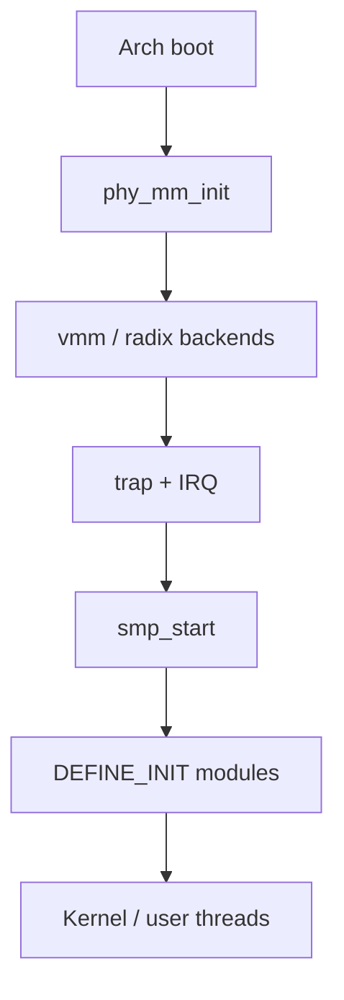

# RendezvOS core — unified guide

**Single canonical document** for the core kernel tree: layout, boot, public API, headers, and pointers to deep references.

**Scope:** `core/` only. No documentation of personalities or trees outside this directory.

**Supplements (deep dives):** [`memory.md`](memory.md) §0 caller contract · [`task-thread.md`](task-thread.md) runtime context · [`trap.md`](trap.md) syscall entry · [`ipc.md`](ipc.md) · [`lockfree-ipc.md`](lockfree-ipc.md) · platform notes in [`README.md`](README.md).

**For code outside `core/`:** [`USING_CORE.md`](USING_CORE.md) (call patterns, reading order, checklists). This file is the **in-tree** map; personalities should not maintain a second copy upstream.

---

## 1. Source layout

```
core/
├── arch/<ARCH>/       boot, trap, MM hooks, per-CPU, SMP AP
├── include/
│   ├── rendezvos/     portable public API
│   ├── arch/          per-ISA hooks
│   ├── common/        shared primitives
│   └── modules/       platform (ACPI, DTB, ELF, drivers)
├── kernel/            portable implementation (when present)
└── docs/              this directory
```

Headers are the stable contract; some checkouts omit `kernel/*.c`.

---

## 2. Boot and initialization



| Phase | Read | Key symbols |
|-------|------|-------------|
| Boot | [`boot.md`](boot.md) | `start_arch`, `arch_setup` |
| Memory | [`memory.md`](memory.md) | `phy_mm_init`, `VSpace` |
| Traps | [`trap.md`](trap.md) | `register_fixed_trap`, `register_irq_handler` |
| IRQ hardware | [`interrupt.md`](interrupt.md) | PIC / APIC / GIC |
| SMP | [`smp.md`](smp.md) | BSP/AP, `percpu` |
| Modules | [`task-thread.md`](task-thread.md) | `DEFINE_INIT`, `do_init_call` |

---

## 3. Subsystems (summary)

| Subsystem | Model | Guide / reference |
|-----------|--------|-------------------|
| Memory | PMM → map handler → radix (see [`memory.md`](memory.md)) → kmalloc | [`cache&tlb.md`](cache&tlb.md) |
| Tasks | `Task_Manager` → `Tcb_Base` → `Thread_Base` | [`task-thread.md`](task-thread.md) |
| IPC | Ports, MS queues, `kmsg` + TLV | [`ipc.md`](ipc.md), [`lockfree-ipc.md`](lockfree-ipc.md) |
| Traps | `trap_class`, arch `trap_frame` | [`trap.md`](trap.md) |
| Time | Arch timers + `time.h` | [`timer.md`](timer.md) |
| Log | `modules/log/log.h` | [`log.md`](log.md) |

### Design boundary

| In core | Outside core (by policy) |
|---------|---------------------------|
| Scheduler, ports, MM primitives | ABI syscall tables |
| ELF load helpers, `generate_user_stack` | argv/env layout policy |
| `arch_syscall_*` on trap frame | How a personality uses them |
| `error_t` | errno mapping for an ABI |

---

## 4. Traps and IRQ — which document

| Question | Document |
|----------|----------|
| Page fault, syscall frame, trap classes | [`trap.md`](trap.md) |
| 8259 / APIC / GIC wiring | [`interrupt.md`](interrupt.md) |
| TLB after unmap | [`cache&tlb.md`](cache&tlb.md) |
| User return from syscall path | [`task-thread.md`](task-thread.md), `arch/*/tcb_arch.h` |

Prefer `register_fixed_trap(TRAP_CLASS_*, …)` over hard-coded vector numbers.

---

## 5. SMP and synchronization

- **Per-CPU:** `rendezvos/smp/percpu.h` — MCS waiter node must be this CPU’s slot.
- **Locks:** `sync/spin_lock.h`, `sync/cas_lock.h`, `sync/barrier.h`.
- **Bring-up:** [`smp.md`](smp.md); sample DT [`hardware/README.md`](hardware/README.md).
- **IPC vs locks:** motivation in [`lockfree-ipc.md`](lockfree-ipc.md) §1.

---

## 6. Public API index

Update this table when adding or changing public symbols.

| Status | Meaning |
|--------|---------|
| `stable` | Header + behavior aligned |
| `doc` | Topic guide exists |
| `code-only` | Implemented; thin doc |

| Subsystem | Task | Headers / symbols | More | Status |
|-----------|------|-------------------|------|--------|
| Init | Module hooks | `task/initcall.h` | §2 | `doc` |
| Thread | Kernel thread | `thread_loader.h` `gen_thread_from_func` | [`task-thread.md`](task-thread.md) | `stable` |
| Thread | Duplicate thread | `tcb.h` `copy_thread` `run_copied_thread` | [`task-thread.md`](task-thread.md) | `stable` |
| Thread | ELF / user stack | `load_elf_to_vs` `generate_user_stack` `gen_task_from_elf` | [`task-thread.md`](task-thread.md) | `stable` |
| Thread | Syscall-frame return | `arch_syscall_*` in `arch/*/tcb_arch.h` | [`task-thread.md`](task-thread.md) | `stable` |
| Thread | Context merge | `arch_ctx_refresh` `arch_ctx_merge_from_src` | [`task-thread.md`](task-thread.md) | `stable` |
| Thread | Teardown | `delete_thread` `delete_task` | [`task-thread.md`](task-thread.md) | `stable` |
| Scheduler | Block / run | `thread_set_status` `schedule` | [`task-thread.md`](task-thread.md) | `code-only` |
| IPC | Port table | `global_port_table` `port_table_lookup` `register_port` | [`ipc.md`](ipc.md) | `stable` |
| IPC | Send / recv (blocking) | `enqueue_msg_for_send` `send_msg` `recv_msg` `dequeue_recv_msg` | [`ipc.md`](ipc.md) | `stable` |
| IPC | Send / recv (non-blocking) | `ipc_try_send_msg` `ipc_try_recv_msg` | [`ipc.md`](ipc.md) | `stable` |
| IPC | Payload | `ipc/kmsg.h` `ipc/ipc_serial.h` | [`ipc.md`](ipc.md) | `doc` |
| Registry | Name index | `registry/name_index.h` | §7 | `code-only` |
| MM | Clone address space | `mm/vmm.h` `clone_vspace` | [`memory.md`](memory.md) | `stable` |
| MM | Clear user mappings | `mm/vmm.h` `vspace_clear_user_mappings` | [`memory.md`](memory.md) | `doc` |
| MM | Radix lock/query/insert | `vmm_radix_tree_lock_range_big`, `insert_range`, `query_range`, … | [`memory.md`](memory.md) §0.3 | `doc` |
| MM | Page tables (per CPU) | `map_handler.h` `map()` / `&percpu(Map_Handler)` | [`memory.md`](memory.md) | `doc` |
| MM | User range orchestration | `mm_user_utils_*` (requires L0 held) | [`memory.md`](memory.md) §0 | `doc` |
| MM | Page fault hook | `register_fixed_trap(TRAP_CLASS_PAGE_FAULT, …)` | [`trap.md`](trap.md) | `doc` |
| Syscall | Dispatch hook | `syscall(trap_frame*)` weak in core | [`trap.md`](trap.md) | `stable` |
| MM | Destroy vspace | `del_vspace` `unregister_vspace` | [`memory.md`](memory.md) | `code-only` |
| Trap | Handlers | `trap/trap.h` | [`trap.md`](trap.md) | `doc` |
| Time | Timers | `time.h` | [`timer.md`](timer.md) | `doc` |
| SMP | Per-CPU | `smp/percpu.h` `smp/smp.h` | §5, [`smp.md`](smp.md) | `doc` |
| Sync | Locks | `sync/spin_lock.h` etc. | §5 | `doc` |
| Log | Print | `modules/log/log.h` | [`log.md`](log.md) | `doc` |

---

## 7. Public header map

Under `core/include/`.

### `rendezvos/`

| Header | Purpose |
|--------|---------|
| `common.h`, `error.h`, `limits.h` | Types, `error_t` |
| `time.h` | Timekeeping |
| `mm/pmm.h`, `mm/vmm.h`, `mm/vmm_radix_tree.h`, `mm/map_handler.h`, `mm/mm_user_utils.h`, `mm/kmalloc.h`, `mm/allocator.h`, `mm/asid.h` | Memory |
| `task/tcb.h`, `task/thread_loader.h`, `task/initcall.h`, `task/id.h`, `task/ebr.h` | Tasks |
| `ipc/port.h`, `ipc/ipc.h`, `ipc/message.h`, `ipc/kmsg.h`, `ipc/ipc_serial.h` | IPC |
| `smp/percpu.h`, `smp/smp.h`, `smp/cpu_id.h` | SMP |
| `sync/spin_lock.h`, `sync/cas_lock.h`, `sync/barrier.h` | Sync |
| `trap/trap.h`, `trap/trap_common.h` | Traps |
| `registry/name_index.h` | Name tables |
| `system/panic.h`, `system/powerd.h` | System |

### `arch/<ARCH>/`, `modules/`, `common/`

- **arch/:** boot, MM, trap, `tcb_arch.h`, IRQ controllers — use when portable API is insufficient.
- **modules/:** ELF, log, DTB, ACPI, drivers — mainly boot/platform.
- **common/:** internal DSA/atomics; not a second public API unless listed above.

**Legacy names:** `rendezvos/task/port.h` → `rendezvos/ipc/port.h`; nexus-era notes → [`memory.md`](memory.md) / `vmm_radix_tree.h`.

---

## 9. External callers

All **how to use core from outside this tree** documentation lives in **[`USING_CORE.md`](USING_CORE.md)** (patterns, `error_t`, direct-vs-IPC, checklists). Do not duplicate that material in other repositories.

---

## 10. Documentation maintenance (core)

| Class | Files | When to update |
|-------|-------|----------------|
| **This guide** | `GUIDE.md` | Layout, API, or header map changes |
| **Topic** | `memory.md`, `trap.md`, `ipc.md`, … | Subsystem behavior change |
| **Platform** | `boot.md`, `interrupt.md`, `smp.md` | Bring-up notes |
| **Archive** | `archive/*` | Append only |
| **Work** | `TODO.md` | Open/close items |

**API change checklist:** (1) merge in `core/` (2) update §6–§7 here (3) update [`USING_CORE.md`](USING_CORE.md) if call pattern changes (4) update topic doc if needed (5) do not document trees outside `core/`.

---

## Changelog

| Date | Change |
|------|--------|
| 2026-05 | Unified guide; merged ARCHITECTURE, CAPABILITY_INDEX, HEADERS, trap/SMP bridges, MAINTENANCE |
| 2026-05 | §9 call patterns, §10 error_t; expanded §6 MM/IPC APIs |
| 2026-05 | Review pass: `memory.md` §0, `task-thread` runtime, `trap` syscall entry |
| 2026-05 | External usage → `USING_CORE.md`; §9–§10 slimmed |
