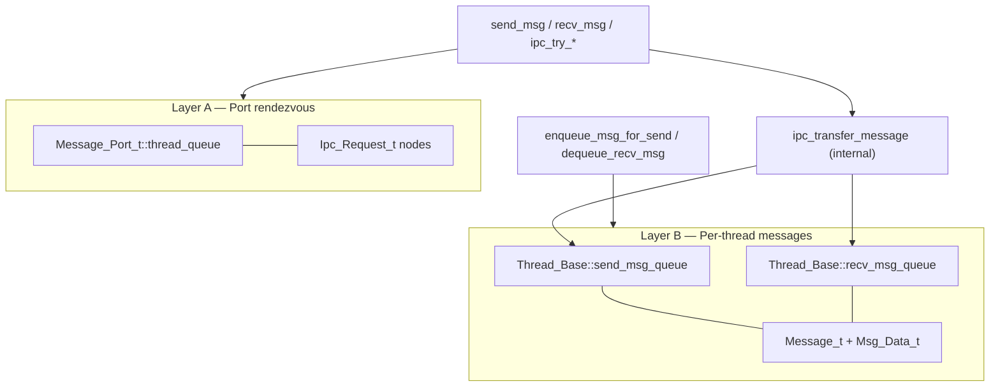
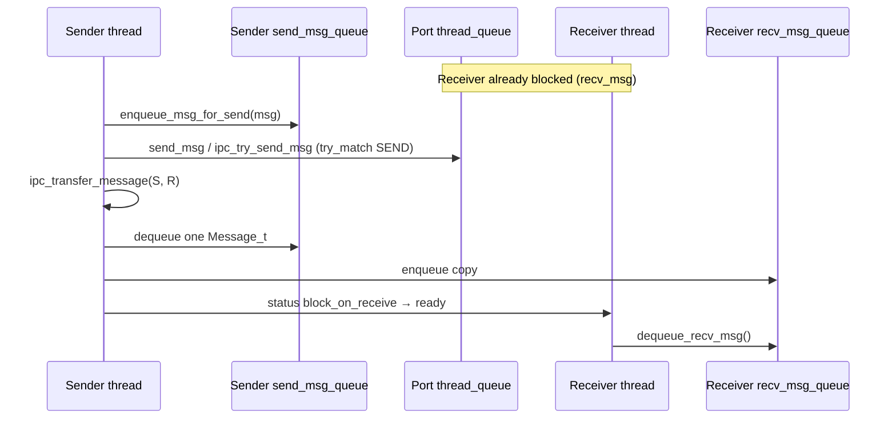
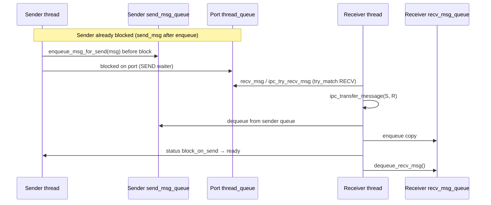
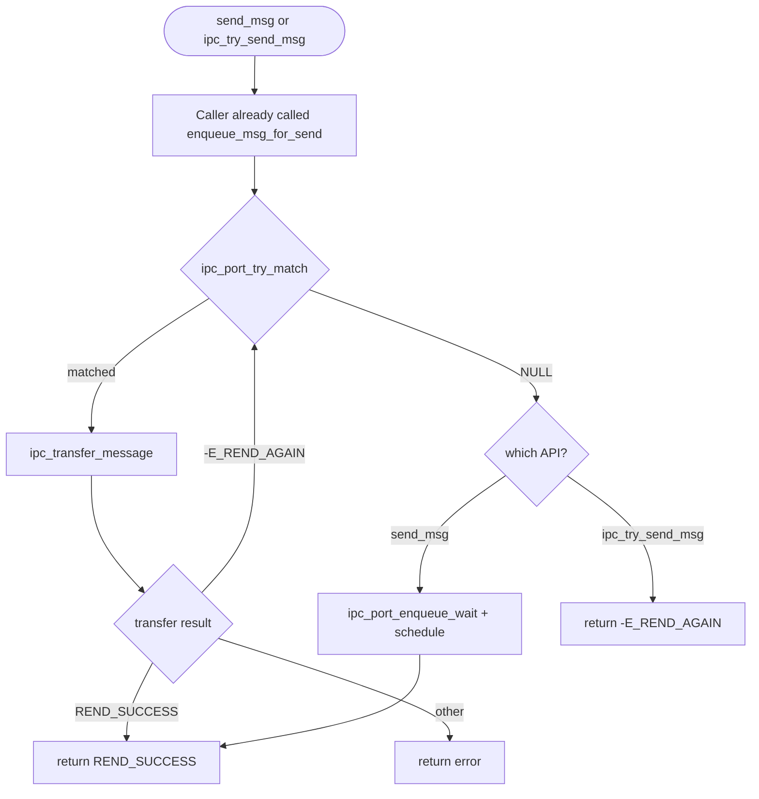
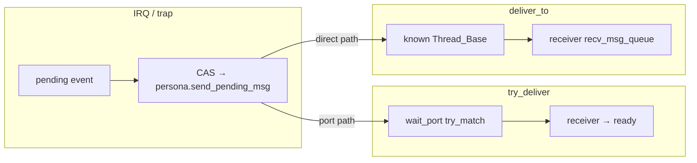

# IPC — API reference (ports and messages)

> **文档角色：** 对外 API / 调用契约（给实现 compat、server、或修改 IPC 调用点的读者与 AI）  
> **设计原理与无锁细节：** 仅见 [`lockfree-ipc.md`](lockfree-ipc.md) — 不在此重复 MS 队列推导  
> **源码真源：** `core/kernel/ipc/ipc.c` · 头文件 `core/include/rendezvos/ipc/ipc.h`  
> **上层用法入口：** [`USING_CORE.md`](USING_CORE.md) §3.1

---

## 1. Scope

| In scope | Out of scope (see elsewhere) |
|----------|------------------------------|
| Public functions in `rendezvos/ipc/ipc.h` | MS-queue / EBR / tagged-ptr algorithms → `lockfree-ipc.md` |
| Caller obligations (enqueue / send / recv / dequeue) | Why lock-free IPC was chosen → `lockfree-ipc.md` §1 |
| Return codes as implemented in `ipc.c` | `cancel_ipc` — **不存在**；替代方案 → §7 |
| Push vs pull (who calls `ipc_transfer_message`) | kmsg TLV 编码细节 → `ipc/kmsg.h`, `ipc_serial.h` |
| System async outbound (`ipc_system_*`) | MS / persona derivation → `lockfree-ipc.md` §9 |

**Do not** refactor `send_msg` / `recv_msg` together with try variants: try APIs are a **copied** match+transfer branch only (`ipc.c` comments).

---

## 2. Architecture — two layers

IPC = **port rendezvous** (threads) + **per-thread message queues** (payloads). Do not pass `Message_t*` into `send_msg` / `ipc_try_send_msg`.



| Layer | Queue location | Element type | Public API |
|-------|----------------|--------------|------------|
| A | `port->thread_queue` | `Ipc_Request_t` | `send_msg`, `recv_msg`, `ipc_try_send_msg`, `ipc_try_recv_msg` |
| B | `thread->send_msg_queue` / `recv_msg_queue` | `Message_t` | `enqueue_msg_for_send`, `dequeue_recv_msg` |

**Invariant:** Port queue holds **waiters**, not messages. Port queue is **single-state** (all SEND or all RECV waiters). See `lockfree-ipc.md` §6.

**Transfer:** `ipc_transfer_message` dequeues one message from sender’s send queue (or `send_pending_msg`), copies data via `fill_message_data`, enqueues a **new** `Message_t` on receiver’s recv queue (`lockfree-ipc.md` §3.3).

---

## 3. Push vs pull

After rendezvous, **the thread that did not block on the port** runs `ipc_transfer_message`.





---

## 4. Blocking vs non-blocking

Same message-queue rules; difference is **only** when `ipc_port_try_match` returns NULL.



| | `send_msg` / `recv_msg` | `ipc_try_send_msg` / `ipc_try_recv_msg` |
|---|-------------------------|----------------------------------------|
| Before send | `enqueue_msg_for_send(msg)` | **Same** |
| After recv success | `dequeue_recv_msg()` | **Same** |
| No peer on port | Enqueue self on port + `schedule()` | Return `-E_REND_AGAIN` immediately |
| Implementation | Full `while` loop in `ipc.c` | **Copied** match+transfer loop only; **do not share helpers with blocking** |

---

## 5. Public API — quick reference

Headers: `rendezvos/ipc/ipc.h`, `ipc/port.h`, `ipc/message.h`, `ipc/kmsg.h`.

| Function | Preconditions | Postconditions (success) | Blocks |
|----------|---------------|--------------------------|--------|
| `enqueue_msg_for_send(msg)` | Current thread; valid msg refcount | `msg` on current send queue | No |
| `send_msg(port)` | Prior `enqueue_msg_for_send` | One msg transferred off send side; peer may be `ready` | If no peer |
| `ipc_try_send_msg(port)` | Prior `enqueue_msg_for_send` | Same transfer as send on match | No |
| `recv_msg(port)` | — | One msg on current recv queue | If no peer |
| `ipc_try_recv_msg(port)` | — | Same as recv on match | No |
| `dequeue_recv_msg()` | After recv API returned `REND_SUCCESS` | Returns `Message_t*` or NULL; decrements `recv_pending_cnt` | No |
| `ipc_system_try_deliver(port, msg)` | IRQ/trap; valid `msg` refs | One msg to port waiter’s recv queue; persona stages `send_pending_msg` | No |
| `ipc_system_deliver_to(receiver, msg)` | IRQ/trap; bound `receiver`; valid `msg` refs | One msg on `receiver->recv_msg_queue` via direct transfer | No |

**Not exported:** `ipc_port_try_match`, `ipc_port_enqueue_wait` (internal to `ipc.c`).

**Core async only:** `ipc_system_*` — see §10. Do **not** use `enqueue_msg_for_send` + `ipc_try_send_msg` from IRQ with `get_cpu_current_thread()`.

---

## 6. Per-function behavior (matches `ipc.c`)

### 6.1 `send_msg(port)`

1. `ipc_port_try_match(port, IPC_PORT_STATE_SEND)` (reuse `receiver_request` on retry).
2. **Matched:** `ipc_transfer_message(sender, receiver)`.
   - `REND_SUCCESS` → receiver `block_on_receive` → `ready`; `ref_put(Ipc_Request)`; return.
   - `-E_REND_AGAIN` → `continue`.
   - Else → `ref_put`; return error.
3. **Not matched:** status → `block_on_send`; `ipc_port_enqueue_wait(SEND)` → `schedule()` → return `REND_SUCCESS`.

IPC does **not** `schedule()` the peer; it only sets peer to `ready`.

### 6.2 `ipc_try_send_msg(port)`

Steps 1–2 identical to §6.1 matched path. Step 3 replaced by: **not matched → return `-E_REND_AGAIN`** (message remains on send queue).

| Return | Condition |
|--------|-----------|
| `REND_SUCCESS` | Transfer OK |
| `-E_REND_AGAIN` | `try_match` NULL, or no current thread |
| `-E_IN_PARAM` | `port == NULL` |
| Other | From `ipc_transfer_message` |

### 6.3 `recv_msg(port)`

1. `ipc_port_try_match(port, IPC_PORT_STATE_RECV)`.
2. **Matched:** `ipc_transfer_message(sender, receiver)`.
   - `REND_SUCCESS` → sender `block_on_send` → `ready`; `ref_put`; return.
   - `-E_REND_NO_MSG` → `continue`.
   - `-E_REND_AGAIN` → `ref_put`; return `-E_RENDEZVOS`.
   - Else → `ref_put`; return error.
3. **Not matched:** `block_on_receive`; `enqueue_wait(RECV)` → `schedule()` → return `REND_SUCCESS`.

**Caller after success:** `dequeue_recv_msg()`.

### 6.4 `ipc_try_recv_msg(port)`

Same as §6.3 step 2; not matched → `-E_REND_AGAIN`. Same return table as §6.3 except no blocking path.

### 6.5 `while (1)` on try APIs

Retries **only** after a successful `try_match`, for the same reasons as blocking APIs:

- Send path: `ipc_transfer_message` → `-E_REND_AGAIN`.
- Recv path: `ipc_transfer_message` → `-E_REND_NO_MSG`.

Not a spin-wait on an empty port.

---

## 7. Cancel / abort (no `cancel_ipc`)

| Fact | Detail |
|------|--------|
| No API | `cancel_ipc` is not implemented and not planned |
| Wakeup mechanism | Peer completes `ipc_transfer_message`; waiter → `ready` |
| Abort pattern | Dedicated port + protocol message via `send_msg` or `ipc_try_send_msg`; waiter interprets payload after `dequeue_recv_msg` |
| Stale waiters | `ipc_port_try_match` drops requests if thread status ≠ expected block state |

Rationale and alternatives: [`lockfree-ipc.md`](lockfree-ipc.md) §8.1.

---

## 8. Call patterns (copy-paste templates)

**Server (blocking recv):**

```c
for (;;) {
        if (recv_msg(port) != REND_SUCCESS)
                break;
        Message_t *m = dequeue_recv_msg();
        if (!m)
                continue;
        /* handle m; ref_put / free per message.h */
}
```

**Client send:**

```c
/* build Message_t + kmsg payload */
enqueue_msg_for_send(msg);
send_msg(port);   /* or ipc_try_send_msg(port) */
```

**Non-blocking send (ordinary thread, peer may be absent):**

```c
enqueue_msg_for_send(msg);
error_t r = ipc_try_send_msg(port);
if (r == -E_REND_AGAIN) {
        /* No rendezvous: msg still on this thread's send_msg_queue */
} else if (r != REND_SUCCESS) {
        /* handle error */
}
```

**Timer / wait_port from IRQ (system persona — do not enqueue on current):**

```c
Message_t *msg = /* build FIRE payload */;
error_t r = ipc_system_try_deliver(wait_port, msg);
/* On failure after staging, API released msg. On SUCCESS, waiter may be ready. */
```

**Device IRQ to bound driver kthread (known receiver):**

```c
for (each pending packet) {
        Message_t *msg = /* build */;
        error_t r = ipc_system_deliver_to(nic_kthread, msg);
        /* Loop: one in-flight on persona at a time; clean on failure. */
}

/* nic_kthread (thread context): */
while ((m = dequeue_recv_msg()) != NULL) {
        handle_rx(m);
        ref_put(&m->ms_queue_node.refcount, free_message_ref);
}
```

---

## 9. Invariants (for reviewers / AI)

1. **Never** pass `Message_t*` to `send_msg` / `ipc_try_send_msg`.
2. **Always** `enqueue_msg_for_send` before ordinary send APIs (not before `ipc_system_*`).
3. **Always** `dequeue_recv_msg` after recv APIs return `REND_SUCCESS`.
4. `-E_REND_AGAIN` from `ipc_try_send_msg` means **no transfer occurred** — not implicit success.
5. Do **not** modify `send_msg`/`recv_msg` when adding features; add try paths or new functions.
6. Do **not** implement Linux-style forced dequeue of blocked threads from port MS-queue.
7. **System async:** at most one outbound message staged on persona `send_pending_msg` at a time; never `enqueue_msg_for_send` on persona; try-clean on failure (§10).

---

## 10. System async outbound (IRQ / trap)

Design rationale and IRQ sender model: [`lockfree-ipc.md`](lockfree-ipc.md) §9. This section is the **API contract** for AI and call sites.

### 10.1 Problem

Timer and device IRQ paths have **no legitimate sender** `Thread_Base*`. Using `get_cpu_current_thread()` would pollute the interrupted thread’s `send_msg_queue` (transfer always takes the **queue head**, not a newly enqueued tail message).

**Solution:** per-CPU **system persona** (boot: `idle_thread_ptr`) as sender; stage outbound messages in `persona->send_pending_msg` (single slot, compatible with `ipc_transfer_message`).

**Inbound core mail** (something sends *to* core) uses a **dedicated kthread** + blocking `recv_msg` on its port (same as `powerd` / servers). There is **no** `ipc_system_try_recv` — persona recv in IRQ was intentionally omitted.

### 10.2 Two outbound models

| | `ipc_system_try_deliver(port, msg)` | `ipc_system_deliver_to(receiver, msg)` |
|---|-------------------------------------|----------------------------------------|
| **Use case** | Timer FIRE, sleep `wait_port` | NIC / device IRQ → driver kthread |
| **Find receiver** | `ipc_try_send_msg(port)` → port try_match | Caller passes `Thread_Base*` (bound at init) |
| **Receiver must block on port?** | **Yes** (block_on_receive on `port`) | **No** — may run send path; drains recv queue in thread context |
| **Wakeup** | Matched waiter → `block_on_receive` → `ready` | **No** status change; receiver must `dequeue_recv_msg` |
| **`current_thread` swap** | Yes (for `ipc_try_send_msg`) | No (`ipc_transfer_message` uses explicit sender/receiver) |
| **Design ref** | lockfree-ipc §9.3 mode 1 | lockfree-ipc §9.3 mode 2 |



### 10.3 Shared rules (both APIs)

1. **Stage:** `atomic64_cas(persona->send_pending_msg, NULL, msg)` — slot must be empty; else `-E_REND_IPC` (caller still owns `msg`).
2. **Transfer:** one message per call; batch IRQ pending by **looping** the API (each iteration: stage → transfer → success or clean → next).
3. **Try-clean:** on any result other than `REND_SUCCESS` after staging, `exchange(send_pending_msg, NULL)` + `ref_put(msg)`.
4. **Ownership:** caller **transfers** `msg` on entry; after staging, failure is API’s to release; success is consumed by `ipc_transfer_message`.
5. **Do not** `enqueue_msg_for_send` on persona for these paths.
6. **Do not** add `Thread_Base*` to public `send_msg` / `ipc_try_send_msg` — only `ipc_system_deliver_to` takes an explicit receiver, and only for this core-async model.

### 10.4 `ipc_system_try_deliver(port, msg)`

1. Validate `port`, `msg`, refcounts.
2. CAS stage on persona `send_pending_msg`.
3. Save `tm->current_thread`; set to persona; `ipc_try_send_msg(port)`; restore.
4. On failure: exchange clean + `ref_put`.

| Return | Meaning |
|--------|---------|
| `REND_SUCCESS` | Transfer OK; port waiter likely `ready` |
| `-E_REND_AGAIN` | No receiver on port, or no persona |
| `-E_REND_IPC` | Slot busy or invalid message refs |
| `-E_IN_PARAM` | NULL `port`/`msg`, or no `core_tm` |

Stale FIRE when waiter already left the port: `-E_REND_AGAIN` + try-clean — expected; use generation in payload (compat layer).

### 10.5 `ipc_system_deliver_to(receiver, msg)`

1. Validate `receiver`, `msg`, refcounts.
2. CAS stage on persona `send_pending_msg`.
3. `ipc_transfer_message(persona, receiver)` (no port, no `current` swap).
4. On failure: exchange clean + `ref_put`.

| Return | Meaning |
|--------|---------|
| `REND_SUCCESS` | Copy on `receiver->recv_msg_queue`; `recv_pending_cnt` incremented in transfer |
| `-E_REND_AGAIN` | No persona, or transfer failed (e.g. receiver exiting) |
| `-E_REND_IPC` | Slot busy or invalid refs |
| `-E_IN_PARAM` | NULL `receiver` or `msg` |

Receiver **must** poll `dequeue_recv_msg()` (and `ref_put`) in thread context; message may arrive while receiver is handling sends.

### 10.6 `recv_pending_cnt`

- `ipc_transfer_message` increments `receiver->recv_pending_cnt` **after** successful enqueue to recv queue.
- `dequeue_recv_msg` decrements it. Pairing applies to all receivers including `deliver_to` targets.

---

## 11. Related files

| File | Content |
|------|---------|
| `kernel/ipc/ipc.c` | `send_msg`, `recv_msg`, `ipc_try_*`, `ipc_system_*`, `ipc_transfer_message` |
| `include/rendezvos/ipc/ipc.h` | Public declarations (incl. system async §10) |
| `kernel/ipc/message.c` | `Message_t` lifecycle |
| `include/rendezvos/ipc/port.h` | `Message_Port_t`, port table |
| `lockfree-ipc.md` | Design document (authoritative “why”, §9 IRQ sender) |
| `task-thread.md` | `thread_set_status`, `schedule`, teardown |

---

## 12. kmsg (minimal)

- Create payloads: `kmsg_create(module, opcode, fmt, ...)`.
- Client and server **must** use the same `fmt` for a given opcode.
- Reply port name: conventionally embedded in TLV stream.

Details: `ipc/kmsg.h`, `ipc/ipc_serial.h`, [`GUIDE.md`](GUIDE.md) §10 for `error_t`.
