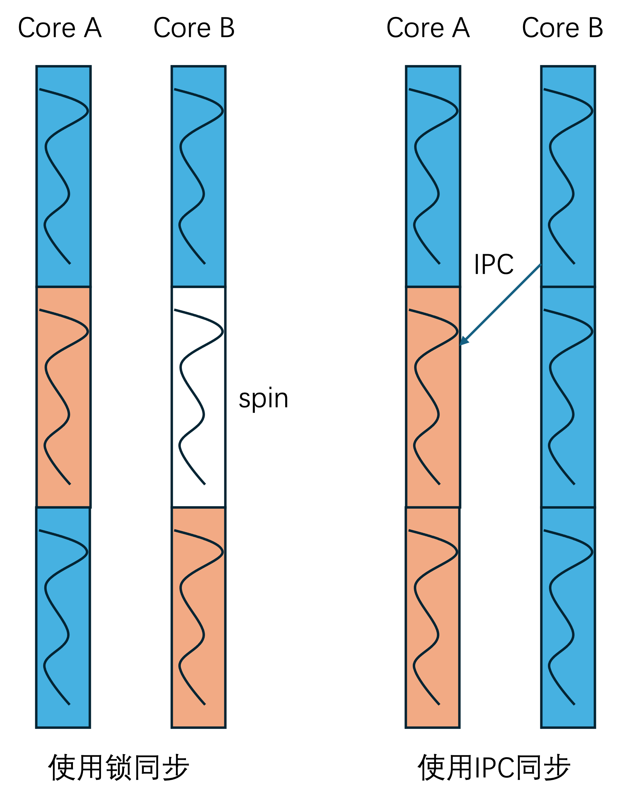
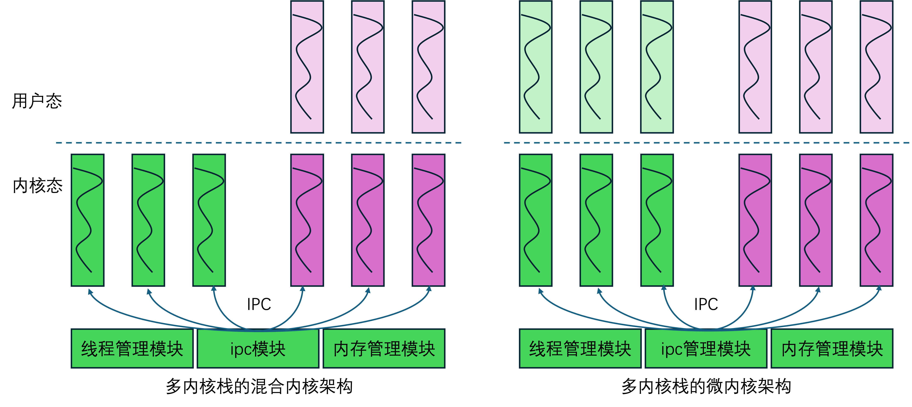
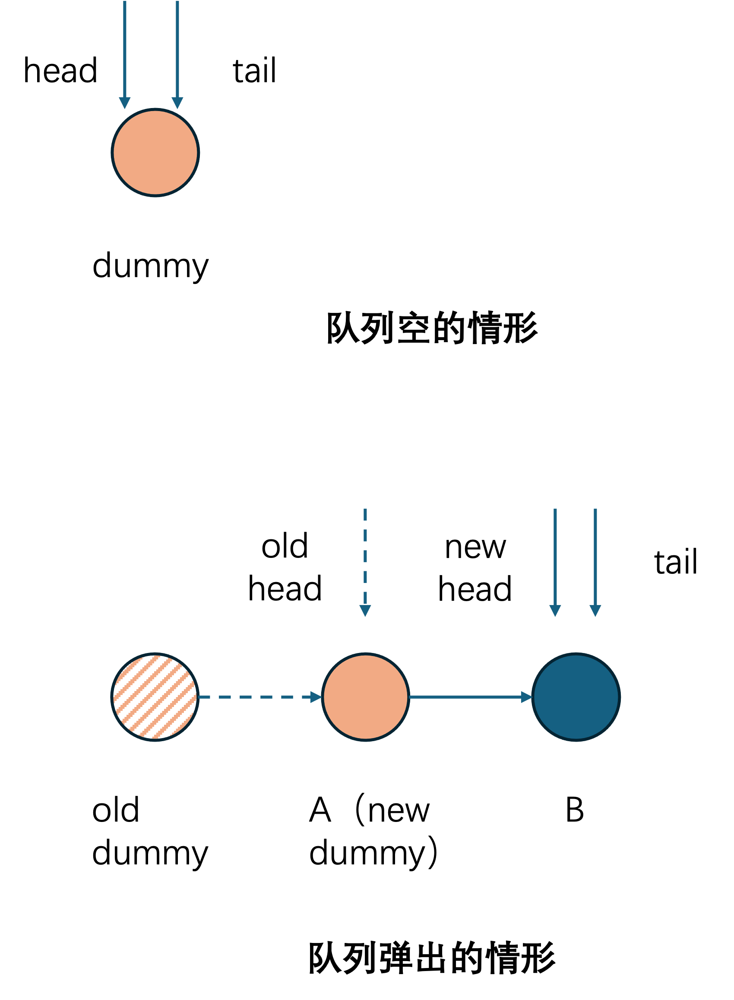
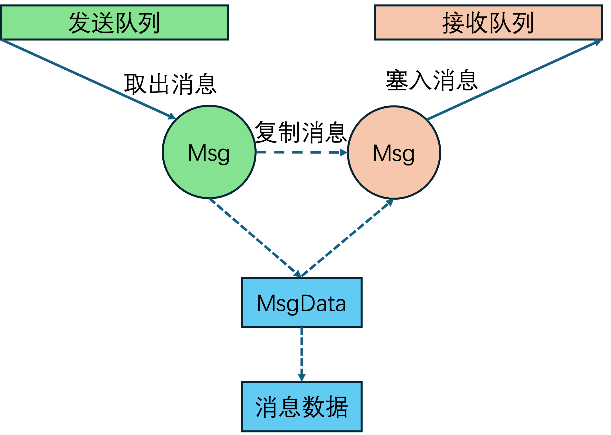

# 一、问题背景

## 1.1概述

IPC机制是混合内核或者微内核的核心机制。当然在某些情况下实质上是ITC（inter-thread communication），不过正如seL4的文档中的处理一样，为了更好的便于理解，我们还是用IPC这个词。

就现有的微内核实现中的ipc同步，seL4微内核的同步，主要基于大内核锁，性能高不高不说，但是至少可以工作。

L4家族的其他内核，比如L4Re和基于L4Re的Fiasco.OC，他的ipc同步，则是基于一个Lock-free Ring Buffer，也就是无锁环形缓冲区的实现，按照我用ai解读的结果，他是一个单收单发的机制。

其他的微内核或者其他内容，就我现在搜索到的资料，大多针对单消费者单生产者（SPSC），或者多生产者单消费者（MPSC）做优化。相对来说，这些方案更为轻量化，但往往跟这些场景下，这样的设计使用场景有关。

然而多生产者多消费者并不是不需要考虑。例如，我有两个网卡interface，那么在混合内核的设计中需要实质上的两个网卡线程实例，也就是说，通过网卡进行网络消息发送，可能有两个消费者。

因此我试图实现一个通用的方案，能够较为轻易的嵌入各种形态的内核中去。

## 1.2 高效ipc在混合内核或微内核中的重要性

为了说明高效ipc在混合内核或者微内核中的作用，我引入了这么一个例子：



如上图所示，只考虑内核态的操作，其中**蓝色的框**表示**内核中的非临界区的执行流**，而**橙色的框**表示**内核中的临界区执行流**，**白色的框**表示**锁自旋状态的执行流**。更具体一点的，我们可以让蓝色的框表示网络框架不需要锁定网卡的代码，而橙色的框表示网络驱动中的需要锁定某个特定网卡硬件的代码（这只是便于理解的一个例子）。

在宏内核中，只使用锁同步的时候，假设两个核心的内核代码都试图发送某个包，就需要core A或者core B试图获取锁，获取了锁的core可以进入临界区（比如这里的core A先获取了锁，就可以执行），然后core B再自旋（白色的执行流框）或者在这个过程中schedule走，以内核来说，通常自旋锁里面schedule的设计情况不多，但是其他较长的临界区比如信号量之类的可能会有schedule走。然后core A释放了锁之后，core B可以获取锁，并执行临界区代码，而此时core A可以执行非临界区代码。所以通常来说，为了减少临界区代码的执行，往往尽可能使用轻量化的锁定代码，减少临界区代码的执行带来的自旋的时间。

在使用ipc消息发送的混合内核或者微内核中，如右图所示，一般来说，在这种情况下，临界区代码会实现为一个网卡线程（如例子所示，这在逻辑上更清晰，网卡作为一个有限的资源，一一对应一个线程来处理相关逻辑，很清晰），在这种情况下，两个网络协议栈线程可以直接发一个ipc给目标的网卡线程，然后网卡线程运行在某个核心上（如core A里的橙色框）并分别处理来自两个ipc的代码。在这种情况下，core B可以直接运行其他代码而无需锁定。

这种方式有个优点，网卡线程和协议栈线程内部的代码，都可以直接写成单线程的（循环处理多个ipc消息罢了）。但是这不意味着多核同步消失了，上面例子里面，两个消息如何正确，有序的发送给对应的接收消息线程，就是ipc框架的同步问题。我说的更明确一点，**在宏内核下的多核需要的临界区同步相关代码，通过线程化方式，变成了混合内核或者微内核下的线程之后，原本需要锁进行的同步工作，现在转换为了ipc框架的同步问题。**这个同步问题不是消失了，而是转化到了ipc框架中了。因此，一个高性能的ipc框架，就是在微内核或者混合内核的核心工作，因为其他内核代码都线程化了，无非这些线程在内核态（混合内核）还是用户态（微内核）。写单线程的工作相比于多核，是easy的多的。

成本和缺陷的分析：

使用锁的成本很明显，主要来自于锁，如果所有核心都同时试图抢这把锁，比如我有n个核心，试图同时争抢这把锁，那么第一个核心获取锁，几乎可以无缝获取，不需要等待，但是第二个核心需要等待一次临界区（第一个核心）执行完毕，第三个核心需要等待前两个执行完，所以同时存在n个核心争抢锁，那么需要1+2+3+4+5...的临界区等待，这对于整个系统是一个**O（n^2）**的开销。这也是很多研究表明，在**核心数量上升时，锁性能不佳**的原因。

使用ipc的成本，首先当然是来自于ipc框架本身，以例子为例，需要core A和core B上的协议栈线程都需要向core A上的网卡线程发消息，这取决于ipc框架上的实现，如果用个锁来完成ipc，那多对一的发送，同样是**O（n^2）**的系统开销，然而使用无锁方案（也就是我这个技术文档所要实现的方案，按道理就是**O（n）**，也就是每个核心ipc的成本都存在一个上限，那么有多少个核心去发，就有多少个ipc操作。第二部分主要来自于上下文切换和调度，同样也是**O（n）**，每个核心都调度切换一次嘛。

当然，无可否认，如果核心数量少，额，显然ipc方案的开销是大于精心设计好的锁的，因为上下文切换的开销本来就大于获取锁的开销。然而随着核心的增长，一个无锁的ipc的混合内核或者微内核方案，是系统的through put等指标的性能更好的。

## 1.3 运行条件特点

我目前的设计和验证，基本是一个混合内核的框架，如下图所示。具体来说，除了一个内存管理和线程管理，其他内核功能，都以内核线程的方式运行在内核空间（如示意图中左边图里的绿色执行流），内核空间当然指的是是高地址空间。（实质上，更为标准的设计是内存管理也应当作为一个内核线程来实现，比如seL4微内核就是如此，只是额，确实会比较麻烦）。



而用户线程，我们设计为，**每个用户线程都存在一个对应内核栈**的设计，而**不是**sel4这样的**单内核栈**，从而在这些用户线程进入内核态之后，可以被视为某种“内核线程”。如示意图里左边图的紫色执行流，浅紫色表示用户态的部分，深紫色表示内核态的部分。

所以从这个角度来说，如果把这种情况下的内核栈的核心代码，放到用户态，只在内核态保留一个基本的内核栈用于收发消息等，那么也是一种等效的微内核方案了。也就是如示意图里右边图中的浅绿色执行流，把原本混合内核中的内核态执行流，一部分下放到用户态。

当用户线程和内核线程，也就是用户代码和内核功能之间，都被视同为内核线程。那么用户代码调用内核功能的过程，就被视为内核功能线程和用户线程在内核态的延伸执行流之间的ipc。

因此，从这种设计理念上来说，**基于ipc的混合内核和微内核是等价的**。从这个角度来说，ipc模块和具有ipc感知的调度模块在这两个架构中均具有**核心性**的地位。

这样的方案存在一点特点：

第一是，ipc模块的工作都在**同一个内核地址空间**。虽然不同的用户线程可能实质性具有不同地址空间，但是映射到同样的物理地址，使得我们不需要关心地址空间切换。

第二个是，在内核中，通常需要**手动切换上下文**，也就是说，如果没有主动调用schedule，或者确定性的某些调度点，通常不会考虑中断等问题。

这一方面让我们可以确定ipc的主要竞态条件主要来自于多核，而不需要关心不必要的调度，另一方面也意味着我们的ipc框架在可能的while循环或者其他阻塞点处，需要主动添加schedule或者其他处理。否则其他内核线程就没法运行了。

# 二、标准MS无锁队列实现和特性详解

## 2.1 内核中常见的一些原子操作

要实现无锁队列，根本上这依赖于原子操作，所以这里列举出来我所使用的原子操作及功能说明

```c
/**
 * 原子64位整数类型。
 * 用于在多线程环境中进行无锁的原子操作。
 */
typedef struct {
    volatile i64 counter; /**< 原子计数器，使用 volatile 确保可见性。 */
} atomic64_t;

/**
 * 原子比较并交换（CAS）操作。
 * 如果 *addr 的值等于 expected，则将其更新为 desired，并返回旧值。
 * 无论是否成功交换，都会返回 *addr 的旧值。
 *
 * @param addr      目标内存地址（volatile 修饰，防止编译器优化）
 * @param expected  期望值
 * @param desired   新值
 * @return          返回 *addr 的旧值
 */
u64 atomic64_cas(volatile u64 *addr, u64 expected, u64 desired);

/**
 * 原子交换操作。
 * 将 *addr 的值原子地替换为 newval，并返回旧值。
 *
 * @param addr   目标内存地址
 * @param newval 新值
 * @return       返回 *addr 的旧值
 */
u64 atomic64_exchange(volatile u64 *addr, u64 newval);

/**
 * 原子加载操作。
 * 原子地读取 *ptr 的值并返回。
 *
 * @param ptr 目标内存地址（const 修饰，表示只读）
 * @return    返回 *ptr 的值
 */
u64 atomic64_load(volatile const u64 *ptr);

/**
 * 原子存储操作。
 * 原子地将 value 写入 *ptr。
 *
 * @param ptr   目标内存地址
 * @param value 要存储的值
 */
void atomic64_store(volatile u64 *ptr, u64 value);

/**
 * 初始化原子变量。
 * 将原子变量 ptr 的计数器设置为 value。
 * 注意：此操作不一定需要是原子的，通常在初始化阶段使用。
 *
 * @param ptr   指向 atomic64_t 的指针
 * @param value 初始值
 */
void atomic64_init(atomic64_t *ptr, i64 value);

/**
 * 原子加法操作。
 * 将 value 加到 ptr->counter 上。
 *
 * @param ptr   指向 atomic64_t 的指针
 * @param value 要加的值
 */
void atomic64_add(atomic64_t *ptr, i64 value);

/**
 * 原子减法操作。
 * 从 ptr->counter 中减去 value。
 *
 * @param ptr   指向 atomic64_t 的指针
 * @param value 要减的值
 */
void atomic64_sub(atomic64_t *ptr, i64 value);

/**
 * 原子加法并返回旧值。
 * 将 value 加到 ptr->counter 上，并返回加法前的值。
 *
 * @param ptr   指向 atomic64_t 的指针
 * @param value 要加的值
 * @return      返回加法前的旧值
 */
i64 atomic64_fetch_add(atomic64_t *ptr, i64 value);

/**
 * 原子减法并返回旧值。
 * 从 ptr->counter 中减去 value，并返回减法前的值。
 *
 * @param ptr   指向 atomic64_t 的指针
 * @param value 要减的值
 * @return      返回减法前的旧值
 */
i64 atomic64_fetch_sub(atomic64_t *ptr, i64 value);

/**
 * 原子递增操作（加1）。
 * 将 ptr->counter 原子地增加1。
 *
 * @param ptr 指向 atomic64_t 的指针
 */
void atomic64_inc(atomic64_t *ptr);

/**
 * 原子递减操作（减1）。
 * 将 ptr->counter 原子地减少1。
 *
 * @param ptr 指向 atomic64_t 的指针
 */
void atomic64_dec(atomic64_t *ptr);

/**
 * 原子递增并返回旧值。
 * 将 ptr->counter 原子地增加1，并返回递增前的值。
 *
 * @param ptr 指向 atomic64_t 的指针
 * @return    返回递增前的旧值
 */
i64 atomic64_fetch_inc(atomic64_t *ptr);

/**
 * 原子递减并返回旧值。
 * 将 ptr->counter 原子地减少1，并返回递减前的值。
 *
 * @param ptr 指向 atomic64_t 的指针
 * @return    返回递减前的旧值
 */
i64 atomic64_fetch_dec(atomic64_t *ptr);
```

当然我相信看本文的人大多数应该很熟悉这些原子操作。在此不再赘述。

不过，有些语义问题同样需要注意，比如我引用的msqueue代码里面的链接，他的cas的语义，看上去返回值并不是目标地址原有的值，而是cas的成功与否的一个bool值：

```C
#define CAS __sync_bool_compare_and_swap
```

但是我在测试代码仓库中的语义则是如上面所示，cas的返回值是返回目标地址的内容的值。

这些细节性的语义问题，总之以我这里的说明为准（也是我为何需要在此列举的原因）。

必须指出的是，我这里只用了64位的，同样的接口还有32位和128位的。

## 2.2 固定dummy节点和无dummy节点的无锁队列实现问题

本节主要是试图向读者表明传统链表的模式为什么难以无锁化，当然如果你对无锁领域很熟悉，那么，这些都是废话，都是很古早的内容了。

让我举个简单的例子，先考虑普通的固定dummy的单链表。


在这个例子中，一个哑节点，后哦面跟着A，再后面跟着B。如果线程T1需要弹出A，我需要简单的将dummy的后继从A更新到B。

算法上来说，T1需要

1、先获取dummy的next

2、然后再获取dummy的next的next

3、随后更新dummy的next为B。

但是一个竞态条件的例子是这样的（事实上这样的例子很多）

1、T1先获取dummy的next，也就是A

2、T2逐出A和B，此时，dummy的后继是NULL，也就是空队列

3、T1然后再获取A的next，也就是B。

4、T1随后更新dummy的next为B。此时，bug出现了，一个已经被T2逐出的B节点，他又“复活”了。

更进一步的，如果考虑无dummy节点，同样也需要一个head指针，这跟有dummy节点的情形获取dummy指向A的指针是一样的。

他的核心矛盾其实在于这里：

在有dummy的情形中，需要**同时原子性的保证dummy->A和A->B的指针**，而非单个atomic的指针操作可以解决的，但是，就体系结构的发展而言，这种同时锁定非连续的两个内存值的操作，是不被支持的。

## 2.3 标准MS queue队列

MS queue无锁队列，他的命名来自于Michael and Scott，具体的论文为Simple, Fast, and Practical Non-Blocking and Blocking Concurrent Queue Algorithms。

我会基于上面实现的原子操作，给出一个标准的MS queue的实现（其实也是查资料结合我的实现实际改的，链接为：https://www.cnblogs.com/lijingcheng/p/4454848.html#:~:text=M%20.Michael%20and%20M.,L.%20Scott%E3%80%82，网上相关资料还是真的不多啊），以及给出相关内容的说明。

```
typedef int data_type;
typedef struct queue_t queue_t; 
typedef struct pointer_t pointer_t; 
typedef struct node_t node_t; 

struct node_t;

struct pointer_t {
    node_t* ptr;
};

struct node_t {
    data_type value;
    pointer_t next;
};

struct queue_t {
    pointer_t Head;
    pointer_t Tail;
};

void initialize(queue_t *q)
{
    node_t *node = NULL;

    node = malloc(sizeof(node_t));
    node->next.ptr = NULL;
    q->Head.ptr = q->Tail.ptr = node;
}

void enqueue(queue_t* q, data_type value){ 
    node_t *node = NULL;
    pointer_t old_tail, tail, next, tmp;

    node = malloc(sizeof(node_t));
    node->value = value;
    node->next.ptr = NULL;

    while(1)
    {
        tail = q->Tail;
        old_tail = tail;
        next = tail.ptr->next;
        if (atomic64_cas((u64_t*)&q->Tail, *(const u64*)&tail, *(const u64*)&tail))
        {
            if (next.ptr == NULL)
            {
                tmp.ptr = node;
                tmp.count = next.count+1;
                if (atomic64_cas((u64*)&tail.ptr->next, *(const u64*)&next, *(const u64*)&tmp))
                {
                    break;
                }
            }
            else
            {
                tmp.ptr = next.ptr;
                tmp.count = tail.count+1;
                atomic64_cas((u64*)&q->Tail, *(const u64*)&tail, *(const u64*)&tmp);
            }
        }
    }

    tmp.ptr = node;
    tmp.count = tail.count+1;
    atomic64_cas((u64*)&q->Tail, *(const u64*)&tail, *(const u64*)&tmp);
}

int dequeue(queue_t *q, data_type* pvalue)
{
    pointer_t old_head, head, tail, next, tmp;
    while(1)
    {
        head = q->Head;
        old_head = head;
        tail = q->Tail;
        next = head.ptr->next;
        if (atomic64_cas((u64*)&q->Head, *(const u64*)&head, *(const u64*)&head))
        {
            if (head.ptr == tail.ptr)
            {
                if (next.ptr == NULL)
                {
                    return 0;
                }
                tmp.ptr = next.ptr;
                tmp.count = tail.count+1;
                atomic64_cas((u64*)&q->Tail, *(const u64*)&tail, *(const u64*)&tmp);
            }
            else
            {
                if (pvalue)
                {
                    *pvalue = next.ptr->value;
                }
                tmp.ptr = next.ptr;
                tmp.count = head.count+1;
                if (atomic64_cas((u64*)&q->Head, *(const u64*)&head, *(const u64*)&tmp))
                {
                    break;
                }
            }
        }
    }

    free(head.ptr);
    return 1;
}
```

我们对此之后会做很多的改造。具体改造的结果可以看第九章列举的代码实现情况。

接下来我会说明一下这段代码的逻辑。

```
struct node_t {
    data_type value;
    pointer_t next;
};

struct queue_t {
    pointer_t Head;
    pointer_t Tail;
};
```

数据结构的定义如上，一个是节点，节点同时持有数据（在第五章会说明由此带来的引用计数和数据生命周期问题，以及为了通用化必须做的改进，因此这里面的value处理并不重要，反正都要大改，关键是它何时申请何时释放），另一个是queue，包括head指针和tail指针。

然后是过程，请注意这个过程最好enqueue和dequeue结合起来看，因为一个在enqueue，另一个在dequeue从而修改队列的状态。

- 首先说初始化

初始化需要塞入一个初始化的dummy节点，并且让队列数据结构的head和tail都指向初始化的dummy节点。

由此可以看出2.4中提到的一个特性，就是在msqueue中，队列空状态，是用一个dummy节点，并且head和tail都指向他，来表示的。

- 先说enqueue入队

enqueue的数据节点是现场malloc分配的（生命周期的改造后面再说），在分配后，进入while循环，试图入队。

入队的过程相对简单，只涉及到tail节点。

在enqueue的while循环中，最外面的if里面的cas，也就是`atomic64_cas((u64_t*)&q->Tail, *(const u64*)&tail, *(const u64*)&tail)`这个代码，他的作用是尽可能地同步一下。

随后，根据next节点的不同，来确定操作。

如果next指针为NULL，就试图cas将新节点链接上，并返回。注意这里的cas的判断，cas成功，说明tail节点的后继现在成功变成了新的节点，但是如果失败了，说明有别的线程已经更新了tail的next，导致cas失败，这里虽然没有if分支，但是会走回while循环这里，并重试。

在更新了旧的tail节点的next之后（也就是break之后）会尝试继续用一个cas更新tail，让他指向新插入的节点。

如果next不为NULL，说明它在取到head和tail之后取到的tail的next已经是被修改过了，但是取完的cas同步主要针对的是tail的值同步，所以这种状态对应于，next已经更新，但是tail没有更新。所以需要辅助更新tail为新的tail，但是试图更新的节点没有塞进去，所以必须while重试，试图插入新的节点。

总体来说，整个过程是通过cas来保证next的更新，并通过辅助推进tail的方式，来完成整个无锁队列的入队操作。


- 再说dequeue出队

这里的dequeue过程需要同时使用tail和head。使用head是为了出队，而使用tail是为了辅助推进tail。

dequeue过程，首先同样是通过`atomic64_cas((u64*)&q->Head, *(const u64*)&head, *(const u64*)&head)`来进行一次同步。

这里的分支主要在于判断是否为空队列。如果为空队列，自然无法出队，否则需要执行出队逻辑。

但是按照前面入队所述的逻辑，先修改next再更新tail，就会存在一种情况，可能tail还是指向dummy，但是next已经更新了，就会发现head==tail但是head的next不是NULL。这时候需要辅助推进tail。这种情况下仍然无法成功出队，但是不应当视为失败。只需要重试。

如果head==tail并且next是NULL，这三个值可能都过期了。虽然它返回了0，但是有可能有其他节点在读取之后，进行了enqueue操作。这种情况下，实际上只能说这次尝试失败了。

如果head不等于tail，就试图cas更新head，如果失败说明已经有人在此之前出队了。相比于2.2中列举的出队问题，它这里**只更新一个head，而不是试图更新两个指针**，这也是为什么msqueue可以作为无锁的队列的原因。


## 2.4 一些MS queue的特性

msqueue有以下几个特性，这些特性深刻的影响了本文后续代码开发中的诸多细节。



1.msqueue本身是一个**多发送者多接收者**的一个无锁队列。

2.msqueue本身具有一个dummy节点，所以只有一个dummy节点的时候，他就意味着队列空，此时队列的head和tail指针都指向dummy，如图所示。

3.msqueue的出队过程，是把旧的dummy节点出队，让原本跟在dummy节点后的节点，图中是A（这个节点必须存在，否则只剩下一个dummy，那么出队失败），成为新的dummy节点。虽然逻辑上这个新的dummy节点已经出队了，但是实质上，**新的dummy必须还“放”在队列中**。同时，我们难以确定，这个新的dummy节点，他的后继指针next，是否被其他线程所使用，所以直接使用这个新的dummy，认为他是已经被弹出的，是不可行的。

4.辅助tail更新。无论是enqueue还是dequeue，在失败的时候都试图推进tail节点。

# 三、线程间通信的基本方案规划

在本节，我会给出一个本文所设计的IPC方案的大的框架的伪代码或者真实的代码实现。

## 3.1消息管理和发送/接收的分离、整体框架

### 基本设计问题需求概述

如果要在内核中有一个发送者线程一个接收者线程，他们如果要实现互相发消息，那么实现一个队列，一个入队发消息，一个出队收消息，这样看上去就可以了，甚至他的消息发送可以使用更为简单的无锁队列实现。

但是我们看seL4微内核的代码，他实现了一个endpoint机制。在这里，排队的是线程。

具体来说，他的ipc是先找到对应的线程（也就是把发送者和接收者配对），然后再移动消息。

至于为什么这么设计，我语文不好，引用一下AI的回答内容吧：

```
关键点在于，seL4的endpoint里排队的是控制流（线程），而不是消息。这种设计主要是为了同步、安全和形式化验证的便利。

如果用一个简单的消息队列（类似邮箱），系统会变得复杂且不可控：

缺乏同步与阻塞语义：简单的队列无法表达“谁在等回复”这种关系。seL4的IPC是同步的，发送者如果没有接收者就会阻塞。如果只排队消息，就需要另一个复杂机制来记录每个消息对应的阻塞线程。
安全与权能难绑定：在seL4的能力（Capability）体系中，endpoint本身就是一种能力。消息队列只关注数据，但内核需要知道“谁”有权限发送。把线程挂在endpoint上，内核就能直接基于线程的权限进行访问控制，非常清晰。
形式化验证的复杂性：seL4以形式化验证闻名。线程→端点的模型非常简洁，状态机可以清晰地定义为“线程正在等待”或“正在传递”。如果引入可变长的消息队列，内核就成了一个通用的存储转发系统，验证难度会指数级上升。
确定性与实时性：消息队列的排队策略会引入不确定性，比如队列满了怎么办？这不符合seL4追求的硬实时和高度确定性。
这种设计带来了以下好处：

同步与握手：当发送者通过endpoint“找到”接收者时，内核不仅仅是拷贝数据，更是在完成控制权的转移。发送者随即进入等待回复的阻塞状态，整个过程是同步的。
直接的权能转移：接收者从endpoint拿到的是对发送者线程的引用，这允许接收者在回复时，可以精确地将内存页等能力直接映射给对方，实现零拷贝。
简洁的内核状态：内核只需管理少量“等待”队列，而不是管理一个复杂的数据缓冲池。
总的来说，seL4的endpoint就像一个电话总机。它连接的不是“留言箱”，而是通话双方。只有双方都在线，通话才会发生，这是微内核理念的体现：内核只做最核心的“路由”和“权限验证”，而数据的复制策略（是拷贝还是映射）由用户态决定。

所以，endpoint排队的不是消息本身，而是通信会话的控制流。
```

总而言之，我的理解，只有一个队列的话，为了给不同线程发，还是需要实现不同的队列，并找到对应的队列。

我们给出的相关设计充分吸收了seL4等微内核这些优秀的设计思想。

也就是说，我们同样给出一个基于端口（sel4叫endpoint，我这边叫port，实际上类似）的方案，这里面排队的是线程，然后再进行消息的传递。

由此我总结一下，把消息发给对应线程需要两步

- 第一步，找到对应的线程
- 第二部，把消息塞给对应的线程

听上去就跟把大象塞到冰箱里需要几步，我们先来说第一步的找到对应的线程的工作

- 单一类型的线程队列（具体实现也见第六章）

如果要使用port找到对应的线程，一个直观的设计是，我在port中维护一个sender线程队列和一个receiver线程队列，但是同时操作两个队列，同时想要无锁，是很麻烦甚至可以说不可能的。具体的麻烦，我还是给个AI说明例子吧，写累了：

```
核心同步问题：跨队列原子操作

双队列面临的核心挑战是：一个线程（发送者或接收者）需要同时操作两个队列才能完成一次 IPC 配对。具体流程如下：

发送者 S 到达 endpoint，首先检查接收者队列是否有等待的接收者。
如果有，S 需要从接收者队列中取出一个接收者 R，并与之完成数据传递。
如果没有，S 需要将自己插入到发送者队列中等待。
这个“检查 + 取出 / 插入”的过程必须是一个原子操作，否则会出现竞争。例如：

发送者 S 检查接收者队列为空，于是准备将自己插入发送者队列。但在它完成插入之前，另一个接收者 R 也到达了，它检查发送者队列为空（因为 S 还没插入），然后将自己插入接收者队列。结果两个线程都进入等待，错过了本可以立即进行的配对。
更糟糕的是，如果两个队列都有等待者，取出的操作也可能出现冲突：

发送者 S1 和 S2 同时尝试从接收者队列中取出接收者，如果没有原子性保证，可能导致同一个接收者被取出两次，或者取出操作相互干扰导致队列结构破坏。
在无锁环境中，无法用单个 CAS（Compare-And-Swap）指令同时操作两个独立的数据结构。要保证上述复合操作的原子性，通常需要：

双重 CAS（DCAS）：硬件支持同时比较并交换两个内存位置，但主流 CPU 通常不提供。
事务内存（TM）：硬件或软件事务内存，但复杂性高且可能引入性能开销。
全局锁：违背了无锁设计的初衷。
复杂的帮助机制：例如设计一种“配对状态”标记，让线程在插入队列前先尝试“预订”对方队列中的等待者，这需要多阶段 CAS 和回退逻辑，极易引发活锁、死锁或 ABA 问题。
```

因此我认为seL4给出的单队列设计是很优秀的，其逻辑很简单，只用一个队列，**队列中要么全都是sender要么全都是receiver**。如果同时存在sender和receiver，那么一定可以两两配对并发消息，配对要么啥都不剩下（empty，队列空），剩下的也全都要么是sender要么全都是receiver。因此只需要维护一个队列，这非常有利于无锁队列的实现，

但是问题来了，这需要维护一个**单状态的无锁队列**。这个难点的实现我放在第六章描述，这一部分只是描述我们为何需要对msqueue进行一个单状态队列的扩展方案。


我们再来说消息的发送。

为了兼容多发多收的情况，我也希望每个线程有独立的接收队列和发送队列。

当然我们实现的主要方案是一个阻塞式的方案，所以只能两两匹配并发送。不过，这不是还有批量发送和异步的情况嘛，按照我们的设计，完全可以做到两个sender跟receiver之间完成一次阻塞式同步通信进行协调之后，然后持续不断的发异步消息，进一步的，receiver可以作为一个新的sender给另一个receiver发消息。比如普通线程给文件系统线程发消息，文件系统线程再同时在处理逻辑中发送给磁盘线程。所以我认为，为了更好的通用性，一个线程至少应该具有一个send msg队列，和一个recv msg队列。

同时，我不希望过于耦合的复杂逻辑，需要解耦并实现一些基本原语


### 整体框架

基于这些考虑，我给出这样一个整体设计框架。

数据结构方面

```C
// 实现的port
typedef struct Msg_Port Message_Port_t;
struct Msg_Port {
        ms_queue_t thread_queue;	//就是一个简单的msqueue结构体，包括head和tail
};
// 在线程控制块中，我们需要增加以下内容
				ms_queue_node_t ms_queue_node; //线程在port中的排队节点
        ms_queue_t recv_msg_queue; //recv msg队列，一个标准的msqueue
        ms_queue_t send_msg_queue; //send msg队列，一个标准的msqueue

//除此之外，线程控制块中，还需要增加两个线程状态
        thread_status_block_on_send,	//线程正阻塞在发送
        thread_status_block_on_receive,  //线程正阻塞在接收
//相应的，需要给出操作status的函数，这里使用了atomic原子操作。
//这几个函数的含义从名字就可以看出来，我不想废话。
static inline u64 thread_get_status(Thread_Base* thread)
{
        return atomic64_load((volatile u64*)(&thread->status));
}
static inline u64 thread_set_status(Thread_Base* thread, u64 status)
{
        return atomic64_exchange((volatile u64*)(&thread->status), status);
}
static inline bool thread_set_status_with_expect(Thread_Base* thread,
                                                 u64 expect_status,
                                                 u64 target_status)
{
        return atomic64_cas((volatile u64*)(&thread->status),
                            expect_status,
                            target_status)
               == expect_status;
}
```


在代码的执行流程中，我解耦了消息和线程的关系，具体如下：

```
sender  -> 创建消息 -> 把消息塞入自己的send msg队列 -> 消息传送
receiver                                           消息传送 -> 从自己的recv msg队列取出消息 -> 读取并销毁消息 
```

很多的消息传送接口中，会包含一个msg指针的函数参数，sender据此发送，而receiver的消息发送过程会返回一个msg指针。但是我在这里做了一个语义的解耦，也就是放入消息和取出消息，放在消息传送步骤之外。这种解耦是能够实现通用的ipc方案的基础。

具体到这里的消息传送的语义来说：

sender在跑完消息传送函数之后，可以认为，消息已经放入了目标线程的接收队列。

receiver在跑完消息传送函数之后，可以认为自己的接收队列中至少有一个消息。


当然，你可以进一步封装，按照前面提到的，sender传入一个msg指针，而receiver返回一个msg指针的语义来封装，但是，从一个基础ipc方案来说，没必要。

### 原语

基于上述的整个代码执行相关的分析，我实现了几个原语，以供上层逻辑使用：

```c
Thread_Base* ipc_port_try_match(Message_Port_t* port, u16 my_ipc_state); 
//注：在7.2节中，ipc_port_try_match的返回值会改为Ipc_request结构体，最终使用的方案也是Ipc_request结构体，不过目前我们先假定是简单的线程控制块Thread_Base在里面排队吧。
error_t ipc_port_enqueue_wait(Message_Port_t* port, u16 my_ipc_state,Thread_Base* my_thread);
error_t ipc_transfer_message(Thread_Base* sender, Thread_Base* receiver);
error_t enqueue_msg_for_send(Message_t* msg);
Message_t* dequeue_recv_msg(void);
```

对于这几个原语的设计逻辑，

ipc_port_try_match和ipc_port_enqueue_wait的框架，在本节稍后会介绍，他们基于第六章的代码接口。他们的含义是：

- ipc_port_try_match : 试图从端口队列中，根据自己thread的state，取出相反state的thread。如果匹配成功，说明可以正常与之通信。
- ipc_port_enqueue_wait : 如果上面的ipc_port_try_match函数调用失败，说明队列中没有可以匹配的相反state的thread。按照上面所述的单一状态队列的特性，就需要将自己入队，等待其他与自己相反state的thread和自己配对，并把自己出队。

ipc_transfer_message的框架逻辑，在3.3中会介绍，我也会描述，为了能够适配2.4中介绍的msqueue的特性，需要对message做怎样的修改。他的含义是：

- ipc_transfer_message : 当做好了上述的配对框架之后，该函数需要实现实质性的消息发送。具体来说，参数给出了sender线程和receiver线程，这个操作主要是从sender线程的send msg队列中，发送一个消息到receiver线程的recv msg队列中。

enqueue_msg_for_send和dequeue_recv_msg的逻辑框架，本身是非常简单的，就是做了基本的检查之后，把msg放入每个线程的send_msg_queue，和从线程的recv_msg_queue队列中取出来一个msg。而且这两个队列都被实现为标准的msqueue（虽然可能基于第五章的引用计数，队列会做一定的修改），他的出队入队，我觉得没必要细说。但是我还是列举出来他们的含义（毕竟是文档嘛）：

- enqueue_msg_for_send：把一个消息放到自己线程的send msg队列中
- dequeue_recv_msg：从自己线程的recv msg队列中试图取出一个消息（可能为空）


在这里我给出ipc_port_try_match和ipc_port_enqueue_wait两个原语的基本框架说明（他们的实现可能存在一些细节上的不断变化，因此只是给出大体的思路）。

这两个都基于第六章实现的两个原语，他们主要用于维护无锁队列中的单一状态，具体参数还涉及到引用计数和其他内容，我在这里只简单介绍一下两个接口的作用：

```C
//如果队列q的状态为expetc_tp中指定的状态（tagged_ptr_t可见第四章），那么向队列q，塞入一个状态为append info的新节点，新节点被分配为new_node这块内存，这块内存的生命周期释放使用free_func这个函数，否则如果不能成功塞入新节点，返回失败信息error_t。
static inline error_t msq_enqueue_check_tail(ms_queue_t* q,
                                             ms_queue_node_t* new_node,
                                             u64 append_info,
                                             tagged_ptr_t expect_tp,
                                             void (*free_func)(ref_count_t*));
//从队列中的头部，试图dequeue一个符合条件的节点，该节点使用check_field_mask来指定需要哪些检查，检查的比较值由expect_tp给出，如果需要出队，正如前面的msqueue队列所述，他会弹出一个旧的dummy节点，这个旧的dummy节点使用free_func来释放。
static inline tagged_ptr_t
msq_dequeue_check_head(ms_queue_t* q, u64 check_field_mask,
                       tagged_ptr_t expect_tp, void (*free_func)(ref_count_t*));
```

基于这两个第六章实现的单一状态队列的接口。我们给出ipc_port_try_match和ipc_port_enqueue_wait两个原语的基本框架伪代码说明：

```c
Thread_Base* ipc_port_try_match(Message_Port_t* port, u16 my_ipc_state){
        根据my_ipc_state，确定期望取出的目标线程的状态
        while(1){
        				调用msq_dequeue_check_head，试图出队一个线程
        				如果失败，返回NULL，表示没有取出线程
        				如果成功，进一步查看取出的线程的状态
        				如果线程的状态不合法（比如线程状态为exiting，正在退出，此时发消息是没有意义的），直接丢弃，并continue；
        				返回成功取出并且合法的线程
        }
}
error_t ipc_port_enqueue_wait(Message_Port_t* port, u16 my_ipc_state,Thread_Base* my_thread){
				首先试图获取port的队列的状态，如果状态不符合，直接快速返回
				调用msq_enqueue_check_tail函数，试图塞入一个状态为my_ipc_state的自己线程节点
				返回msq_enqueue_check_tail函数的结果，供上层处理
}
```


### 基于这些分离式原语的ipc实现

在这几个原语的基础上，我进一步地实现了如下的阻塞的同步消息发送接口，这两个接口的框架会在3.2中细致讨论

```
error_t send_msg(Message_Port_t* port);
error_t recv_msg(Message_Port_t* port);
```

这两个接口的含义正如前文描述消息传送方案里面所述一样。

```
sender在跑完send_msg函数之后，可以认为，消息已经放入了目标线程的接收队列。
receiver在跑完recv_msg函数之后，可以认为自己的接收队列中至少有一个消息。
```

当然，这只是目前已经实现了的阻塞式的接口。在第八章我们会讨论批量发送和异步，在这样的消息和控制分离设计，和相关已经给出的原语下，如何实现（尽管还没实现，但是设计是可行的）。

## 3.2 阻塞式的推/拉方案——到底是哪些代码在跑？

本节主要描述在上一小节中提到的send_msg和recv_msg两个接口的基本框架，他们基于我们实现的ipc_port_try_match、ipc_port_enqueue_wait和ipc_transfer_message三个原语。

更进一步的，如果sender线程和receiver线程，在两个核心上运行，那么需要梳理清楚，到底，每个核心上跑了什么代码。

首先给出框架思路：

send_msg

```
error_t send_msg(Message_Port_t* port){
				检查入参
				获取当前线程指针
				while(1){
								调用ipc_port_try_match试图获取一个recv的线程，并取得他的引用
								if（获取到了recv线程）
								{
												调用ipc_transfer_message
												if（发送成功）
												{
																将recv的线程状态从block on receive改为ready
												} else {
																进行错误处理，如有必要，跳回while循环重试
												}
								} else {
												把自己状态改为block on send
												入队
												if（入队成功）
																调度走
												else{
																错误处理，如有必要，跳回while循环重试。
												}
								}
				}
}
```

recv_msg类似，因为是对称的。

然后是哪些代码在哪里跑的问题，确切的说，在这种对称的阻塞式的方式下，实质性的ipc transfer message进行消息发送是在哪里跑的。如果是在sender，那么就是推，如果是在receiver，那就是拉。

在我搜到的一些资料中，包括了只有推的，只有拉的，但是我采用**推拉平衡方式**。

也就是说，**sender和receiver，一定是一个阻塞，一个尝试匹配，尝试匹配的，就顺带完成ipc transfer message**。


当然这是阻塞式的情况，如果是非阻塞式的，例如异步，可以sender和receiver均试图调用该函数，以尝试提高性能（不确定能否有提高）。


## 3.3 消息传递过程

本节主要描述在3.1小节中提到的ipc_transfer_message原语的设计框架。

首先，我们需要考虑一个问题。既然这个函数的语义为，从sender线程的send msg队列中，发送一个消息到receiver线程的recv msg队列中，其中排队的是消息，那么，在msqueue的场景下，真的就是简单的从send msg队列中弹出一个消息节点，挪动到recv msg队列中嘛？显然不是。

我们可以看到2.4节中的一些msqueue的特性，**出队不是真出队**，出队的节点还是挂在上面作为dummy的，所以不能直接挪动到recv msg队列（debug的时候狠狠坑了我一把）。那么怎么办？**只能新建一个节点，然后复制，往recv msg队列塞入新建的节点**。

但是复制带来了额外的问题。作为一个通用的msg机制，我们难以假定消息的长度，所以他可能非常大，并消耗很多cpu周期。

思路自然简单，我在节点中，不存数据内容本身，而是存放一个指向数据的指针，不就行了？所以我的实现如下所示，在队列中排队的消息，简单的包括了一个指针和一个队列节点。

```C
typedef struct Msg Message_t;
struct Msg {
        ms_queue_node_t ms_queue_node;
        Msg_Data_t* data;
};
```

嗯，如果没有引用计数问题，这样就可以了，但是引用计数和内核中的一些条件迫使我们额外增加一层。

具体原因是这样的：引用计数作为一块内存生命周期管理的标志。如果排队的不是消息，而是消息的指针，那么很显然，这里存在两个引用计数带来的生命周期，一个是在这里排队的消息指针和msqueue节点打包的这个内存，另一个是消息所在的内存。

然而，在内核的很多地方，**无法简单的在一个消息所在的内存之前或者之后加一个引用计数**（说人话就是，消息都密铺了，前后插不上这个引用计数），所以我不得不额外加一层，用于表示一个消息数据。

```C
typedef struct MsgData Msg_Data_t;
struct MsgData {
        ref_count_t refcount;
        i64 msg_type;
        u64 data_len; /*Bytes*/
        void* data;
        void (*free_data)(ref_count_t*);
};
```

这个MsgData数据结构，被设计为**唯一对应某块消息内存**。

实际结构如图所示：



从发送队列中获取的节点是一个Msg结构体，它复制一份放入到接受队列中。原节点和副本分别持有MsgData。而MsgData和具体的消息数据一一对应。

当然，更综合的方案也有，因为问题在于复制，所以如果是短消息，可以用一个union，和MsgData指针混在一起，但是，作为一个通用框架来说，没必要。


另外，正如3.2节所述，ipc_transfer_message作为推拉平衡式消息发送机制的关键，他可能在sender所在的核心上跑，也可以在receiver所在核心上跑，同时可能存在多发送多接收和发送失败等问题。所以代码逻辑中需要分别处理这些问题。

这里面其实就三步：

- 取出消息
- 复制消息
- 塞入消息

对于取出消息来说，后续的流程可能失败（复制消息失败，没新内存了，或者塞入消息失败，比如目标线程正在exiting），但是它都从队列头取出消息了，如果消息再塞回队头，这不太可能（msqueue不支持），如果塞回队尾，已经破坏了序。

所以需要一个地方存放，我设置了一个`volatile Message_t* send_pending_msg;`用于表示已经在ipc_transfer_message过程中，已经从发送队列取出来，但是发送失败了的情况。

如果**ipc_transfer_message是在receiver这边执行**，那么可能存在多个receiver同时试图从sender这里取出来，并且均发送失败的情况。所以只有一个`send_pending_msg`指针，可能不够用，一种方案是pending也搞成队列，另一种方案是，取出来之后，在执行栈上，有对应节点的指针`send_msg_ptr`，然后再while循环试图塞回去这个栈上的指针到线程的`send_pending_msg`，超过尝试次数就阻塞住。

但是这种情况下，不可能存在receiver为exiting的情况，因为它正在执行。只有可能出现取出消息的时候sender没消息，或者复制消息的时候申请内存失败等问题。——我们总是可以认为，receiver塞入一个已经存在的消息到自己的recv msg队列是一定能成功的。

```c
error_t ipc_transfer_message(Thread_Base* sender, Thread_Base* receiver)
{
        申请一个栈上的指针（这个得是tagged ptr）dequeued_ptr，表示从send msg队列取出的Msg的tagged ptr
        申请一个栈上的指针Message_t* send_msg_ptr，表示send_pending_msg或send msg队列中取出的Msg
          
        
        if ((send_msg_ptr = (Message_t*)atomic64_exchange(
                     (volatile u64*)(&sender->send_pending_msg), (u64)NULL))
            == NULL) {
        				上面这个if语句表示试图通过exchange，原子的试图从发送者的send_pending_msg获取pending的信息，并且失败了
          			
               	说明现在需要从send msg队列中获取消息，那么我们从中取出消息并获取引用计数
                  
                如果失败，返回sender没有消息的错误。
                
                然后检查sender的状态是否为exiting
                如果是sender执行，那么这没关系，一定不是exiting
                如果是receiver在执行，sender可能正在退出，那么他发送的消息是无效的
                此时，栈上的指针send_msg_ptr通过之前的dequeue，持有了这个消息的一个refcount，必须做一次ref put
        }
  			如果通过exchange成功获取到了，说明是之前一次尝试失败了，存在一个取出来但是没发送成功的消息，直接用
          
        从而，我们获取到了一条sender待发送的消息。
         
        创建一个消息结构体并复制过去。
        enqueue到recevier的recv msg队列。

        随后，需要检查一些错误的情形，比如sender这里执行该函数，发现receiver正在exiting
        那么必须把已经取出来但是没有发送成功的消息，还原到send_pending_msg这里。
        因为我们没有使用pending队列，所以，只能循环cas一下试图塞进去了。
}
```

如果**ipc_transfer_message是在sender这边执行**，那么sender只有一个（就是正在执行的线程，不可能竞态），但是不确定receiver的状态（可能exiting），所以先尝试取出该消息到栈上的指针，失败同样返回no msg的错误，复制消息并塞入消息，后检查，如果receiver在exiting，就回退，如前所述，在这种情况下要反复尝试cas，把已经取出来到执行栈上的指针，塞回到`send_pending_msg`。


我们可以看到，ipc_transfer_message函数在sender和recevier两边执行，可能存在不同的两种行为。**这根源于如果我正在执行，说明我一定是活着的，而且我操作自己的队列一定是可以成功的，但是我无法保证对方线程还是活着的**等隐性的约束。


原本这应该是两个不同的函数，但是我试图把他们融合到一起，从而屏蔽了上层调用ipc_transfer_message的调用者的使用复杂度，只需要知道sender和receiver是谁即可


# 四、ABA问题和tagged ptr的引入

尽管对于无锁而言，aba问题和tagged ptr是常见的无锁必须了解的机制。但是，我在第六章中，为了能够实现单一状态的ms扩展队列，对tagged ptr做了一些设计上的改造，因此必须在这里做一些说明。（本章节内容主要是AI生成，比较公开的东西，手写那么多文档我表示受不太了，将就着看吧）

基于这些，我**首先将msqueue改造成为了基于tagged ptr的实现**。

## 4.1 ABA问题

在无锁并发编程中，ABA问题是一个经典且隐蔽的错误场景。它通常出现在使用比较并交换（Compare-And-Swap, CAS）原语实现的数据结构中。CAS操作会原子地比较内存位置的值与期望值，若相等则更新为新值。ABA问题的典型过程如下：

1.线程T1读取共享变量，当前值为A。
2.线程T1被抢占，线程T2开始运行。
3.线程T2将共享变量从A修改为B，随后又将其改回A（可能是直接修改，也可能是通过一系列操作）。
4.线程T1恢复运行，再次执行CAS，发现共享变量仍为A（与之前读取的期望值相同），于是CAS成功，但实际上共享变量的内容已经经历了A→B→A的变化。T1基于“变量未变”的假设进行的后续操作可能导致数据结构损坏或逻辑错误。

在上面所说的msqueue队列中，一个可能的问题就是一个已经释放的节点，但是因为分配器随后又将同一个内存分配给了队列节点并试图入队，那么会分不清到底是原先的节点还是新申请的节点。

为了解决ABA问题，一种常见的方案是引入带标签的指针（Tagged Pointer）。其核心思想是将指针与一个单调递增的版本号（标签）捆绑在一起，作为一个原子单元进行操作。即使指针值本身恢复原状，标签也会不同，因此CAS可以检测到中间发生过修改。在64位系统上，由于实际使用的虚拟地址位数通常少于64（如x86-64仅使用低48位，注，实际上应该为47位，因为canonical地址格式的48位用于表明符号扩展位），我们可以利用高16位来存储标签，将指针和标签打包在一个64位整数中。每次修改指针时，同时递增标签，确保每次更新都产生一个唯一的值组合。

## 4.2 tagged ptr

按照上述的内容，我实现了tagged ptr的定义和接口。

```C
#define TAG_BITS       16      // 标签占用的位数
#define ADDR_BITS      48      // 地址占用的位数
#define TAG_SHIFT      ADDR_BITS  // 标签在64位中的偏移量，即48位
#define TAG_MASK       ((1ULL << TAG_BITS) - 1)   // 低16位掩码，用于提取标签
#define ADDR_MASK      ((1ULL << ADDR_BITS) - 1)   // 低48位掩码，用于提取地址
#define ADDR_SIGN_MASK (1ULL << (ADDR_BITS - 1))   // 地址的最高有效位（第47位），用于符号扩展

typedef u64 tagged_ptr_t;   // 打包后的指针类型
```

这些宏定义明确了地址和标签在64位字中的布局：低48位存放真实地址，高16位存放标签。`ADDR_SIGN_MASK`用于在将48位地址恢复为完整的64位指针时进行符号扩展（即根据第47位填充高16位），以保证指针能够正确指向内核或用户空间的地址。

```
static inline tagged_ptr_t tp_new_none(void)
{
        return (u64)0;
}
static inline bool tp_is_none(tagged_ptr_t tp)
{
        return tp == 0;
}
static inline tagged_ptr_t tp_new(void* ptr, u16 tag)
{
        u64 tagged_ptr_value = 0;
        tagged_ptr_value |= (((u64)ptr) & ADDR_MASK);
        tagged_ptr_value |= (((u64)tag) << TAG_SHIFT);
        return tagged_ptr_value;
}
static inline void* tp_get_ptr(tagged_ptr_t tp)
{
        u64 raw_address = tp & ADDR_MASK;
        if (raw_address & ADDR_SIGN_MASK) {
                return (void*)(raw_address | (~ADDR_MASK));
        } else {
                return (void*)raw_address;
        }
}
static inline u16 tp_get_tag(tagged_ptr_t tp)
{
        return (u16)(tp >> TAG_SHIFT);
}
static inline void tp_set_ptr(tagged_ptr_t* tp, void* new_ptr)
{
        *tp |= (((u64)new_ptr) & ADDR_MASK);
}
static inline void tp_set_tag(tagged_ptr_t* tp, u16 tag)
{
        *tp |= (((u64)tag) << TAG_SHIFT);
}
```

**tp_new_none() **和 **tp_is_none()**：定义一个“空”标记指针（值为0）并判断是否为空。常用于表示无效或初始化状态。
**tp_new(void ptr, u16 tag)**：将48位地址和16位标签组合成一个64位的tagged pointer。实现直接对地址掩码后与标签移位后按位或，保证了地址和标签互不重叠。
**tp_get_ptr(tagged_ptr_t tp)**：从打包值中提取原始指针。关键在于地址恢复时的符号扩展：若提取出的48位地址的最高位（第47位）为1，则表示该地址属于内核空间或高地址区域，需要将高16位全部置1以得到正确的符号扩展；否则高16位清零。这是x86-64架构下正确处理规范地址的必要步骤。
**tp_get_tag(tagged_ptr_t tp)**：通过右移48位提取高16位标签，直接返回。
**tp_set_ptr(tagged_ptr_t tp, void new_ptr)**：设置打包值中的地址部分。当前实现使用 *tp |= (((u64)new_ptr) & ADDR_MASK);，这存在缺陷**：它仅通过按位或添加新地址，但并没有清除原地址位域。如果之前打包值中地址位已经存在值，或运算会导致新旧地址叠加，结果错误。正确的做法应先将地址位清零（*tp &= ~ADDR_MASK），再或上新地址。同样的问题也出现在 tp_set_tag 中，它也未清除原有标签位域。在实际使用中需要注意修正。
**tp_set_tag(tagged_ptr_t tp, u16 tag)**：类似地，使用 |= 设置标签，同样需要先清除原标签位。


当做了这些改动之后，就需要使用tagged ptr，全面替换掉在msqueue算法中使用的head tail next指针。

同时，我们要不忘初心，我们为何需要引入tagged ptr？就是试图在推进tail的时候，可以不会出现aba问题，因此，**每次更新tail的时候，更新的内容，应该使用tp_new()函数，更新他的tag域（简单加一即可）**。

# 五、引用计数和生命周期问题

这两个概念我就不介绍了哈，搞内核的应该都懂的。

这里，必须从第二章的标准msqueue说起，在这里，数据结构中包括了data。而节点的生命周期是什么时候呢？在入队的时候，有一个malloc创建节点，出队的时候，需要释放。所以他实现的标准msqueue的生命周期，是跟他在队列中的时间相同的。

但是，我们使用msqueue，通常希望类似于像linux的linked list一样，嵌入到某个数据结构中，并通过container_of宏来访问对应的数据结构。这种方式，可以实现通用化的结构。但是也带来了生命周期的问题。我想没有人希望他在访问一个过时的节点的时候，发现他已经被释放掉了然后发生了缺页中断或者use after free的问题。

所以必须使用引用计数来管理生命周期。当引用计数清零的时候，就释放掉。

对此我们实现了以下几个接口，函数名字加上注释也都很明确，我就不多念叨了

```
static inline void ref_init(ref_count_t* refcount)
{
        atomic64_init(&refcount->counter, 1);
}
/**
 * @brief Increment refcount only if it was > 0. Prevents "revival" of a dying
 *        object (refcount 0, another CPU about to free).
 * @return true if ref acquired, false if refcount was 0 (object is dying).
 */
static inline bool ref_get_not_zero(ref_count_t* refcount)
{
        i64 old;
        do {
                old = (i64)atomic64_load(
                        (volatile const u64*)&refcount->counter.counter);
                if (old <= 0)
                        return false;
        } while (atomic64_cas((volatile u64*)&refcount->counter.counter,
                              (u64)old,
                              (u64)(old + 1))
                 != (u64)old);
        return true;
}
static inline void ref_put(ref_count_t* refcount,
                           void (*free_func)(ref_count_t*))
{
        i64 prev = atomic64_fetch_dec(&refcount->counter);
        if (prev == 1 && free_func != NULL) {
                free_func(refcount);
        }
}
static inline i64 ref_count(ref_count_t* refcount)
{
        return (i64)atomic64_load(
                (volatile const u64*)&refcount->counter.counter);
}
```

这里我踩了一次坑。确切来说是在ref_get_not_zero这里，必须写成这样cas的情况，原因在于refput的`atomic64_fetch_dec`和后面的free并不是原子的，因此如果常见的方案，ref get的时候试图原子加一，那么可能发生这样一种情况，先`atomic64_fetch_dec`，然后在ref get，然后再free，就会一边ref put释放掉了，一边让他refget复活了这个节点，就会产生use after free。

使用了这些接口之后，我们必须对上述框架的全部对象都加以生命周期管理。以避免错误的内存访问。

对msqueue的节点，需要增加refcount

```
typedef struct {
        ref_count_t refcount;
        tagged_ptr_t next;
} ms_queue_node_t;
```

具体来说，对每一类试图使用ref put来释放的数据结构，都需要实现一个free_func来供ref put调用。以及在msqueue里面，在使用某个节点内存之前必须先ref_get_not_zero一下获取该节点内存的引用计数，并在取消使用之前ref_put一下。这个取消，可能是临时变量开启下一次循环之前进行取消引用。也可能是新入队的节点，永久性的增加一，直到它作为旧的dummy节点，被真正的从队列中释放掉。


当然，在msqueue访问相关节点的时候，仍然可能存在问题。这是因为访问队列的head和tail并获取相应的节点，他在并发情况下可能已经释放了这个节点，而**仅仅是访问已经释放的节点中的refcount这个数据本身**，都会导致错误，更别提完成ref get和ref put了。

这里，可以使用**危险指针**等常见的无锁算法中用的保证内存的方式，来进一步增强内存安全性，不过简单来说，我个人认为增加一个延后释放内存节点的时间窗口，通常即可，因为这个msqueue的更新head和tail的窗口还是比较短的。

# 六、单一状态的MS扩展队列方案

原始的msqueue不能完成在第三章中提到的需要一个全都是sender或者全都是receiver的队列的要求。

因此，我们必须做一定的改造。当然在这之前，我们先需要完成之前所述的，对整个算法的添加tagged ptr的更新，和添加引用计数的更新。

在数据结构设计上，由于我们只支持64位的原子操作，因此为了操作的原子性，必须在一个64位中容纳下来。

原先高16位是tagged ptr，低48位是地址。地址肯定不能改，所以跟队列状态相关的信息必须和tagged ptr共用高16位。

我的设计如下，队列数据结构改为：

```
typedef struct Michael_Scott_Queue {
        tagged_ptr_t head;
        tagged_ptr_t tail;
        size_t append_info_bits;
} ms_queue_t;
```

这里为了适应不确定位数的状态（为了基础数据结构的通用性）所以增加了一个append info bits，并且在队列初始化的时候，指定多少bit用于append info（最多肯定得留出给tag的空间）

```C
				q->append_info_bits = append_info_bits;
        if (q->append_info_bits >= 16) {
                /*we must left 1 bit for tag*/
                q->append_info_bits = 15;
        }
```

在具体的设计中，tag原本占用的16位，现在的低append_info_bits位用于append info，这append info可以用于存放队列的状态。

首先，我们改了tag部分，我们首先需要参照tagged ptr的部分，在推进tail指针的地方，同样用tp_new()修改他的更新逻辑，下面我举个例子：

```
u16 tag_step = 1 << q->append_info_bits;
u16 append_info_mask = tag_step - 1;
u16 tag_mask = ~append_info_mask;
tmp = tp_new(new_node,((tp_get_tag(tail) + tag_step) & tag_mask) | (append_info & append_info_mask));
```

原先tag部分的更新，是每次增加1，但是现在低位变成append info了，所以每次增加1 << q->append_info_bits，并通过一些mask，来保证它只更新相应的位数。其他所有更新tail的地方都需要做相应的处理。

那么另一个问题是，关键性的cas只能操作一个64位，我要在哪个64位tagged ptr中，增加队列的信息？

事情很明显了，我前面都在改动tail了，所以我们**把队列状态信息放在tail指针的append info相关位数**上。（head和next，都不作为判断依据）

然后，我们继续考虑，如何维护队列状态的单一性，以及相关的竞态情况的考虑。

如3.1的原语部分那样，我们在普通的msq enqueue和dequeue之外维护了两个接口：

```c
//如果队列q的状态为expetc_tp中指定的状态（tagged_ptr_t可见第四章），那么向队列q，塞入一个状态为append info的新节点，新节点被分配为new_node这块内存，这块内存的生命周期释放使用free_func这个函数，否则如果不能成功塞入新节点，返回失败信息error_t。
static inline error_t msq_enqueue_check_tail(ms_queue_t* q,
                                             ms_queue_node_t* new_node,
                                             u64 append_info,
                                             tagged_ptr_t expect_tp,
                                             void (*free_func)(ref_count_t*));
//从队列中的头部，试图dequeue一个符合条件的节点，该节点使用check_field_mask来指定需要哪些检查，检查的比较值由expect_tp给出，如果需要出队，正如前面的msqueue队列所述，他会弹出一个旧的dummy节点，这个旧的dummy节点使用free_func来释放。
static inline tagged_ptr_t
msq_dequeue_check_head(ms_queue_t* q, u64 check_field_mask,
                       tagged_ptr_t expect_tp, void (*free_func)(ref_count_t*));
```

对于msq_enqueue_check_tail，我选择在普通的msq_enqueue算法实现中，通过cas进行tail的同步之后，立即插入一个进行状态的检查，查看tail中保存的状态信息，是否是我们期望的，如果是我们期望的，再做之后的入队操作。这是很标准的先检查后入队。

对于msq_dequeue_check_head，我不得不做更复杂的说明，因为它确实复杂了一点，下面是最最原版的msqueue（舍去了tagged ptr和生命周期的修改版本，主要是加了之后，太复杂了）。我在其中增加了说明表明我改动了什么，改动了什么位置，之后会有更详细的分析。

```c
int dequeue(queue_t *q)
{
    pointer_t old_head, head, tail, next, tmp;
    while(1)
    {
        head = q->Head;
        old_head = head;
        tail = q->Tail;
        next = head.ptr->next;
        if (atomic64_cas((u64*)&q->Head, *(const u64*)&head, *(const u64*)&head))
        {
            if (head.ptr == tail.ptr)
            {
                if (next.ptr == NULL)
                {
                    return 0;
                }
                tmp.ptr = next.ptr;
                atomic64_cas((u64*)&q->Tail, *(const u64*)&tail, *(const u64*)&tmp);
            }
            else
            {
            		//在此处增加试图出队节点的状态判断。因为另一分支是无法出队的。
                tmp.ptr = next.ptr;
                if (atomic64_cas((u64*)&q->Head, *(const u64*)&head, *(const u64*)&tmp))
                {
                  	//在这里增加一个判断
                  	//做了出队更新了之后的head，和tail是否是相同的
                  	//如果相同，说明更新之后队列变空了，必须通过一次cas试图推进tail的状态为0
                    break;
                }
            }
        }
    }

    return 1;
}
```

第一处增加的先检查再出队，这跟enqueue一样没啥疑问的。

第二处更新这里主要涉及到队列状态的转换问题的设计。如果没有队列的转换，就没法满足，一个队列中要么全是sender或者全都是receiver的条件了，只有可能全都是sender，然后一直没法变成receiver状态，哪怕队列空。所以她需要一个empty状态，也就是0，进行一次中转。

在状态为empty的时候，如果先入队一个sender，那么队列状态转为sender，无法接受receiver入队，反之亦然。当所有sender出队之后，队列状态转变为empty，那么可以继续接受一个新的sender或者receiver的状态转换。

至于正确性问题。

主要的正确性问题，在于注释里面最后试图通过cas更新tail的状态的步骤，其他的先检查后出队入队，逻辑上很直观。

这个cas可能成功，那么说明没有人更新过tail，此时仍然是空的。

cas也可能失败，说明有人动过tail。但是，由于tail原先的状态没有改变，新入队的节点，一定是原先状态的节点。而不可能是另一状态的节点。这种情况下，另一种状态的进不来，只有一种状态节点的竞态，退化到简单的msq的enqueue/dequeue的竞态了，那这是毋庸置疑正确的。

这样我们完成了一个单一状态的MS队列的扩展方案。

# 七、自环问题和ipc request的引入及其他方案

## 7.1 自环问题的产生

还记得我们之前说原语的时候

```c
Thread_Base* ipc_port_try_match(Message_Port_t* port, u16 my_ipc_state); 
//注：在7.2节中，ipc_port_try_match的返回值会改为Ipc_request结构体，最终使用的方案也是Ipc_request结构体，不过目前我们先假定是简单的线程控制块Thread_Base在里面排队吧。
```

这里为啥使用线程控制块结构体作为返回值不合适呢？

在原先的设计中，在port的队列中排队的是线程控制块结构体。

但是这里会存在一个自环问题，它根源来源于2.4节提到的msqueue的特性，一个节点出队了，但是它又还在队列中。

考虑这样一个情形，队列中有个receiver在排队，然后一个新到达的sender，把它出队了，并让该receiver线程重新设置为ready状态了。此时receiver的线程控制块作为dummy节点，逻辑上出队了，但是线程控制块还在队列里。而receiver此时继续执行，并继续调用3.1中所述的recv_msg函数的enqueue并阻塞的逻辑，他会把这个当dummy节点的线程控制块当成新节点继续塞入，从而产生自环。

针对这个问题，我也考虑过用一些方式来表明它还在队列中当dummy，不能入队需要重试，但是效果不好，会产生额外的问题。

## 7.2 现有的实现方案——ipc request

现有的方案，比较简单，既然问题本身来源于一个还在队列中的节点又要入队，那么我每次分配个新节点入队不就行了？

而这个思路很容易让你发现，新入队的节点代表着线程的每一次ipc的请求（请求一次入队一个嘛），所以干脆叫做ipc_request吧。

OK，问题解决。现在，在队列中排队的不再是线程，而是包含了线程指针等信息（目前没有其他信息，也许要时间戳或者其他？）的ipc request。

```c
typedef struct {
        ms_queue_node_t ms_queue_node;
        Thread_Base* thread;
        ms_queue_t* queue_ptr;
} Ipc_Request_t;
```

如果考虑生命周期和引用计数，问题会复杂一些，简单来说，如果ipc request里面包含线程控制块的指针，而线程控制块也包含ipc request的指针，就有**循环引用**的复杂问题。

所以目前我放弃了让线程具有指向ipc request的指针这一个需求。只让ipc request拥有线程控制块的指针。

相应的，需要改写ipc_port_enqueue_wait的实现逻辑，每次新创建一个ipc request节点用于入队。

他的优点在于符合每次一个request请求。但是循环引用和为了解决循环引用，放弃通过线程控制块访问这些ipc request，都是问题。

## 7.3 在线程控制块中嵌入节点对的方案

既然问题在于一个还在队列中的节点又要入队，线程控制块中只有一个内嵌的队列节点不够用，那么两个，不就够用了？

两个里面最多只能存在一个节点被用于dummy。所以可以在线程控制块中内嵌两个队列节点。

这种方案的优点在于，不需要考虑循环引用问题，也不需要考虑动态内存释放。

# 八、其他待定问题（有所思考但未必完全实现）

## 8.1 cancel ipc实现和引用计数循环问题

这个问题完全是由前面提到的ipc request的循环引用计数问题产生的。

如果线程控制块不能拥有ipc request的指针。我如何才能告知，这些request已经被cancel了呢？

（也因此我倾向于7.3中的方案）

## 8.2 消息背压机制

在通信机制中，消息背压是一个非常重要的部分，所谓的消息背压，就是在发送者和接收者之间，如果接受者的消息处理速度，低于发送者的发送速度，会造成消息数量的不断积累。消息背压机制就是为了避免这个问题而设计的。

对于**循环队列**（包括循环无锁队列）的消息传递方案来说，消息背压机制天生就存在，这受限于队列的容量。超过容量的发送必然会因为无法进入而失败。

但是这样的方案存在一些问题，比如，我希望这个容量上限并不固定，或者随着负载变化等等，固定容量就不太行。

在我们实现的框架中，他目前不提供消息背压机制。但是实际上实现了，因为这是个阻塞式的send/recv。所以如果sender发了一个ipc request，但是没有receiver试图取出他来并重新设置他的状态从block_on_send变为ready，那么sender就会被阻塞住，无法继续执行并进行消息发送。

另外，在高性能场景下，如果试图批量发送，也就是放弃了这种阻塞，可以在消息中增加上层**反馈控制**，让receiver向sender发送特定消息进行流量控制。不过这是更高一层的设计，并不在本方案的实现范围中。

## 8.3 批量发送/异步/函数调用式

这里的批量发送和异步都是基于ipc_transfer_message函数的实现。因为我们的实现基于msqueue，而这东西呢，是支持多发送多接收的。这带来了一个优点，我可以在sender和receiver两边同时调用ipc_transfer_message。

具体来说，如果我们试图实现一个批量发送，举个例子，我们可以生成一个receiver的控制线程和一个receiver的数据线程。sender和控制线程通过前面提到的阻塞式ipc操作进行控制流交互。最终获取到数据线程的指针（可能也有权限什么的，那再说），然后就可以通过不停的调用enqueue_msg_for_send和ipc_transfer_message进行发送，数据线程通过不断调用ipc_transfer_message和dequeue_recv_msg两个原语进行接收，如果接收失败就重试。那么后续的这些绕过阻塞机制实现的sender和数据线程之间的直接发送，就是一个批量发送。

在3.2节我们讨论过，在阻塞式的方式下，谁完成了配对，谁来调用ipc_transfer_message进行发送，也就是说，最多只有一个调用了该函数，但是在我们刚才的例子里，sender和receiver的数据线程两者都可以使用ipc_transfer_message以试图提升性能，当然也可以只有一边调用，这一方面是通用性的框架的体现。另一方面体现了这样非阻塞式通信相比于阻塞式的这种双工性。

对于异步。我认为和上面的批量式比较接近，只需要加一些合适的线程阻塞转换即可。

对于函数调用式，意思是，我们希望像调用函数一样，发送消息，返回消息。假定caller线程调用callee线程的功能，那么同样可以利用原语，先获取对方线程（的引用），然后发送消息，并阻塞式的等待自己的接收队列有消息。callee线程循环，接收到消息之后，同样发送给caller线程一个消息，让他的接收队列有消息。

## 8.4 消息广播

消息广播，主要是实现一条消息让所有等在这个port的线程都收到，我觉得按照现有的设计，实现起来比较困难。

## 8.5 调度器可感知的ipc通信

这一点，逻辑上也很简单，如果A线程通过ipc通信依赖于B线程，那么调度器应该先调度B。更进一步的，虽然我们已经没有锁了，但是仍然可能存在优先级翻转问题。

比如高优先级线程A，通过我们设计的ipc框架，依赖于低优先级线程B的消息回复，但是B被中优先级线程C抢占了，导致A长期得不到运行。他虽然不是用了锁，但是，正如我们在开头1.2中分析的那样，他们某种程度上，是等效的。

我们先不说为了计算这种依赖关系需要的图算法问题，仅仅考虑如何提供基础的内容，让调度器感知到。

实现我认为也是比较简单的，也就是添加enqueue到某个port并阻塞的时候的依赖关系图即可。

# 九、代码实现情况及相关测试代码说明

## 9.1 测试代码链接及相关文件与上述内容的对应

我的测试代码现在已经在善朴OS上跑通了：

https://github.com/ZhiyuanSue/RendezvOS

具体的commit id为 df72997311cf6be4cc0659d4ee4e1eb3432cbbe4

(我可能继续更新内容，所以务必切换到对应commit id)

跟上述内容相关的文件：

include/common/dsa/ms_queue.h:包含了msqueue标准和扩展的定义和算法

include/common/taggedptr.h:包含了tagged ptr的基本操作

include/common/atomic.h:包含了原子操作

include/rendezvos/task/ipc.h:包含了ipc中用到的的一些数据结构和函数定义

include/rendezvos/task/message.h:包含了message相关的定义

include/rendezvos/task/tcb.h:线程控制块相关的接口、实现等

kernel/task/ipc.c:包含了上面说的原语和阻塞式接口

kernel/task/message.c:包含了message相关的操作实现

## 9.2 测试样例内容、运行方式及结果说明

测试样例主要在以下几个位置：

modules/test/single_ipc_test.c：包含两个测试，一个是单核的单次ipc测试，一个是单核的50000次ipc测试

modules/test/smp_ms_queue_test.c：包含三个测试，一个是没有节点生命周期的标准msqueue测试，一个是动态分配节点的标准msqueue测试，一个是增加了队列状态和检查的扩展msqueue测试。

modules/test/smp_ipc_test.c：包含一个50000次的两收两发（总共4核心）的ipc的测试


运行方式：

依照仓库readme，简单来说就是：

```
./build_env.sh
make config ARCH=x86_64
make user && make run
```

当然build env脚本会引起一些工具链冲突，请注意使用docker等虚拟环境。


期望结果（这是aarch64的，x86有些差别）：

```
RendezvOS
[ Phy_Mem	@	< 0x40000000 , 0x48000000 >]
[ DTB_DATA	@	< 0xffff800040e00000 , 0xffff800041000000 >]
[ KERNEL_REGION	@	< 0xffff800040080000 , 0xffff800040b93a00 >]
[ PERCPU_REGION	@	< 0xffff800041000000 , 0xffff80004101ce00 >]
[ PMM_L2_TABLE	@	< 0xffff80004101d000 , 0xffff80004101e000 >]
[ PMM_DATA	@	< 0xffff80004101e000 , 0xffff8000411df000 >]
[ PSCI ] use hvc call
[ PSCI ] version is D
[ GIC ] irq num 288 and cpu num 3
[CPU 0 SCHE INFO] old idle_thread new init_thread
start smp
[ CPU1 ]RendezvOS
successfully start secondary cpu 1
[ CPU2 ]RendezvOS
[CPU 1 SCHE INFO] old idle_thread new init_thread
[CPU 1 SCHE INFO] old init_thread new idle_thread
[CPU 1 SCHE INFO] old idle_thread new test_thread
successfully start secondary cpu 2
[ CP[CPU 2 SCHE INFO] old idle_thread new init_thread
U3 ]endezvOS
0;32m[CPU 2 SCHE INFO] old init_thread new idle_thread
[CPU 2 SCHE INFO] old idle_thread new test_thread
successfully start secondary cpu 3
[CPU 0 SCHE INFO] old init_thread new idle_thread
[CPU 0 SCHE INFO] old idle_thread new test_thread
[CPU 3 SCHE INFO] old idle_thread new init_thread
====== [ KERNEL SINGLE CPU TEST ] ======
[CPU 3 SCHE INFO] old init_thread new idle_thread
[CPU 3 SCHE INFO] old idle_thread new test_thread
[ TEST @      f7 ] PASS: test rb_tree ok!
[ TEST ] PASS: vmm:arch vmm test ok!
[ TEST ] PASS: vmm:init map system ok!
[ TEST ] PASS: map 4K ok!
[ MAP ] mapping two different physical pages to a same virtual 4K page
[ MAP ] arguments: old 0x412aa000 new 0x412ae000 to 0xffffff7fbfdfe000
[ TEST ] PASS: remap 4K ok!
[ TEST ] PASS: map 2M ok!
[ MAP ] mapping two different physical pages to a same virtual 2M page
[ MAP ] arguments: old 0x41400000 new 0x41600000
[ TEST ] PASS: remap 2M ok!
[ TEST ] PASS: vmm:map a 4K and unmap and map 2M to same place ok!
[ TEST @      f9 ] PASS: test arch_vmm ok!
kmalloc test iter 0
kmalloc test iter 1
total alloc 101142 times, and free 101142 times
[ TEST @     4c2 ] PASS: test kmalloc ok!
1 apps
app 0 start:ffff8000400c3908 end:ffff8000400d8cc0
[ TEST @     4c2 ] PASS: test elf_read ok!
1 apps
[ TEST @     4c2 ] PASS: test task_test ok!
[ TEST @     4c2 ] PASS: test test_pci_scan ok!
start gen task from elf start ffff8000400c3908 end ffff8000400d8cc0 vs ffff800041fdd358
Syscall with id 93 arg1: 1234
[ Syscall ] get a undefined syscall id 93
go back to thread entry and try to clean
go back to thread entry and try to clean
[ TEST @     4c3 ] PASS: test ipc ok!
[single_ipc_multi_round_test] starting multi-round IPC test (50000 rounds)
[single_ipc_multi_round_test] sender: sent 10000/50000 messages
[single_ipc_multi_round_test] receiver: received 10000/50000 messages
[single_ipc_multi_round_test] sender: sent 20000/50000 messages
[single_ipc_multi_round_test] receiver: received 20000/50000 messages
[single_ipc_multi_round_test] sender: sent 30000/50000 messages
[single_ipc_multi_round_test] receiver: received 30000/50000 messages
[single_ipc_multi_round_test] sender: sent 40000/50000 messages
[single_ipc_multi_round_test] receiver: received 40000/50000 messages
[single_ipc_multi_round_test] sender: sent 50000/50000 messages
[single_ipc_multi_round_test] sender: completed, total sent=50000
go back to thread entry and try to clean
[single_ipc_multi_round_test] receiver: received 50000/50000 messages
[single_ipc_multi_round_test] receiver: completed, total received=50000
go back to thread entry and try to clean
[single_ipc_multi_round_test] test completed: sent=50000 received=50000
[single_ipc_multi_round_test] PASS: all 50000 messages sent and received correctly
[ TEST @     58b ] PASS: test ipc_multi_round ok!
====== [ SINGLE CPU TEST PASS ] ======
====== [ KERNEL MULTI CPU TEST ] ======
[ MULTI CPU TEST smp spin_lock ]
[ TEST @     5b7 ] PASS: test smp spin_lock ok!
[ MULTI CPU TEST smp nexus test ]
[ TEST @     618 ] PASS: test smp nexus test ok!
[ MULTI CPU TEST smp spmalloc ]
[CPU:3]	[allocator	@	ffff80004128baa0]
	[nexus_root	@	ffff800041287078]
	[handler	@	ffff80004101cd98]
[CPU:2]	[allocator	@	ffff800041263aa0]
	[nexus_root	@	ffff80004125c078]
	[handler	@	ffff800041013398]
[CPU:1]	[allocator	@	ffff80004123faa0]
	[nexus_root	@	ffff800041239078]
	[handler	@	ffff800041009998]
[CPU:0]	[allocator	@	ffff80004120baa0]
	[nexus_root	@	ffff800041204078]
	[handler	@	ffff800040b93998]
kmalloc test iter 0
kmalloc test iter 0
kmalloc test iter 0
kmalloc test iter 0
kmalloc test iter 1
kmalloc test iter 1
kmalloc test iter 1
kmalloc test iter 1
total alloc 101142 times, and free 101142 times
total alloc 101142 times, and free 101142 times
total alloc 101142 times, and free 101142 times
total alloc 101142 times, and free 101142 times
[ TEST @     bd4 ] PASS: test smp spmalloc ok!
[ MULTI CPU TEST smp ms queue test ]
[ TEST @     c00 ] PASS: test smp ms queue test ok!
[ MULTI CPU TEST smp ms queue dyn alloc test ]
[ TEST @     c2b ] PASS: test smp ms queue dyn alloc test ok!
[ MULTI CPU TEST smp ms queue check test ]
offset 0 finish ms check 0/50000 tests
offset 50000 finish ms check 0/50000 tests
offset 100000 finish ms check 0/50000 tests
offset 150000 finish ms check 0/50000 tests
offset 0 finish ms check 10000/50000 tests
offset 150000 finish ms check 10000/50000 tests
offset 50000 finish ms check 10000/50000 tests
offset 100000 finish ms check 10000/50000 tests
offset 150000 finish ms check 20000/50000 tests
offset 0 finish ms check 20000/50000 tests
offset 100000 finish ms check 20000/50000 tests
offset 50000 finish ms check 20000/50000 tests
offset 150000 finish ms check 30000/50000 tests
offset 0 finish ms check 30000/50000 tests
offset 100000 finish ms check 30000/50000 tests
offset 50000 finish ms check 30000/50000 tests
offset 150000 finish ms check 40000/50000 tests
offset 0 finish ms check 40000/50000 tests
offset 100000 finish ms check 40000/50000 tests
offset 50000 finish ms check 40000/50000 tests
[ TEST @     c59 ] PASS: test smp ms queue check test ok!
[ MULTI CPU TEST smp ipc test ]
cpu 2 waiting for port_ready
BSP creating message port
cpu 3 waiting for port_ready
cpu 1 waiting for port_ready
BSP port ready, NR_CPU=4
cpu 2 port ready
cpu 3 port ready
cpu 1 port ready
cpu 2 sender start, count=50000
cpu 0 sender start, count=50000
cpu 3 receiver start, count=50000
cpu 1 receiver start, count=50000
cpu 2 finish smp ipc send 0/50000
cpu 0 finish smp ipc send 0/50000
cpu 3 finish smp ipc recv 0/50000
cpu 1 finish smp ipc recv 0/50000
cpu 3 finish smp ipc recv 5000/50000
cpu 2 finish smp ipc send 5000/50000
cpu 0 finish smp ipc send 5000/50000
cpu 1 finish smp ipc recv 5000/50000
cpu 3 finish smp ipc recv 10000/50000
cpu 2 finish smp ipc send 10000/50000
cpu 0 finish smp ipc send 10000/50000
cpu 1 finish smp ipc recv 10000/50000
cpu 3 finish smp ipc recv 15000/50000
cpu 0 finish smp ipc send 15000/50000
cpu 2 finish smp ipc send 15000/50000
cpu 1 finish smp ipc recv 15000/50000
cpu 3 finish smp ipc recv 20000/50000
cpu 0 finish smp ipc send 20000/50000
cpu 2 finish smp ipc send 20000/50000
cpu 1 finish smp ipc recv 20000/50000
cpu 3 finish smp ipc recv 25000/50000
cpu 0 finish smp ipc send 25000/50000
cpu 2 finish smp ipc send 25000/50000
cpu 1 finish smp ipc recv 25000/50000
cpu 3 finish smp ipc recv 30000/50000
cpu 0 finish smp ipc send 30000/50000
cpu 2 finish smp ipc send 30000/50000
cpu 1 finish smp ipc recv 30000/50000
cpu 3 finish smp ipc recv 35000/50000
cpu 0 finish smp ipc send 35000/50000
cpu 2 finish smp ipc send 35000/50000
cpu 1 finish smp ipc recv 35000/50000
cpu 3 finish smp ipc recv 40000/50000
cpu 0 finish smp ipc send 40000/50000
cpu 2 finish smp ipc send 40000/50000
cpu 1 finish smp ipc recv 40000/50000
cpu 3 finish smp ipc recv 45000/50000
cpu 0 finish smp ipc send 45000/50000
cpu 2 finish smp ipc send 45000/50000
cpu 1 finish smp ipc recv 45000/50000
cpu 3 receiver done, total=50000
cpu 0 sender done, total=50000
BSP entering all_done wait loop
cpu 2 sender done, total=50000
cpu 1 receiver done, total=50000
BSP all_done, exiting wait
[ TEST @     d20 ] PASS: test smp ipc test ok!
====== [ MULTI CPU TEST PASS ] ======
[CPU 2 SCHE INFO] old test_thread new init_thread
[CPU 1 SCHE INFO] old test_thread new init_thread
[CPU 3 SCHE INFO] old test_thread new init_thread
[CPU 0 SCHE INFO] old test_thread new init_thread
```

至少需要看到上述几个test的ok输出。