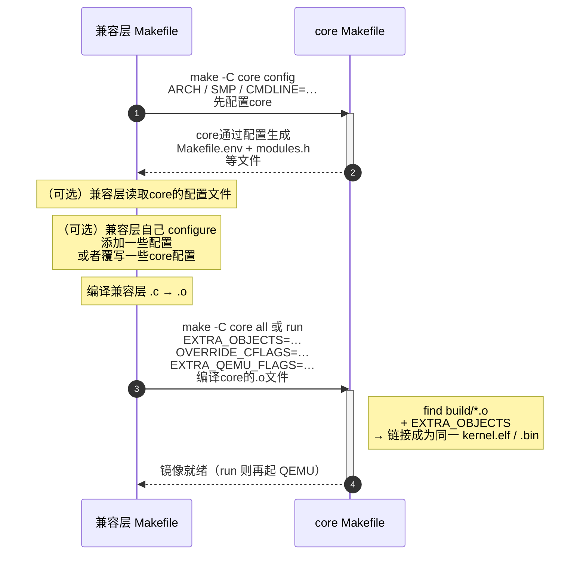

# 构建与链接

v0.1 · 2026-08-29

本篇覆盖：`Makefile` · `Makefile.env`（生成物） · `arch/Makefile` · `kernel/Makefile` · `modules/Makefile` · `script/config/configure.py` · `script/config/config_*.json` · `script/make/gen_makefile.py` · `script/make/build.mk` · `script/make/qemu.mk` · `script/link/<isa>_linker.ld`。

源码树分区与公开 API 边界见 `00-总览/00-架构与源码布局.md`；initcall 段在运行时的调用时机见同目录 §4.3 与 `01-启动与初始化/03-模块初始化与内核入口.md`。

---

## 1. 概述


在构建系统上，与较为复杂的Linux等系统内核使用Kconfig/autotools不同，RendezvOS core 使用 **Make + Python 配置脚本 + 按目录生成的叶子 Makefile** 构建。

RendezvOS core 的构建脚本所具有的复杂性在于，它存在两种构建目标（具体实现见 §1.1 ）。一个是为了验证RendezvOS core ，需要运行包含在 RendezvOS core 源码目录里面一些自带的测例。另一个是将RendezvOS core 作为兼容层的一个子模块，用于调用 RendezvOS core 提供的一些接口。

为了这个目的，我们在RendezvOS core中设计了一个兼容上述两种模式的可扩展构建系统脚本。

第一种模式就是普通的单个仓库模式，不再赘述。

第二种模式下，在位置逻辑上，RendezvOS理应被作为一个子模块，放在某个上层兼容层构建脚本定义的 `$(CORE_DIR)`（或者叫做其他的名字，兼容层可以自行定义宏名称，本文档后续统一用 `$(CORE_DIR)`来表示该位置）。在具体实践中，可以不使用这种具有上下级从属关系的目录结构，但由于其代码物理内存分配等依赖于 RendezvOS core 的链接脚本等构建链接文件，实际上其链接逻辑并不能因此改变。

在生成的产物的逻辑结构上，普通的子模块理应产出一些`obj`文件，并可能通过AS工具，打包成为`.a`类型的文件，供上层进一步的进行链接。然而，RendezvOS core并不采用这种模式。依照前述的逻辑位置模式，从逻辑上，兼容层产出的obj文件，需要反过来，注入到对应的RendezvOS core中。这是由于在RendezvOS core中，链接脚本如何做，树状的`Makefile`文件如何生成，以及相应的`modules`相关的文件如何生成，都被隐藏在相应的构建系统中，即使没有兼容层，它也是一个完整的内核，所以在不让构建系统变得过于复杂的前提下，只能让兼容层的`obj`文件注入到这个内核文件中，来让两种模式得以支持。

整个流程概述如下：

架构通用的一些编译特性由`config_common.json`给出，而具体架构的可选模块与编译特性由 `script/config/config_<isa>.json` 声明，经 `make config`写入根与各子树 `Makefile.env`、以及给出`include/modules/modules.h`的结果（细节见 §4.1）。

链接布局（内核虚拟基址、`.init.call.*`、`.percpu..data` 等）由 `script/link/<isa>_linker.ld` 确定。

通过编译的最终产出物在 `$(CORE_DIR)/build/kernel.elf`（ELF）与 `$(CORE_DIR)/build/kernel.bin`（QEMU 用 raw binary）。（如前文所述，兼容层的`obj`文件，也会注入到这里）

具体细节，在之后进一步详述。

### 1.1 两种构建目标

RendezvOS core 构建系统天然支持两类用法；第一种是 core 仓库自己跑一些内部测例，第 2 种依赖在上层兼容层（见`00-总览/00-架构与源码布局.md`定义）通过链接进core（后面简称**链接方**）在其树顶提供 Makefile，需要依赖 core 侧须提供的挂接点（见 §1.1 表、§4.2），同时**链接方**需要有选择性的覆写掉core中的一些宏（比如在core默认构建的时候默认开启`RENDEZVOS_TEST`宏，用于测试自己的内部测例，链接方需要完成覆写，去掉该宏，从而跑自己的测例）。

**（1）仅 core — 单独验证框架**

在 `$(CORE_DIR)/` 下操作，只编译 `arch/`、`kernel/`、`modules/` 与 core 链接脚本，**不**链入兼容层对象。典型命令：

```bash
cd core
make config ARCH=x86_64 SMP=4 CMDLINE=""
# 目前仅支持 x86_64/aarch64；riscv64/loongarch 见 §8，目前待实现
make run
# make config 配置会写入 Makefile.env ，后续可不再在 make 命令里写 ARCH=xxx
```

用途：测试内核测例（即 json 里默认开启的 `RENDEZVOS_TEST` 宏在代码中所包含的测例）、core的smp正常启动等 core 机制测试。产物路径固定为 **`$(CORE_DIR)/build/kernel.elf`**（及 `.bin`）。`CMDLINE` 由调用方传入 `make config`，core 不注入，也不解析通过CMDLINE传入的兼容层 init 策略。

以上通过命令行传的几个参数，ARCH在第一次config的时候会选择对应的json文件，这是不能省略的。SMP和CMDLINE其实可以在`make run`命令中直接传递。

**（2）core + 兼容层 — 链成完整内核镜像**

兼容层链接方把 core 当作**子模块**：

在兼容层的Makefile根据定义好的某个 `CORE_DIR` 变量（或者其他名字）调用 **`make -C $(CORE_DIR)`**，用 core 的 config/compile/link 产出**同一位置的** `kernel.elf`，并在最终链接阶段通过 **`EXTRA_OBJECTS`** 将兼容层的server和嵌入资源（如可能存在的 initramfs 的 `.incbin` 对象）的 `.o`文件，追加到这个`kernel.elf`中去。

兼容层源码在 core 树**外**编译（因为把 core 当成了子工程）。

关于头文件，兼容层应当具有自己需要的头文件，但同时也涉及到 core 头文件（在`$(CORE_DIR)/include`中)。因此，兼容层的构建编译脚本命令建议 **`-I $(CORE_DIR)/include`**，并加入链接方自己的 `include/`。当然在实际实现上，为了便于统一，其实建议链接方自己增加一个封装，去引用 core 的需要（而不一定是全部）的 include 头文件，在这种模式下，只需要引用链接方自己设定的头文件即可，所以只是建议。

在兼容层的配置上，需要在 core 的基础上，完成统一的配置管理，最终使得 core 和兼容层看到同样的配置，或者core的配置是兼容层配置的子集（因为并不需要看到全部的兼容层配置）。通常建议兼容层的 Makefile 也具有 config 命令，在其中先 `make -C core config`，可读config生成的 `$(CORE_DIR)/Makefile.env` 校验一致。但不允许兼容层和core存在冲突的配置（很显然的，例如`ARCH`不同会存在链接问题，再比如前面提到的`RENDEZVOS_TEST`宏需要兼容层覆写）。

`RendezvOS core` 提供的兼容点：

| 兼容点 | core 行为 | 链接方责任 |
|--------|-----------|------------|
| **`make -C core config`** | 相当于调用core的`make config` | 在同一 `ARCH`/`SMP` 下调用；可传入 `CMDLINE=`等core的`make config`可以接受的参数。 |
| **`make -C core run`** | core会构建 core自身的所有obj对象，然后跟兼容层通过`$(EXTRA_OBJECTS)`注入的obj一起，根据core自身的链接脚本，一起构建成目标`kernel.elf`文件，然后进行运行 | 先编译兼容层的 `.c` 为 `.o`，同时以 **`EXTRA_OBJECTS`** 传入兼容层的这些obj文件。 |
| **`OVERRIDE_CFLAGS`** | core的Makefile通过 `export`这些通过`gen_makefile` 模板传入子目录的Makefile里的 `CC` 规则 | 仅用于**微调 core 树内**编译的宏，兼容层需要手动写入`-D`/`-U`，例如`OVERRIDE_CFLAGS=-U RENDEZVOS_TEST`，通过这种方式，可以覆写掉core中已经有的默认定义的一些宏，但是不应该传入兼容层自己需要定义的宏（传了正常情况下也应该不会生效，因为core感知不到兼容层宏，所以没有相关ifdef分支代码），兼容层专用宏应在链接方自己的 `CFLAGS` 里。 |
| **`EXTRA_CFLAGS`** | 追加到 core 根Makefile的 `CFLAGS`中 | 可选；建议少用以避免与 json 特性冲突 |
| **`-include $(CORE_DIR)/Makefile.env`** | 无（这是让链接方调用的，从而可以看到core的Makefile.env, 但core 不感知链接方） | 链接方 Makefile 可以读 core 已 config 的 `ARCH`/`SMP`等其他配置信息，避免错配 |
| **`EXTRA_QEMU_FLAGS`** | core会根据这个注入额外的qemu启动参数 | 链接方的Makefile需要注入合适的qemu参数。部分已经定义的参数（例如`SMP`,`MEM_SIZE`这些已经在core中定义的参数需要通过传统的方式传入） |

链接方**不应**改 core 链接脚本里的段布局来「塞」扩展代码；链接方 `.o` 与 core `.o` 最终会在core 下使用core的链接脚本，用一次`ld`完成构建生成和单独构建core一样位置的内核镜像`kernel.elf`。

**例如（仅说明一种形态，非兼容层Makefile唯一合法布置方案）：** 

1. 兼容层根目录 Makefile 设 `CORE_DIR=./core`。

2. 兼容层的`config` 先 `$(MAKE) -C $(CORE_DIR) config` 来生成core的config，再运行链接方自己的 `configure_root.py` ，根据core生成的`$(CORE_DIR)/Makefile.env`和兼容层确定的配置，生成兼容层根目录下的 `Makefile.root.env`，其中包括了生成兼容层自身相关的配置信息，以及需要传递给core编译的`OVERRIDE_CFLAGS`等信息。
3. 兼容层的`run` 编译兼容层的 `.o` ，`$(MAKE) -C $(CORE_DIR) run EXTRA_OBJECTS="…" OVERRIDE_CFLAGS="…" EXTRA_QEMU_FLAGS="…"`传入`EXTRA_OBJECTS`，`OVERRIDE_CFLAGS`，按需追加`EXTRA_CFLAGS`，在core中统一构建为`kernel.elf`文件，并通过传入给core的`EXTRA_QEMU_FLAGS`qemu命令的额外参数，配合上core已有的默认参数以及上层注入的已有参数值进行qemu启动运行。

最后，上述主要都是用`make run`命令直接在qemu里面运行。如果需要上真板子或者其他环境，在core提供了`make all`等命令，在兼容层需要相应的提供构建整个内核但不跑qemu的命令，建议将其作为Makefile脚本的run命令的依赖项。从而提供生成的`kernel.elf`但不在qemu中运行。

---

## 2. 目标与边界

core 构建系统要解决：**多ISA下共用同一套 `kernel/`/`modules/` 树并实现内核构建**、**可选模块根据需要链入core**、**链接脚本与其中预留给兼容层的initcall等段布局**、**QEMU 运行入口**，以及 **供兼容层通过 `EXTRA_OBJECTS` 等接入点（见§1.1）来完成在同镜像中链入扩展代码**。它不负责：兼容层如何组织其源码目录、用户态 payload/rootfs 打包、发行版镜像、交叉编译工具链安装（尽管我们提供了build_env.sh）、CI 封装等。

core 故意不做：类似 Linux Kconfig 的交互式菜单；在 core 树内编译兼容层源码；为每个链接方维护独立链接脚本。兼容层对象须由链接方编译并以 **`EXTRA_OBJECTS`**（及必要的**`OVERRIDE_CFLAGS`**）按 §1.1 约定并入；core 的 `config_*.json` 只描述 **core 树内模块**，不替链接方写 `-D` 兼容层特性。

---

## 3. 分层与调用方

**维护 core 的开发者** — 改 `config_*.json` 开关模块、改链接脚本布局、增删 `arch/`/`kernel/` 下目录时，须同步本篇与 `00-架构与源码布局.md`；改 `.init.call.*` 须对照 `initcall.h` 与 `01-启动与初始化/03-模块初始化与内核入口.md`。

**兼容层（链接方）** — 在**自树顶 Makefile** 中 `make -C <core路径> config` 与 `make -C <core路径> all`，编译自家 `.c` 时 `-I <core>/include`，把产出的 `.o` 列表传给 **`EXTRA_OBJECTS`**；需改 core 编译宏时用 **`OVERRIDE_CFLAGS`**（不要改 core 的 `config_*.json` 除非模块已并入 core 树）。`ARCH`/`SMP`等配置情况须与 `$(CORE_DIR)/Makefile.env` 一致。集成步骤细节由兼容层文档描述；core 侧契约见 §1.1、§4.2；兼容层和core相关命令的推荐时序见 §6。

**只跑 core 测例者** — 在 **`$(CORE_DIR)/` 目录内** `make ARCH=<isa> config` → `make run`；勿依赖兼容层 Makefile。测例开关 `RENDEZVOS_TEST` 等在各 ISA 的 `config_*.json` 里默认开启，见 §9。

---

## 4. 数据结构与不变量

本篇不涉及运行时数据结构；下列为**构建期约定**。

### 4.1 core 树内生成物与脚本产物

构建期要分清三件事：配置从哪读、`configure.py` 写出什么、编译/链接依赖哪些文件。时序见 §6；路径一览见 §5。对于兼容层来说，无需关心下述实现细节，只需要考虑如何依据 §1 里面的描述的兼容点，在上层调用相关core命令并注入相关的兼容层参数。

#### `configure.py` 做了什么

`make config` 会先运行 `mrproper`，这条命令会清理掉所有的中间产物，之前`make config`之后产生的配置文件（树内全部 `Makefile.env` 和生成的 `modules.h`）也会被清理掉，再跑 `script/config/configure.py`（该脚本实际上包含以下参数：core 根目录位置、`script/config`位置、`config_<isa>.json`位置选定config的json文件、`SMP`数量、可选 `CMDLINE`）。脚本依次：

1. 读 `config_common.json`（若有）和`config_<isa>.json`的`kernel` 段，写出`$(CORE_DIR)/`下的 `Makefile.env`（包含`ARCH`/`SMP`/`CMDLINE`/`CROSS_COMPLIER`/`DBG`，以及合并后的 `CFLAGS`/`LDFLAGS`等配置信息）。
2. 遍历 `modules`：每个 `use: true` 的模块在其 `path` 下写 `Makefile.env`；再写 `modules/Makefile.env`（启用列表）和 `include/modules/modules.h`。`depend_module` **不会**自动把依赖模块打开或编进列表——只要求依赖已在 json 里**先于**本模块出现且 `use:true`，否则 configure 失败；通过检查后把依赖（及 kernel）的 features `-D` 也加入进本模块的 env。其是顺序敏感的，而没有维护一个复杂的图算法。
3. 把 **kernel 的 features** 与 **已启用模块的全部 features** 汇总，写成内容相同的 `kernel/Makefile.env` 与 `arch/Makefile.env`（`CFLAGS += -D …`）。因此像 `RENDEZVOS_TEST`、`HELLO`、`_UART_PL011_` 这类模块侧宏也会出现在 **kernel/arch 的编译**里——否则类似于 `main.c` / `smp.c` 里的 `#ifdef RENDEZVOS_TEST` / `#ifdef HELLO` 无法生效。

如果修改了`config_<isa>.json`，比如关掉某个模块的 `use`，需要重新`make config`，仅关掉某模块的 `use` 而不重新 `make config`，这些 `-D` 定义的宏不会从 kernel/arch env 消失。

`make config`并不管理 Makefile，`arch/`、`kernel/`、`modules/` 以及core最顶层的 Makefile 是手写维护的；叶子目录 Makefile 由 `gen_makefile.py` 生成，见后文。

#### 配置从哪读

这一小节描述各个config文件。

`config_common.json` 放各架构共用的编译/链接FLAGS（如 `-nostdlib`、`-nostdinc`、`-Werror`等）。

`config_<isa>.json` 的 `kernel` 段给出 `ARCH`、`CROSS_COMPLIER`、该 ISA 专用 `CFLAGS`（如 x86 的 `-mcmodel=large`），以及 kernel 的 `features`；同文件的 `modules.*` 用 `use`/`path`/`features`/`depend_module` 决定编哪些模块、给哪些 `-D`。

特性宏（`features`）只写在 `config_<isa>.json`（kernel 与各 module），不在 `config_common.json`。configure 把它们变成各子树 env 里的 `CFLAGS += -D <name>`：

这些`features`可能被写到以下几个地方：

- **模块目录 env** — 该模块自己的 features；若声明了 `depend_module`，还会带上依赖模块的 features，并在依赖分支里附带 kernel features。`depend_module` 要求依赖模块在 json 里**先于**本模块已处理进可用列表（顺序敏感）；缺失则 configure 失败。
- **`kernel/` 与 `arch/` 的 env** — **同一份**汇总：kernel features **加上**所有已启用模块的 features（见上一步 3）。
- **根 `Makefile.env`** — **不**承载这批 `-D features`。

叶子目录靠子 `Makefile` 的 `-include ./Makefile.env` 叠上这些宏。各 ISA 默认开哪些见 §8；改开关后必须重新 `make config`。

根 `Makefile` 在 include 根 env 之后，还会固定叠上 `-I $(INCLUDE_DIR)` 和 `-DNR_CPUS=$(SMP)`（`DBG` 时再加 `-g` 等）并 export——这几项不在 json 里。

注意两套「SMP」含义不同：

| 名字 | 来源 | 作用 |
|------|------|------|
| Make 变量 **`SMP`** | `make config/all/run` 的命令行或 env 里的核数 | → `-DNR_CPUS=$(SMP)`、QEMU `-smp`；影响数组上限等 |
| 特性宏 **`SMP`**（`-D SMP`） | json `kernel.features` | → `#ifdef SMP` 控制 `start_smp` 等多核路径是否编译 |

链接方如果要关掉 core 默认宏（例如测例）用 `OVERRIDE_CFLAGS`（§4.2），不要手改已生成的 env。

#### 写出哪些生成物

下述文件都由 configure.py 写出，编译时靠子 `Makefile` 的 `-include ./Makefile.env` 与根 env / 根 Makefile 导出的 `CFLAGS` 配合：

- **根 `Makefile.env`** — 工具链与全局 `CFLAGS`/`LDFLAGS` 的真源；根 `Makefile` `-include` 该文件，没有则 `make all` 失败（`have_config`会检查是否存在该文件）。
- **`kernel/Makefile.env`、`arch/Makefile.env`** — 同内容，注入特性宏，供两棵树递归编译。
- **`modules/Makefile.env`** — `modules := …`，决定包含哪些`modules`里面的模块。
- **各启用模块 `path/Makefile.env`** — 路径来自 json（如 `modules/log/Makefile.env`）；未在`config_<isa>.json`里面设置 `use:true` 的不生成。
- **`include/modules/modules.h`** — 每个启用模块一行 `#include`，由 `common.h` 引入；与 `modules/Makefile.env` 一起决定编进哪些模块、暴露哪些头。

#### 子目录 Makefile（手写顶层 + `gen_makefile.py` 叶子）

之前的`configure`工作只给出了相关的`Makefile.env`等文件，但是如果需要构建，还需要一个Makefile，并包含这些env文件给出的参数。

`build_objs` 会运行 `gen_makefile.py`：在 `arch/`、`kernel/`、`modules/` **等各含源码的子目录**写统一叶子Makefile模板（模板内容包括include `build.mk`、`-include ./Makefile.env`、递归的调用下一层的Makefile、使用带 `OVERRIDE_CFLAGS` 的 `CC`编译当前目录下的文件）。这些叶子 Makefile **每次构建都会由`gen_makefile.py`重新生成**，不接受手动修改。

**顶层** `arch/Makefile`、`kernel/Makefile`、`modules/Makefile` **不是** gen_makefile 产物，需手动维护：

- `arch/Makefile`：按 `$(ARCH)` 编译给定的 ISA 子目录，然后 `rm` 掉 arch 下嵌套生成的 Makefile。
- `modules/Makefile`：只编译 `modules/Makefile.env` 里的 `$(modules)` 列表，然后同样删掉生成的嵌套 Makefile。
- `kernel/Makefile`：递归全部子目录并编译；然后同样删掉生成的嵌套 Makefile。

区别：`Makefile.env` / `modules.h` 在 **config** 时由 `configure.py` 生成并长期存在，直到下一次`mrproper`或者重新`make config`；叶子 `Makefile` 在每次 `build_objs` 时由 `gen_makefile.py` 生成，建完又被顶层清掉——仓库里通常看不到长期存在的叶子 Makefile。

#### 链接布局与编译约定

段布局在 `script/link/<isa>_linker.ld`：在普通的`text`段，`data`段之外，还定义 `_s_init`/`_e_init`（包住 `.init.call.0`…`.init.call.9` 以及兜底 `.init.call`，与 `initcall.h` 一致，这部分用于兼容层注入一些initcall的初始化操作。），以及 `kernel_virt_offset` 确定线性映射偏移、`.percpu..data`给出percpu变量起止等。最终链接是 `find build -name '*.o'`，再追加可为空的 `EXTRA_OBJECTS`（§4.2）。仅 core 时没有额外对象；链接方在同一次 `ld` 并入兼容层 `.o`。

**与启动布局的关系（必须与运行时篇对读）：** 脚本里的 `kernel_virt_offset` / `kernel_start_offset` 决定「链接 VA」；引导器把 `kernel.bin` 放到对应 **PA**；`boot.S` 建早期页表并跳上高半——地址级步骤见 `04-平台启动-x86_64.md`、`05-平台启动-aarch64.md`，本篇不重复画物理快照，但改链接偏移时必须同步改平台 boot 与本文 §8。

编译侧硬约定：公共基线以 `config_common.json` → 根 env 为准；ISA 的 `CFLAGS` 与 `features` 以 `config_<isa>.json` 为准。根 Makefile 固定叠加 `-I include` 与 **`-DNR_CPUS=$(SMP)`**。

### 4.2 Make 目标与变量

下列由 **core 根 Makefile**（及 `qemu.mk`）消费。链接方通过 **`make -C core … 变量=值`** 传入，单独构建运行core的时候由命令行传入。

| 目标/变量 | 作用 |
|-----------|------|
| **`make config`** | `mrproper` 后跑 `configure.py`，刷新根/子树 `Makefile.env` 与 `modules.h` |
| **`make all`** | 编译并链接（**core 内主构建目标**；无 `build` 别名） |
| **`make run`** | 依赖 `all`，启动 QEMU |
| **`make dump`** | 对 `kernel.elf` 做 `objdump -d -S`（需先前带 debug 信息构建） |
| **`make mrproper`** | 删除树内全部 `Makefile.env`、`modules.h`、build 产物 |
| **`EXTRA_OBJECTS`** | 最终 `ld` 在 `$(find $(BUILD) -name '*.o')` **之后**追加的 `.o` 路径列表 |
| **`OVERRIDE_CFLAGS`** | `export` 到 `arch/`/`kernel/`/`modules/` 叶子 Makefile 的 `CC` 命令，用于 core 树编译期的 `-D`/`-U` 覆盖 |
| **`EXTRA_CFLAGS`** | 追加到 core 根 `CFLAGS`（较少用） |
| **`EXTRA_QEMU_FLAGS`** | 追加到 core 的qemu运行参数 |
| **`ARCH`** | `make config` 时选定 `config_<isa>.json` 并写入 env；之后按该 ISA 构建 |
| **`SMP`** | 写入根 env；编译期 `-DNR_CPUS=$(SMP)`；QEMU `-smp`（与 json 特性宏 `-D SMP` 不是同一回事，见 §4.1） |
| **`CMDLINE`** | **仅当命令行显式传入**才写入新 env；`make run` 时非空则 QEMU `-append` |
| **`DBG`** | 持久值来自 json `kernel.DBG`（或 `DEBUG`）→ 根 env；`make DBG=true …` 可临时覆盖编译/QEMU，但 **`make config DBG=true` 不会**把 DBG 写进 env |
| **`MEM_SIZE`** | 仅运行期（默认 `256M`），不进 `Makefile.env`；QEMU使用 `-m` 参数确定模拟的内存大小 |
| **`DUMP` / `LOG`** | 仅运行期。`DUMP=true` 给编译加 `-g`；随后 `make dump` 才有符号级反汇编。`LOG=true` 让 QEMU 写跟踪日志（路径见下） |
| **`QEMU_LOG` / `DUMPFILE`** | `LOG=true` / `make dump` 时的日志路径（链接方可改到仓库根） |

**强调**

- 切换 `ARCH` 必须 **`make -C core config` 重新生成** env 与 `modules.h`，不能仅改命令行 `ARCH=` 而不同步 config。
- **`EXTRA_OBJECTS` 中的 `.o` 须与 core 使用同一工具链、同一 `-D` 架构宏**（如 `_X86_64_`），且编译时已 `-I $(CORE_DIR)/include`。
- 最终只有 **一个** `kernel.elf`；链接方不得期望 core 产出「仅 core 的静态库」再二次链接（当前 Makefile 未提供 `libcore.a` 等类似的产物）。
- 特性宏（如 `_X86_64_`、`RENDEZVOS_TEST`）通过 json 的 `features` → `-D` 注入（含注入到 kernel/arch）；链接方若需**关闭** core 默认测例宏，应通过 **`OVERRIDE_CFLAGS`**（如 `-U RENDEZVOS_TEST`）而非手改已生成的 `Makefile.env`。

---

## 5. 代码对应

以下描述了本文档涉及的相关代码文件的作用（部分内容已经在之前小节描述过，此处再次做了一些汇总）：

| 路径 | 职责 |
|------|------|
| `Makefile` | 给定了相关的顶层make目标：`config` / `build_objs` / 链接 `kernel.elf` / `objcopy` → `kernel.bin` / `run`→qemu / `dump` / `mrproper`；**主目标为 `all`，无 `build` 别名**。 |
| `Makefile.env` | 本地配置快照（git 通常忽略） |
| `arch/Makefile` · `kernel/Makefile` · `modules/Makefile` | 手写，获取相应目录下生成的`.env`文件配置，并递归的调用子目录的由`gen_makefile.py`生成的Makefile，并在构建后清理掉对应的Makefile |
| `script/config/configure.py` | 该文件相关功能已经在 §4.1 给出 |
| `script/config/config_<isa>.json` | 每 ISA 给出相应使用的编译选项和配置信息 |
| `script/make/gen_makefile.py` | 为含需要编译的源码的叶子目录递归的写临时 Makefile（顶层 `arch/`/`kernel/`/`modules/` Makefile 除外） |
| `script/make/build.mk` | 叶子 Makefile 引用的通配编译规则 |
| `script/make/qemu.mk` | QEMU 命令行组装；被顶层 `run` 引用 |
| `script/make/utils.mk` | 一些辅助目标 |
| `script/link/<isa>_linker.ld` | ELF 段布局、内核链接基址、initcall / percpu（loongarch 文件目前为空） |

---

## 6. 流程

本节**只排时间线**，不重复解释机制：写出哪些文件、变量含义、段布局 → §4；链接方挂接点与例子 → §1.1；路径索引 → §5。

### 6.1 仅 core：`config` → `all` → `run`


1. **`make ARCH=<isa> config`** — `mrproper` + `configure.py`（细节 §4.1）。  
2. **`make all`**（或直接 `make run`，因其依赖 `all`）  
   - `build_objs`：`gen_makefile.py` 写叶子 Makefile；  
   - `make -C arch|kernel|modules`：递归编译到 `build/<相对路径>/*.o`，顶层再删掉嵌套 Makefile；  
   - `ld … $(find build -name '*.o') $(EXTRA_OBJECTS)` → `kernel.elf` → `objcopy` → `kernel.bin`。  
3. **`make run`** — `qemu-system-$(ARCH) -kernel …`（`SMP`/`MEM_SIZE`/`CMDLINE`/`DBG`/`LOG`/`EXTRA_QEMU_FLAGS` 等见 §4.2）。  
4. 需要符号级反汇编时：先 `DUMP=true` 构建，再 `make dump`。

对象的目标build路径和源码树存在对应关系，例如 `kernel/mm/pmm.c` → `build/kernel/mm/pmm.o`。

### 6.2 兼容层构建推荐方案（使用同一core内核elf文件，仅作为推荐流程）

core Makefile **不含**链接方源码路径；推荐时序如下（细则与变量名见 §1.1、§4.2）：



要点：先 core `config` 再编兼容层；先备好 `EXTRA_OBJECTS` 再 `all`/`run`；`ARCH`/`SMP` 与 `$(CORE_DIR)/Makefile.env` 不一致时应重新 config（常见做法，非 core 强制）。

---

## 7. 公开 API

构建系统**无** C 语言 API。集成方使用的 Make **目标与变量**以 **§4.2** 为唯一契约表；命令先后顺序见 **§6**；链接方应传哪些挂接点见 **§1.1**。

---

## 8. 多架构

| ISA | config 文件 | 链接脚本 | 典型 `-D` 特性（json） |
|-----|-------------|----------|------------------------|
| x86_64 | `config_x86_64.json` | `x86_64_linker.ld` | `_X86_64_`、`SMP`；模块含 ACPI、16550 UART 等；链接脚本另外包括了 `__tss_rsp_offset` 等 GS 常量 |
| aarch64 | `config_aarch64.json` | `aarch64_linker.ld` | `_AARCH64_`；模块含 DTB（当前 json 为 `use:true`）、UART 等；percpu 靠 TPIDR，无 x86 那套链接期 GS offset |
| riscv64 | `config_riscv64.json` | `riscv64_linker.ld` | 骨架可用；无主线同款高 VA/percpu 标记；v0.1 测例以 x86_64/aarch64 为主 |
| loongarch | `config_loongarch.json` | `loongarch_linker.ld` **存在但为空**（不可链接） | 实验性；Make 侧 `ARCH=loongarch` 与 json 内 `ARCH` 字符串也可能不一致，不是可用端口，后续开发需要补齐 |

**虚拟基址**（链接脚本）：x86_64 与 aarch64 均使用 `kernel_virt_offset = 0xffff800000000000`，**物理加载偏移**不同（x86 `0x100000`，aarch64 `0x40080000`）。切换 ISA 时 **链接脚本与 boot 代码成对更换**，不能只换编译宏。

交叉编译前缀由 json 的 `CROSS_COMPLIER` 写入 env（拼写保持历史字段名）；工具链须自行安装并在 PATH 中可用。

---

## 9. 测试

**仅 core：** 在 `$(CORE_DIR)/` 内启用 json 中 `test` 模块与 `RENDEZVOS_TEST`，`make ARCH=x86_64 config && make run`。(其他参数以及ARCH参数的可选配置在前文已有描述)

**集成镜像：** 链接方常在 `configure` 阶段用 `OVERRIDE_CFLAGS` 关闭 core 自带测例宏，改跑兼容层测例与用户 payload；具体开关在链接方 config json等配置方案中，不在 core `config_*.json` 内重复描述。

构建系统本身无单测；验证方式为能 config、能链接、QEMU 能进 `cmain`。core 测例行为见 `11-测试/43-内核测试框架与测例索引.md`。本篇与当前 `$(CORE_DIR)/Makefile` 一致；集成 Makefile 以链接方仓库为准，本篇 §1.1/§6.2 只描述 core 挂接契约。

---

## 10. 限制与后续

- 叶子 Makefile 由 `gen_makefile.py` 每次 `build_objs` 覆盖后又常被顶层删除，不支持在叶子目录长期手改规则；改行为应改顶层手写 Makefile、`build.mk` 或 gen 模板。
- core `Makefile` **无 `build` 目标**；链接方树顶可定义 `build` → `make -C core all`。
- 顶层链接聚合全部 `.o`，大仓库增量链接优化有限；`find` 顺序导致同 initcall level 内次序可能跨机器建不一致。
- `make config` 配方里「python 失败则 mrproper」因 Make 每行新 shell，**实际上几乎不生效**；失败时需人工 `mrproper`（工具链瑕疵，非契约承诺）。
- 外部 git 模块（json 里带 `git` 字段）在 configure 时可 clone，通常用于稳定并存放在github的module来使用，v0.1 默认 json 未启用。
- riscv64/loongarch 的 config/qemu/链接脚本较 x86/aarch64 粗糙；loongarch 空链接脚本见 §8，整体实际上尚未进入构建阶段。

---

## 11. 变更记录

- 2026-09-12：Maintainer 复审通过，确认契约主线无硬伤，正文不再大改。
- 2026-09-12：收束重复——§4.2 合并目标+变量为唯一契约表；§6 只保留时间线；§7 改为索引；纠正 `depend_module` 不自动启用、`SMP`/`loongarch` 命名与 `kernel_virt_offset` 表述。
- 2026-08-29：按操作计划整篇深读验收——修正 MEM_SIZE/DUMP/DBG 持久化表述；写明模块 features 汇总进 kernel/arch；手写顶层 Makefile + 叶子生成/删除；SMP 核数 vs `-D SMP`；initcall level 3 / find 顺序；按 ISA 区分 boot/percpu；loongarch 空 `.ld`。契约（`EXTRA_OBJECTS` / 仅 `all` / OVERRIDE）未改，Maintainer 双勾保留，若需复审请明示。
- 2026-08-28：Maintainer 审定通过；对齐 §7/§8 与 §4.1（子树 env、aarch64 DTB `use:true`）。
- 2026-08-27：澄清 core 仅 `make all` 无 `build` 目标；§4.1/§4.2 分节。
- 2026-08-27：全库统一术语（链接方/兼容层）、`make all` 测例命令；子系统篇与总览对齐。
- 2026-08-27：v0.1 初稿，config / gen_makefile / 链接脚本 / QEMU 流程。
