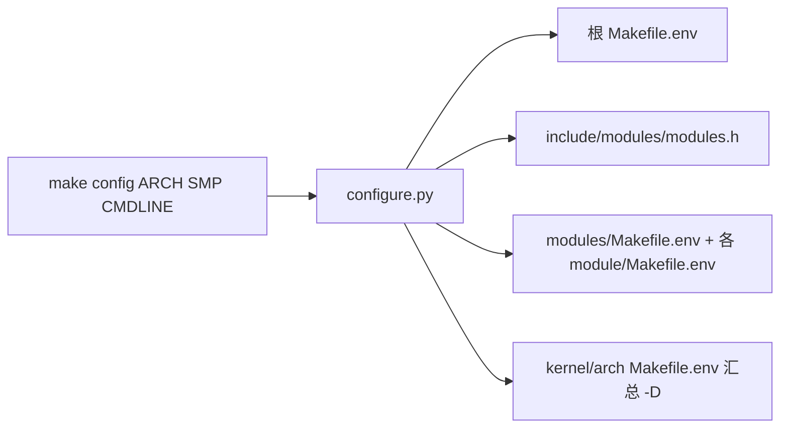
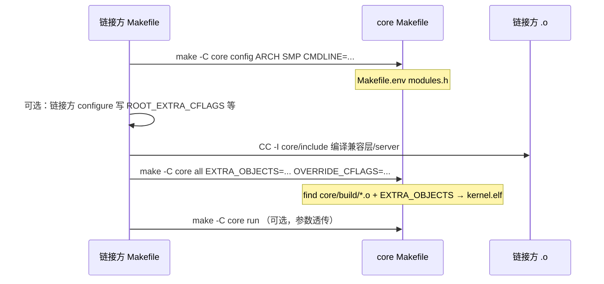

# 构建与链接

v0.1 · 2026-08-27

本篇覆盖：`Makefile` · `Makefile.env`（生成物） · `script/config/configure.py` · `script/config/config_*.json` · `script/make/gen_makefile.py` · `script/make/build.mk` · `script/make/qemu.mk` · `script/link/<isa>_linker.ld`。

源码树分区与公开 API 边界见 `00-总览/架构与源码布局.md`；initcall 段在运行时的调用时机见同目录 §4.3 与 `01-启动与初始化/模块初始化与内核入口.md`。

---

## 1. 概述

RendezvOS core 使用 **Make + Python 配置脚本 + 按目录生成的子 Makefile** 构建，不用 Kconfig/autotools。在 **`core/` 目录内**完成配置与编译时，产出 `core/build/kernel.elf`（ELF）与 `core/build/kernel.bin`（QEMU 用 raw binary）。架构、SMP 核数、可选模块与编译特性由 `script/config/config_<isa>.json` 声明，经 **`make config`** 写入 `Makefile.env` 与 `include/modules/modules.h`；链接布局（内核虚拟基址、`.init.call.*`、`.percpu`、boot 栈等）由 `script/link/<isa>_linker.ld` 固定。

### 1.1 两种构建目标

core 构建系统天然支持两类用法；**core 仓库自洽的是第 1 种**，第 2 种依赖**链接方**在其树顶提供 Makefile，但 core 侧须提供稳定挂接点（见 §4.2、§6.5）。

**（1）仅 core — 单独验证框架**

在 `core/` 下操作，只编译 `arch/`、`kernel/`、`modules/` 与 core 链接脚本，**不**链入兼容层对象。典型命令：

```bash
cd core
make ARCH=x86_64 SMP=4 config
make ARCH=x86_64 all    # core/Makefile 无 build 目标；run 依赖 all
make ARCH=x86_64 run
```

用途：内核测例（json 里 `RENDEZVOS_TEST`）、启动/initcall/port 等 core 机制回归。产物路径固定为 **`core/build/kernel.elf`**（及 `.bin`）。`CMDLINE` 由调用方传入 `make config`，core 不注入用户态 init 策略。

**（2）core + 兼容层 — 链成完整内核镜像**

链接方把 core 当作**子工程**：在**自身仓库根**（或某 `CORE_DIR`）调用 **`make -C $(CORE_DIR)`**，用 core 的 config/compile/link 产出**同一** `kernel.elf`，并在最终链接阶段通过 **`EXTRA_OBJECTS`** 追加兼容层、server、嵌入资源（如 initramfs 的 `.incbin` 对象）的 `.o`。兼容层源码在 core 树**外**编译，编译命令须 **`-I $(CORE_DIR)/include`**（及链接方自己的 `include/`），与 core 使用**同一 `ARCH` / `SMP` / 工具链前缀**（通常先 `make -C core config`，再读 `core/Makefile.env` 校验一致）。

约定要点（core 提供的契约）：

| 挂接点 | core 行为 | 链接方责任 |
|--------|-----------|------------|
| **`make -C core config`** | 写 `core/Makefile.env`、`modules.h` 等 | 在同一 `ARCH`/`SMP` 下调用；可传入 `CMDLINE=`（core 不替链接方定默认 init 命令） |
| **`make -C core all`** | `build_objs` + `ld … $(find build -name '*.o') $(EXTRA_OBJECTS)` | 先编译自家 `.c` 为 `.o`，以 **`EXTRA_OBJECTS`** 传入链接行 |
| **`OVERRIDE_CFLAGS`** | 经 `export` 传入子目录 `CC` 规则（`gen_makefile` 模板） | 仅用于**微调 core 树内**编译的 `-D`/`-U`；兼容层专用宏应在链接方自己的 `CFLAGS` 里 |
| **`EXTRA_CFLAGS`** | 追加到 core 根 `CFLAGS` | 可选；少用以避免与 json 特性冲突 |
| **`-include core/Makefile.env`** | 无（core 不感知链接方） | 链接方 Makefile 可读 core 已 config 的 `ARCH`/`SMP`/交叉编译前缀，避免错配 |

链接方**不应**改 core 链接脚本里的段布局来「塞」扩展代码；链接方 `.o` 与 core `.o` **同镜像、同链接脚本**一次 `ld` 完成。`main_init()` 等符号由链接方对象提供，core 只声明且 **`cmain` 不自动调用 `main_init()`**（见 `架构与源码布局.md` §6.3、`01-启动与初始化/模块初始化与内核入口.md` §10）。

**例如（仅说明一种常见 monorepo 形态，非 core 唯一合法布局）：** 某仓库根目录 Makefile 设 `CORE_DIR=./core`，`config` 先 `$(MAKE) -C $(CORE_DIR) config` 再运行链接方自己的 `configure_root.py` 写 `Makefile.root.env`（兼容层 `-D` 与 core 的 `CORE_OVERRIDE_CFLAGS` 分离）；`build` 编译兼容层/server 的 `.o` 与 embed 对象后，`$(MAKE) -C $(CORE_DIR) all EXTRA_OBJECTS="…"`。具体目录名与 json 文件名属于该仓库，不在 core 契约内。

本篇 §6.1–§6.4 详述**仅在 core 树内**的 config→link 链；§6.5 给出**链接方委托**时序。读 arch 专篇或改模块开关前，应先弄清本节与 §1.1 的区别。

---

## 2. 目标与边界

core 构建系统要解决：**多 ISA 共用同一套 `kernel/`/`modules/` 树**、**可选模块与 `-D` 特性开关**、**链接脚本与 initcall 段布局**、**本地/QEMU 运行入口**，以及 **供链接方通过 `EXTRA_OBJECTS` 等同镜像链入扩展代码**。它不负责：链接方如何组织其源码目录、用户态 payload/rootfs 打包、发行版镜像、交叉编译工具链安装、CI 封装（链接方在 core 之外做）。

core 故意不做：类似 Linux Kconfig 的交互式菜单；在 core 树内编译兼容层源码；为每个链接方维护独立链接脚本。兼容层对象须由链接方编译并以 **`EXTRA_OBJECTS`**（及必要时 **`OVERRIDE_CFLAGS`**）按 §1.1 约定并入；core 的 `config_*.json` 只描述 **core 树内模块**，不替链接方写 `-D` 兼容层特性。

---

## 3. 分层与调用方

**维护 core 的开发者** — 改 `config_*.json` 开关模块、改链接脚本布局、增删 `arch/`/`kernel/` 下目录时，须同步本篇与 `架构与源码布局.md`；改 `.init.call.*` 须对照 `initcall.h` 与 `01-启动与初始化/模块初始化与内核入口.md`。

**上层集成方（链接方）** — 在**自树顶 Makefile** 中 `make -C <core路径> config` 与 `make -C <core路径> all`，编译自家 `.c` 时 `-I <core>/include`，把产出的 `.o` 列表传给 **`EXTRA_OBJECTS`**；需改 core 编译宏时用 **`OVERRIDE_CFLAGS`**（不要改 core 的 `config_*.json` 除非模块已并入 core 树）。`ARCH`/`SMP` 须与 `core/Makefile.env` 一致。集成步骤细节由链接方 compat 文档描述；core 侧契约见 §1.1、§4.2、§6.5。

**只跑 core 测例者** — 在 **`core/` 目录内** `make ARCH=<isa> config` → **`make all`** → `make run`；勿依赖链接方 Makefile。core **没有**名为 `build` 的 Make 目标（链接方树顶可自定义 `build` 并内部调用 `make -C core all`）。测例开关 `RENDEZVOS_TEST` 等在 x86_64/aarch64 的 core json 里默认开启，见 §9。

---

## 4. 数据结构与不变量

本篇不涉及运行时 struct；下列为**构建期约定**。

### 4.1 core 树内生成物与脚本产物

**`Makefile.env`（core 根目录）** — `make config` 生成，含 `ARCH`、`SMP`、`CROSS_COMPLIER`、`CFLAGS`、`LDFLAGS`、`CMDLINE` 等。根 `Makefile` 通过 `-include Makefile.env` 读取；**不存在时 `make all` 失败**（`have_config` 目标）。

**`include/modules/modules.h`（生成）** — `configure.py` 根据 json 里 `use: true` 的模块，写入 `#include "log/log.h"` 等形式；`common.h` 会 include 它。`mrproper` 删除该文件；未 config 时编译可能缺头文件。

**子目录 `Makefile`（生成）** — `gen_makefile.py` 在每个含 `.c`/`.S` 的目录写入统一模板（include `build.mk`、递归子目录、`CC` 规则）。**每次 `build_objs`（`make all` 的一部分）都会重新生成**，手改会被覆盖。

**链接脚本符号** — 各 ISA 链接脚本均定义 `_s_init` / `_e_init` 包裹 `.init.call.0`…`.init.call.9`，与 `initcall.h` 中 `Init_Info` 数组一致；还定义 `kernel_virt_offset`、`_per_cpu_start` / `_per_cpu_end`、boot 栈等，启动代码与 `cmain` 依赖这些符号。

**core 编译不变量** — `CFLAGS` 含 `-I include`、`-nostdlib -nostdinc`、`-DNR_CPUS=$(SMP)`；特性宏由 json `features` → `-D` 注入。链接：`find build -name '*.o'` 再追加 `EXTRA_OBJECTS`（可为空）。

### 4.2 链接方集成挂接点（core/Makefile）

下列变量由 **core 根 Makefile** 定义；链接方通过 **`make -C core … 变量=值`** 传入，core 源码树内不必也不应包含链接方路径。

| 变量 | 作用 |
|------|------|
| **`EXTRA_OBJECTS`** | 最终 `ld` 行在 `$(find $(BUILD) -name '*.o')` **之后**追加的路径列表（兼容层、server、`.incbin` 对象等） |
| **`OVERRIDE_CFLAGS`** | `export` 到 `arch/`/`kernel/`/`modules/` 叶子 Makefile 的 `CC` 命令，用于 core 树编译期的 `-D`/`-U` 覆盖 |
| **`EXTRA_CFLAGS`** | 追加到 core 根 `CFLAGS`（较少用） |
| **`ARCH` / `SMP` / `CMDLINE` / `MEM_SIZE` / `DBG` / `DUMP`** | 与 standalone 相同；`make -C core config` 时写入 `Makefile.env` |
| **`QEMU_LOG` / `DUMPFILE`** | 委托 `make -C core run` / `dump` 时的日志路径（链接方可改到仓库根） |

**不变量**

- 切换 `ARCH` 必须 **`make -C core config` 重新生成** env 与 `modules.h`，不能仅改命令行 `ARCH=` 而不同步 config。
- **`EXTRA_OBJECTS` 中的 `.o` 须与 core 使用同一工具链、同一 `-D` 架构宏**（如 `_X86_64_`），且编译时已 `-I core/include`。
- 最终只有 **一个** `kernel.elf`；链接方不得期望 core 产出「仅 core 的静态库」再二次链接（当前 Makefile 未提供 `libcore.a` 产品）。
- 特性宏（如 `_X86_64_`、`RENDEZVOS_TEST`）通过 json 的 `features` → `-D` 注入；链接方若需**关闭** core 默认测例宏，应通过 **`OVERRIDE_CFLAGS`**（如 `-U RENDEZVOS_TEST`）而非手改已生成的 `Makefile.env`。

---

## 5. 代码对应

| 路径 | 职责 |
|------|------|
| `Makefile` | 顶层：`config` / `build_objs` / 链接 `kernel.elf` / `objcopy` → `kernel.bin` / `run`→qemu / `dump` / `mrproper`；**主目标为 `all`，无 `build` 别名** |
| `Makefile.env` | 本地配置快照（git 通常忽略） |
| `script/config/configure.py` | 读 json → 写根 `Makefile.env`、各 module 的 `Makefile.env`、`modules/Makefile.env`、`include/modules/modules.h`、`kernel/` 与 `arch/` 的 `Makefile.env`（汇总 `-D` 特性） |
| `script/config/config_<isa>.json` | 每 ISA 默认：`kernel.ARCH/CROSS_COMPLIER/CFLAGS/features`、`modules.*.use/path/features/depend_module` |
| `script/make/gen_makefile.py` | 递归扫描 `arch/`、`kernel/`、`modules/`，写目录级 `Makefile` |
| `script/make/build.mk` | 单目录：`BUILD` 子路径、`wildcard` 源文件、`.o` 规则、依赖 `.d` |
| `script/make/qemu.mk` | `qemu-system-$(ARCH)` 参数：`-kernel kernel.bin`、`-smp`、`-m`、`CMDLINE`、x86 q35 / aarch64 virt 等 |
| `script/make/utils.mk` | 辅助目标（如 `show_config` 配合） |
| `script/link/<isa>_linker.ld` | ELF 段布局、内核链接基址、initcall/percpu/boot_stack |

`config_common.json` 若存在，其 `CFLAGS`/`LDFLAGS` 会 prepend 到各 arch 的 kernel 配置；当前 x86_64/aarch64 json 以 per-arch 为主。

---

## 6. 流程

### 6.1 配置：`make config`



调用形如：`make ARCH=x86_64 SMP=4 config`（`config` 目标会先 `mrproper` 清理旧 env 与 build 产物）。`configure.py` 参数：根目录、`script/config` 路径、`config_<isa>.json`、SMP 数、可选 CMDLINE。

模块依赖：`depend_module` 会把依赖模块的 `features` 一并 `-D` 进该模块的 `CFLAGS`；缺失依赖模块时 configure **失败退出**。

### 6.2 编译与链接：`make all`

core 的 **`all`** 依赖 `have_config` 与 `$(Target_BIN)`，内部触发 `build_objs` 再链接。链接方集成时同样调用 **`make -C core all`**（不要写 `make -C core build`，除非链接方自行添加别名）。

1. **`build_objs`**：`python3 script/make/gen_makefile.py arch kernel modules`。
2. **`make -C arch all`** → **`kernel`** → **`modules`**：各树自顶向下递归子目录，叶子目录 `CC` 生成 `build/<相对路径>/*.o`。
3. **链接**：`ld $(LDFLAGS) -o build/kernel.elf $(find build -name '*.o') $(EXTRA_OBJECTS)`；`LDFLAGS` 含 `-T script/link/$(ARCH)_linker.ld`。standalone 时 `EXTRA_OBJECTS` 为空。
4. **`objcopy -O binary`** → `build/kernel.bin`。

对象文件路径镜像源码目录，例如 `kernel/mm/pmm.c` → `build/kernel/mm/pmm.o`。

### 6.3 运行与调试

- **`make run`**（即 `qemu`）：依赖 `all`，用 `qemu-system-$(ARCH) -kernel build/kernel.bin -smp $(SMP) -m $(MEM_SIZE)` 等；`LOG=true` 可开 guest 跟踪日志；`DBG=true` 挂 gdb（`-s -S`）。
- **`make run DUMP=true`** 后再 **`make dump`**：生成带源码的 `objdump.log`。

### 6.4 与 initcall / 启动的关系

`.init.call.N` 段在链接时落入 `.init`，`_s_init`/`_e_init` 界定了 `do_init_call()` 的遍历范围——**链接脚本与 `initcall.h` 必须一致**。boot 栈、内核虚拟基址、`ENTRY(_start)` 也在链接脚本中固定，与 `01-启动与初始化/平台启动-*.md` 直接相关。构建阶段**不**执行 init；仅决定镜像里函数指针与段的布局。

**链接方注意：** 通过 `EXTRA_OBJECTS` 链入的 `.o` 若含 **`DEFINE_INIT`**，其 `Init_Info` 也会进入同一 `.init` 段，与 core 模块 init 一并被 `do_init_call()` 遍历；init 须幂等并遵守 `01-启动与初始化/模块初始化与内核入口.md` 中的 AP 语义。

### 6.5 链接方委托构建（core 树外 Makefile）

core  Makefile **不包含**链接方源码路径；下列为推荐时序（链接方实现细节在其自身文档，core 只保证挂接点存在）：



链接方 **`config`** 应**先**驱动 core config，再生成自家 env，以保证 `ARCH`/`SMP`/交叉编译前缀一致； **`build`** 应先产出 `EXTRA_OBJECTS` 再调用 `make -C core all`，否则链接缺符号。若检测到 `core/Makefile.env` 中 `ARCH`/`SMP` 与当前目标不符，链接方 Makefile **应** `mrproper` 后重新 config（常见做法，非 core 强制）。

standalone 路径无 `EXTRA_OBJECTS`，即 §6.1–§6.3 在 `core/` 内直接执行。

---

## 7. 公开 API

构建系统无 C 语言 API；集成方常用 **Make 目标与变量**：

| 目标/变量 | 含义 |
|-----------|------|
| `make config` | 生成/刷新 `Makefile.env`、`modules.h`（会 mrproper） |
| `make all` | 编译并链接（**core 内主构建目标**） |
| `make run` | QEMU 启动（依赖 `all`） |
| `make dump` | 反汇编 ELF（需先前带 debug 信息构建） |
| `make mrproper` | 删除 `Makefile.env`、`modules.h`、build 产物 |
| `EXTRA_OBJECTS` | 链接阶段追加的 `.o` 列表（**链接方集成**） |
| `OVERRIDE_CFLAGS` | 覆盖 core 树内 `CC` 的额外标志（**链接方集成**） |
| `ARCH` | `x86_64` / `aarch64` / `riscv64` / `loongarch` |
| `SMP` | 写入 env 与 `-DNR_CPUS`、QEMU `-smp` |
| `MEM_SIZE` | QEMU 内存，默认 `256M` |
| `CMDLINE` | 写入 env，QEMU `-append`（aarch64 等） |
| `RENDEZVOS_TEST` / `HELLO` 等 | 由 json `features` → `-D`，非命令行直接传 |

改模块组合应编辑对应 `script/config/config_<isa>.json` 后重新 `make config`，不要只改 `-D` 而不更新 `modules.h`。

---

## 8. 多架构

| ISA | config 文件 | 链接脚本 | 典型 `-D` 特性（json） |
|-----|-------------|----------|------------------------|
| x86_64 | `config_x86_64.json` | `x86_64_linker.ld` | `_X86_64_`、`SMP`；模块含 ACPI、16550 UART 等 |
| aarch64 | `config_aarch64.json` | `aarch64_linker.ld` | `_AARCH64_`；DTB 模块常 `use:false`（按 json 为准） |
| riscv64 | `config_riscv64.json` | `riscv64_linker.ld` | 骨架可用；v0.1 文档与测例以 x86_64/aarch64 为主 |
| loongarch | `config_loongarch.json` | 仓库内暂无对应 `script/link/*.ld`（以 `Makefile` 与 arch 树为准） | 实验性 |

**虚拟基址**（链接脚本）：x86_64 与 aarch64 均使用 `kernel_virt_offset = 0xffff800000000000`，**物理加载偏移**不同（x86 `0x100000`，aarch64 `0x40080000`）。切换 ISA 时 **链接脚本与 boot 代码成对更换**，不能只换编译宏。

交叉编译前缀由 json 的 `CROSS_COMPLIER` 写入 env（拼写保持历史字段名）；工具链须自行安装并在 PATH 中可用。

---

## 9. 测试

**仅 core：** 在 `core/` 内启用 json 中 `test` 模块与 `RENDEZVOS_TEST`，`make ARCH=x86_64 config && make all && make run`。

**集成镜像：** 链接方常在 `configure` 阶段用 `OVERRIDE_CFLAGS` 关闭 core 自带测例宏，改跑兼容层测例与用户 payload；具体开关在链接方 config json，不在 core `config_*.json` 内重复描述。

构建系统本身无单测；验证方式为能 config、能链接、QEMU 能进 `cmain`。core 测例行为见 `11-测试/内核测试框架与测例索引.md`。本篇与当前 `core/Makefile` 一致；集成 Makefile 以链接方仓库为准，本篇 §1.1/§6.5 只描述 core 挂接契约。未在本环境复跑 build。

---

## 10. 限制与后续

- `gen_makefile.py` 每次 `build_objs` 覆盖子 Makefile，不支持在叶子目录长期手改规则。
- core `Makefile` **无 `build` 目标**；链接方树顶可定义 `build` → `make -C core all`。若需 core 内别名，属 core 变更，需 Maintainer 确认。
- 顶层链接聚合全部 `.o`，大仓库增量链接优化有限。
- 外部 git 模块（json 里带 `git` 字段）在 configure 时可 clone，v0.1 默认 json 未启用。
- riscv64/loongarch 的 config/qemu 路径较 x86/aarch64 粗糙，以源码为准。

---

## 11. 变更记录

- 2026-08-27：澄清 core 仅 `make all` 无 `build` 目标；§4.1/§4.2 分节；`main_init` 不由 `cmain` 调用。
- 2026-08-27：全库统一术语（链接方/兼容层）、`make all` 测例命令；子系统篇与总览对齐。
- 2026-08-27：v0.1 初稿，config / gen_makefile / 链接脚本 / QEMU 流程。
