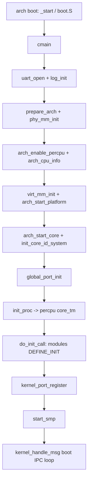

# 架构与源码布局

v0.1 · 2026-08-26

本篇覆盖：`include/rendezvos/`（目录级）、`include/common/`、`include/modules/modules.h`、`kernel/system/main.c`、`include/rendezvos/task/initcall.h`。

---

## 1. 概述

RendezvOS 是一个**混合内核架构**的**多核**操作系统内核框架（`KERNELVERSION=0.1`）。基于该框架构建的完整操作系统，在内核态保留一个小的 **core**，提供 boot 启动、与目标 ISA 相关的硬件设置、物理/虚拟内存与地址空间管理、线程与 per-CPU 调度、线程间 IPC port、陷阱与中断抽象、SMP 与 per-CPU 数据、基础同步原语，以及 UART/定时器等最小平台模块，但**不向用户态提供任何 syscall 接口**。一切对用户态可见的系统调用、文件管理、网络、设备驱动等，均设计在 core 之上的**兼容层**实现，而不属于 core 契约。

**RendezvOS 项目（core 仓库）的范围**包括：core 框架的设计与实现、面向 core 的文档、对兼容层的硬性约束约定、基础内核测例、为可观测性所必需的最小支撑代码（例如 UART 串口输出），以及 **在 `core/` 内可独立完成的构建与 QEMU 运行**。不包含某一具体兼容层的产品实现；完整产品镜像由链接方在其仓库根 Makefile 中通过 `make -C core` 与 `EXTRA_OBJECTS` 等方式链入（见 `00-总览/构建与链接.md`）。

**设计目的**在于：屏蔽启动代码、上下文切换、中断处理等硬件相关复杂度；封装并发模型并提供统一的多核框架——使兼容层可以以**多个单执行流 server + server 之间异步 IPC** 的方式协作构建完整内核。兼容层可以拟合 Linux、seL4 等既有操作系统的接口风格，但不限于其中任何一种；core 文档只描述框架能力，不假定上层选型。

core 源码树按职责分成五块：`include/`、`kernel/`、`arch/`、`modules/`、`script/`。文档体系在 `core/docs/v0.1/full/` 下按子系统拆成 44 篇（索引见 `v0.1/full/README.md`）。`script/` 与构建流程见同分区 `00-总览/构建与链接.md`（standalone 在 `core/` 内用 **`make all`**，无 `build` 目标）。

---

## 2. 目标与边界

core 要解决的是「上层集成方可以复用的原语层」：地址空间与映射、线程生命周期、消息 port、跨核一致性、陷阱入口等。兼容层应通过 `include/rendezvos/` 下的头文件使用这些能力；在需要全局串行化时，由兼容层自建单执行流 server 并通过 IPC 协作，而不是在 core 内嵌入某一具体 OS 的语义。

core **故意不做**的事包括：向用户态暴露 syscall 分发表；按某一 OS（例如 POSIX 风格）命名的系统调用实现；文件系统路径解析与 inode 模型；进程组、信号、命名空间等策略；网络栈与通用设备驱动框架；用户态 loader 的完整产品策略（core 提供 ELF 辅助与 `thread_loader`，但不承担发行版级的动态链接策略）。若兼容层需要上述能力，应在 core 之外实现，并通过直接 API 调用、与 core 约定线程的 IPC、或 hook/initcall 注入挂接。

**兼容层通常包括但不限于**（具体形态由集成方决定）：用户态可见接口的分发与封装；为支持这些接口而实现的单执行流 server 及其 IPC 协议；对 core 公开 API 的薄封装或适配层。

边界上还有一个习惯：`include/common/` 只放与 RendezvOS 语义无关的基础类型与数据结构（链表、位图、原子操作等）；一旦涉及 VSpace、Thread、Port 等内核对象，头文件应放在 `include/rendezvos/` 或其子目录，实现放在 `kernel/` 或 `arch/`。`include/modules/` 与 `modules/` 对应可选的平台与调试组件，由 `modules.h` 聚合 include，不参与「最小内核 API」的核心契约。

---

## 3. 分层与调用方

core 位于完整内核镜像的**最内层**。获得可运行镜像有两种构建路径（详述见 `00-总览/构建与链接.md` §1.1）：

- **仅 core** — 在 `core/` 内 `make config` 后 **`make all`**（或 `make run`，依赖 `all`），产物 `core/build/kernel.elf`，用于 core 测例与机制验证。
- **core + 兼容层** — 链接方在**自树顶** `make -C <core路径> config`，编译兼容层/server 为 `.o`，再 `make -C <core路径> all EXTRA_OBJECTS=…` 与 core 对象**同一次**链接；须 `-I <core>/include`，且 `ARCH`/`SMP` 与 `core/Makefile.env` 一致。链接方树顶 Makefile 常把目标命名为 `build`，内部仍应 **`make -C core all`**，而非假定 core 存在 `build` 目标。

无论哪种路径，调用方都通过 include `include/rendezvos/` 使用 API。`include/rendezvos/common.h` 约定：完整产品内核的其余部分由**链接方**在 core 之外实现；core 只保留必要原语。`main_init()`、`interrupt_init()` 等由链接方 `.o` 提供实现，但 **core 的 `cmain` 不会自动调用 `main_init()`**——是否调用、何时调用由链接方初始化策略决定（见 `01-启动与初始化/模块初始化与内核入口.md` §10）。

兼容层调用 core 功能，典型有三条路径（可组合使用，core 不规定上层目录结构）：

**直接调 core 公开 API** — 内存映射、线程创建、port 收发、trap 注册等，只要不需要全局锁串行化，应优先直接调用 `include/rendezvos/` 中的函数；兼容层可在其外再包一层封装，但不改变 core 契约。哪些用户态操作对应 direct call、哪些必须经 server，由兼容层自行划分，不在 core full 中写具体 syscall 名。

**经 IPC 与 core 或 compat 内 server 协作** — 当多个执行流竞争同一全局命名空间（例如全局 port 表上的资源操作）时，由兼容层创建单执行流 server、注册 listen port，客户端以异步 IPC（含 request-reply 模式）发消息。core 只保证 port、消息与阻塞语义正确；server 策略与协议属于兼容层。若需与 core 内固定线程（如 boot 线程）通信，可通过 `kernel_set_ipc_handler` 等挂接点约定。

**通过 hook / initcall 注入** — 链接段中的 `DEFINE_INIT` 在 `do_init_call()` 阶段执行，用于注册模块、port、测例线程等；链接方 `.o` 中的 init 与 core 模块 init **同一链接脚本、同一次 `do_init_call()` 遍历**（见 `00-总览/构建与链接.md` §6.4）。

core 对调用方还有各子系统的生命周期、并发与所有权等契约，不在本篇枚举。查阅方式：**按任务找分区**（§5.3、§5.7、§7 的 API 地图与 full 索引）→ 进入对应分区 full 篇的「目标与边界」「数据结构与不变量」「公开 API」；集成步骤待 compat 撰写后见 `core/docs/v0.1/compat/`。

与文档的关系：`core/docs/v0.1/full/` 供维护 core 或查实现细节；`core/docs/v0.1/compat/`（待 full 审定后撰写）供上层集成方按任务查调用步骤；`core/docs/v0.1/evolution/` 记录待办与远期设计，不是现行 API。compat 篇同样只写抽象调用约定，不绑定某一具体上层仓库布局。

---

## 4. 布局约定与跨切面不变量

本篇**不**逐一定义 `VSpace`、`Thread`、`Port` 等具体 struct（那在各子系统 full 篇里）。本节只列**读树、集成、启动时必须先对齐**的几条**布局级约定**：它们要么规定源码/头文件怎么分层，要么规定链接与启动阶段的**全局顺序**，违反时会在多个子系统同时踩坑。

### 4.1 头文件与实现分离（集成边界）

**是什么：** 公开类型与 API 在 `include/rendezvos/`（及 `include/arch/`、`include/common/`）；实现 `.c` 在 `kernel/`、`arch/<isa>/`、`modules/`。

**为何写在本篇：** 这不是某个内核对象的字段不变量，而是**调用方与 core 的硬边界**——只应 include 公开头，不得依赖 `kernel/` 内 static 符号或私有布局。违反此约定会导致链接失败或静默 ABI 耦合。

**详述：** 各 struct 定义见对应分区；公共基础库见 `10-基础设施/公共基础库与数据结构.md`。

### 4.2 构建、链接与架构选择

**是什么：** 同一套 portable 源码通过 `ARCH` 与编译宏（如 `-D_X86_64_`、`-D_AARCH64_`，由 `script/config/configure.py` 写入 `Makefile.env`）选中 `include/arch/<isa>/` 与 `arch/<isa>/` 的实现；portable 头（如 `include/rendezvos/mm/vmm.h`）在内部 include 对应 `arch/<isa>/mm/vmm.h` 扩展。链接使用 `script/link/<isa>_linker.ld`。**仅 core** 时在 `core/` 内 `make config` + **`make all`**；**集成** 时由链接方 `make -C core … all` 并传入 `EXTRA_OBJECTS`（见 `00-总览/构建与链接.md` §1.1）。

**为何写在本篇：** 这解释「为何改 `ARCH` 会换整棵 arch 树」以及 initcall 段、链接脚本从哪来——属于**工程布局**，不是运行时对象，但读任何 arch 专篇前需先知道宏与脚本如何选 ISA。

**详述：** `00-总览/构建与链接.md`（config、gen_makefile、链接脚本、QEMU）；各 ISA 平台行为见本篇 §8 与 `01-启动与初始化/平台启动-*.md`。

### 4.3 模块 initcall 与「注册」和「真正运行」的时序

**是什么：** `DEFINE_INIT(fn)` 把函数指针放进链接段 `.init.call.<level>`（默认 level 3）；链接脚本按 level 0→9 排序，由符号 `_s_init`…`_e_init` 界定范围。`do_init_call()` 线性调用这些函数——**仅做注册类工作**（创建线程结构并 **挂入** Task_Manager、注册 port、分配资源等），**不**保证 init 里创建的线程此刻已在 CPU 上执行。

**何时调用：**

| 阶段 | BSP | AP（SMP） |
|------|-----|-----------|
| 前置 | `cmain` 中 `init_proc()` 已建立本核 boot + idle 与 Task_Manager | `start_secondary_cpu` 路径上同样 `init_proc()` |
| **`do_init_call()`** | `init_proc()` **之后**、`kernel_port_register()` 与 **`start_smp()` 之前** | AP 在等到 `all_enabled` 后**再次**执行整表 init（init 须幂等或 per-CPU 分支） |
| 之后 | `start_smp()` →（可选测例）→ boot 线程进入 `kernel_handle_msg()` | 各 AP boot 线程同样进入 IPC 循环 |

**注册 vs 运行：** `init_proc()` 末尾会把当前执行流 `switch_to` idle，boot 已在就绪队列上；`do_init_call()` 里 `gen_thread_from_func` 等只是把新线程 **enqueue**。线程的**正式运行**须等 `cmain` / `start_secondary_cpu` **走完**启动编排、中断与调度可用，且（BSP 上）`start_smp()` 拉起 AP 之后，由 round-robin **选中**该线程才会进入其入口函数。init 函数本身在 **boot 线程上下文、调度已存在但未进入多核稳态** 时同步执行完毕。

**为何写在本篇：** 这是链接布局 + 启动编排的**全局时序不变量**；与 §6.1 流程图、`01-启动与初始化/模块初始化与内核入口.md` 配套阅读，避免误以为「init 返回 = 所有 server 已在跑」。

**详述：** 启动阶段划分 → `01-启动与初始化/启动流程总览.md`；initcall、boot/idle、AP 二次 init → `01-启动与初始化/模块初始化与内核入口.md`；调度选中 → `03-任务与调度/线程与Task_Manager.md`。

### 4.4 per-CPU 与 SMP 数据布局

**是什么：** 开启 `SMP` 时 `common.h` include `rendezvos/smp/smp.h`；Task_Manager、当前线程等通过 `DEFINE_PER_CPU` / `percpu()` 访问；启动阶段 `arch_enable_percpu` / `calculate_per_cpu_offset` 建立各 AP 偏移。

**为何写在本篇：** 这是**地址布局与访问方式**的约定（数据在 per-CPU 区而非全局变量），影响所有多核调用方；具体 struct 字段与锁规则在 SMP/调度篇展开。

**详述：** `06-SMP与同步/per-CPU数据与访问约定.md`、`06-SMP与同步/SMP启动与处理器拓扑.md`；跨核改队列见 `03-任务与调度/` 与 `06-SMP与同步/`。

### 4.5 全局命名索引（IPC 前置基础设施）

**是什么：** IPC port 按名查找依赖 `include/rendezvos/registry/name_index.h` 的字符串索引；port 须注册进全局表后他线程才能 `thread_lookup_port`。

**为何写在本篇：** 名称索引不是 Port 对象本身，但是 **IPC 子系统共用的注册表布局**；不先理解「名 → 对象」在哪一层，读 `04-IPC/` 会缺一块。

**详述：** `10-基础设施/名称索引注册表.md`；port 语义 → `04-IPC/Port与消息模型.md`。

---

## 5. 代码对应

### 5.1 顶层目录

```text
core/
├── include/          所有头文件（公开 API + arch + modules + common）
├── kernel/           架构无关的内核实现
├── arch/             按 ISA 划分的 boot、mm、trap、smp 等
├── modules/          驱动、ACPI/DTB/ELF/PCI、测例、helloworld
├── script/           gen_makefile、链接脚本、qemu 运行脚本
├── docs/             v0.1 文档（full / compat / evolution）
├── Makefile          入口；KERNELVERSION=0.1
└── Makefile.env      ARCH、SMP、交叉编译前缀等本地配置
```

构建时 `script/make/gen_makefile.py` 扫描 `arch/`、`kernel/`、`modules/` 生成各子 Makefile，再统一链接为 `build/kernel.elf`。编译选项固定 `-I include` 与 `-nostdlib -nostdinc`，不使用宿主 libc。构建链路详见 `00-总览/构建与链接.md`。

### 5.2 include/

| 路径 | 职责 |
|------|------|
| `include/common/` | 基础类型 `types.h`、原子与自旋、`dsa/` 下链表/红黑树/位图/ms_queue、字符串与对齐工具。无 RendezvOS 对象语义。 |
| `include/rendezvos/` | **对外公开的内核 API**。子目录见下节。 |
| `include/arch/<isa>/` | 页表项格式、trap 帧、thread 上下文、boot 参数等 ISA 相关定义；由 `rendezvos/` 头文件间接 include。 |
| `include/modules/` | 可选模块 API：`log/`、`driver/`、`dtb/`、`acpi/`、`elf/`、`pci/`、`psci/`、`test/`、`helloworld/`。 |
| `include/modules/modules.h` | 聚合 include，供 `common.h` 拉入当前配置需要的模块头（如 `log.h`、`driver.h`、`test.h`）。 |

### 5.3 include/rendezvos/ 子目录（公开 API 地图）

下列头文件是上层集成方最常接触的入口；实现细节与调用链在对应 full 篇中展开。

- **`mm/`** — 物理内存 `pmm.h`、`buddy_pmm.h`，虚拟地址空间 `vmm.h`、`nexus.h`（radix 用户映射）、`kmalloc.h`、`map_handler.h`、`page_slice_copy.h`、`allocator.h`。→ `02-内存管理/`
- **`task/`** — 线程与调度 `thread.h`，启动与 ELF 加载 `thread_loader.h`，线程 id `id.h`，模块 init `initcall.h`，EBR 回收 `ebr.h`。→ `03-任务与调度/`
- **`ipc/`** — 消息 `message.h`、`kmsg.h`，port `port.h`，IPC 封装 `ipc.h`、`ipc_serial.h`，内核侧 kmsg 系统 `kmsg_system.h`。→ `04-IPC/`
- **`trap/`、`trap.h`** — 陷阱分类与处理入口。→ `05-陷阱与中断/`
- **`smp/`** — `smp.h`、`percpu.h`、`ipi.h`，以及 `cpu_id` 相关约定（部分在 arch 头中）。→ `06-SMP与同步/`
- **`sync/`** — `spin_lock.h`、`cas_lock.h`、`barrier.h`。→ `06-SMP与同步/锁与内存屏障.md`
- **`registry/`** — `name_index.h` 全局字符串索引。→ `10-基础设施/名称索引注册表.md`
- **`system/`** — `panic.h`、`powerd.h`。→ `10-基础设施/错误码与panic.md`
- **根目录** — `common.h`（内核通用 include 入口）、`error.h`、`limits.h`、`stdio.h`（内核打印）、`stdlib.h`、`time.h`、`cpu_topology.h`。

### 5.4 kernel/

架构无关实现，与 `include/rendezvos/` 大致一一对应：

- `kernel/system/main.c` — BSP 上 C 语言入口 `cmain()`，见第 6 节。
- `kernel/mm/` — pmm、buddy、vmm、nexus、kmalloc、map_handler、page_slice 等。
- `kernel/task/` — `thread.c`、`thread_boot.c`、`thread_loader.c`、`task_manager.c`、`id.c`、`ebr.c`；`kernel/task/servers/` 下有 **core 内** idle 与示例 IPC server（与兼容层中的 server 无关）。
- `kernel/ipc/` — port、message、ipc、kmsg、ipc_serial。
- `kernel/registry/` — `name_index.c`。
- `kernel/smp/`、`kernel/trap/`、`kernel/time/` — SMP 辅助、trap 分发、时间子系统。

### 5.5 arch/

每个支持的 ISA 下有 boot、mm、trap、task、smp、time 等子目录；x86_64 另有 `acpi/`、`PIC/`；aarch64 有 `gic/`、`psci/`。riscv64 与 loongarch 目录存在，但 v0.1 以 x86_64 与 aarch64 为主要开发与测试目标。平台相关 full 篇在 `01-启动与初始化/平台启动-*.md` 与 `05-陷阱与中断/`、`09-平台模块/`。

### 5.6 modules/

可选组件与测例，全部通过 `DEFINE_INIT` 或显式调用挂接：

- **`driver/`** — UART（16550、PL011）、x86 字符控制台、8254 定时器。
- **`log/`** — 内核日志级别与输出。
- **`dtb/`、`acpi/`、`pci/`、`elf/`、`psci/`** — 平台发现与 ELF 辅助。
- **`helloworld/`** — 最小示例模块（`HELLO` 配置下在 `cmain` 早期调用）。
- **`test/`** — 单测与 SMP 测例；由 `RENDEZVOS_TEST` 与 `create_test_thread` 等挂接。→ `11-测试/内核测试框架与测例索引.md`

### 5.7 与 full 目录树的对应

`core/docs/v0.1/full/README.md` 中 11 个分区与源码的映射已逐篇列出。本篇之后阅读顺序建议：先读本篇与 **`00-总览/构建与链接.md`**（两种构建目标），再按任务进入 `01-启动与初始化/` → `02-内存管理/` → `03-任务与调度/` → `04-IPC/`，其余分区按需查阅。

---

## 6. 流程

### 6.1 从引导到 boot 线程

硬件/固件加载内核后，各架构的 `arch/<isa>/boot/` 完成最早期的页表与栈设置，最终进入 `kernel/system/main.c` 的 `cmain(struct setup_info *arch_setup_info)`。高层阶段如下（细节见 `01-启动与初始化/启动流程总览.md`）：



`cmain` 在失败路径上调用 `kernel_panic` 或 `rendezvos_request_poweroff`；正常路径在 BSP 上进入 `kernel_handle_msg()`，即 boot 线程的消息循环，后续用户态或测试线程由 initcall 与 `thread_boot` 创建（见 `01-启动与初始化/模块初始化与内核入口.md`）。

### 6.2 模块 initcall（摘要）

链接器将 `DEFINE_INIT` 登记的 `Init_Info` 放入 `.init.call.*` 段；`do_init_call()` 在 **`init_proc()` 之后、`kernel_port_register()` 与 `start_smp()` 之前**（BSP）执行，AP 在 `start_secondary_cpu` 中再执行一遍（见 §4.3 时序表）。

init 函数做的是**同步注册**（挂线程、注册 port 等），不等于这些线程已调度运行；正式执行须待启动编排结束、调度器选中。level 数字越小越先执行（链接脚本 0…9）；默认 `DEFINE_INIT` 为 level 3。模块不应在 init 里假定 AP 已 online，除非自行检查。

**详述：** `01-启动与初始化/模块初始化与内核入口.md` §4–§6。

### 6.3 链接方挂接点

- **`main_init()`** — 声明于 `common.h`，由链接方 `.o` 实现；**core `cmain` 不调用**，链接方须在 initcall、显式调用或其它约定路径自行挂接（见 `01-启动与初始化/模块初始化与内核入口.md` §10）。
- **`interrupt_init()`** — 声明于 `common.h`，与 arch 中断子系统配合；具体调用点见 trap/IRQ 篇章。
- **`kernel_set_ipc_handler`** — boot 线程 recv 到的消息可交给链接方 dispatcher（见 `01-启动与初始化/模块初始化与内核入口.md`）。

---

## 7. 公开 API

本篇不重复各 API 的签名与前后条件，只标明入口头文件与文档归属。上层集成时通常 include `<rendezvos/common.h>` 或直接 include 子系统头。

| 领域 | 主要头文件 | full 文档 |
|------|------------|-----------|
| 通用入口 | `rendezvos/common.h` | 本篇 |
| 构建与链接 | `Makefile` · `script/` | `00-总览/构建与链接.md` |
| 错误码 | `rendezvos/error.h` | `10-基础设施/错误码与panic.md` |
| 内存 | `rendezvos/mm/*.h` | `02-内存管理/` 各篇 |
| 线程 | `rendezvos/task/thread.h` 等 | `03-任务与调度/` 各篇 |
| IPC | `rendezvos/ipc/port.h`、`ipc.h` | `04-IPC/` 各篇 |
| 陷阱 | `rendezvos/trap/trap.h` | `05-陷阱与中断/` |
| SMP | `rendezvos/smp/smp.h`、`percpu.h` | `06-SMP与同步/` |
| 同步 | `rendezvos/sync/*.h` | `06-SMP与同步/锁与内存屏障.md` |
| 名称索引 | `rendezvos/registry/name_index.h` | `10-基础设施/名称索引注册表.md` |
| 模块 init | `rendezvos/task/initcall.h` | `01-启动与初始化/模块初始化与内核入口.md` |
| 日志与 UART | `modules/log/log.h`、`modules/driver/uart/uart.h` | `08-日志与控制台/` |

`modules.h` 本身不是稳定 API，只是方便内核早期 include 模块头；若只需 port 与线程，应避免依赖整个 `modules.h` 拉入测试头。

---

## 8. 多架构

Makefile 通过 `ARCH` 选择工具链、`script/link/<isa>_linker.ld` 与 `script/config/config_<isa>.json`。编译定义 `_X86_64_` 或 `_AARCH64_` 等，使 `common.h`、`thread.h`、`vmm.h` 等自动 include 对应 `arch/<isa>/` 头文件。config / 链接 / QEMU 流程见 `00-总览/构建与链接.md`。

**x86_64** — Multiboot/Multiboot2 引导，ACPI MADT，APIC/PIC，内核虚拟基址 `0xffff800000000000`（见链接脚本）。文档：`01-启动与初始化/平台启动-x86_64.md`，`05-陷阱与中断/平台中断-x86_64-APIC与PIC.md`，`09-平台模块/ACPI与MADT-x86_64.md`。

**aarch64** — DTB 引导，GIC，PSCI 启核，PL011 UART。文档：`01-启动与初始化/平台启动-aarch64.md`，`05-陷阱与中断/平台中断-aarch64-GIC.md`，`09-平台模块/DTB与设备树-aarch64.md`、`PSCI与处理器电源-aarch64.md`。

**riscv64 / loongarch** — 目录与头文件骨架存在，链接脚本与部分 boot/mm 代码可用于实验，但 v0.1 文档与测例以 x86_64/aarch64 为准；riscv 相关行为若与主线不一致，以源码为准并在 evolution 中跟踪。

同一 API 在多数情况下跨架构名称一致，差异集中在页表格式、trap 帧、IPI 与 TLB shootdown 实现；各篇「多架构」节或 arch 专篇中说明。

---

## 9. 测试

core 测例位于 `modules/test/`，由 `include/modules/test/test.h` 声明，`RENDEZVOS_TEST` 编译开关启用。`cmain` 末尾可 `create_test_thread(true)` 并 suspend boot 线程，以便测例独占或并发运行。单测与 SMP 测例覆盖 pmm、kmalloc、nexus、port、ipc、锁、线程亲和性等。

运行方式分两种：**仅 core** 时在 `core/` 内 `make ARCH=<isa> config && make all && make run`；**集成镜像** 在链接方树顶按其 Makefile 构建（内部 `make -C core all`）。测例与 `RENDEZVOS_TEST` 说明见 `00-总览/构建与链接.md` §9 与 `11-测试/内核测试框架与测例索引.md`。本篇未复测具体测例，与当前源码一致。

---

## 10. 限制与后续

- full 44 篇初稿已完成，待 Maintainer 审定（`v0.1/full/README.md` 第二格 `[x]`）；compat 与 evolution `design/` 正文随 full 全部审定后补充。
- `main_init()` 与完整产品内核的模块边界由**链接方**定义，core 只提供声明与注释约定。
- riscv64/loongarch 的启动与测例覆盖弱于 x86_64/aarch64。
- 名称索引、port 全局表、VSpace 等远期增强项见 `core/docs/v0.1/evolution/TODO.md`。

---

## 11. 变更记录

- 2026-08-26：v0.1 初稿，建立 core 树分区、公开 API 边界与 full 索引对应关系。
- 2026-08-27：全库统一术语与 `make all` 测例写法（链接方/兼容层；去除「外层」）。
- 2026-08-27：§1/§3/§4.2 与 `构建与链接.md` 对齐两种构建目标及链接方挂接。
- 2026-08-27：构建专篇独立为 `00-总览/构建与链接.md`；本篇 §5.8 并入该篇。
- 2026-08-27：§1 合并重复的能力枚举；合并 Maintainer 总览表述；明确混合内核/多核定位、项目范围、三条调用路径；全文去除对具体上层实现的绑定。
- 2026-08-27：全库初稿整理——索引 44 篇、清除「待撰写」交叉引用、§10 与 `evolution/TODO.md` 对齐。
