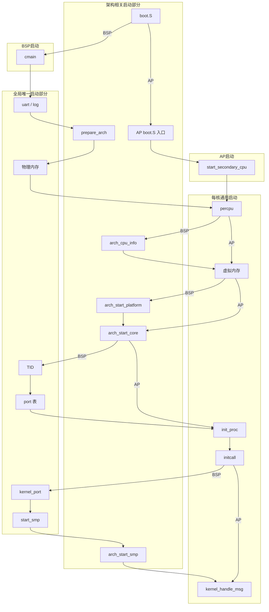

# 启动流程总览

v0.1 · 2026-08-29

本篇覆盖：`kernel/system/main.c`、`kernel/smp/smp.c`（`start_smp` / `start_secondary_cpu`）、`arch/x86_64/boot/boot.S`、`arch/aarch64/boot/boot.S`、`arch/x86_64/boot/start_arch.c`、`arch/aarch64/boot/start_arch.c`、`include/arch/x86_64/boot/arch_setup.h`、`include/arch/aarch64/boot/arch_setup.h`、`include/arch/x86_64/boot/multiboot.h`、`include/arch/x86_64/boot/multiboot2.h`。

不同ISA的启动细节见 `04-平台启动-x86_64.md` / `05-平台启动-aarch64.md`（目前仅有这两个架构，日后增加，需重新编排序号并更新在文档中的引用）；initcall 与 boot/idle 等供兼容层启动的相关部分见 `03-模块初始化与内核入口.md`；SMP 启动多核见 `06-SMP与同步/28-SMP启动与处理器拓扑.md`。本篇文档在整个文档中的定位见 `00-总览/00-架构与源码布局.md`。

---

## 1. 概述

RendezvOS core 把启动分成几层：

1.架构相关的 boot（`boot.S` + `prepare_arch` / `arch_start_*`）：`boot.S`负责从固件协议走到可用的 64 位内核 VA、填好 `struct setup_info`，最终将控制权给`cmain`；`prepare_arch` / `arch_start_*`等，包括了平台的处理（比如DTB/ACPI的读取，调用CPUID了解feature等工作），以及启动BSP/AP相关的一些硬件操作，他们是在`cmain`的启动过程中被调用的，但是应当具有相同的接口参数和名称，以供`cmain`调用。这些是与架构强相关的部分。

2.BSP的启动核心函数是 `cmain`**（`kernel/system/main.c`），按固定顺序拉起物理/虚拟内存、本核 trap、全局 port、调度与 initcall等相关内容，再启 SMP，最后进入 boot 线程 IPC 循环等待有线程给BSP的core通信。 至于SMP的AP启动，部分AP也需要做的事情，比如percpu的核心启动，initcall等内容，依然跟BSP的启动顺序一致，相关内容在SMP部分详述，但BSP已经是包括了percpu和全局平台相关东西的启动全过程了。

3.core的启动只是完成了框架的启动，而下一棒的兼容层的启动初始化部分，则通过initcall来进行传递。在上一步骤里面的initcall调用时，会调用兼容层注入的相关启动，比如增加相应的server thread，但是必须指出的是，这些兼容层的server thread的真正运行，是第二步骤里面进入 boot 线程的IPC循环之后，依赖于 IPC 等消息自然进行调度，才会真正的运行起来。必须说明的是，根据`00-总览/00-架构与源码布局.md`里面，兼容层注入一些东西到core里面存在三种方式，但是这里指出的是启动编排的**顺序上**的情况，我们选择了initcall的方式，用`DEFINE_INIT`进行（而非其他两种方式）兼容层相关策略的启动初始化。


一些启动期关键选择：

- **UART 最早实现** — 在 `phy_mm_init` / `virt_mm_init` 之前就通过初始化串口，从而允许 `pr_*`，否则早期 panic 无输出，但是这并非一个成熟内核的合理行为，而是一个设备的特例，从合理的角度来说，如果需要专门的uart输出，需要给定一个uart server来处理。
- **BSP和AP的启动内容区别** — 全局唯一的只在BSP启动一次、而每个核心都需要的内容，则AP启动也需要，例如全局唯一的平台启动`arch_start_platform` 只在 BSP存在；而`arch_start_core` 在 BSP 与每个 AP 都需要启动一次。AP 启动走 `start_secondary_cpu` 而非再跑一次 `cmain` 。
- **BSP和AP的initcall调用区别** — BSP是在启动smp之前就完成initcall，但是AP不同，它会多个核心等待到一个同步点`all_enabled`，等待所有核心都启动之后，然后再跑每个核心的 `do_init_call` ，并在最后同样进 `kernel_handle_msg` 等待消息。<br><br>这么设计的目的和意图是，BSP可能在多核心起来之前完成一些兼容层全局的initcall的相关初始化工作，如果放在多核心启动之后的同步点之后，那么可能导致其他核心依赖的一些全局初始化工作在其他核心初始化之后进行，这会导致问题。<br><br>兼容层注入的initcall必须考虑到这种执行顺序差异，并**读取自己核心编号，对不同核心编写不同的初始化代码**。<br><br>另外，需要注意到，BSP的initcall的调用并不会调用两次，所以BSP在兼容层除了需要全局相关的初始化，也需要完成绑定在BSP的初始化。
- **注册 ≠ 运行** — initcall 注册的一些server线程不会立刻同步执行，而是在`kernel_handle_msg`通过等待消息切换走。请注意initcall注册线程的执行时间。


下面是一张示意图，但并不完全是 §6 的逐步说明。里面包括了几个部分：
 - **架构相关启动部分**：这些需要在`arch/`文件夹下对应实现的启动相关代码。
 - **全局唯一启动部分**：这部分是全局唯一的，比如物理内存的初始化，只需要BSP做一次就好了。全局port表等数据结构也是如此，因此它是在BSP核心上被初始化。
 - **每核心通用启动部分**：这些每个核心都要做

当然实际上，AP的启动是需要在`start_smp`，去调用跟架构相关的`arch_start_smp`，然后会再回到boot.S里面AP启动的汇编代码（在其他核心上执行相关启动代码），再走到AP上的`start_secondary_cpu`，这并不是串行的关系，而是并行的核心启动。因此这个图其实是为了便于理解我们调用的代码他们所具有的归属关系，但不代表实际顺序。



---

## 2. 目标与边界

基于上图和上述相关部分的划分，我们后续的文档也将分块的进行描述。在`01-启动与初始化`这个文件夹下这几个文档主要涵盖的范围包括：

 - **`02-启动流程总览`** 也就是本篇，主要介绍这整个启动部分的流程。本篇主要是用来确定整个启动这方面大概的流程，以及其中若干边角的公共的部分。如上图所示的启动部分，本篇需要分别提供各个模块初始化的条件，以及初始化之后，哪些模块已经起来可以使用等等信息。
   
   **失败策略**：在BSP上的大多数失败用 `kernel_panic`（骨架还没搭完，没有可退回的调度，这是必须要报告暂停的事项）；在`kernel/system/powerd.c`文件中的power线程起来之后，就可以跟对应的关机线程进行通信，所以后续的`"kernel_port"` 登记失败和 `kernel_handle_msg` 查找失败走 `rendezvos_request_poweroff`，发请求给对应的power线程。AP 上某核失败不会把整机带进 panic，因为也许就是某个核心坏掉了或者AP启动代码出错，这虽然概率不大，但是不应该影响整个系统的启动，当然，那是 SMP 篇的边界。

 - **`03-模块初始化与内核入口`** 主要介绍initcall调用兼容层初始化，core和兼容层衔接需要考虑的内容。
 - **`04-平台启动-x86_64`** 主要介绍x86_64启动相关的部分。`boot.S` `arch_start_platform` `arch_start_core`在x86上的一些整体内容和细节。但是不涉及跟smp启动相关的arch相关的东西，那些放在smp启动的部分。
 - **`05-平台启动-aarch64`** 同上，主要是aarch64。
 - **`未来计划的其他架构`** 这些文档是预留的。


---

## 3. 分层与调用方

就启动来说，`cmain`是一个顶层的函数，它会拉起各个组件，然后用`initcall`去启动兼容层，所以实际上也没啥分层和调用方的概念，只有它调用别人的使用方式。这里提到的一些概念性的层级，其实是对上述启动过程的一个另一个视角的抽象。

| 层 | 谁调用 | 职责 |
|----|--------|------|
| `boot.S` | 固件 / 引导器 | 保存固件的协议入口、构建早期页表以及设置一些特殊的CPU寄存器状态并跳转到早期页表给定的虚拟地址空间、填写传递给`cmain` 的 `setup_info`，并最终跳转到 `cmain` |
| `cmain` | BSP的`boot.S`调用 | 按照固定顺序拉起其他模块；失败打印一些消息后panic（powerd没起来的时候）或者关机（powerd已经起来之后） |
| `start_secondary_cpu` | 由BSP的smp启动拉起来的boot.S的AP启动代码调用 | 启动AP核心 |
| 架构无关模块 | `cmain` | 物理内存、虚拟内存、线程子系统等子系统 |
| `initcall` | 在`DEFINE_INIT`中定义，并由BSP或者AP的启动代码调用 | 兼容层启动 |

---

## 4. 数据结构与不变量

启动这条链上，真正需要跨模块钉清楚的公共东西不多：一份 `setup_info`，再加上几个「做到哪一步，后面才能用什么」的约定。某一 ISA 的页表项、寄存器顺序、物理地址快照，都不在本篇展开，见两篇平台启动文档。

### 4.1 `setup_info`

这是 `boot.S` 留给后面 C 代码的那份启动信息。两边字段不完全一样，但角色一样：固件给了什么、早期映射做到哪、稍后启 AP 时要用的栈和 cpu id，都从这里过。字段布局以各架构自己的 `arch_setup.h` 为准；本篇只关心它在整条链上什么时候被填、什么时候被谁读。

两边都会留下 `ap_boot_stack_ptr` 和 `cpu_id`，供 BSP 在拉 AP 之前写好。其余固件相关字段（比如 Multiboot 信息、DTB 指针、早期 UART 基址等）由各自的 `boot.S` / `prepare_arch` / 物理内存路径填写，平台篇会对照结构体写清楚。

### 4.2 做到哪一步，什么才可用

整条启动可以看成一串门槛。跨过某一道之前，后面的模块不要假定前面的能力已经在。

`phy_mm_init` 还没回来之前，buddy 不能用；固件给出的内存图，也必须在后续预留把它盖住之前读完——具体怎么读，见物理内存篇和平台篇。

`virt_mm_init` 在 BSP 上成功之后，root、本核 Map_Handler 和本核 `kallocator` 才齐。所以 `arch_start_platform` 排在它后面：平台对象要从堆上分配，堆还没起来就调，没有地方可拿。

`arch_start_platform` 只在 BSP 上跑一次；`arch_start_core` 每个核各自一次。`init_proc` 返回以后，当前执行流就是本核的 boot 线程，后面的 initcall 和 `kernel_handle_msg` 都跑在这个上下文里。`global_port_init` 交出的只是一张空表；名为 `"kernel_port"` 的那个 port，要等 initcall 跑完，才由 BSP 登记上去。

### 4.3 `BSP_ID` 和 percpu 谁先谁后

这里有一个容易踩的次序。`cmain` 先调用 `arch_enable_percpu(BSP_ID)`，而此时全局的 `BSP_ID` 还是初值 0；真正可能改写它的，是紧跟着的 `arch_cpu_info`。若某平台上 BSP 的最终 id 不是 0，早先挂上的 percpu 窗口，和后来按下标去访问的那个槽，就不是同一个。平台篇会写明本 ISA 会不会改写 `BSP_ID`。

早期页表怎么建、镜像落在哪段物理地址、什么时候跳上高半，属于各架构 boot 自己的事，见 `04-平台启动-x86_64.md`、`05-平台启动-aarch64.md`；链接脚本里的偏移和段布局，见 `01-构建与链接.md`。

---

## 5. 代码对应

对照 §1 里那张归属图，启动相关的代码大致落在这些地方。本篇只负责「谁在什么时候被叫到」；某个函数内部怎么做，去对应的专篇。

| 阶段 | 实现 | 本篇写到哪 |
|------|------|------------|
| 引导到 `cmain` / AP 入口 | `arch/*/boot/boot.S` | 调用关系在 §6；指令与布局在平台篇 |
| BSP 编排 | `kernel/system/main.c` 的 `cmain` | §6 |
| AP 编排 | `kernel/smp/smp.c` 的 `start_secondary_cpu` | 顺序在 §6；细节在 SMP 篇 |
| 协议检查 / 平台一次 / 每核 | `arch/*/boot/start_arch.c` | 只记调用点；正文在平台篇 |
| 物理 / 虚拟内存 | `phy_mm_init`、`virt_mm_init` | 传了什么、回来后多了什么；内部见内存篇 |
| 线程 / port | `init_proc`、`global_port_init` | 同上；见线程篇、port 篇 |
| 兼容层启动 | `do_init_call` | 见 `03-模块初始化与内核入口.md` |
| 启 AP | `start_smp` → `arch_start_smp` | 见 SMP 篇 |

---

## 6. 流程

§1 那张图讲的是归属，以及 BSP / AP 各自大致怎么走。这里把 BSP 上 `cmain` 的每一步按源码顺序摊开；AP 只在末尾对照一下差异，细节仍归 SMP 篇。从固件进到 `cmain` 之前，各 ISA 怎么建早期页表、怎么跳上高半，见两篇平台文档，这里不重复。

### 6.1 `cmain` 在 BSP 上的顺序

进 `cmain` 的时候，CPU 已经在链接高半，栈和 `setup_info` 里固件那几项也填好了。buddy 还没有，`kallocator` 还没有，线程也还没有。`cmain` 自己并不实现这些模块，它只是按固定顺序把参数交出去。

先核对 `setup_info` 是不是空的，空则 panic。然后 `uart_open`，传入的是镜像末尾按 2 MiB 对齐的地址，接着 `log_init`。这样做，是为了后面任何一步挂掉时还能打出字来——串口具体怎么用这个地址，见日志篇。如果编了 `HELLO`，这里会直接调一下 `hello_world()`，不走 initcall。

接下来是 `prepare_arch`：做协议检查，失败就 panic，细节在平台篇。然后 `phy_mm_init`，同样失败 panic；回来之后 buddy 可以分物理页了，内核和 percpu 也已经从可用区里抠出去，见物理内存篇。

`arch_enable_percpu(BSP_ID)` 紧跟着。此时 `BSP_ID` 多半还是 0，见 §4.3。然后才是 `arch_cpu_info`，它有可能改写 `BSP_ID`；失败 panic。再往后 `virt_mm_init(BSP_ID, setup_info)`：BSP 在这里建 root、本核 Map_Handler，并 `kinit`。BSP 这条路径上，`setup_info` 并不用来取栈。失败同样 panic。见虚拟地址篇和 kmalloc 篇。

有了堆之后，才轮到 `arch_start_platform`（全机一次）和 `arch_start_core(BSP_ID)`（每核都要做的那一份，BSP 在这里做第一次）。都失败 panic，细节在平台篇。

再往后是几件全局、但已经跟 ISA 无关的事：`init_core_id_system` 只是把 TID 从 0 拨起来；`global_port_init` 交出一张空的全局 port 表；`init_proc` 成功后把结果写进 `percpu(core_tm)`，当前执行流变成 boot 线程——从这里起，`cmain` 剩下的部分都跑在 boot 上。这三步失败也都是 panic。切换过程见线程篇，port 见 IPC 篇。

然后才是 `do_init_call`：兼容层启动走这里。它只做同步注册，不保证 server 已经在跑，见模块初始化篇。initcall 结束之后，BSP 才 `kernel_port_register`——故意排在模块的 `register_port` 后面，免得名字和表的顺序拧着。这一步失败不再 panic，而是请求关机。

`start_smp` 在这之后。如果没有定义 `SMP`，函数直接返回；否则把 `setup_info` 交给 `arch_start_smp`，等它回来再把 `all_enabled` 置上。AP 自己怎么走，见 SMP 篇。若编了 `RENDEZVOS_TEST`，这里还会 `create_test_thread(true)`，并把当前 boot 标成 suspend，但仍然会进入下一步。

最后是 `kernel_handle_msg`：查不到 `"kernel_port"` 就请求关机；查到了就循环 `recv_msg`，成功路径不返回。如果链接方设过 `kernel_set_ipc_handler`，消息交给它，否则丢掉引用。前面 initcall 里放进调度环的那些 server，要等这个循环里真正发生调度，才会跑起来。

### 6.2 AP 对照着看一眼

AP 不进 `cmain`，从各自的 `boot.S` 入口进 `start_secondary_cpu`。它不会再做 uart、prepare、phy_mm、cpu_info、platform，也不会建 TID 管理器、全局 port 表或 `"kernel_port"`。它会做本核的 percpu、虚拟内存、`arch_start_core`、`init_proc`；在 `all_enabled` 之后跑自己那一次 `do_init_call`，最后同样进 `kernel_handle_msg`。和 BSP 谁先谁后、为什么要这样排，§1 已经说了。

---

## 7. 公开 API

下面这些是启动编排上会碰到的入口。每个函数自己的契约在所属专篇；本篇真正「拥有」的，是 BSP 上的调用顺序，不是这些函数的内部实现。

```c
void cmain(struct setup_info *arch_setup_info);

error_t prepare_arch(struct setup_info *);
error_t arch_cpu_info(struct setup_info *);
error_t phy_mm_init(struct setup_info *);
error_t virt_mm_init(cpu_id_t cpu_id, struct setup_info *);
error_t arch_start_platform(struct setup_info *);
error_t arch_start_core(cpu_id_t cpu_id);
void init_core_id_system(void);
error_t global_port_init(void);
Task_Manager *init_proc(void);
void do_init_call(void);
error_t kernel_port_register(void);
void start_smp(struct setup_info *);
error_t kernel_handle_msg(void);
```

---

## 8. 多架构

钩子名字两边一样，所以 `cmain` 不用按 ISA 分叉。真正不一样的地方——`setup_info` 里装什么、`BSP_ID` 会不会从 0 改掉、平台那一次初始化读什么固件表——都在两篇平台文档里。riscv64 有 boot 骨架，还没进本篇主线；loongarch 的链接脚本是空的，见构建篇。

---

## 9. 测试

在 `core/` 里跑：`make ARCH=x86_64|aarch64 config && make all && make run`。没有单独覆盖 `boot.S` 或 `cmain` 顺序的测例。本篇按当前源码整理，这一轮没有单独再复测 QEMU。

---

## 10. 限制与后续

x86 目前只认 Multiboot，没有 UEFI 直启，见 evolution **E7**。aarch64 的 `drop_to_el1` 在 EL2/EL3 上还没做完，见 evolution **E8**；现行能走通的路径，是进来时已经在 EL1。另外，`cmain` 会在可能改写 `BSP_ID` 之前就启用 0 号 percpu，这是 §4.3 里那道缝。

---

## 11. 变更记录

- 2026-09-25：§4 去掉架构布局长段，只留 `setup_info` 与公共门槛；§6 不再复述各 ISA 早期页表步骤。
- 2026-09-21：§1 增加启动示意图；§6 仍保留逐步说明。
- 2026-09-20：概述保持原修改。正文收回「full 单篇结构」；`cmain` 编排放在 §6。
- 2026-08-29：曾按源码重做，并补过布局链。
