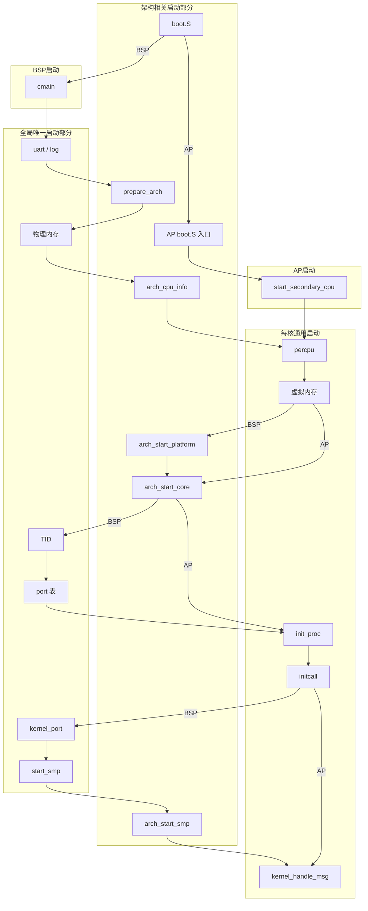

# 启动流程总览

v0.1 · 2026-10-03

本篇覆盖：`kernel/system/main.c`、`kernel/smp/smp.c`（`start_smp` / `start_secondary_cpu`）、`arch/x86_64/boot/boot.S`、`arch/aarch64/boot/boot.S`、`arch/x86_64/boot/start_arch.c`、`arch/aarch64/boot/start_arch.c`、`include/arch/x86_64/boot/arch_setup.h`、`include/arch/aarch64/boot/arch_setup.h`、`include/arch/x86_64/boot/multiboot.h`、`include/arch/x86_64/boot/multiboot2.h`。

各 ISA 的早期启动细节见该架构的平台启动文档（当前主线已写专篇：`04-平台启动-x86_64.md`、`05-平台启动-aarch64.md`；日后新 ISA 另开专篇并更新引用）。initcall 与 boot/idle 等供兼容层启动的相关部分见 `03-模块初始化与内核入口.md`；SMP 启动多核见 `06-SMP与同步/28-SMP启动与处理器拓扑.md`。本篇在整个文档中的定位见 `00-总览/00-架构与源码布局.md`。

---

## 1. 概述

下文把最先起来、负责把整机带起来的那颗核叫 **BSP**，把其余后来被叫醒的核叫 **AP**（这也是常见的约定）。

RendezvOS core 把启动分成几层：

1.架构相关的 boot（`boot.S` + `prepare_arch` / `arch_start_*`）：`boot.S`负责从固件协议走到可用的 64 位内核 VA、填好 `struct setup_info`，最终将控制权给`cmain`；`prepare_arch` / `arch_start_*`等，包括了平台的处理（比如DTB/ACPI的读取，调用CPUID了解feature等工作），以及启动BSP/AP相关的一些硬件操作，他们是在`cmain`的启动过程中被调用的，但是应当具有相同的接口参数和名称，以供`cmain`调用。这些是与架构强相关的部分。

2.BSP 的启动核心函数是 `cmain`（`kernel/system/main.c`），按固定顺序拉起物理/虚拟内存、本核 trap、全局 port、调度与 initcall 等相关内容，再启 SMP，最后进入 boot 线程的 IPC 循环，等待有线程给 BSP 上的 core 发消息。至于 SMP 里 AP 的启动：AP 上也要做本核 per-CPU 区、本核 `do_init_call` 等，顺序和 BSP 上对应的那几步一致，对照见本篇 §6.2，叫醒与同步见 `28`。BSP 这条路径已经覆盖了「本核一份」和「全机一份」的启动全过程。

3.core的启动只是完成了框架的启动，而下一棒的兼容层的启动初始化部分，则通过initcall来进行传递。在上一步骤里面的initcall调用时，会调用兼容层注入的相关启动，比如增加相应的server thread，但是必须指出的是，这些兼容层的server thread的真正运行，是第二步骤里面进入 boot 线程的IPC循环之后，依赖于 IPC 等消息自然进行调度，才会真正的运行起来。必须说明的是，根据`00-总览/00-架构与源码布局.md`里面，兼容层注入一些东西到core里面存在三种方式，但是这里指出的是启动编排的**顺序上**的情况，我们选择了initcall的方式，用`DEFINE_INIT`进行（而非其他两种方式）兼容层相关策略的启动初始化。


一些启动期关键选择：

- **UART 最早实现** — 在 `phy_mm_init` / `virt_mm_init` 之前就通过初始化串口，从而允许 `pr_*`，否则早期 panic 无输出，但是这并非一个成熟内核的合理行为，而是一个设备的特例，从合理的角度来说，如果需要专门的uart输出，需要给定一个uart server来处理。
- **BSP和AP的启动内容区别** — 全局唯一的只在BSP启动一次、而每个核心都需要的内容，则AP启动也需要，例如全局唯一的平台启动`arch_start_platform` 只在 BSP存在；而`arch_start_core` 在 BSP 与每个 AP 都需要启动一次。AP 启动走 `start_secondary_cpu` 而非再跑一次 `cmain` 。
- **BSP和AP的initcall调用区别** — BSP是在启动smp之前就完成initcall，但是AP不同，它会多个核心等待到一个同步点`all_enabled`，等待所有核心都启动之后，然后再跑每个核心的 `do_init_call` ，并在最后同样进 `kernel_handle_msg` 等待消息。<br><br>这么设计的目的和意图是，BSP可能在多核心起来之前完成一些兼容层全局的initcall的相关初始化工作，如果放在多核心启动之后的同步点之后，那么可能导致其他核心依赖的一些全局初始化工作在其他核心初始化之后进行，这会导致问题。<br><br>兼容层注入的initcall必须考虑到这种执行顺序差异，并**读取自己核心编号，对不同核心编写不同的初始化代码**。<br><br>另外，需要注意到，BSP的initcall的调用并不会调用两次，所以BSP在兼容层除了需要全局相关的初始化，也需要完成绑定在BSP的初始化。
- **注册 ≠ 运行** — initcall 注册的一些server线程不会立刻同步执行，而是在`kernel_handle_msg`通过等待消息切换走。请注意initcall注册线程的执行时间。


下面是一张示意图，但并不完全是 §6 的逐步说明。里面包括了几个部分：
 - **架构相关启动部分**：这些需要在`arch/`文件夹下对应实现的启动相关代码。
 - **全局唯一启动部分**：这部分是全局唯一的，比如物理内存的初始化，只需要BSP做一次就好了。全局port表等数据结构也是如此，因此它是在BSP核心上被初始化。
 - **每核心通用启动部分**：这些每个核心都要做

当然实际上，AP的启动是需要在`start_smp`，去调用跟架构相关的`arch_start_smp`，然后会再回到boot.S里面AP启动的汇编代码（在其他核心上执行相关启动代码），再走到AP上的`start_secondary_cpu`，这并不是串行的关系，而是并行的核心启动。因此这个图其实是为了便于理解我们调用的代码他们所具有的归属关系，但不代表实际顺序。



---

## 2. 目标与边界

基于上图和上述相关部分的划分，我们后续的文档也将分块的进行描述。在`01-启动与初始化`这个文件夹下这几个文档主要涵盖的范围包括：

 - **`02-启动流程总览`** 也就是本篇，主要介绍这整个启动部分的流程。本篇主要是用来确定整个启动这方面大概的流程，以及其中若干边角的公共的部分。如上图所示的启动部分，本篇需要分别提供各个模块初始化的条件，以及初始化之后，哪些模块已经起来可以使用等等信息。

   **失败策略**：在BSP上的大多数失败用 `kernel_panic`（骨架还没搭完，没有可退回的调度，这是必须要报告暂停的事项）；在`kernel/system/powerd.c`文件中的power线程起来之后，就可以跟对应的关机线程进行通信，所以后续的`"kernel_port"` 登记失败和 `kernel_handle_msg` 查找失败走 `rendezvos_request_poweroff`，发请求给对应的power线程。AP 上某核失败不会把整机带进 panic，因为也许就是某个核心坏掉了或者AP启动代码出错，这虽然概率不大，但是不应该影响整个系统的启动，当然，那是 SMP 篇的边界。

 - **`03-模块初始化与内核入口`** 主要介绍initcall调用兼容层初始化，core和兼容层衔接需要考虑的内容。
 - **`04-平台启动-x86_64`** 主要介绍x86_64启动相关的部分。`boot.S` `arch_start_platform` `arch_start_core`在x86上的一些整体内容和细节。但是不涉及跟smp启动相关的arch相关的东西，那些放在smp启动的部分。
 - **`05-平台启动-aarch64`** 同上，主要是aarch64。
 - **`未来计划的其他架构`** 这些文档是预留的。


---

## 3. 分层与调用方

就启动来说，`cmain`是一个顶层的函数，它会拉起各个组件，然后用`initcall`去启动兼容层，所以实际上也没啥分层和调用方的概念，只有它调用别人的使用方式。这里提到的一些概念性的层级，其实是对上述启动过程的一个另一个视角的抽象。

| 层 | 谁调用 | 职责 |
|----|--------|------|
| `boot.S` | 固件 / 引导器 | 保存固件的协议入口、构建早期页表以及设置一些特殊的CPU寄存器状态并跳转到早期页表给定的虚拟地址空间、填写传递给`cmain` 的 `setup_info`，并最终跳转到 `cmain` |
| `cmain` | BSP的`boot.S`调用 | 按照固定顺序拉起其他模块；失败打印一些消息后panic（powerd没起来的时候）或者关机（powerd已经起来之后） |
| `start_secondary_cpu` | 由BSP的smp启动拉起来的boot.S的AP启动代码调用 | 启动AP核心 |
| 架构无关模块 | `cmain` | 物理内存、虚拟内存、线程子系统等子系统 |
| `initcall` | 在`DEFINE_INIT`中定义，并由BSP或者AP的启动代码调用 | 兼容层启动 |

---

## 4. 数据结构与不变量

启动这条链上，只有 `setup_info` 作为跨模块（甚至跨AP启动）中用于传递信息的唯一源头。至于不变量，我们只描述启动到哪一步，后面才能用什么的约定。

某一 ISA 的页表项、寄存器顺序、物理地址快照等一系列跟具体架构启动相关的内容，都不在本篇展开，见该 ISA 的平台启动文档（当前主线有 `04-平台启动-x86_64.md`、`05-平台启动-aarch64.md`；日后新 ISA 另开专篇）。平台篇侧重早期启动；后续模块启动里再用到的架构相关细节，见各模块专篇。本篇只概述整条启动过程，不详述各模块内部步骤。

### 4.1 `setup_info`：统一但分架构的启动信息块

`struct setup_info` 是 `boot.S` 留给后面整条启动链的那份状态。类型定义在各架构自己的 `include/arch/<isa>/boot/arch_setup.h`，不是一个跨 ISA 的公共头——`cmain` / `phy_mm_init` / `virt_mm_init` / `start_smp` 等传入了相关参数的代码，运行时只能看见本架构编译进来的那一个结构体的情况。

但该结构体的角色却是统一的：固件给了什么、早期映射做到哪、稍后启 AP 时要用的栈和 cpu id等相关信息，都存放在这里并按需更新。字段分两层：

| 层 | 含义 | 权威篇 |
|----|------|--------|
| **通用字段** | 凡接入本启动链的 ISA 都须具备、名字与语义对齐；架构无关模块与各 ISA 的 `arch_start_smp` 都使用这些字段 | **本篇 §4.1.1** |
| **架构专用字段** | 固件协议 / 早期映射 / 平台表指针等；只在本 ISA 路径读写 | 该 ISA 平台启动文档的 §4.1（本篇不列；现行见 `04` / `05`） |

布局以各 `arch_setup.h` + 同架构 `boot.S` 里的 `.boot.data` 符号为准（头文件与汇编的偏移应当相同）。通用字段都放在结构体尾部，但由于前面专用字段长度因 ISA 而异，因此**绝对偏移不跨 ISA 保证相同**。

#### 4.1.1 通用字段

| 字段 | 类型 | 语义 | 谁写 | 谁读 |
|------|------|------|------|------|
| `ap_boot_stack_ptr` | `vaddr` | 即将唤醒的那颗 AP 的 boot 栈顶（高半虚地址）。AP 被串行拉起来，每启一核前改写一次 | 各 ISA 的 `arch_start_smp`（BSP 侧） | AP：`boot.S` 启动虚拟地址后，进入C代码前设定栈时使用；`virt_mm_init`（仅 AP 路径）记入 `per_cpu(boot_stack_bottom, …)`。BSP 的 `virt_mm_init` 用链接脚本里的 boot 栈 |
| `cpu_id` | `cpu_id_t` | 当前这条启动路径对应的逻辑 CPU 编号，供 `start_secondary_cpu` 打开本核 per-CPU 区和虚拟内存 | 写法随 ISA 的多核协议：x86_64 由 BSP 的 `arch_start_smp` 在发 SIPI 前写入；aarch64 经 PSCI `cpu_on` 的第三个参数传入，由 AP 的 `ap_entry` 把入口寄存器 x0 存进本字段（C 侧 `arch_start_smp` 不直接写）。其他 ISA 在各自平台篇说明 | `start_secondary_cpu` 里用 `arch_setup_info->cpu_id` 去调 `arch_enable_percpu`、`virt_mm_init`、`arch_start_core`。本核 per-CPU 区还没打开（设置好硬件percpu寄存器）时，要用 `per_cpu(符号, cpu_id)` 这种带编号的方式访问，不能用默认「当前核」的 `percpu()`。 |

尾部偏移对照参考（现行主线 ISA；不要假设跨 ISA 使用同一个偏移；新 ISA 以本架构 `boot.S` / 平台篇为准）：

| 字段 | x86_64（packed） | aarch64 |
|------|------------------|---------|
| `ap_boot_stack_ptr` | `0x18` | `0x38` |
| `cpu_id` | `0x20` | `0x40` |

#### 4.1.2 贯穿各模块的生命周期

同一块 `setup_info`（BSP 侧那份，通常在 `.boot.data`）被整条启动链接力读写，而不是每个模块各拷一份：

```text
boot.S（固件 / 早期映射等专用字段）
  → prepare_arch          （校验协议；可能补写本 ISA 专用字段）
  → phy_mm_init / arch_init_pmm
                          （读/写本 ISA 专用字段，如 memmap、RSDP、DTB等）
  → arch_enable_percpu    （BSP：BSP_ID；AP：setup_info->cpu_id）
  → virt_mm_init          （BSP 忽略栈字段；AP 读 ap_boot_stack_ptr）
  → arch_start_platform   （仅 BSP；读本 ISA 平台指针类专用字段）
  → … init_proc / initcall …
  → arch_start_smp        （每启一核：写 ap_boot_stack_ptr；
                           如何把 cpu_id 交给 AP 见各 ISA 平台篇）
  → AP boot.S / start_secondary_cpu
                          （读栈与 cpu_id；percpu → virt → core → …）
```

不变量：

- 进 `cmain` 时setup_info指针不得为 NULL；固件相关专用字段应已由本架构 `boot.S`（及必要的早期映射）填好——具体字段见该 ISA 平台篇 §4.1。
- 通用字段在 `start_smp` 之前对 BSP 主路径不是必需的；一旦开始串行唤醒 AP，同一时刻只有一颗 AP 视这两字段有效——下一核到来前会被覆盖。
- 架构无关代码只应依赖通用字段的语义，不要去读本编译目标之外 ISA 才有的专用成员。

### 4.2 做到哪一步，什么才可用

整条启动过程链条，是一串一串启动的，每当启动一个模块之后，后面才能使用当前模块启用的相关能力。

 - `phy_mm_init` 启动了物理内存分配器，目前是分Zone但是只提供了主分配器的初始化，在这之后我们才能使用主分配器的物理内存的分配，是按照一页为最小单位进行分配的。目前暂时没有做其他内存Zone的区分打算，但是留出了基本的设计和接口。其他Zone也可以设定对应的物理内存分配器。

 - `virt_mm_init` 在每个核心上启动之后，才能具有基本的地址空间（ `root_vspace` ），虚拟内存映射（`Map_Handler`）和封装好的内核对象分配器（`kallocator`） 。所以 `arch_start_platform`需要BSP构建设备树等树状结构动态分配内存，因此必须排在它后面，如果堆还没起来就初始化，没有地方拿内存，`arch_start_platform` 只在 BSP 上跑一次。

 - `arch_start_core` 每个核各自一次，它必须在`arch_start_platform`之后，才能使用，例如`arch_start_platform`在aarch64下准备好了dtb设备树，而gic必须读取设备树的内容，以确定对应的gic控制器的情况（实际上，内存管理也需要，但是设备树需要动态分配内存，我们只能打破鸡生蛋问题，给他手动读写设备树中的内存节点了）。该函数是每个架构每个核心的核心启动准备函数，它不是为了准备什么模块，而是将每个核心的状态都准备好，比如x86下的gdt表，tss等架构相关的寄存器读写，中断向量表的设定等。只有这些准备好之后，才能认为CPU状态已经准备好了，才能在之后构建进程相关工作。

 - `init_core_id_system` 和 `global_port_init`：分别把全局 TID 计数拨起来、交出一张空的全局 port 表。二者不依赖 boot/idle 线程已存在；现行 `cmain` 把它们排在 `init_proc` 之前。

 - `init_proc` 的主要作用就是启动本核 Task_Manager / 调度环，自举地把当前执行流变成 boot 线程，并造 idle；后面的 initcall 和 `kernel_handle_msg` 都跑在这个 boot 线程上下文里。

---

## 5. 代码对应

对照 §1 里那张归属图，启动相关的代码大致落在这些地方。本篇只负责「谁在什么时候被叫到」；某个函数内部怎么做，去对应的专篇。

| 阶段 | 实现 | 本篇写到哪 |
|------|------|------------|
| 引导到 `cmain` / AP 入口 | `arch/*/boot/boot.S` | 调用关系在 §6；指令与布局在平台篇 |
| BSP 编排 | `kernel/system/main.c` 的 `cmain` | §6 |
| AP 编排 | `kernel/smp/smp.c` 的 `start_secondary_cpu` | 对照在本篇 §6.2；C 顺序与 `all_enabled` 见 `28` §6.6 |
| 协议检查 / 平台相关的具体启动 / 每核的架构相关启动 | `arch/*/boot/start_arch.c` | 只记调用点；正文在具体架构篇 |
| 物理 / 虚拟内存 | `phy_mm_init`、`virt_mm_init` | 传了什么（setup info）、回来后多了什么（哪些功能可用）；内部实现见内存篇 |
| 线程 / port | `init_proc`、`global_port_init` | 同上；见线程篇、port 篇 |
| 兼容层启动 | `do_init_call` | 见 `03-模块初始化与内核入口.md` |
| 启 AP | `start_smp` → `arch_start_smp` | 编排见 `28` §6.3；叫醒与 `setup_info` 见 `28` §6.4 / §6.5 |

---

## 6. 流程

§1 那张图讲的是归属，以及 BSP / AP 各自大致怎么走。这里把 BSP 上 `cmain` 的每一步按源码顺序摊开；AP 只在末尾对照一下差异——少做什么以本篇 §6.2 为准，叫醒与进 C 之后的同步见 `28` §6.3 起。从固件进到 `cmain` 之前，各 ISA 怎么建早期页表、怎么跳上高半，见该 ISA 的平台启动文档，这里不重复。

### 6.1 `cmain` 在 BSP 上的顺序

进 `cmain` 的时候，CPU运行的地址已经在高半，栈和 `setup_info` 里固件那几项也填好了。`cmain` 按固定顺序把`setup_info`交给各个模块的启动代码。

先对 `setup_info` 指针做基本检查，空则 panic。然后 `uart_open`，传入的是镜像末尾按 2 MiB 对齐的地址，接着 `log_init`。这样做，是为了后面任何一步挂掉时还能打出字来——串口具体怎么用，见日志篇。如果编了 `HELLO`宏，这里会直接调一下 `hello_world()`。

接下来是 `prepare_arch`：做传入的启动协议检查（Multiboot/DTB等），失败就 panic，细节在平台篇。然后 `phy_mm_init`，同样失败 panic；回来之后可以使用buddy分normal的Zone区域的物理页了，percpu 和内核需要的一些物理页面也已经从可用内存区里分出去，见物理内存篇。

然后才是 `arch_cpu_info`，它有可能改写 `BSP_ID`；失败 panic。`arch_enable_percpu(BSP_ID)` 紧跟着。再往后 `virt_mm_init(BSP_ID, setup_info)`：BSP 在这里建 root、本核 Map_Handler，并 `kinit`实现该核心的内核对象分配器。BSP 这条路径上，`setup_info` 并不用来取栈。失败同样 panic。见虚拟地址篇和 kmalloc 篇。

有了堆之后，才轮到 `arch_start_platform`（全机一次）和 `arch_start_core(BSP_ID)`（每核都要做，BSP 在这里做一次）。都失败 panic，细节在平台篇。

再往后是几件全局、但已经跟 ISA 无关的事：`init_core_id_system` 只是把 TID 从 0 拨起来；`global_port_init` 设定一张空的全局 port 表；`init_proc` 成功后把当前执行流变成 boot 线程——从这里起，`cmain` 剩下的部分都跑在 boot 上。这三步失败也都是 panic。切换过程见线程篇，port 见 IPC 篇。

然后才是 `do_init_call`：兼容层启动走这里。它只做同步注册，不保证 server 已经在跑，见模块初始化篇。initcall 结束之后，BSP 才 `kernel_port_register`——按设计排在模块的 `register_port` 后面，免得名字和表的顺序拧着。这一步失败不再 panic，而是请求关机（因为`do_init_call`中启动了powerd线程）。

`start_smp` 在这之后。如果没有定义 `SMP`，函数直接返回；否则把 `setup_info` 交给 `arch_start_smp`，等它回来再把 `all_enabled` 置上。`arch_start_smp` 里怎么改 `setup_info`、怎么发 SIPI 或调 `cpu_on`，见 `28` §6.4 / §6.5；AP 进 `start_secondary_cpu` 之后卡在哪些同步点，见 `28` §6.6。若编了 `RENDEZVOS_TEST`，这里还会 `create_test_thread(true)`，运行一些基本测试用例。

最后是 `kernel_handle_msg`，如果查不到 `"kernel_port"` 就请求关机；查到了就循环 `recv_msg`，成功路径不返回。如果链接方设过 `kernel_set_ipc_handler`，消息交给它，否则丢掉消息的引用。

boot 随后在 `kernel_handle_msg` 里 `recv_msg` 阻塞，并通过调度器切换到其他线程，比如测试用例线程或者前面initcall里面放进调度器的那些 server。

### 6.2 AP 对照着看一眼

AP 不进 `cmain`，从各自的 `boot.S` 入口进 `start_secondary_cpu`。

它不会再做 uart、prepare、phy_mm、cpu_info、platform，也不会建 TID 管理器、全局 port 表或 `"kernel_port"`等全局或者平台相关的东西。若编了 `HELLO`，入口极早会再调一次 `hello_world()`。

然后做本核的 percpu、虚拟内存、`arch_start_core`、`init_proc`；在 `all_enabled` 之后跑自己那一次 `do_init_call`。为何先标 `cpu_enable` 再等 `all_enabled`、initcall 为何一定晚于 BSP，见 `28` §6.6。

若编了 `RENDEZVOS_TEST` 则 `create_test_thread(false)`，最后同样进 `kernel_handle_msg`。

---

## 7. 公开 API

本篇拥有的公开入口只有 BSP 编排函数 `cmain`。该函数由 `boot.S` 跳入，无 C 调用方，故不单独设定一个cmain的头文件的声明。调用约定是函数体内的固定顺序。

```c
void cmain(struct setup_info *arch_setup_info);  /* kernel/system/main.c */
```

| 项 | 说明 |
|----|------|
| 谁调用 | 仅 BSP 的 `boot.S`（已在链接高半、`setup_info` 固件字段已填）。 |
| 参数 | `arch_setup_info`：架构相关的 `struct setup_info *`，**不得为 NULL**（NULL → `kernel_panic`）。布局见 `include/arch/<isa>/boot/arch_setup.h`。 |
| 返回 | `void`；成功路径**不返回**（停在 `kernel_handle_msg`）。 |
| 编排顺序（与源码一致） | `uart_open` → `log_init` →（可选 `HELLO`：`hello_world`）→ `prepare_arch` → `phy_mm_init` → `arch_cpu_info` → `arch_enable_percpu(BSP_ID)` → `virt_mm_init` → `arch_start_platform` → `arch_start_core` → `init_core_id_system` → `global_port_init` → `init_proc` → `do_init_call` → `kernel_port_register` → `start_smp` →（可选 `RENDEZVOS_TEST`）→ `kernel_handle_msg`。 |
| 失败 | `prepare_arch` … `init_proc` 失败 → `kernel_panic`。`kernel_port_register` / `kernel_handle_msg` 失败 → `pr_error` + `rendezvos_request_poweroff`；**register 失败后仍会继续 `start_smp`**（与当前 `.c` 一致）。 |
| 非本 API | AP **不得**进 `cmain`，走 `start_secondary_cpu`（`28` §6.6）。被调用的各模块启动函数，分属平台 / 内存 / initcall / SMP / IPC 等专篇 §7。 |
| 兼容层 | 启动顺序挂接用 `DEFINE_INIT`（见 `03`），不要在 `cmain` 里启动具体的上层函数。 |

---

## 8. 多架构

各 ISA 提供同名架构相关函数（`prepare_arch` / `arch_cpu_info` / `arch_start_platform` / `arch_start_core` / `arch_start_smp` 等），所以 `cmain` 不用按 ISA 分叉。

`setup_info` 的通用字段（`ap_boot_stack_ptr` / `cpu_id`）见 §4.1；专用字段、平台初始化读什么固件表，见该 ISA的平台启动文档。当前主线已写专篇的是 x86_64 与 aarch64；riscv64 有 boot 骨架，还没进本篇主线；loongarch 的代码基本为空。

---

## 9. 测试

在 `core/` 里跑：`make ARCH=x86_64|aarch64 config && make run`。没有单独覆盖 `boot.S` 或 `cmain` 顺序的测试用例（能正常起来跑到测试用例就说明这些初始化步骤OK了）。

---

## 10. 限制与后续

x86 目前只认 Multiboot，没有 UEFI 直启，见 evolution **E7**。aarch64 的 `drop_to_el1` 在 EL2/EL3 上还没做完，见 evolution **E8**；现行能走通的路径，是进来时已经在 EL1。

`BSP_ID`：现行 `cmain` 已是 `arch_cpu_info`（可能改写 `BSP_ID`）→ 再 `arch_enable_percpu(BSP_ID)`。x86_64 上这个值来自 APIC id，aarch64 上固定为 0（见各平台篇）。x86_64 若将来 APIC id 不连续，或超出 `CPUID（EAX=1）` 读出的那 8 位，还要另做「APIC id → 数组下标」的对照，不是单靠调换这两步就完事。

---

## 11. 变更记录

- 2026-10-04：§5 / §6 把 SMP 交叉引用写到 `28` 的具体小节；§6.2 对照清单仍以本篇为准。
- 2026-10-03：Maintainer 审定通过（第二格 `[x]`）。
- 2026-10-03：终审对照 `main.c`——§1 mermaid / §7 编排改为 `arch_cpu_info` → `arch_enable_percpu`；§4.2 纠正 tid/port 与 `init_proc` 的实际先后；§10 去掉已失效的「先 enable(0)」与悬空 §4.3 引用；§7 失败行补全笔误。
- 2026-10-03：`RENDEZVOS_TEST` 不再把 boot 标 suspend；测例靠 boot 进 `recv_msg` 阻塞让出 CPU。
- 2026-10-03：去掉「两边 / 两架构」等含糊表述，改为「各 ISA / 该 ISA 平台篇」；现行 x86_64、aarch64 仅作示例点名。
- 2026-10-03：§4.1 去掉架构专用字段表（归平台篇）；本篇只留通用字段、尾部偏移与贯穿生命周期。
- 2026-10-03：§4.1 按源码对照重写——区分通用字段（`ap_boot_stack_ptr` / `cpu_id`）与架构专用字段；补谁写谁读、尾部偏移差异、贯穿生命周期；澄清 aarch64 的 `cpu_id` 经 PSCI context + AP `ap_entry` 写入。
- 2026-09-27：中文表述润色（母语习惯）。
- 2026-09-26：§6.2 对照 `start_secondary_cpu`：补上 AP 侧可选 `HELLO` / `RENDEZVOS_TEST`（与 `smp.c` 一致）。
- 2026-09-26：§7 按 `main.c` Doxygen 补全 `cmain` 说明（含与源码一致的编排顺序）；撤销误加的 `cmain.h`（仅汇编跳入，不建公开头）。
- 2026-09-26：§7 收束为本篇拥有的 `cmain`；去掉「编排时碰到的」他篇 API 清单。
- 2026-09-25：§4 去掉架构布局长段，只留 `setup_info` 与公共门槛；§6 不再复述各 ISA 早期页表步骤。
- 2026-09-21：§1 增加启动示意图；§6 仍保留逐步说明。
- 2026-09-20：概述保持原修改。正文收回「full 单篇结构」；`cmain` 编排放在 §6。
- 2026-08-29：曾按源码重做，并补过布局链。
