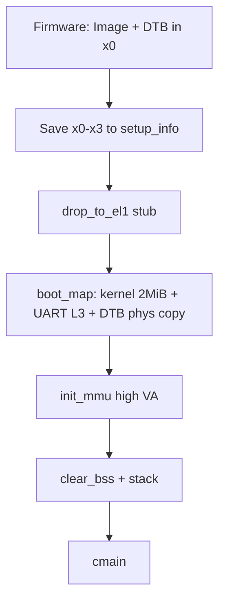

# 平台启动-aarch64

v0.1 · 2026-08-29

本篇覆盖：`arch/aarch64/boot/boot.S`、`arch/aarch64/boot/boot_map.c`、`arch/aarch64/boot/start_arch.c`、`arch/aarch64/boot/smp.c`、`arch/aarch64/psci/psci.c`、`arch/aarch64/psci/psci_call.S`、`include/arch/aarch64/psci/psci.h`、`include/arch/aarch64/psci/psci_error.h`、`include/arch/aarch64/boot/arch_setup.h`。

通用编排见 `02-启动流程总览.md`；DTB 模块见 `09-平台模块/36-DTB与设备树-aarch64.md`；GIC 见 `05-陷阱与中断/27-平台中断-aarch64-GIC.md`；PSCI 电源见 `09-平台模块/39-PSCI与处理器电源-aarch64.md`。

---

## 1. 概述

aarch64 以 Linux arm64 **Image 头**被固件/QEMU 加载：入口保存 x0–x3（含 DTB）到 `setup_info`，在 **MMU off** 下用 `boot_map_pg_table` 建内核 2 MiB identity + UART 设备页，并把 DTB **物理拷贝**到内核末尾之后；开 EL1 MMU 进高半核 VA 后调 `cmain`。平台阶段构建设备树、读 `chosen/bootargs`、绑 PSCI、探 GIC 分发器。SMP 遍历 DTB `cpu` 节点，要求 `enable-method = "psci"`，用 **`cpu_on(affinity=reg, entry=phys(ap_entry), context=逻辑 id)`** 串行拉起 AP。

**设计意图：**

- **协议跟 Linux Image + DTB** — 与 x86 Multiboot 对称的「固件契约」；不实现 spin-table / UEFI 直启。
- **逻辑 id ≠ affinity** — PSCI 目标用 DTB `reg`；`per_cpu` / `cpu_number` 用递增逻辑 id（经 context 传入 AP）。这样稀疏 affinity 与稠密 percpu 槽分离。
- **`BSP_ID` 固定 0** — 简化；要求 BSP 的 DTB `reg` 也为 0，否则 skip 规则失效。
- **平台一次 / 核心每核** — DTB 树 + PSCI + GIC distributor 只在 BSP；每核 GIC CPU IF + trap/syscall。

---

## 2. 目标与边界

**覆盖：** Image 入口 → `arch_start_core`，以及 `arch_start_smp` 的 PSCI 启核。

**不做：** 完整 EL3/EL2 下降（`drop_to_el1` 多为 stub，E8）；`arm,psci-0.2` 等其它 compatible（只认 `"arm,psci"`）；非 PSCI `enable-method`；GICv3 ITS / SMMU。

**失败边界：** 早期找不到 PL011 → `boot_Error`；`prepare_arch` 校验 DTB header 失败 → panic 路径；PSCI 未成功 enable 时 `smp.c` **仍可能调** `cpu_on`（未先查 `psci_func.enable`）——集成须保证 DTB 正确。AP 失败不整机 panic（见启动总览）。

---

## 3. 分层与调用方

| 组件 | 角色 |
|------|------|
| `boot.S` | Image 头、`bsp_entry` / `ap_entry`、MMU/栈、跳 `cmain` / `start_secondary_cpu` |
| `boot_map.c` | MMU off 下写页表（paddr）；探 PL011；物理 relocate DTB |
| `start_arch.c` | `map_dtb`/`prepare_arch`；设备树 + cmdline；`psci_init`；GIC；`arch_start_core` |
| `smp.c` | DTB `cpu` walk + `psci_func.cpu_on` |
| `psci.*` | method=smc/hvc；函数指针表；`smc`/`hvc` 桩 |

portable 顺序见启动总览；更换 DTB 时须保持 **BSP `reg==0`** 与逻辑 id 约定。

---

## 4. 数据结构与不变量

### 4.1 `setup_info`

```c
struct setup_info {
        u64 dtb_ptr;
        u64 res_x1, res_x2, res_x3;
        u64 map_end_virt_addr;
        u64 boot_uart_base_addr;
        u64 boot_dtb_header_base_addr;
        vaddr ap_boot_stack_ptr;
        cpu_id_t cpu_id;           /* AP: PSCI context → 逻辑 id */
};
```

位于 `.boot.data`。UART 基址由 `boot_map` 填；DTB **头 VA** 由 `prepare_arch`→`map_dtb` 填（不是 early L3 映射 DTB）。

### 4.2 早期映射（纠正常见误解）

`boot_map_pg_table`（全 paddr）：

1. 内核 `[start,end)` → L2 **2 MiB** identity。
2. 在 `kernel_end` 后挂 L3，按页映射 UART（compatible `"arm,pl011"` 的 `reg`）；写 `boot_uart_base_addr` / `map_end_virt_addr`。
3. 高半 L0 指向同一套表，供开 MMU 后跑高 VA。
4. 将 DTB **物理 memcpy** 到 UART 映射区之后，更新 `dtb_ptr`——**此时页表尚无 DTB VA**。

`prepare_arch`：`map_dtb` 用 2 MiB L2 把 DTB 映到 `ROUND_UP(map_end_virt_addr, …)`，再 `fdt_check_header`。

### 4.3 PSCI

- DTB 节点 `compatible == "arm,psci"`；`method` → `psci_smc` / `psci_hvc`。
- 属性名存在与否决定是否挂上 `cpu_on` 等包装；**FID 为编译期常量**，不读 DTB 单元格。
- `arch_shutdown` 可走 `system_off`；`arch_reset` 空。

### 4.4 双 id 与 `NR_CPU`

`arch_start_smp`：`NR_CPU=1`，BSP `CPU_STATE[0]=enable`。对每个 `cpu` 节点：读 `reg`；`enable-method` 须为 `psci`；`reg==(u32)BSP_ID` 则跳过；否则 kalloc 16 页栈写入 `ap_boot_stack_ptr`，`cpu_on(reg, PHY(ap_entry), NR_CPU)`，等 `CPU_STATE[NR_CPU]==enable`，再 `NR_CPU++`。逻辑 id 稠密；affinity 可稀疏。

### 4.5 链接 → 加载 → 早期物理布局 → 早期页表（本 ISA 精确）

跨架构地图见 `02-启动流程总览.md` §4.4。

**链接（`aarch64_linker.ld`）：**

- `kernel_virt_offset = 0xffff800000000000`
- `kernel_start_offset = 0x40080000` → 与 QEMU virt 常见加载地址对齐
- `.data` 含 `.boot.data` / `.boot.page`（页表页）/ `.boot_stack`（早期栈等）/ `.boot.map_util`
- `.percpu..data`；**无** x86 那套链接期 GS offset 符号

**加载：** Linux arm64 Image 头；固件/QEMU 将镜像放到 **`kernel_start_offset` 对应 PA**；**x0=DTB**，x1–x3 写入 `setup_info`。

**早期物理快照（`boot_map` 后）：**

```text
PA = 0x40080000…     内核镜像（含 L0_table 等）
其后（kernel_end 对齐后）
  L3 窗口            PL011 UART 设备页（按 reg 长度按页映射）
  再后               DTB 物理拷贝（一截 2 MiB 量级）
```

此时 **DTB 往往还没有内核 VA**；`prepare_arch`→`map_dtb` 才在 `map_end_virt_addr` 之上挂 2 MiB L2。

**早期页表与 EL/MMU（硬件）：**

1. `drop_to_el1`：查 CurrentEL；EL1 直接返回；EL2/EL3 路径多为 TODO（E8）。QEMU virt+cortex-a72 常见已在 EL1。  
2. MMU off：用 **paddr** 写 `L0/L1/L2/L3`——内核 **2 MiB identity**；UART **Device** 属性 4 KiB；高半 L0 槽指向同一套表。  
3. `mair_init`；`TTBR0_EL1`=`TTBR1_EL1`=`L0_table`；配 TCR（含 ASID/T0SZ 等，以源码为准）；开 SCTLR.M（及 C/I）；**屏障与 TLB 维护**后，把 PC/LR 加上 `0xffff800000000000`。  
4. 清 BSS；栈切到高 VA；`cmain`。

**与 x86 对比：** 无「先 32 位再长模式」；无低址 AP 跳板；加载地址随 SoC/QEMU 变，故链接偏移写成 `0x40080000` 而非 1 MiB。SPSel/SPSR 等细节以 `boot.S` 注释与实现为准，成稿不把整本寄存器手册搬进来，但**降 EL / 开 MMU 的必要寄存器写入必须在本篇或源码注释中可查**。

---

## 5. 代码对应

| 文件 | 职责 |
|------|------|
| `boot.S` | Image、`drop_to_el1`、`init_mmu`、BSP/AP 栈切换、入口 |
| `boot_map.c` | 早期页表、UART、DTB 物理拷贝 |
| `start_arch.c` | DTB VA、设备树、cmdline、PSCI、GIC、每核 core |
| `smp.c` | PSCI 串行启核 |
| `psci.c` / `psci_call.S` | 探测与 SMC/HVC |

---

## 6. 流程

### 6.1 BSP：MMU off → on → `cmain`



`cmain` 里：`prepare_arch`（map+check DTB）→ … → `arch_start_platform`（树、**bootargs→cmdline**、PSCI、GIC dist）→ `arch_start_core`。完整 portable 序见启动总览。

### 6.2 `arch_start_core`（每核）

`cpu_number=cpu_id` → `init_interrupt` → `gic.init_cpu_interface` → `smp_ipi_init` → `rendezvos_time_init` → `init_syscall`（固定 trap 注册 syscall helper）。

### 6.3 SMP：PSCI + 逻辑 id

```mermaid
sequenceDiagram
  participant BSP as arch_start_smp
  participant FW as PSCI/firmware
  participant AP as ap_entry
  participant SS as start_secondary_cpu

  BSP->>BSP: NR_CPU=1; walk DTB cpu nodes
  loop each non-BSP PSCI cpu
    BSP->>BSP: kalloc stack; ap_boot_stack_ptr
    BSP->>FW: cpu_on(reg, phys(ap_entry), logical=NR_CPU)
    FW->>AP: enter ap_entry(x0=context)
    AP->>AP: setup_info.cpu_id=x0; MMU; stacks
    AP->>SS: start_secondary_cpu
    SS->>SS: CPU_STATE[id]=enable（早于 init_proc）
    BSP->>BSP: wait enable; NR_CPU++
  end
```

AP portable 尾：`init_proc` → 等 **`all_enabled`**（BSP 在 `arch_start_smp` 返回后置位）→ **整表 `do_init_call`** → `kernel_handle_msg`。不是「AP 只到 init_proc」。

**为何 context 传逻辑 id：** AP 无法从 affinity 可靠反推稠密下标；PSCI 允许带 context，正好写入 `cpu_id` 供 `arch_enable_percpu` / `virt_mm_init`。

---

## 7. 公开 API

```c
error_t prepare_arch(struct setup_info *);
error_t arch_cpu_info(struct setup_info *);  /* BSP_ID = 0 */
error_t arch_start_platform(struct setup_info *);
error_t arch_start_core(cpu_id_t cpu_id);
void arch_start_smp(struct setup_info *);

error_t psci_init(void);
/* psci_func.cpu_on / system_off / … */
```

DTB 遍历 API 见 DTB 专篇；GIC 对象见 GIC 专篇。

---

## 8. 多架构

仅 aarch64。对比 x86：Image+DTB+PSCI，无低址跳板与 Multiboot；`BSP_ID` 固定 0；CPU 拓扑是 **逻辑稠密 + affinity 稀疏**，不是 APIC id 直索引。

---

## 9. 测试

`core/`：`make ARCH=aarch64 config && make all && make run`（QEMU virt + DTB）。`SMP>1` 依赖正确 `arm,psci` 与 `cpu` 节点。本篇与源码对齐，本轮未单独复测。

---

## 10. 限制与后续

- `drop_to_el1` 不完整（E7/E8 相关）。
- 早期 UART 仅 PL011；DTB compatible 过窄（`arm,psci` only）。
- BSP `reg` 必须为 0；多 cluster / 非零 BSP affinity 未支持。
- `smp.c` 若干错误路径上的节点推进 / `NR_CPU` 与等待条件以源码为准，有脆弱处可记 evolution。
- `psci_func.enable` 未在启核前强制检查。

---

## 11. 变更记录

- 2026-08-29：整篇重做——纠正 early map（DTB 物理拷贝 vs `prepare_arch` VA）；双 id 模型；cmdline 仅 platform；AP 尾对齐启动总览（`all_enabled` / 二次 initcall / IPC）；PSCI FID/compatible 边界。
- 2026-08-29：补 §4.5 链接/加载/早期 PA/TTBR+SCTLR 开 MMU 步骤与物理快照。
- 2026-08-26：v0.1 初稿。
