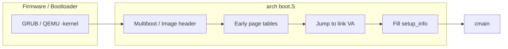
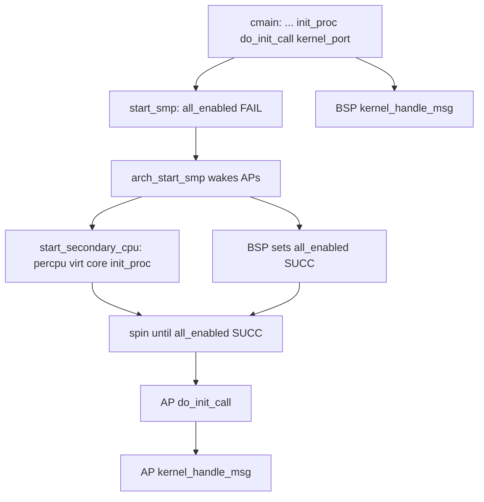

# 启动流程总览

v0.1 · 2026-08-29

本篇覆盖：`kernel/system/main.c`、`kernel/smp/smp.c`（`start_smp` / `start_secondary_cpu`）、`arch/x86_64/boot/boot.S`、`arch/aarch64/boot/boot.S`、`arch/x86_64/boot/start_arch.c`、`arch/aarch64/boot/start_arch.c`、`include/arch/x86_64/boot/arch_setup.h`、`include/arch/aarch64/boot/arch_setup.h`、`include/arch/x86_64/boot/multiboot.h`、`include/arch/x86_64/boot/multiboot2.h`。

平台细节见 `平台启动-x86_64.md` / `平台启动-aarch64.md`；initcall 与 boot/idle 语义见 `模块初始化与内核入口.md`；SMP 启核细节见 `06-SMP与同步/SMP启动与处理器拓扑.md`。布局级挂接点见 `00-总览/架构与源码布局.md`。

---

## 1. 概述

RendezvOS core 把启动分成两层：**架构相关 early boot**（`boot.S` + `prepare_arch` / `arch_start_*`）负责从固件协议走到可用的 64 位内核 VA、填好 `struct setup_info`；**portable 编排点只有 `cmain`**（`kernel/system/main.c`），按固定顺序拉起可打印、物理/虚拟内存、本核 trap、全局 port、调度与 initcall，再启 SMP，最后进入 boot 线程 IPC 循环。

**设计意图：** 兼容层与模块不应改写 `cmain` 顺序；扩展靠 `DEFINE_INIT*`、`EXTRA_OBJECTS`、`kernel_set_ipc_handler` 挂接。若把「平台设备枚举」塞进 early boot、或假定 `cmain` 末尾会调 `main_init` / 拉起用户 init，都会与现实现冲突——`main_init` 只声明不调用；BSP 稳态是 `kernel_handle_msg()`，不是 PID1。

从源码读出的启动期关键选择（开放增补；专篇再深挖）：

- **UART 最早** — 在 `phy_mm_init` / `virt_mm_init` 之前就能 `pr_*`，否则早期 panic 无输出。
- **平台一次、核心每核** — `arch_start_platform` 只在 BSP；`arch_start_core` 在 BSP 与每个 AP。
- **AP 不是半截 `cmain`** — AP 走 `start_secondary_cpu`：本地 VMM/core/调度 → 等 `all_enabled` → **再跑整表 `do_init_call`** → 同样进 `kernel_handle_msg`。
- **注册 ≠ 运行** — initcall 在 boot 上下文同步执行，只 enqueue 线程；真正跑起来要等调度与（通常）SMP 完成。

---

## 2. 目标与边界

**要完成：** 可打印；buddy / Map_Handler / root VSpace 可用；BSP 上可建线程与全局 port；可选拉起 AP；每核 boot 进入可接消息的稳态。

**故意不做：** 加载用户态 rootfs / 启动 init 进程；在 `cmain` 里硬编码兼容层初始化（用 initcall）；把 Multiboot tag、DTB 节点、AP 汇编跳板逐行写在本篇（平台 / SMP 专篇）。

**失败策略（动机）：** BSP 上 MM/arch 失败多用 `kernel_panic`（无调度可退）；`kernel_port_register` / `kernel_handle_msg` 失败走 `rendezvos_request_poweroff`。AP 上 `virt_mm_init` / `arch_start_core` / `init_proc` 失败只打印并 `return`——该核死亡，BSP 可能一直等在 `arch_start_smp`；不要假定「任一 AP 失败会干净地整机 panic」。

对比朴素「单核宏内核 `_start` → `start_kernel` → `init`」：本框架把产品语义外置，core 只保证「多核 + IPC + 可注入」的骨架；代价是链接方必须理解 initcall 幂等与 boot IPC，否则看起来「内核起来了但兼容层从没跑」。

---

## 3. 分层与调用方

| 层 | 职责 |
|----|------|
| `boot.S` / early arch C | 协议入口、早期页表/栈、填 `setup_info`、跳 `cmain` 或 AP 的 `start_secondary_cpu` |
| `cmain`（portable） | BSP 唯一编排顺序；失败 panic/poweroff |
| `start_secondary_cpu`（portable） | AP 编排；与 BSP 共享「后半」语义（调度、initcall、IPC） |
| 链接方 / 兼容层 | `DEFINE_INIT*`（常即 `main_init` 的挂接方式）、`kernel_set_ipc_handler`、测例外的产品线程 |

新平台应实现 `prepare_arch` / `arch_cpu_info` / `arch_start_platform` / `arch_start_core` / `arch_start_smp` 与兼容的 `setup_info`，**不要**为图省事重排 `cmain`（除非 Maintainer 同意并同步全库文档）。

---

## 4. 数据结构与不变量

### 4.1 `setup_info`

**x86_64**（`arch_setup.h`）：`multiboot_magic` / `multiboot_info_struct_ptr`（转内核 VA 时加 `KERNEL_VIRT_OFFSET`）；`phy_addr_width` / `vir_addr_width`（CPUID）；`rsdp_addr`（**在 `phy_mm_init` 路径探测填入**，boot.S 初始为 0）；`ap_boot_stack_ptr`、`cpu_id`（启 AP 前由 BSP 写入）。

**aarch64**：`dtb_ptr`；早期 `map_end_virt_addr` / `boot_uart_base_addr` / `boot_dtb_header_base_addr`；同样有 `ap_boot_stack_ptr`、`cpu_id`。cmdline/`bootargs` 在 **`arch_start_platform`** 从 DTB `chosen` 解析，不在 `prepare_arch`。

两架构共用全局 **`BSP_ID`**（`arch_cpu_info`：x86 取 APIC ID，aarch64 当前固定 0）与可选 **`cmdline_ptr`**。

### 4.2 阶段不变量

- **`phy_mm_init` 之前** — 不依赖 buddy；x86 须在 percpu 预留覆盖内存图之前读完 Multiboot memmap（见 `prepare_arch` / PMM 注释）。
- **`virt_mm_init` 之后** — BSP：`sys_init_map`、root VSpace、ASID、`kinit`；AP：attach Map_Handler、栈取自 `ap_boot_stack_ptr`、共享 root、本核 `kinit`。此后可用 `kallocator`。
- **`arch_start_platform` 之后** — 平台全局资源（ACPI/PCI 或 DTB 树 / GIC 分发器 / PSCI）就绪；**不**在 AP 上重跑。
- **`init_proc` 之后** — 本核有 `core_tm`、boot、idle；当前执行流已是 boot 线程（见下节与模块入口篇）。
- **`all_enabled == SUCC` 之后** — AP 才进入 `do_init_call`；BSP 在 `arch_start_smp` 返回后置位。
- **稳态** — 每个 online CPU 的 boot 在 `kernel_handle_msg`；全局表与 `"kernel_port"` 只由 BSP 创建/注册一次。

### 4.3 `init_core_id_system` 名实

实现**仅** `init_id_manager(&tid_manager)`，为后续 `get_new_id` 准备全局 TID 空间。逻辑 CPU 枚举 / `NR_CPU` 来自 MADT 或 DTB SMP 路径，**不是**本函数。「拓扑」不写在此处。

### 4.4 链接 → 加载 → 早期物理布局 → 早期页表 → 运行演化

本小节是启动文档的**布局真源地图**（跨架构）。平台篇必须用本 ISA 的符号与地址把每一格写实；构建篇负责链接脚本侧。旧笔记里「恒等映射再跳高址」须落到具体表项与寄存器顺序。

#### （1）链接给出的虚拟布局

两端主线 ISA 共用 `kernel_virt_offset = 0xffff800000000000`，**物理加载偏移不同**：

| | x86_64 | aarch64 |
|--|--------|---------|
| 脚本 | `script/link/x86_64_linker.ld` | `aarch64_linker.ld` |
| `kernel_start_offset` | `0x100000`（1 MiB） | `0x40080000`（QEMU virt 习惯） |
| 链接地址 | `virt_offset + start_offset` | 同左公式 |
| 早期相关段 | `.boot` / `.boot_64` / `.boot.*`；`.boot_stack` 在 **`.bss`**；`.percpu..data`；x86 另算 `__tss_rsp_offset` | `.boot`；`.boot.data` / `.boot.page` / `.boot.log`（栈常在 `.boot.log` 一带）；`.percpu..data` |
| initcall | `_s_init`…`_e_init` 包 `.init.call.0`…`.9` | 同 |

产物：`ld` → `kernel.elf`，再 `objcopy -O binary` → **`kernel.bin`**（QEMU `-kernel` 吃 bin，不是直接拿 ELF 当 Multiboot 载荷的主路径）。见 `构建与链接.md`。

#### （2）引导器如何放到物理内存

- **x86：** Multiboot1/2 按 address tag 把 **bin** 装到约 **PA 1 MiB**；入口落在 32 位 stub。选用 bin+MB1 的历史原因：QEMU/工具链对裸 x86_64 ELF/MB2 支持曾不足——约束写进实现，不在此展开邮件列表考古。
- **aarch64：** 遵循 Linux arm64 Image 约定；QEMU `virt` 常把镜像放到 **`0x40080000`**（与链接 `kernel_start_offset` 对齐）；**x0=DTB 物理指针**，x1–x3 一并存进 `setup_info`。

#### （3）进入 C 之前的物理快照（示意）

**x86（BSP，开 PG 前后）：**

```text
PA ~0x1000        预留给 AP 跳板（稍后 memcpy .boot.ap_code）
PA ~0x100000…     内核镜像（.text/.data/.bss 含 boot_stack、静态 L0/L1/L2）
（高端）          尚未：buddy 管理的可用 RAM（来自 Multiboot mmap，≤1MiB 常跳过）
```

**aarch64（`boot_map` 之后、`cmain` 前）：**

```text
PA = load addr…   内核镜像（含 L0_table 等 .boot.page）
其后              UART 的 4K 设备映射窗口（L3）
再后              DTB 的物理拷贝（页表此时可能仍无 DTB 的 VA）
```

#### （4）早期页表：硬件步骤与本实现选择

**x86 — 进 IA-32e paging（与 SDM 状态机一致的最小集）：**

1. CPUID 确认长模式等；地址宽度写入 `setup_info`。  
2. 按 `[_kstart,_end)`（转 PA、2 MiB 对齐）循环填写 **L2 项**：`P|RW|PS|G`（**2 MiB 大页**；不依赖 1 GiB 页）。  
3. PML4 同时挂 **identity 与高半**（同一套下层），以便仍在低址执行时开分页。  
4. 固定顺序：**PAE → LME → 装 CR3 → PG**。  
5. `lgdt` + `ljmp` 进入 `.boot_64`，再 `movabs` 跳到**链接高 VA**，栈切 `_boot_stack_bottom`。  
6. 此后意图去掉临时 identity（`clean_tmp_page_table`；实现细节以源码为准，SMP 后调用）。

**aarch64 — EL1 + TTBR：**

1. `drop_to_el1`：EL3/EL2 多为占位；QEMU virt 常已在 EL1。  
2. `boot_map_pg_table`（**全物理地址写表**）：内核区间 **2 MiB identity**；UART 走 L3 设备属性；DTB **memcpy** 到镜像后。  
3. `mair_init`；`TTBR0_EL1` 与 `TTBR1_EL1` 同指 `L0_table`；TCR 等；开 SCTLR.M（及 cache 位）；PC/LR 加上高半偏移。  
4. DTB 的 **VA 映射**留到 `prepare_arch`→`map_dtb`（纠正「early 已把 DTB 映进页表」的说法）。

**设计意图：** 先用尽量少的大页盖住「当前 PC 所在的内核镜像」，再跳到链接脚本承诺的高半 VA；完整 RAM 线性映射不做——后续用 buddy + Map_Handler 窗口。见 `虚拟地址空间与页表.md`。

#### （5）`cmain` 之后布局如何长出来

时间轴（与 §6.2 步骤对齐）：

1. 仍用 early 表 + UART → 可 `pr_*`。  
2. **`phy_mm_init`**：消费 memmap/DTB memory；reserve 内核+percpu+PMM blob（物理上紧挨镜像后的管理区，须与内核同 1 GiB 窗口等约束）；buddy 接管剩余。  
3. **`virt_mm_init` / `sys_init_map`**：挂 `map_pages` 窗口链；预创建高半全部 L1；`root_vspace`。  
4. 平台/ACPI|DTB/GIC 等可开始用 `kallocator`。  
5. SMP：x86 填 `0x1000` 跳板；aarch64 PSCI 带逻辑 id——此时物理/页表已是「可分配」世界。

更细的 PMM blob / Map 窗口几何分别见内存两篇；**本篇负责声明「链条存在且必须按上表读」**。

---

## 5. 代码对应

| 阶段 | x86_64 | aarch64 | portable |
|------|--------|---------|----------|
| 引导头 / 早期模式 | `boot.S` Multiboot → 长模式 | `boot.S` Image header → EL1/MMU | — |
| 填 `setup_info` | boot.S + 后续 PMM 填 RSDP | boot.S + platform 填 cmdline | — |
| 协议检查 | `prepare_arch` Multiboot+cmdline | `prepare_arch` 映射/校验 DTB | `cmain` |
| 物理内存 | `arch_init_pmm` … | 同角色 | `phy_mm_init` |
| per-CPU 基址 | GS_BASE | TPIDR_EL1 | `arch_enable_percpu` |
| CPU 身份 | APIC → `BSP_ID` | `BSP_ID=0` | `arch_cpu_info` |
| 虚拟内存 | — | — | `virt_mm_init` |
| 平台一次 | ACPI/PCI | DTB/PSCI/GIC | `arch_start_platform` |
| 本核 | GDT/TSS/trap/syscall | GIC CPU IF/trap/syscall | `arch_start_core` |
| 调度 / IPC 稳态 | — | — | `init_proc` → … → `kernel_handle_msg` |
| 启 AP | trampoline + INIT-SIPI | PSCI `cpu_on` | `start_smp` → `arch_start_smp` |

`cmain` 是 BSP 唯一 portable 编排点；AP 入口在 arch asm，汇入 `start_secondary_cpu`。

---

## 6. 流程

### 6.1 自引导到 `cmain`（接 §4.4 布局）



布局与页表步骤的**地址级说明见 §4.4**；下表只点硬件状态机关键词，细节在平台篇。

**x86_64：** Multiboot → 32 位 → 按内核范围填 2 MiB L2 → **PAE→LME→CR3→PG** → `.boot_64` → 上高半 VA → `cmain`。  
**aarch64：** Image（x0=DTB）→（可选降 EL）→ `boot_map` identity+UART+DTB 物理拷贝 → TTBR0/1+SCTLR.M → 高半 → `cmain`；DTB VA 在 `prepare_arch`。

### 6.2 `cmain` 顺序（BSP）

与源码一致：

1. `setup_info == NULL` → panic  
2. **`uart_open` + `log_init`** — 最早控制台（x86 16550 常忽略传入基址用 I/O port；aarch64 PL011 用 early map 基址）  
3. 可选 **`HELLO` → `hello_world()`**  
4. **`prepare_arch`** — 协议 sanity（非完整平台）  
5. **`phy_mm_init`** — zone/buddy；x86 在此路径探测 RSDP 写入 `setup_info`  
6. **`arch_enable_percpu(BSP_ID)`** — 此时全局 `BSP_ID` 仍多为默认 **0**，先挂上 0 号 percpu 窗口  
7. **`arch_cpu_info`** — 才可能把 `BSP_ID` 改成 APIC ID（x86）  
8. **`virt_mm_init(BSP_ID, …)`** — root VSpace 等（仅 BSP 建 root）  
9. **`arch_start_platform`** — 需 allocator；aarch64 cmdline 在此  
10. **`arch_start_core(BSP_ID)`** — 含 `init_interrupt()` 等（不是死符号 `interrupt_init`）  
11. **`init_core_id_system`** — 仅 TID 管理器  
12. **`global_port_init`** — 全局 port 表（须早于模块 `register_port`）  
13. **`init_proc()`** — 把当前流标成 boot，建 idle，`switch_to` idle；boot 再被调度回来后函数返回，**后续 `cmain` 尾部在 boot 线程上下文继续**  
14. **`do_init_call()`** — 整表 `.init.call.*`（含 `EXTRA_OBJECTS` 里的 `DEFINE_INIT*`）  
15. **`kernel_port_register()`** — 创建并注册 `"kernel_port"`（**仅 BSP**）  
16. **`start_smp`** — 无 `-D SMP` 则直接 return；否则 `all_enabled=FAIL` → `arch_start_smp`（阻塞到 arch 认为 AP 已 online）→ `SUCC`  
17. 可选 **`RENDEZVOS_TEST`**：`create_test_thread(true)` 并把 boot **状态**标 suspend——**仍会**进入下一步  
18. **`kernel_handle_msg()`** — 查 `"kernel_port"`，无限 `recv_msg`；有 `kernel_set_ipc_handler` 则交给链接方，否则丢弃消息引用。成功路径不返回  

**为何 `arch_enable_percpu` 在改 `BSP_ID` 之前：** `arch_cpu_info` / 后续代码已要用 `percpu()`；先以 0 号槽启用。若 BSP 的 APIC ID ≠ 0，须清楚早期窗口与之后以新 `BSP_ID` 访问的 percpu 槽关系（细节见 per-CPU 篇与 x86 `arch_cpu_info`）。

**为何 port 表在 `init_proc` 前、`kernel_port` 在 initcall 后：** 模块 init 要能 `register_port`；boot 专用 listen port 在模块注册完后再挂，避免与产品 port 初始化顺序打架。多核上多个 boot 抢同一 `"kernel_port"` recv——handler 须可重入/可丢弃；策略在兼容层。

### 6.3 AP 与 BSP 分工

AP **不**跑 `cmain`。入口：x86 `ap_start`（跳板 @ 物理 `0x1000`）/ aarch64 `ap_entry`（PSCI）→ `start_secondary_cpu(setup_info)`。

| 步骤 | BSP (`cmain`) | AP (`start_secondary_cpu`) |
|------|---------------|----------------------------|
| UART / prepare / phy_mm / cpu_info / platform | 是 | 否 |
| `arch_enable_percpu` / `virt_mm_init` / `arch_start_core` | 是 | 是（AP 不建 root） |
| `init_core_id_system` / `global_port_init` / `kernel_port_register` | 是 | 否 |
| `init_proc` | 是 | 是（每核自己的 boot/idle/`core_tm`） |
| 等待 `all_enabled` | 在 `arch_start_smp` 内等齐 | `init_proc` 之后自旋到 `SUCC` |
| `do_init_call` | 是（SMP 前） | 是（**全表再跑一遍**，须幂等或 `cpu_number==BSP_ID` 门控） |
| `start_smp` | 是 | 否 |
| `kernel_handle_msg` | 是 | **是**（与 BSP 同循环） |
| 测例 | `create_test_thread(true)` + suspend boot 状态 | `create_test_thread(false)` |

**`all_enabled` 屏障的意图：** AP 可并行做完本核 VMM/trap/调度；但 initcall 里若假定「所有 CPU 已存在 / 可绑核」，须等 BSP 的 `arch_start_smp` 返回后再跑。反例：某 init 在 AP 上过早 `add_thread_to_cpu` 到尚未 `cpu_enable` 的核。

启核差异（细节链 SMP/平台篇）：x86 MADT 枚举 + INIT-SIPI；aarch64 在 `arch_start_smp` 走 DTB `cpu` 节点 + PSCI，逻辑 id 与 affinity 分离。



---

## 7. 公开 API

启动编排相关（链接方通常间接依赖）：

```c
void cmain(struct setup_info *arch_setup_info); /* 实现于 main.c；无独立 public 声明头 */

error_t prepare_arch(struct setup_info *);
error_t arch_cpu_info(struct setup_info *);
error_t phy_mm_init(struct setup_info *);
error_t virt_mm_init(cpu_id_t cpu_id, struct setup_info *);
error_t arch_start_platform(struct setup_info *);
error_t arch_start_core(cpu_id_t cpu_id);
Task_Manager *init_proc(void);
void do_init_call(void);
error_t kernel_port_register(void); /* BSP only */
error_t kernel_handle_msg(void);
void start_smp(struct setup_info *);
void kernel_set_ipc_handler(boot_thread_ipc_handler_fn);
```

`setup_info` 见各 `arch_setup.h`。AP 入口符号在 arch，不在 `smp.h` 对链接方暴露为必调 API。

---

## 8. 多架构

| 项目 | x86_64 | aarch64 |
|------|--------|---------|
| 引导协议 | Multiboot 1/2（非此则 `prepare_arch` 失败） | Linux arm64 Image + DTB |
| 固件数据 | memmap；RSDP 在 PMM 路径 | DTB；cmdline 在 platform |
| `BSP_ID` | APIC ID | 当前实现 0 |
| 平台 | ACPI MADT、PCI | DTB、GIC、PSCI |
| 启 AP | 低址跳板 + IPI | PSCI `cpu_on` |
| 内核 VA 基址 | `0xffff800000000000` | 同 |

riscv64 有 boot 骨架，未纳入 v0.1 主线启动文档。loongarch 链接脚本为空，见构建篇。

---

## 9. 测试

在 `core/` 内：`make ARCH=x86_64|aarch64 config && make all && make run`。`RENDEZVOS_TEST` 在 BSP/AP 创建测例线程，**不**替代 boot IPC 循环。无单独「只测 boot.S」自动化。本篇与当前源码对齐，尚未在本轮单独复测 QEMU。

---

## 10. 限制与后续

- x86 非 Multiboot 直接失败；无 UEFI 直启（E7）。
- aarch64 `drop_to_el1` 不完整——**未实现能力**见 evolution **E8**（现行 EL1 路径行为以本篇与平台篇正文为准）。
- AP 失败不整机 panic；新增 per-CPU 资源必须同步改 `start_secondary_cpu`。
- 多 boot 竞争 `"kernel_port"` 的语义由 handler 策略决定，core 不提供队列仲裁。
- 死声明 `interrupt_init` 的清理属代码卫生——**E12**；现行中断初始化路径见本篇 §6.2 / trap 篇，不依赖该符号。

---

## 11. 变更记录

- 2026-08-29：整篇按源码重做——纠正 AP 亦执行 `do_init_call` / `kernel_handle_msg`；补 `all_enabled`；纠正 `init_core_id_system`、percpu/`BSP_ID` 次序、RSDP/cmdline 时机；写明设计意图与失败策略；TEST 与 IPC 非互斥。
- 2026-08-29：补 §4.4「链接→加载→早期物理布局→早期页表→运行演化」跨架构地图；§6.1 回链；澄清 evolution 仅未实现项。
- 2026-08-26：v0.1 初稿，固件到 cmain 阶段划分与 BSP/AP 分工。
