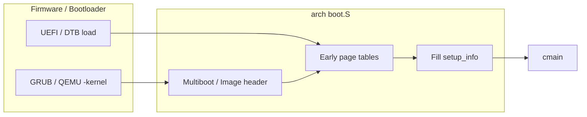

# 启动流程总览

v0.1 · 2026-08-26

本篇覆盖：`kernel/system/main.c`、`arch/x86_64/boot/boot.S`、`arch/aarch64/boot/boot.S`、`arch/x86_64/boot/start_arch.c`、`arch/aarch64/boot/start_arch.c`、`include/arch/x86_64/boot/arch_setup.h`、`include/arch/aarch64/boot/arch_setup.h`、`include/arch/x86_64/boot/multiboot.h`、`include/arch/x86_64/boot/multiboot2.h`。

平台细节见 `01-启动与初始化/平台启动-x86_64.md` 与 `平台启动-aarch64.md`；`DEFINE_INIT` 与 boot/idle 线程见 `模块初始化与内核入口.md`；SMP 启核见 `06-SMP与同步/SMP启动与处理器拓扑.md`。

---

## 1. 概述

RendezvOS core 的启动链路由 **架构相关 boot 代码** 完成最早期的 CPU/页表/栈设置，然后进入统一的 C 入口 `cmain(struct setup_info *)`（`kernel/system/main.c`）。`setup_info` 由 `boot.S` 填充：x86_64 携带 Multiboot(1/2) 信息与地址宽度；aarch64 携带 DTB 指针、早期映射边界与 UART 基址等。

`cmain` 在 BSP 上顺序初始化 UART/日志、架构准备、物理内存、per-CPU、虚拟内存、平台设备、trap/核心 per-CPU 状态、全局 port 表、Task_Manager 与模块 initcall，再注册内核 port、启动 SMP，最后进入 boot 线程 IPC 循环。AP 在 `start_smp` → `arch_start_smp` 路径上重复部分 per-CPU 与调度初始化，不再次执行完整 `cmain`。

---

## 2. 目标与边界

core 启动阶段要完成：可打印、可分配物理/虚拟内存、BSP 上可创建线程与 IPC、可选拉起 AP。它不负责加载用户态根文件系统或启动 init 进程——那是**集成镜像**（链接方链入兼容层后）与 `main_init()` / 测例线程的职责；`main_init` 不由 `cmain` 自动调用（见 `00-总览/架构与源码布局.md` §6.3）。

本篇不展开 Multiboot tag 逐项含义、DTB 节点解析或 AP 汇编入口的每一行；那些放在平台专篇与 SMP 篇。

---

## 3. 分层与调用方

- **boot.S / 早期 C（arch）** — 从引导协议到 64 位内核虚拟地址、构造 `setup_info`、跳 `cmain`。
- **cmain（ portable ）** — 固定顺序调用 `prepare_arch`、`phy_mm_init`、`virt_mm_init`、`arch_start_platform`、`init_proc` 等；失败则 `kernel_panic` 或 poweroff。
- **链接方 / 兼容层** — `RENDEZVOS_TEST` 时 `create_test_thread`（仅 core 构建）；`main_init()` 由链接方实现（若使用）；`kernel_set_ipc_handler` 注册 boot 线程消息处理。

调用方集成新平台时，须提供与 `arch_setup.h` 兼容的 `setup_info` 填充，并实现 `prepare_arch` / `arch_start_platform` / `arch_start_smp` 等 arch 钩子，而不是修改 `cmain` 顺序（除非 Maintainer 同意）。

---

## 4. 数据结构与不变量

### 4.1 setup_info

**x86_64**（`include/arch/x86_64/boot/arch_setup.h`）：

- `multiboot_magic` / `multiboot_info_struct_ptr` — 引导协议与信息结构（需加 `KERNEL_VIRT_OFFSET` 转为内核 VA）。
- `phy_addr_width` / `vir_addr_width` — 来自 CPUID，供 PMM/VMM。
- `rsdp_addr` — ACPI RSDP，供 `arch_start_platform` 中 `acpi_init`。
- `ap_boot_stack_ptr` — AP 启动栈（SMP）。
- `cpu_id` — 早期逻辑 CPU 号。

**aarch64**（`include/arch/aarch64/boot/arch_setup.h`）：

- `dtb_ptr` — 设备树物理指针。
- `map_end_virt_addr`、`boot_uart_base_addr`、`boot_dtb_header_base_addr` — 早期 fixmap 结果。
- `ap_boot_stack_ptr`、`cpu_id` — 同 x86 角色。

两架构共用 **`BSP_ID`**（在 `arch_cpu_info` 中设定：x86 为 APIC ID，aarch64 当前为 0）与 **`cmdline_ptr`**（x86 从 Multiboot cmdline 解析）。

### 4.2 阶段不变量

- **`phy_mm_init` 之前** — 不应依赖 buddy 分配；Multiboot 内存图须在覆盖 per-CPU 区域之前读完（x86 `prepare_arch` 注释）。
- **`virt_mm_init` 之后** — 可用 `kallocator`、`Map_Handler`、`root_vspace`。
- **`init_proc` 之后** — 存在 per-CPU `core_tm`、boot/idle 线程；`do_init_call` 可安全创建模块线程。
- **`start_smp` 之后** — AP 拥有独立 `core_tm` 与 idle，参与调度；BSP 已在 boot IPC 循环或测例路径。

---

## 5. 代码对应

| 阶段 | x86_64 | aarch64 | 统一 C |
|------|--------|---------|--------|
| 引导头与实模式/EL | `arch/x86_64/boot/boot.S` | `arch/aarch64/boot/boot.S` | — |
| setup 填充 | boot.S → `setup_info` | 同左 | — |
| 架构准备 | `start_arch.c` `prepare_arch` | DTB map + header 检查 | `cmain` 调用 |
| CPU 身份 | `arch_cpu_info` + APIC | `arch_cpu_info` + MPIDR | `init_core_id_system` |
| 平台 | `arch_start_platform` ACPI/PCI | DTB 设备树 + GIC + PSCI 等 | 在 `virt_mm_init` 后 |
| per-CPU core | `arch_start_core` GDT/TSS/syscall | `arch_start_core` EL/DAIF/syscall | `arch_enable_percpu` 更早 |

`kernel/system/main.c` 是唯一 portable 启动编排点。

---

## 6. 流程

### 6.1 自引导到 cmain



**x86_64**：Multiboot1/2 header → 32 位入口 → 建立 L0/L1、开 PAE/LME/分页 → 64 位 `cmain(setup_info)`。

**aarch64**：`_start` 设栈与早期映射 → 填 `setup_info`（含 DTB）→ `bl cmain`。

### 6.2 cmain 顺序（BSP）

与 `00-总览/架构与源码布局.md` 中流程图一致，此处按依赖关系简述：

1. **`uart_open` + `log_init`** — 最早控制台（x86 可能用 I/O port，aarch64 用 PL011 MMIO）。
2. **`prepare_arch`** — x86：解析 Multiboot cmdline；aarch64：映射并校验 DTB。
3. **`phy_mm_init`** — 物理内存区/zone/buddy（见物理内存篇）。
4. **`arch_enable_percpu(BSP_ID)`** — per-CPU 段偏移可用。
5. **`arch_cpu_info`** — 设 `BSP_ID`、CPU 特性。
6. **`virt_mm_init(BSP_ID, setup_info)`** — `Map_Handler`、`root_vspace`、BSP `boot_stack_bottom`。
7. **`arch_start_platform`** — x86：ACPI、PCI；aarch64：解析 DTB 树、GIC、时钟等。
8. **`arch_start_core(BSP_ID)`** — 本核 GDT/TSS 或 EL/sysreg、syscall/trap 绑定。
9. **`init_core_id_system`** — 逻辑 CPU 编号与拓扑。
10. **`global_port_init`** — 全局 port 表。
11. **`init_proc()`** — Task_Manager、boot/idle、`switch_to` 进入 idle 上下文。
12. **`do_init_call()`** — 所有 `DEFINE_INIT` 模块。
13. **`kernel_port_register()`** — 内核 listen port。
14. **`start_smp(setup_info)`** — 启 AP（若 `SMP`>1）。
15. **测例 / boot 循环** — `#ifdef RENDEZVOS_TEST` 或 `kernel_handle_msg()`。

任一步失败：多数路径 `kernel_panic`；port 注册失败可 `rendezvos_request_poweroff`。

### 6.3 AP 与 BSP 分工

| 项目 | BSP | AP |
|------|-----|-----|
| `cmain` 全程 | 是 | 否 |
| `virt_mm_init` | 是（初始化 root） | 是（attach 共享内核映射） |
| `init_proc` / boot 线程 | 是 | 各自 `arch_ap_init` 类路径建 idle |
| `do_init_call` | 是 | 通常否（模块 init 一次） |
| `kernel_handle_msg` | boot 线程 | 否 |

AP 入口由 `arch_start_smp` 触发（x86 INIT-SIPI、aarch64 PSCI）；细节见 SMP 篇与平台篇。

---

## 7. 公开 API

启动阶段链接方与兼容层最常间接用到的接口：

```c
void cmain(struct setup_info *arch_setup_info);

error_t prepare_arch(struct setup_info *arch_setup_info);
error_t arch_cpu_info(struct setup_info *arch_setup_info);
error_t phy_mm_init(struct setup_info *arch_setup_info);
error_t virt_mm_init(cpu_id_t cpu_id, struct setup_info *arch_setup_info);
error_t arch_start_platform(struct setup_info *arch_setup_info);
error_t arch_start_core(cpu_id_t cpu_id);
Task_Manager* init_proc(void);
void do_init_call(void);
void start_smp(struct setup_info *arch_setup_info);
```

`setup_info` 布局见各 arch 的 `arch_setup.h`。Multiboot 结构体见 `multiboot.h` / `multiboot2.h`。

---

## 8. 多架构

| 项目 | x86_64 | aarch64 |
|------|--------|---------|
| 引导协议 | Multiboot 1/2 | Linux arm64 Image + DTB |
| 固件数据 | Multiboot memmap、RSDP | DTB |
| BSP_ID | APIC ID | 当前实现固定 0 |
| 平台 init | ACPI MADT、PCI | GIC、PSCI、DTB 设备树 |
| 内核虚拟基址 | `0xffff800000000000` | 同（`KERNEL_VIRT_OFFSET`） |

riscv64 有 boot 骨架，未纳入 v0.1 主线启动文档。

---

## 9. 测试

完整启动路径在 `core/` 内通过 `make ARCH=x86_64|aarch64 config && make all && make run` 验证；`RENDEZVOS_TEST` 在 `cmain` 末创建测例线程。无单独「只测 boot.S」的自动化用例。本篇与当前源码一致，尚未单独复测。

---

## 10. 限制与后续

- x86 非 Multiboot 引导在 `prepare_arch` 直接失败。
- cmdline 依赖引导器传入；core 不解析内核命令行参数表（除早期打印）。
- AP 与 BSP 的 init 对称性不完整，新增 per-CPU 资源须同时考虑 AP 路径。
- UEFI 直启、Secure Boot 等见 `v0.1/evolution/TODO.md`（E7）。

---

## 11. 变更记录

- 2026-08-26：v0.1 初稿，固件到 cmain 阶段划分与 BSP/AP 分工。
