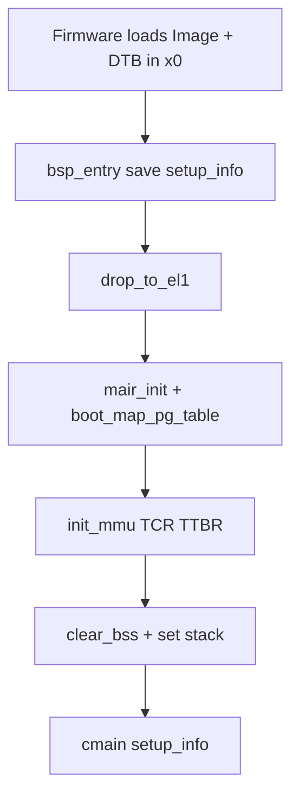
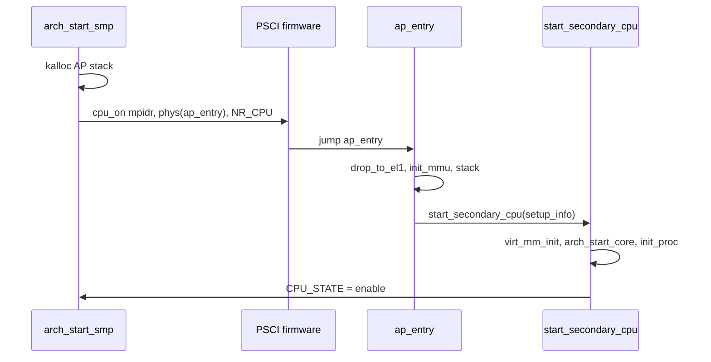

# 平台启动-aarch64

v0.1 · 2026-08-26

本篇覆盖：`arch/aarch64/boot/boot.S`、`arch/aarch64/boot/boot_map.c`、`arch/aarch64/boot/start_arch.c`、`arch/aarch64/boot/smp.c`、`arch/aarch64/psci/psci.c`、`arch/aarch64/psci/psci_call.S`、`include/arch/aarch64/psci/psci.h`、`include/arch/aarch64/psci/psci_error.h`。

通用流程见 `01-启动与初始化/启动流程总览.md`；DTB 模块与设备树遍历见 `09-平台模块/DTB与设备树-aarch64.md`；GIC 细节见 `05-陷阱与中断/平台中断-aarch64-GIC.md`；PSCI 电源语义见 `09-平台模块/PSCI与处理器电源-aarch64.md`。

---

## 1. 概述

aarch64 平台以 Linux arm64 **Image 头**（`boot.S` 中 `_boot_header`）被固件/QEMU 加载，入口 `_start` 保存 DTB 指针到 `setup_info`，在 MMU 关闭状态下通过 `boot_map_pg_table` 建立内核与 UART/DTB 的早期映射，启用 EL1 MMU 后调用 `cmain`。平台初始化阶段解析 DTB 构建设备树、从 `chosen/bootargs` 取 cmdline、**`psci_init`** 绑定 SMC/HVC，并 **`gic.probe` / init distributor**。SMP 在 DTB 的 `cpu` 节点上找 `enable-method = "psci"`，用 **`psci_cpu_on`** 把 AP 带到 `ap_entry`，再进 `start_secondary_cpu`。

---

## 2. 目标与边界

本篇覆盖 core 在 aarch64 上从 Image 入口到 `arch_start_core` 的平台代码，不含 UEFI boot、EL3 完整固件链或 **PSCI 0.1 以前** 的 spin-table 启核（仅 PSCI）。

`drop_to_el1` 对 EL3/EL2 多为占位（`TODO`）；当前 QEMU virt 通常已在 EL1 进入 `bsp_entry`。不在此展开 GICv3 ITS、SMMU 等可选硬件。

---

## 3. 分层与调用方

- **boot.S** — Image 头、EL 检测、`prepare_page_table` 调 `boot_map_pg_table`、TCR/TTBR、`cmain`；**`ap_entry`** 为 AP 物理入口。
- **boot_map.c** — MMU 开启前用 **物理地址** 操作页表；从 DTB 读 PL011 `reg` 映射 UART。
- **start_arch.c** — `map_dtb` / `prepare_arch`；`build_device_tree`；`psci_init` + GIC；`arch_start_core` 每核 GIC CPU interface、syscall trap。
- **smp.c** — 遍历 DTB cpu 节点，`psci_func.cpu_on(reg, phys(ap_entry), context)`。
- **psci.c / psci_call.S** — 从 DTB `arm,psci` 节点读 `method`（smc/hvc），函数指针表 `psci_func`。

链接方更换 DTB 或 CPU 节点 `reg` 编码时，须与 `arch_start_smp` 中 `reg_val` 作为 `cpu_id` 的用法一致。

---

## 4. 数据结构与不变量

### 4.1 setup_info（aarch64）

```c
struct setup_info {
        u64 dtb_ptr;
        u64 res_x1, res_x2, res_x3;
        u64 map_end_virt_addr;
        u64 boot_uart_base_addr;
        u64 boot_dtb_header_base_addr;
        vaddr ap_boot_stack_ptr;
        cpu_id_t cpu_id;
};
```

`boot.S` 的 `setup_info` 在 `.boot.data`：x0(DTB) 等由 BSP 写入；`boot_map_pg_table` 填充 map 边界与 UART/DTB 的 **内核 VA**。AP 在 `ap_entry` 把 PSCI 传入的 context 写入 `setup_info+0x40`（`cpu_id` 字段）。

### 4.2 早期映射（boot_map.c）

- 调用方传入 L0–L3 表 **物理地址** 与 `setup_info` 物理指针。
- 映射内核 `[kernel_start, kernel_end)` 为 2 MiB 块；UART 与 DTB 各需一页 4 KiB 映射。
- `boot_get_uart_info` 硬编码 compatible `"arm,pl011"`；失败 `boot_Error()`。

### 4.3 PSCI

- `struct psci_func_64 psci_func` — `cpu_on`、`cpu_off` 等函数指针。
- `psci_call.S` — `psci_smc` / `psci_hvc` 单条指令封装。
- `psci_init` 失败时 `psci_func.enable = false`，SMP 无法启 AP。

### 4.4 SMP 计数

`arch_start_smp` 设 `NR_CPU = 1`，每成功启一 AP 则 `NR_CPU++`；`per_cpu(CPU_STATE, NR_CPU) = cpu_disable` 直至 AP 在 `start_secondary_cpu` 内置 `cpu_enable`。与 x86 按 APIC ID 索引不同，此处用 **递增逻辑 id** 作为 `cpu_number`（与 DTB `reg` 匹配跳过 BSP）。

---

## 5. 代码对应

| 文件 | 职责 |
|------|------|
| `boot.S` | Image 头、`bsp_entry`、`ap_entry`、`setup_info`、MMU/栈、`cmain` / `start_secondary_cpu` |
| `boot_map.c` | `boot_map_pg_table`、`boot_get_uart_info` |
| `start_arch.c` | DTB map/check、设备树、`cmdline`、`psci_init`、GIC distributor、`arch_start_core` |
| `smp.c` | DTB cpu  walk + `psci cpu_on` |
| `psci/psci.c` | DTB 探测 method、填充 `psci_func` |
| `psci/psci_call.S` | SMC/HVC 桩 |
| `psci.h` / `psci_error.h` | PSCI 函数 ID 与错误码 |

---

## 6. 流程

### 6.1 BSP：MMU off → on → cmain



`prepare_arch`（`start_arch.c`）在 **MMU 已开** 的 `cmain` 里调用：`map_dtb` 将 DTB 映射到可访问 VA，`fdt_check_header` 校验。

### 6.2 arch_start_platform

1. **`build_device_tree`** — 递归解析 DTB 为 `device_node` 树（供 PSCI、cpu、设备等）。
2. **`chosen/bootargs`** → `cmdline_ptr`。
3. **`psci_init()`** — 查找 `compatible = "arm,psci"`，绑定 smc/hvc。
4. **`gic.probe()`** + **`gic.init_distributor()`** — GIC 硬件发现与全局配置（CPU interface 在 `arch_start_core`）。

### 6.3 arch_start_core（每核）

`per_cpu(cpu_number) = cpu_id` → `init_interrupt` → **`gic.init_cpu_interface()`** → `smp_ipi_init` → `rendezvos_time_init` → **`register_fixed_trap(TRAP_CLASS_SYSCALL, ...)`**。

### 6.4 AP：PSCI cpu_on



仅接受 `enable-method = "psci"` 的 cpu 节点；`reg` 等于 `BSP_ID` 的节点跳过。

---

## 7. 公开 API

```c
error_t prepare_arch(struct setup_info *arch_setup_info);
error_t arch_start_platform(struct setup_info *arch_setup_info);
error_t arch_start_core(cpu_id_t cpu_id);
void arch_start_smp(struct setup_info *arch_setup_info);

void boot_map_pg_table(...);  /* boot_map.c，boot.S 调用 */
void psci_init(void);
extern struct psci_func_64 psci_func;

u64 psci_smc(u64 func_id, u64 arg1, u64 arg2, u64 arg3);
u64 psci_hvc(u64 func_id, u64 arg1, u64 arg2, u64 arg3);
```

`start_secondary_cpu` 声明在 `rendezvos/smp/smp.h`（实现在 `kernel/smp/smp.c`）。

---

## 8. 多架构

本篇仅 aarch64。相对 x86_64：DTB 代替 Multiboot；PSCI 代替 INIT-SIPI；GIC 代替 APIC；`BSP_ID` 在 `arch_cpu_info` 中固定为 0（非 MPIDR 低 bits）。

---

## 9. 测试

在 `core/` 内 `make ARCH=aarch64 config && make all && make run`（QEMU virt + DTB）验证 BSP 与 PSCI SMP。`RENDEZVOS_TEST` 在 AP 上调用 `create_test_thread(false)`。本篇与当前源码一致，尚未单独复测。

---

## 10. 限制与后续

- EL3/EL2 降级路径未完整实现。
- UART 仅 PL011 compatible 字符串写死在 `boot_map.c`。
- SMP 仅 PSCI；无 spin-table / spin-table v2。
- `NR_CPU` 与 DTB `reg` 语义耦合，多 cluster 需核对 `cpu_id` 分配。
- GIC 版本探测在 `gic.probe`，错误 DTB 会导致中断不可用。

---

## 11. 变更记录

- 2026-08-26：v0.1 初稿，Image 启动、早期映射、PSCI 与 GIC 早期 init。
