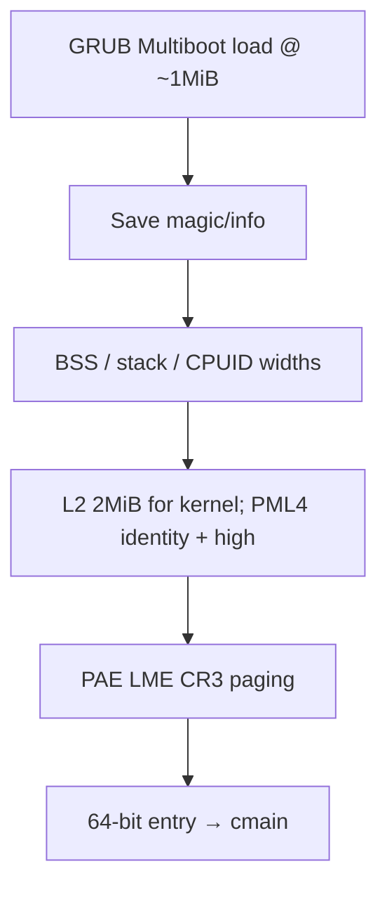

# 平台启动-x86_64

v0.1 · 2026-08-29

本篇覆盖：`arch/x86_64/boot/boot.S`、`arch/x86_64/boot/gdt.c`、`arch/x86_64/boot/start_arch.c`、`arch/x86_64/boot/smp.c`、`arch/x86_64/acpi/acpi.c`、`arch/x86_64/acpi/madt.c`、`include/arch/x86_64/desc.h`、`include/arch/x86_64/boot/arch_setup.h`（及与启动强相关的 `arch/x86_64/mm/pmm.c` RSDP/memmap 入口）。

通用编排见 `启动流程总览.md`；initcall/boot 线程见 `模块初始化与内核入口.md`；ACPI 表字段见 `09-平台模块/ACPI与MADT-x86_64.md`；APIC/PIC 运行期见 `05-陷阱与中断/平台中断-x86_64-APIC与PIC.md`。

---

## 1. 概述

x86_64 上，内核以 **Multiboot 1/2 兼容的 bin 镜像**（物理加载约 `0x100000`，高半核 VA `0xffff8000…`）被 GRUB/QEMU 加载。`boot.S` 在 32 位完成早期 2 MiB 映射与长模式切换，进入 `cmain(setup_info)`。平台特有工作是：从 Multiboot 取 **memmap/cmdline**；在 PMM 路径 **扫描 BIOS 窗口探测 RSDP**（不是 Multiboot ACPI tag）；在 `arch_start_platform` 用 MADT 枚举 Local APIC；再把链接在高 VA 的 **`.boot.ap_code` memcpy 到物理 `0x1000`**，用 INIT-SIPI 串行拉起 AP。

**设计意图（相对「直接跳内核入口」）：**

- **只认 Multiboot magic** — 镜像依赖引导器按 address tag 装载并清 BSS；不实现 UEFI/Linux boot protocol（E7），换协议即改 `prepare_arch` / memmap，属 core 变更。
- **APIC ID 即 `cpu_id`** — MADT、SIPI 目的地、`per_cpu(..., id)` 共用同一 id 空间（可稀疏）；与 aarch64「逻辑 id ≠ affinity」不同。
- **跳板必须在低 1 MiB 页对齐** — SIPI 向量是页帧号；`0x0` 是 IVT/BDA，故选 `0x1000`；用完后清零跳板（注释：avoid attack）。
- **平台一次 / 核心每核** — ACPI+PCI 只在 BSP；GDT/TSS/IRQ/syscall 每核 `arch_start_core`。

---

## 2. 目标与边界

**描述：** 从 Multiboot 入口到本核 `arch_start_core` 完成、以及 `arch_start_smp` 启 AP 的 x86 特有步骤。

**不做：** IOAPIC/MSI 完整路由（E5）；PCI 热插拔；ACPI 2.0+ XSDT 完整路径；并行同时唤醒多个 AP（共享 `setup_info` 的 `cpu_id`/栈指针迫使串行 SIPI）。

**失败与边界：** 非 Multiboot → `prepare_arch` / memmap 失败；RSDP revision ≠ 0 → 保留区路径报错；RSDP **找不到**时探测可仍「成功」留下 `rsdp_addr==0`，随后 `acpi_init(0)` 不安全——集成时须保证 QEMU/固件提供可扫到的 RSDP。AP 超时 10 s 只打日志，该核保持 `cpu_disable`。

---

## 3. 分层与调用方

| 组件 | 角色 |
|------|------|
| `boot.S` | Multiboot 头、BSP/AP 汇编、早期 PT、`setup_info` 前几字段 |
| `start_arch.c` | `prepare_arch` / `arch_cpu_info` / `arch_start_platform` / `arch_start_core` |
| `arch/.../mm/pmm.c` | memmap 插入、`acpi_probe_rsdp` → `rsdp_addr` |
| `smp.c` | 跳板复制、INIT-SIPI、AP 栈 |
| `acpi` / `madt` | RSDT walk、`parser_apic` → `NR_CPU` / `CPU_STATE` |

portable 顺序仍由 `cmain` / `start_secondary_cpu` 固定；本篇不重排。

---

## 4. 数据结构与不变量

### 4.1 `setup_info`

```c
struct setup_info {
        u32 multiboot_magic;
        u32 multiboot_info_struct_ptr; /* + KERNEL_VIRT_OFFSET → info */
        u32 phy_addr_width;
        u32 vir_addr_width;
        vaddr rsdp_addr;               /* phy_mm 路径填入 */
        vaddr ap_boot_stack_ptr;       /* 启下一 AP 前由 BSP 写 */
        cpu_id_t cpu_id;
} __attribute__((packed));
```

`boot.S` 写 magic、info、CPUID `0x80000008` 地址宽度；`rsdp_addr` 初值 0。

### 4.2 GDT / syscall

per-CPU `gdt[]`：kernel CS/DS、TSS 上下半、**USER_DS 在 USER_CS 前**，使 `STAR` 高半与索引约定匹配（SYSRET 拿到用户 CS/SS）。细节见 trap/syscall 篇；本篇只钉：`arch_start_core` 里 `set_gdt` → TSS → `init_syscall`（STAR/LSTAR/FMASK）。

### 4.3 AP 跳板

- 物理目标：`_RENDEZVOS_X86_64_AP_PHY_ADDR_` = **`0x1000`**。
- 源：链接在内核高 VA 的 `.boot.ap_code`（`ap_start`…`ap_start_end`），`memcpy` 到低址后再 SIPI。
- AP：16 位 → 32 位（临时 GDT/页表）→ 64 位 → `start_secondary_cpu(setup_info)`。
- 全部尝试结束后：`clean_ap_start_code()` 清零；`clean_tmp_page_table()` 意图去掉早期 identity 映射（实现是否始终把 PML4[0] 清零，以源码为准；文档不粉饰）。

### 4.4 MADT / `CPU_STATE`

`parser_apic`：先清空再按 Local APIC 项 `NR_CPU++`，`per_cpu(CPU_STATE, apic_id)=cpu_disable`。BSP 在 `arch_start_smp` 标 `cpu_enable`。id = APIC id；`NR_CPU` 是计数不是 `max_id+1`。x2APIC MADT 类型 / IRQ override 未完整消费。

### 4.5 `BSP_ID` 与 percpu 次序

`arch_cpu_info`：`BSP_ID = CPUID 叶 1 的 APIC ID`。但 `cmain` 先 `arch_enable_percpu(BSP_ID)`（此时常为 **0**）再 `arch_cpu_info`。若 BSP APIC ≠ 0，早期 GS 槽与之后 `per_cpu(..., BSP_ID)` 可能不一致——见启动总览；平台代码须保持这一次序或显式处理。

### 4.6 链接 → 加载 → 早期物理布局 → 早期页表（本 ISA 精确）

跨架构地图见 `启动流程总览.md` §4.4。此处只写 x86 数字与硬件步骤。

**链接（`x86_64_linker.ld`）：**

- `kernel_virt_offset = 0xffff800000000000`
- `kernel_start_offset = 0x100000` → 符号链接在 **VA = 高半 + 1 MiB**
- `.text` 含 `.boot` / `.boot_64` / `.boot.*` / `.trap*`
- `.bss` 含 `.boot_stack`（`_boot_stack_bottom`）
- `.percpu` 含 `.percpu..data`，并导出 `__tss_rsp_offset` / `__user_rsp_scratch_offset`（供 `%gs:`）
- `_end` 为镜像终点（后续 percpu/PMM 物理游标多从此转 PA）

**加载：** Multiboot 装 **bin** 到约 **PA 1 MiB**（与 `kernel_start_offset` 一致）。故早期「恒等」：VA `ffff8000_00100000` ↔ PA `0x100000`。

**早期物理快照（BSP 开 PG 前）：**

```text
PA 0x00001000     AP 跳板目标（尚未拷贝）
PA 0x00100000…    内核 bin：代码/数据/BSS(boot_stack)/静态 L0·L1·L2
（memmap 可用区） 稍后 buddy；≤1MiB 可用区通常不插入
```

**早期页表与模式切换（硬件）：**

1. 32 位：`setup_info` 填 magic/info；CPUID `0x80000008` → 地址宽度。  
2. 以 `(_kstart - virt_off)`…`(_end - virt_off)` 为 PA 范围，2 MiB 对齐，向 **L2** 写 `P|RW|PS|G`（不依赖 1 GiB 页能力）。  
3. L0 同时覆盖 **identity 与高半**（仍在低址取指时开 PG）。  
4. 按 Intel SDM 进 IA-32e 的固定序：**开 PAE → 开 EFER.LME → 装 CR3 → 开 CR0.PG**。  
5. `lgdt` + `ljmp` → `.boot_64`；再绝对跳到链接高 VA；`rsp = _boot_stack_bottom`；`cmain(setup_info)`。  
6. SMP 后意图 `clean_tmp_page_table` 去掉临时 identity（实现以 `boot.S` 为准）。

**`cmain` 后：** `phy_mm_init` 在镜像后 reserve percpu/PMM；`sys_init_map` 挂 Map 窗口——见物理内存篇 / 页表篇。RSDP 探测窗口是 BIOS 区，不是 Multiboot 字段。

---

## 5. 代码对应

| 文件 | 职责 |
|------|------|
| `boot.S` | MB1/MB2 头、`bsp_entry`、L2 2 MiB、长模式、`ap_start`、`setup_info` |
| `gdt.c` / `desc.h` | per-CPU GDT 填充与索引 |
| `start_arch.c` | cmdline、`BSP_ID`、ACPI+PCI、每核 core init |
| `smp.c` | 跳板、INIT-SIPI、16 页 AP 栈、超时 |
| `acpi/acpi.c` | `acpi_init(rsdp)`：RSDT rev0，FACP/APIC |
| `acpi/madt.c` | `parser_apic` |
| `mm/pmm.c`（arch） | memmap、`acpi_probe_rsdp` |

`arch_start_smp` 声明在 `include/arch/x86_64/smp.h`，不在 `arch_setup.h`。

---

## 6. 流程

### 6.1 BSP：32 位 → 长模式 → `cmain`



为何 identity + high 同指一套 L1：AP 在 `0x1000` 实模式取指需要低址可执行，同时 BSP 已跑在高 VA。

### 6.2 `prepare_arch` / PMM / platform（与 RSDP 分离）

1. **`prepare_arch`** — 只校验 MB magic + 取 cmdline。**不**读 memmap、**不**探 RSDP。
2. **`phy_mm_init` → `arch_get_memory_regions`** — 强制 MB memmap；可用区插入 buddy。
3. **`reserve_arch_region`** — `acpi_probe_rsdp` 扫 `0x80000–0x80400` 与 `0xE0000–0xFFFFF`；命中则写 `rsdp_addr` 并保留表页。与 Multiboot 无必然关系。
4. **`arch_cpu_info`** — 设 `BSP_ID`。
5. **`virt_mm_init`** — 此后才有稳定 `kallocator` 供 PCI 等。
6. **`arch_start_platform`** — `acpi_init(rsdp)`（MADT→`NR_CPU`）+ PCI 树扫描（BSP allocator）。

### 6.3 `arch_start_core`（每核）

顺序（源码）：`set_gdt` → 清 `MSR_KERNEL_GS_BASE` → `cpu_number=cpu_id` → TSS → `init_interrupt` → `init_irq`（优先 x2APIC→xAPIC→8259，依赖 MADT 已解析）→ `smp_ipi_init` / TLB flush init → `init_syscall` → 开 IRQ → `rendezvos_time_init` → FP/SIMD。

### 6.4 SMP：串行 INIT-SIPI

```mermaid
sequenceDiagram
  participant BSP as arch_start_smp
  participant Mem as PA 0x1000
  participant AP as AP CPU
  participant SS as start_secondary_cpu

  BSP->>BSP: CPU_STATE[BSP]=enable
  alt NR_CPU > 1
    BSP->>Mem: memcpy .boot.ap_code
    BSP->>AP: INIT IPI all-but-self
    loop each cpu_disable i
      BSP->>BSP: kalloc 16 pages; setup_info.stack/cpu_id=i
      BSP->>AP: SIPI x2 (vector=PPN 0x1000)
      AP->>SS: 16→32→64 → start_secondary_cpu
      SS->>SS: enable CPU_STATE[i]
      BSP->>BSP: poll ≤10s
    end
    BSP->>Mem: memset trampoline 0
  end
  BSP->>BSP: clean_tmp_page_table
```

**为何串行：** 下一 AP 的栈与 `cpu_id` 写在**同一** `setup_info` 字段；并行会竞态。代价是启核延迟；换并行须 per-AP 参数页。

AP 后续 portable 路径见启动总览（含二次 `do_init_call` 与 `kernel_handle_msg`）。

---

## 7. 公开 API

```c
error_t prepare_arch(struct setup_info *);
error_t arch_cpu_info(struct setup_info *);
error_t arch_start_platform(struct setup_info *);
error_t arch_start_core(cpu_id_t cpu_id);
void arch_start_smp(struct setup_info *); /* arch smp.h */

error_t acpi_init(vaddr rsdp_addr);
error_t parser_apic(void); /* 经 acpi_init */

void prepare_per_cpu_new_gdt(...);
void perpare_per_cpu_user_gdt(union desc *gdt); /* 拼写保持源码 */
```

Multiboot 结构：`multiboot.h` / `multiboot2.h`。

---

## 8. 多架构

仅 x86_64。对比 aarch64：Multiboot+BIOS RSDP+MADT+APIC IPI+低址跳板，而非 DTB+PSCI；`BSP_ID` 来自 APIC 而非固定 0；CPU id 空间 = APIC id。

---

## 9. 测试

`core/`：`make ARCH=x86_64 config && make all && make run`；`SMP>1` + `RENDEZVOS_TEST` 覆盖 AP。无 boot.S 单测。本篇与源码对齐，本轮未单独复测。

---

## 10. 限制与后续

- 仅 Multiboot 1/2（E7）。
- ACPI rev0 / RSDT；无 RSDP 时的脆弱路径见 §2。
- 跳板固定 `0x1000`；与固件冲突需改常量并同步 SIPI。
- MADT 子集；IOAPIC 空壳（E5）。
- `clean_tmp_page_table` / BSS 循环等边角以源码为准，有疑义记 evolution 而非臆造语义。

---

## 11. 变更记录

- 2026-08-29：整篇重做——分离 Multiboot vs RSDP；阐明跳板高 VA→`0x1000` 与串行 SIPI 动机；APIC id 拓扑；`BSP_ID`/percpu 次序；修正「Multiboot 含 RSDP」表述；补 platform/core 与失败边界。
- 2026-08-29：补 §4.6 链接/加载/早期 PA/早期页表（PAE→LME→PG、2 MiB PS、identity+高半）硬件步骤。
- 2026-08-26：v0.1 初稿。
