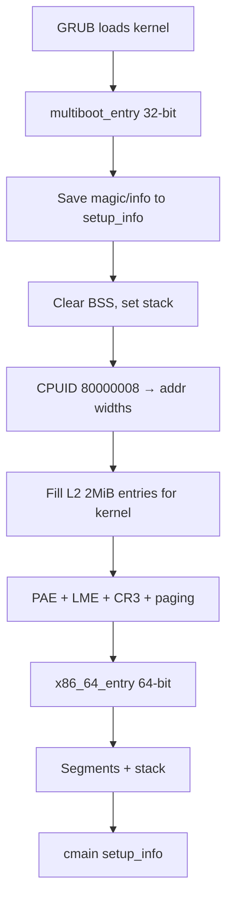
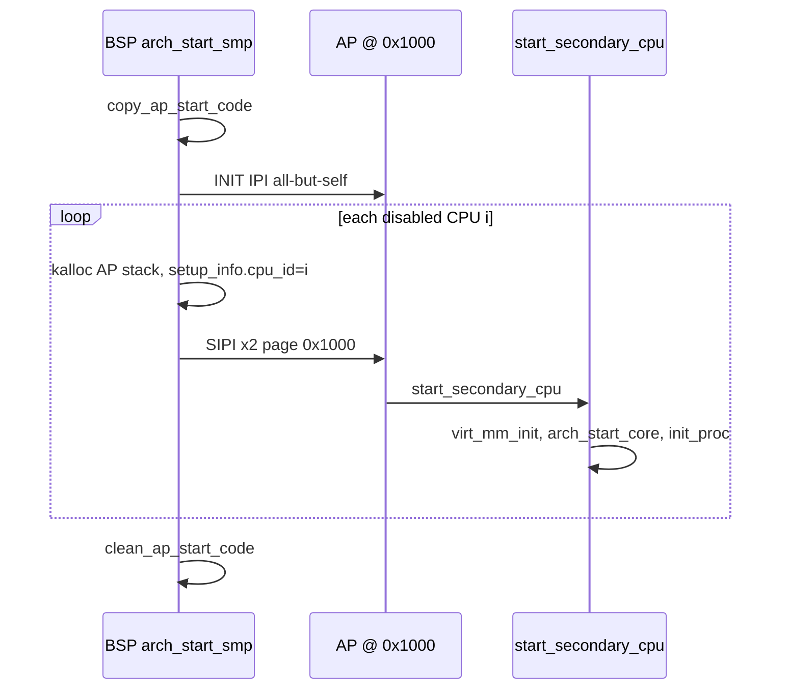

# 平台启动-x86_64

v0.1 · 2026-08-26

本篇覆盖：`arch/x86_64/boot/boot.S`、`arch/x86_64/boot/gdt.c`、`arch/x86_64/boot/start_arch.c`、`arch/x86_64/boot/smp.c`、`arch/x86_64/acpi/acpi.c`、`arch/x86_64/acpi/madt.c`、`include/arch/x86_64/desc.h`、`include/arch/x86_64/boot/arch_setup.h`。

通用阶段划分见 `01-启动与初始化/启动流程总览.md`；GDT/TSS 在运行期的使用见 `05-陷阱与中断/` 与 `06-SMP与同步/`；ACPI 表结构细节见 `09-平台模块/ACPI与MADT-x86_64.md`。

---

## 1. 概述

x86_64 平台启动由 GRUB 等 Multiboot(1/2) 引导器加载内核，从 `boot.S` 的 32 位入口完成 BSS 清零、早期 2 MiB 内核映射、PAE/LME/分页，进入 64 位后调用 `cmain(setup_info)`。`setup_info` 携带 Multiboot 指针与 CPU 地址宽度；RSDP 在 `phy_mm_init` 阶段由 `acpi_probe_rsdp` 填入。SMP 通过 MADT 枚举 Local APIC ID，再用 **低物理地址 AP 跳板**（`.boot.ap_code`）配合 INIT-SIPI-SIPI 启动 AP。

---

## 2. 目标与边界

本篇描述 core 在 x86_64 上 **从引导协议到 `arch_start_core`** 的平台特有步骤，不含 Linux boot protocol、UEFI 直启或 PVH。Multiboot 仅实现 memmap/cmdline 与 RSDP 探测所需子集；ACPI 解析在 `acpi_init` 中只处理 RSDT revision 0 与 FACP/APIC 表。

core 不做：IOAPIC 完整 IRQ 路由策略（见 PIC/APIC 专篇）；PCI 热插拔；Secure Boot。

---

## 3. 分层与调用方

- **boot.S** — 无 C 运行时；写 `setup_info`、建静态 L2 大页表、AP 机器码。
- **start_arch.c** — `prepare_arch`（Multiboot cmdline）、`arch_cpu_info`（APIC ID → `BSP_ID`）、`arch_start_platform`（ACPI+PCI）、`arch_start_core`（每核 GDT/TSS/中断/syscall）。
- **pmm.c（arch）** — `reserve_arch_region` 填 `rsdp_addr`；Multiboot memmap 在 `arch_get_memory_regions`。
- **smp.c（arch）** — `arch_start_smp`：复制 AP 代码、INIT、SIPI。

链接方若更换引导器，须仍提供 Multiboot 兼容信息或改 `prepare_arch` / memmap 路径（属 core 变更，需 Maintainer 确认）。

---

## 4. 数据结构与不变量

### 4.1 setup_info（x86_64）

```c
struct setup_info {
        u32 multiboot_magic;
        u32 multiboot_info_struct_ptr;  /* + KERNEL_VIRT_OFFSET → info */
        u32 phy_addr_width;
        u32 vir_addr_width;
        vaddr rsdp_addr;                /* phy_mm_init 后有效 */
        vaddr ap_boot_stack_ptr;
        cpu_id_t cpu_id;
} __attribute__((packed));
```

`boot.S` 在 32 位阶段写入 magic、info 指针、CPUID 0x80000008 的物理/线性地址宽度；`rsdp_addr` 初值为 0，由 `reserve_arch_region` 更新。

### 4.2 GDT（desc.h / gdt.c）

per-CPU `gdt[GDT_SIZE]`：kernel CS/DS、TSS 上下半、user CS/DS（DPL=3）。`prepare_per_cpu_new_gdt` / `perpare_per_cpu_user_gdt` 在 `arch_start_core` → `set_gdt` 中填充；`arch_set_syscall_entry` 配置 STAR/LSTAR/FMASK。

### 4.3 AP 跳板

- 链接占位：`ap_phy_addr` = `0x1000`（`boot.S` 中 `ap_phy_addr`）。
- `copy_ap_start_code()` 将 `.boot.ap_code` 段复制到该物理页；SIPI 向量 = 页号。
- AP 路径：16 位 → 32 位 → 64 位 → `start_secondary_cpu(setup_info)`。
- 全部 AP 上线后 `clean_ap_start_code()` 清零跳板，`clean_tmp_page_table()` 清理临时 L0。

### 4.4 MADT 与 CPU_STATE

`parser_apic()`（`madt.c`）遍历 MADT Local APIC 项：`NR_CPU++`，`per_cpu(CPU_STATE, apic_id) = cpu_disable`。BSP 在 `arch_start_smp` 内设 `cpu_enable`。未出现在 MADT 的 ID 保持 `no_cpu`。

---

## 5. 代码对应

| 文件 | 职责 |
|------|------|
| `boot.S` | Multiboot1/2 头、`bsp_entry`、内核 2M 映射、64 位 `cmain`、`ap_start` 机器码、`setup_info` |
| `gdt.c` | per-CPU GDT 模板与填充函数 |
| `start_arch.c` | Multiboot cmdline、`BSP_ID`、ACPI/PCI 平台 init、每核 `arch_start_core` |
| `smp.c` | INIT-SIPI、AP 栈分配、`arch_start_smp` |
| `acpi/acpi.c` | `acpi_init(rsdp)`：RSDT  walk，FACP/APIC 分发 |
| `acpi/madt.c` | `parser_apic` → `NR_CPU` / `CPU_STATE` |
| `desc.h` | GDT 索引与描述符布局 |
| `arch_setup.h` | `setup_info`、`GET_MULTIBOOT_INFO` 宏 |

`arch/x86_64/mm/pmm.c` 中 `acpi_probe_rsdp`、`reserve_arch_region` 与启动强相关，职责见物理内存篇。

---

## 6. 流程

### 6.1 BSP：实模式/32 位 → 长模式



内核链接基址 `kernel_virt_offset = 0xffff800000000000`，物理加载约 `0x100000`。早期页表使用 `boot.S` 内静态 `L0_table` / `L2_table`。

### 6.2 prepare_arch 与 RSDP

1. **`prepare_arch`** — 校验 `MULTIBOOT_MAGIC` / `MULTIBOOT2_MAGIC`；解析 cmdline 到 `cmdline_ptr`。非 Multiboot 直接失败。
2. **`phy_mm_init`** → **`reserve_arch_region`** — `acpi_probe_rsdp(KERNEL_VIRT_OFFSET)` 搜索 RSDP（通常在 EBDA/BIOS 区）；成功则 `arch_setup_info->rsdp_addr = (vaddr)rsdp_table` 并保留 RSDT 所在页。
3. **`arch_start_platform`** — `acpi_init(rsdp_addr)` 映射 RSDT、遍历表项；遇 APIC 签名调用 `parser_apic()`。随后 PCI 扫描。

### 6.3 arch_start_core（每核一次）

`set_gdt` → `MSR_KERNEL_GS_BASE` → `prepare_per_cpu_tss` → `init_interrupt` / `init_irq` → `smp_ipi_init` → TLB flush init → **`init_syscall`**（STAR/LSTAR）→ 开 IRQ → `rendezvos_time_init` → FP/SIMD。

BSP 在 `cmain` 中调用一次；AP 在 `start_secondary_cpu` 中再调用。

### 6.4 SMP：INIT-SIPI



`NR_CPU > 1` 时执行；`NR_CPU==1` 仍 `clean_tmp_page_table`。

---

## 7. 公开 API

平台启动相关 arch 钩子（`arch_setup.h`）：

```c
error_t prepare_arch(struct setup_info *arch_setup_info);
error_t arch_cpu_info(struct setup_info *arch_setup_info);
error_t arch_start_platform(struct setup_info *arch_setup_info);
error_t arch_start_core(cpu_id_t cpu_id);
void arch_start_smp(struct setup_info *arch_setup_info);
```

ACPI：

```c
error_t acpi_init(vaddr rsdp_addr);
error_t parser_apic(void);  /* madt.c，经 acpi_init 间接调用 */
```

GDT：

```c
void prepare_per_cpu_new_gdt(struct pseudo_descriptor *desc, union desc *gdt);
void perpare_per_cpu_user_gdt(union desc *gdt);
```

Multiboot 结构体与 tag 宏见 `multiboot.h` / `multiboot2.h`。

---

## 8. 多架构

本篇仅 x86_64。与 aarch64 对比：Multiboot + RSDP/MADT + APIC IPI，而非 DTB + PSCI；BSP_ID 取自 Local APIC ID 而非固定 0。

---

## 9. 测试

在 `core/` 内 `make ARCH=x86_64 config && make all && make run` 经 QEMU/GRUB 走完整 boot 路径；`RENDEZVOS_TEST` 与 `SMP>1` 验证 AP。无单独 boot.S 单测。本篇与当前源码一致，尚未单独复测。

---

## 10. 限制与后续

- 仅 Multiboot 1/2；`prepare_arch` 拒绝其他 magic。
- RSDP revision ≠ 0 时 `reserve_arch_region` 报错（未实现 ACPI 2.0+ RSDT/XSDT 完整路径）。
- AP 跳板占用物理页 `0x1000`，与平台固件布局冲突时需_relocate。
- MADT 仅 Local APIC 计数；x2APIC、IRQ override 未完整处理。

---

## 11. 变更记录

- 2026-08-26：v0.1 初稿，Multiboot、GDT、长模式、AP 跳板与 MADT 入口。
