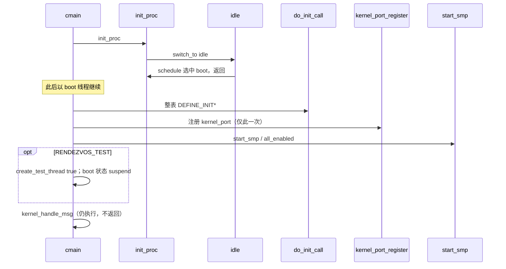

# 模块初始化与内核入口

v0.1 · 2026-08-29

本篇覆盖：`include/rendezvos/task/initcall.h`、`kernel/task/thread_boot.c`、`kernel/task/task_manager.c`（boot 相关）、`kernel/system/main.c`（后半）、`kernel/system/powerd.c`、`modules/helloworld/helloworld.c`、`include/modules/helloworld/helloworld.h`。AP 侧二次 init 见 `kernel/smp/smp.c`（与 `启动流程总览.md` 交叉）。

固件到 `cmain` 前半见 `启动流程总览.md`；线程/调度细节见 `03-任务与调度/`；port 语义见 `04-IPC/`。

---

## 1. 概述

在 BSP 完成内存与本核 trap 之后，core 用 `init_proc()` 造出**可调度的最小环境**（每核 Task_Manager + boot + idle），再用链接段上的 **`do_init_call()`** 跑遍 `DEFINE_INIT*`，注册 `"kernel_port"`，启 SMP，最后每个 online CPU 的 boot 进入 **`kernel_handle_msg()`**。

**设计意图：** 产品与测例都不该改 `cmain` 顺序；扩展一律挂进 `.init.call.*`（链接方 `EXTRA_OBJECTS` 与 core 同表）。init 只做**同步注册**（建线程结构、`register_port`、绑核 enqueue），不保证 server 入口函数此刻已在跑——那要等调度选中，且通常要等 SMP/`all_enabled`。AP 会**再跑整表 initcall**，因此「只应全局一次」的 init 必须 BSP 门控（core 内范例：`powerd_init`）。

与「在 `start_kernel` 里写死一串子系统函数指针」相比：链接段 + level 把兼容层 `.o` 和 core 模块摆进同一机制，代价是同 level 内顺序依赖链接、且无运行时依赖图——作者必须自己幂等。

---

## 2. 目标与边界

**提供：** initcall 框架；boot/idle 与 round-robin 最小调度；BSP 注册的全局 `"kernel_port"`；可选 `kernel_set_ipc_handler`；示例模块 `helloworld`（非 initcall）与 `powerd`（initcall + BSP 门控）。

**不做：** 规定必须有哪些 server；用户态 init 的 ELF 加载策略；标准「等待 all_enabled」API（AP 路径已在 `start_secondary_cpu` 自旋，BSP 上的 init 若需要须自写等待）。

死符号 `interrupt_init` 与本篇无关；中断初始化在 `arch_start_core` → `init_interrupt`（见启动总览 / trap 篇）。

---

## 3. 分层与调用方

**core 模块** — `DEFINE_INIT(fn)` / `DEFINE_INIT_LEVEL(fn, n)`。前置：`percpu(core_tm)`、`global_port_table`、`kallocator` 已就绪。BSP 上 initcall **早于** `start_smp`；AP 上则在 `all_enabled` 之后。全局只应注册一次的资源：`if (percpu(cpu_number) != BSP_ID) return;`（见 `powerd`）。每核一份的资源：允许每核 init 各建线程，但共享 port 名须防 double-`register_port`。

**链接方** — 产品入口优先 `DEFINE_INIT_LEVEL(main_init, 0)`（或同等）经 `EXTRA_OBJECTS` 链入。boot 消息用 `kernel_set_ipc_handler`；多核都会 `recv` 同一 `"kernel_port"`，handler 策略自定。

**测例** — `RENDEZVOS_TEST` 的 `create_test_thread` **独立于** initcall；集成构建常用 `OVERRIDE_CFLAGS=-U RENDEZVOS_TEST`（见构建篇）。

---

## 4. 数据结构与不变量

### 4.1 Initcall

```c
typedef struct {
        void (*init_func_ptr)(void);
} Init_Info;
extern Init_Info _s_init, _e_init;

#define DEFINE_INIT_LEVEL(func_ptr, level) /* .init.call.<level> */
#define DEFINE_INIT(func_ptr) DEFINE_INIT_LEVEL(func_ptr, 3)
```

链接脚本按 level **0→9** 排列，再兜底 `.init.call`；`do_init_call` 线性调用。同 level 内次序 = 链接收录次序（`find` 聚合 `.o` 时跨机构建可能不稳）。函数无参、无约定返回值；失败只能自打日志或 panic。

### 4.2 boot / idle / `core_tm`

- `DEFINE_PER_CPU(Task_Manager*, core_tm)`；`boot_thread_ptr` / `idle_thread_ptr`。
- **boot：** `new_thread_structure(..., NULL)` → `vs == NULL`，栈底 = `percpu(boot_stack_bottom)`（early/链接栈，非 kmalloc 线程栈），非 USER。
- **idle：** `gen_thread_from_func` → 挂 `root_vspace`；体为 `while (1) schedule(core_tm)`（顺带驱动跨核 free / EBR 等，细节见调度篇）。
- **`init_proc` 返回后不变量：** 执行流是 **boot**，`current_thread == boot`（running），idle 在环上 ready。中途曾 `switch_to` 到 idle 只是为了把调度环「转起来」。

### 4.3 `"kernel_port"`

- 名：`KERNEL_PORT_NAME`（`"kernel_port"`）。
- **`kernel_port_register`：** 仅 BSP、`do_init_call` 之后；`create_message_port(..., NULL)` → `register_port` → `ref_put`（表持有）。
- **`kernel_handle_msg`：** 每核 boot；lookup → 循环 `recv_msg`（失败则 continue）→ `dequeue_recv_msg` → 有 handler 则交给链接方（**消息引用归 handler**），否则 `ref_put` 丢弃。成功不返回。

---

## 5. 代码对应

| 文件 | 职责 |
|------|------|
| `initcall.h` | `DEFINE_INIT*`、`do_init_call` |
| `thread_boot.c` | `init_proc`、boot/idle、`kernel_port_*`、`kernel_set_ipc_handler`、`kernel_handle_msg` |
| `task_manager.c` | `new_task_manager`、RR `schedule` |
| `main.c` | BSP：`init_proc` → `do_init_call` → `kernel_port_register` → `start_smp` →（测例）→ `kernel_handle_msg` |
| `smp.c` | AP：`init_proc` → 等 `all_enabled` → `do_init_call` →（测例）→ `kernel_handle_msg` |
| `powerd.c` | **core 内** `DEFINE_INIT(powerd_init)`：仅 BSP `gen_thread_from_func`；线程内建 `"powerd"` port，处理 shutdown kmsg |
| `helloworld.c` | `hello_world()`；`HELLO` 下由 `cmain` / AP 入口**直接调用**，非 initcall |

---

## 6. 流程

### 6.1 BSP：`cmain` 后半



### 6.2 `init_proc`（精确）

1. `new_task_manager()` → `percpu(core_tm)`（owner = 本核，`round_robin_schedule`）。
2. `create_boot_thread`：为**当前执行流**建 `Thread_Base`，入环，标 running，绑 early 栈底。
3. `create_idle_thread`：`gen_thread_from_func` 入环 ready。
4. 手设：`current_thread = idle`；boot → ready；idle → running；`switch_to(boot→idle)`。
5. idle 跑 `schedule` → 选中 boot → 切回；**从 `switch_to` 返回的是 boot**。
6. `return percpu(core_tm)`。失败则拆 boot / 释放 Task_Manager。

**为何先切 idle 再回来：** 没有「从非线程世界第一次进入调度」的特殊入口；用一次真实 `switch_to` 把 boot 放进 RR 环，后续 `cmain` 尾部与 initcall 都跑在 boot 上下文，与稳态一致。

### 6.3 AP 二次 initcall

见 `启动流程总览.md` §6.3。要点：整表再跑；`powerd` 式门控避免双 powerd；若某 init 在每核建 coop 线程并共享 listen port，须自行保证 port 只 `register` 一次。

### 6.4 `powerd`（BSP 门控范例）

```c
static void powerd_init(void)
{
        if (percpu(cpu_number) != BSP_ID)
                return;
        gen_thread_from_func(NULL, powerd_thread, "powerd",
                             percpu(core_tm), NULL);
}
DEFINE_INIT(powerd_init);
```

线程内 `create_message_port` + `register_port`，循环 `recv_msg`；shutdown opcode → `kernel_halt()`。这是「全局单例 server」在 AP 重复 initcall 下的标准写法。

### 6.5 helloworld 与测例

- **`HELLO`：** `cmain` 在 `log_init` 后、以及 AP `start_secondary_cpu` 开头可直接调 `hello_world()`——**不属于** initcall，仅烟雾打印。
- **`RENDEZVOS_TEST`：** BSP `create_test_thread(true)` 后把 boot **状态**标 suspend（RR 少选它）；**仍调用** `kernel_handle_msg`。AP 只建测例线程。测例与 boot IPC **非互斥**。

---

## 7. 公开 API

```c
#define DEFINE_INIT(func_ptr)
#define DEFINE_INIT_LEVEL(func_ptr, level)
static inline void do_init_call(void);

Task_Manager *init_proc(void);
error_t kernel_port_register(void);          /* BSP only */
error_t kernel_handle_msg(void);
void kernel_set_ipc_handler(boot_thread_ipc_handler_fn);
error_t add_thread_to_manager(Task_Manager *, Thread_Base *);
error_t del_thread_from_manager(Thread_Base *);

error_t create_test_thread(bool is_bsp_test); /* modules/test/test.h */
```

模块内建线程：`gen_thread_from_func`（`thread_loader.h`）；跨核见 CPU 亲和性篇。

---

## 8. 多架构

`.init.call.0`…`.9` 在主线链接脚本一致。boot 栈：BSP 来自链接/`boot.S`；AP 栈由 `arch_start_smp` 分配并写入 `setup_info.ap_boot_stack_ptr`。`init_proc` / `do_init_call` / `kernel_handle_msg` 与 ISA 无关。

---

## 9. 测试

`core/` 内开 `RENDEZVOS_TEST`：`make ARCH=x86_64 config && make all && make run`。无「只测 initcall 次序」的单测；`powerd` 可经关机 kmsg 路径间接覆盖。本篇与源码对齐，本轮未单独复测 QEMU。

---

## 10. 限制与后续

- AP 重复 initcall → double-register 风险；必须门控或每核独立命名。
- 多 boot 竞争 `"kernel_port"`；core 无仲裁。
- 同 level 无稳定序、无依赖声明。

---

## 11. 变更记录

- 2026-08-29：整篇重做——纠正「core 无 DEFINE_INIT 示例」（补 `powerd`）；精确 `init_proc` 返回为 boot；handler 引用所有权与多核 recv；TEST 与 IPC 非互斥；对齐启动总览 AP 路径。
- 2026-08-27：与总览对齐链接方/`RENDEZVOS_TEST`。
- 2026-08-26：v0.1 初稿。
