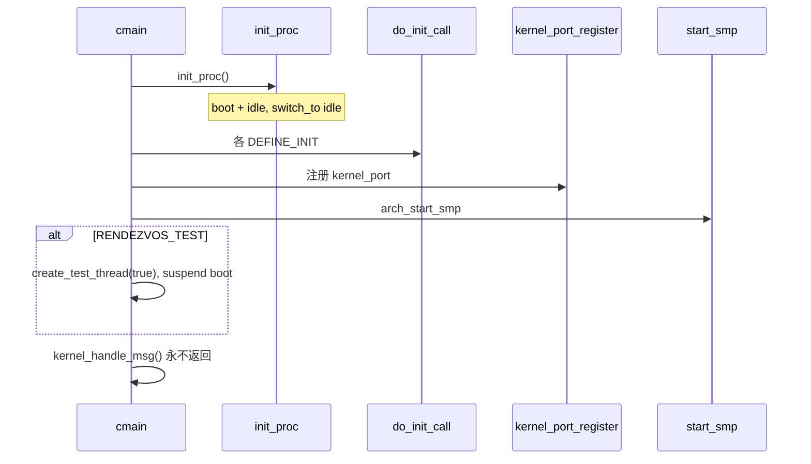

# 模块初始化与内核入口

v0.1 · 2026-08-26

本篇覆盖：`include/rendezvos/task/initcall.h`、`kernel/task/thread_boot.c`、`kernel/task/task_manager.c`、`kernel/system/main.c`、`modules/helloworld/helloworld.c`、`include/modules/helloworld/helloworld.h`。

`cmain` 之前的阶段见 `01-启动与初始化/启动流程总览.md`；线程创建 API 细节见 `03-任务与调度/线程与Task_Manager.md`；port 与 boot IPC 见 `04-IPC/Port与消息模型.md`。

---

## 1. 概述

RendezvOS core 在 BSP 上完成内存与 per-CPU 基础初始化后，通过 `init_proc()` 建立本核 Task_Manager、boot 线程与 idle 线程，再调用 `do_init_call()` 执行链接段中登记的模块 init 函数，注册内核 listen port，启动 SMP，最后 BSP 的 boot 线程进入 `kernel_handle_msg()` 无限 recv 循环。测例或兼容层 server 通常在 `DEFINE_INIT` 或 `RENDEZVOS_TEST` 路径里创建额外线程。

本篇说明 initcall 机制、boot/idle 的特殊性、内核 port 与入口循环，以及 helloworld / 测例如何挂接。

---

## 2. 目标与边界

core 提供 **initcall 框架**（链接器段 + `do_init_call`）和 **最小可调度环境**（boot + idle + round-robin）。不在 core 内规定「必须有哪些 server」；`modules/` 下测例与 `helloworld` 是示例，兼容层通过同样机制注册 init。

core 不做：解析完整内核命令行参数表（cmdline 仅早期打印）；在 `cmain` 里调用 `main_init()`（声明在 `common.h`，由链接方 `.o` 实现）；为用户态 init 进程做 ELF 加载（那是 `gen_thread_from_elf` 与兼容层 loader 的事）。

---

## 3. 分层与调用方

**core 模块** — 在任意 `.c` 中使用 `DEFINE_INIT(fn)`，在 `fn` 里创建内核线程、注册 port 等。须假设：`percpu(core_tm)`、`global_port_table`、`kallocator` 已就绪；**AP 尚未全部 online**（`do_init_call` 在 BSP 上早于 `start_smp` 完成）。

**链接方集成** — 实现 `main_init()`（若使用）、`kernel_set_ipc_handler` 等；`main_init` **不由 core `cmain` 调用**（见 `00-总览/架构与源码布局.md` §6.3）。兼容层/server 的 `DEFINE_INIT` 经 `EXTRA_OBJECTS` 同镜像链接后，与 core init 一并由 `do_init_call()` 遍历。

**测例** — `RENDEZVOS_TEST` 时 `create_test_thread` 在 BSP/AP 各建测试内核线程；与 initcall 独立。仅 core 构建时在 core json 默认开启；集成构建时链接方常用 `OVERRIDE_CFLAGS` 关闭（见 `00-总览/构建与链接.md` §9）。

调用方 init 函数中创建 server 线程的典型写法：`gen_thread_from_func(..., percpu(core_tm), ...)` 或跨核 `task_manager_for_cpu(cpu)`（见 CPU 亲和性篇）。

---

## 4. 数据结构与不变量

### 4.1 Initcall

```c
typedef struct {
        void (*init_func_ptr)(void);
} Init_Info;
extern Init_Info _s_init, _e_init;
```

- `DEFINE_INIT(fn)` → 放入 `.init.call.3` 段。
- `DEFINE_INIT_LEVEL(fn, level)` → `.init.call.<level>`，level 0–9。
- 链接脚本（如 `script/link/x86_64_linker.ld`）按 **0→9** 顺序排列各 level，再 `_s_init`…`_e_init` 线性遍历。

**不变量：** init 函数无参数、无返回值约定；不得依赖 AP 已执行 `do_init_call`（除非自行等待 `all_enabled` 之类，core 未提供标准 API）。同一 level 内顺序由链接顺序决定，跨编译单元不可假定。

### 4.2 Task_Manager 与 boot / idle

- `DEFINE_PER_CPU(Task_Manager*, core_tm)` — 每核一个调度器。
- `boot_thread_ptr` / `idle_thread_ptr` — per-CPU 指针。
- **boot 线程**：`new_thread_structure` 创建，`thread->vs == NULL`，`kstack_bottom = percpu(boot_stack_bottom)`（非 kmalloc 栈），不设 `THREAD_FLAG_USER`。
- **idle 线程**：`gen_thread_from_func` + `&root_vspace`，循环 `schedule(core_tm)`。

`init_proc` 结束时：`current_thread = idle`，boot 为 ready，用 `switch_to(boot_ctx, idle_ctx)` 把 **执行流** 切到 idle，但 boot 在调度环上可被选中。

### 4.3 内核 port

- 名：`KERNEL_PORT_NAME`（`"kernel_port"`）。
- `kernel_port_register()` — BSP、`do_init_call` 之后创建并 `register_port`，随后 `ref_put`（表仍持有 ref）。
- `kernel_handle_msg()` — boot 线程 `thread_lookup_port` → 阻塞 `recv_msg` → `dequeue_recv_msg` → 可选 `boot_thread_ipc_handler`。

---

## 5. 代码对应

| 文件 | 职责 |
|------|------|
| `initcall.h` | `DEFINE_INIT`、`do_init_call` |
| `thread_boot.c` | `init_proc`、`create_boot_thread`、`create_idle_thread`、`kernel_port_register`、`kernel_handle_msg`、`add/del_thread_from_manager` |
| `task_manager.c` | `new_task_manager`、`round_robin_schedule`、`schedule` |
| `main.c` | `cmain` 编排：`init_proc` → `do_init_call` → `kernel_port_register` → `start_smp` → 测例/boot 循环 |
| `helloworld.c` | `hello_world()` 打印；由 `HELLO` 宏在 `cmain` 早期直接调用，**非** initcall |
| `kernel/smp/smp.c` | AP 上再次 `do_init_call`、`init_proc`、`kernel_handle_msg` |

v0.1 的 `core/` 树内尚无除测例外的 `DEFINE_INIT` 使用示例；兼容层在链接镜像中通过同样机制注册 init（具体目录结构由集成方决定）。

---

## 6. 流程

### 6.1 BSP 上 cmain 后半段



### 6.2 init_proc 内部

1. `new_task_manager()` — 初始化 sched 环、`owner_cpu`、round-robin。
2. `create_boot_thread()` — 当前 BSP 执行流作为 boot 线程实体登记。
3. `create_idle_thread()` — 内核 idle。
4. 设置状态并 `switch_to` 到 idle 上下文。

失败时按标签释放 boot 结构与 Task_Manager。

### 6.3 AP 路径（SMP）

`arch_start_smp` 启动 AP 后，AP 汇编入口调用 `start_secondary_cpu`（`kernel/smp/smp.c`）：

1. `virt_mm_init` / `arch_start_core`（无 `prepare_arch` / `phy_mm_init` 重复）。
2. `init_proc()` — 每 AP 自有 boot/idle。
3. 自旋至 `all_enabled == SUCC`（BSP 的 `start_smp` 末尾设置）。
4. **`do_init_call()` 再次执行** — 每个 AP 都会跑一遍所有 init 函数；init 作者须幂等或仅在本核创建资源。
5. 可选 `create_test_thread(false)`。
6. **`kernel_handle_msg()`** — 与 BSP 相同，每 AP boot 线程各跑 IPC 循环。

### 6.4 helloworld 与测例

- **`#ifdef HELLO`**：`cmain` 在 `log_init` 后调用 `hello_world()`，与 initcall 无关。
- **`#ifdef RENDEZVOS_TEST`**：`create_test_thread(true)` 在 BSP 上创建 `BSP_test` 内核线程；`thread_set_status(boot, suspend)` 让 boot 暂不参与调度，测例跑完后可 `rendezvos_request_poweroff`。

---

## 7. 公开 API

**Initcall**

```c
#define DEFINE_INIT(func_ptr)
#define DEFINE_INIT_LEVEL(func_ptr, level)
static inline void do_init_call(void);
```

**Boot / 入口**

```c
Task_Manager* init_proc(void);
error_t kernel_port_register(void);
error_t kernel_handle_msg(void);
void kernel_set_ipc_handler(boot_thread_ipc_handler_fn handler);
error_t add_thread_to_manager(Task_Manager* tm, Thread_Base* thread);
error_t del_thread_from_manager(Thread_Base* thread);
```

**链接方声明（实现不在 core 树）**

```c
void main_init(void);  /* common.h */
```

**测例**

```c
error_t create_test_thread(bool is_bsp_test);  /* modules/test/test.h */
```

模块 init 内创建线程见 `gen_thread_from_func`（`thread_loader.h`）。

---

## 8. 多架构

initcall 段布局各 arch 链接脚本一致（`.init.call.0`…`.init.call.9`）。boot 栈来源不同：x86 BSP 用链接脚本 `boot_stack`；aarch64 用 `boot.S` 中 `boot_stack`；AP 栈由 `arch_start_smp` 里 `kallocator` 分配 16 页。`init_proc` / `do_init_call` 逻辑与 ISA 无关。

---

## 9. 测试

在 `core/` 内启用 `RENDEZVOS_TEST` 后 `make ARCH=x86_64 config && make all && make run`（或 aarch64）可覆盖 init 后测例线程。无专门只测 initcall 顺序的单测。本篇与当前源码一致，尚未单独复测。

---

## 10. 限制与后续

- AP 重复 `do_init_call` 易 double-register；链接方 init 应 guard 或 per-CPU 分支。
- 每 AP 均进入 `kernel_handle_msg`，链接方 handler 需考虑多核 recv 语义。
- `main_init()` 未在 core `cmain` 调用，链接方须自行保证调用点（若使用）。
- init level 细粒度依赖链接顺序，缺运行时依赖声明。

---

## 11. 变更记录

- 2026-08-26：v0.1 初稿，initcall、boot/idle、内核入口与 AP 二次 init。
- 2026-08-27：与总览对齐：链接方/init、`main_init` 调用点、`RENDEZVOS_TEST` 与集成构建。
