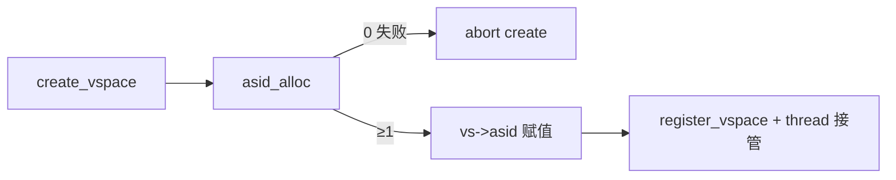

# ASID 与地址空间标识

v0.1 · 2026-08-26

本篇覆盖：`kernel/mm/asid.c`、`include/rendezvos/mm/asid.h`、`include/arch/x86_64/mm/asid.h`、`include/arch/aarch64/mm/asid.h`。

TLB 按 ASID shootdown 见 `TLB与缓存一致性.md`；schedule 安装 TTBR+ASID 见 `03-任务与调度/VSpace所有权与调度切换.md`。

---

## 1. 概述

**ASID**（Address Space ID）在支持它的架构上标识 TLB 中的用户地址空间，避免每次切换 VSpace 都 flush 全 TLB。aarch64 v0.1 **使用** ASID：分配、写入 TTBR0、TLBI 按 ASID 失效。**x86_64** 当前 `arch_asid_supports_16bit()` 为 true 但 **CR3 切换不携带 ASID 语义**，`arch_tlb_invalidate_vspace_page` 等忽略 asid 参数或全 flush。

core 在 `asid.c` 维护 **全局 bitmap 分配器**；`VSpace::asid` 在 `create_vspace` 时分配，`del_vspace` 时 `asid_free`。

---

## 2. 目标与边界

core 提供：`asid_init`、`asid_alloc`、`asid_free`、`asid_get_max`；ASID **0 保留**（表示无效/boot）。

core 不做：ARM 架构下 ASID rollover 代际（generation）防 stale TLB；某 OS 式地址空间 ID 与 CPU 绑定的进一步优化。

---

## 3. 分层与调用方

- **`alloc_user_vs_structure`（vmm.c）** — `asid_alloc()`；失败则 destroy 半成品 VSpace。
- **`schedule`** — `arch_set_current_user_vspace_root_asid(root, new_vs->asid)`（aarch64 有效）。
- **`del_vspace`** — `asid_free(vspace->asid)`。
- **TLB invalidate** — aarch64 `tlbi` 指令带 `(asid << 48) | VA`。

调用方不应手动改 `vs->asid` 或复用已分配 ASID。

---

## 4. 数据结构与不变量

- **`asid_t`** — 通常 u16；bitmap 大小 `U16_MAX+1` 位。
- **`asid_max`** — `asid_init` 时设为 `U16_MAX`（16-bit ASID）或 `U8_MAX`（8-bit），由 `arch_asid_supports_16bit()` 决定。
- **锁** — 全局 `asid_lock` + per-CPU MCS `asid_mcs_node`。
- **ASID 0** — 初始化时 permanently set；`asid_alloc` 从 1 扫描。

**不变量：** 每个 live user `VSpace` 持有唯一 asid（直到 free）；已 free 的 asid 可再分配（v0.1 无 generation，依赖 teardown 前 TLB mask 归零）。

---

## 5. 代码对应

| 文件 | 职责 |
|------|------|
| `asid.c` | bitmap 分配/释放 |
| `asid.h` | 公共 API、include arch |
| `arch/aarch64/mm/asid.h` | 读 ID_AA64MMFR0 判断是否 16-bit ASID |
| `arch/x86_64/mm/asid.h` | stub：`arch_asid_supports_16bit()` 恒 true |
| `vmm.c` | create/del 路径调用 alloc/free |

---

## 6. 流程

### 6.1 启动

BSP `virt_mm_init` → `asid_init()`（BSP 路径在 `init_root_vspace` 前后，见 `vmm.c` 中 `asid_init()` 调用点）。

### 6.2 创建用户 VSpace



### 6.3 调度切换（aarch64）

`schedule` 选中 user 线程 → 写 TTBR0 物理根 + **ASID** → 后续该 CPU 的 user TLB 项带 ASID tag。

### 6.4 销毁

`del_vspace` → 清 user 映射、radix delete → **`asid_free(asid)`** → 释放 VSpace 结构。

---

## 7. 公开 API

```c
void asid_init(void);
asid_t asid_alloc(void);   /* 0 = 耗尽 */
void asid_free(asid_t asid);
asid_t asid_get_max(void);

/* arch */
bool arch_asid_supports_16bit(void);
```

`VSpace::asid` 字段见 `vmm.h`。

---

## 8. 多架构

| 项目 | aarch64 | x86_64 |
|------|---------|--------|
| HW ASID | TTBR0 ASID | 无（PCID 未用） |
| alloc 意义 | TLB 标签 | 字段存在，TLB API 多忽略 |
| 16-bit | 依 ID_AA64MMFR0 | N/A |
| boot 启用 | `init_mmu` 可开 TCR.AS | — |

riscv/loongarch 头文件未纳入 v0.1 ASID 行为说明。

---

## 9. 测试

间接通过 nexus/vmm 与 SMP 运行测例。无专用 asid 耗尽测试。本篇与当前源码一致，尚未单独复测。

---

## 10. 限制与后续

- 无 ASID generation；快速 alloc/free 循环依赖 TLB shootdown 纪律。
- x86 未启用 PCID；切换 CR3 成本较高。
- 耗尽时 `asid_alloc` 返回 0，`create_vspace` 失败。

---

## 11. 变更记录

- 2026-08-26：v0.1 初稿，ASID 分配器与 schedule/TLB 关系。
