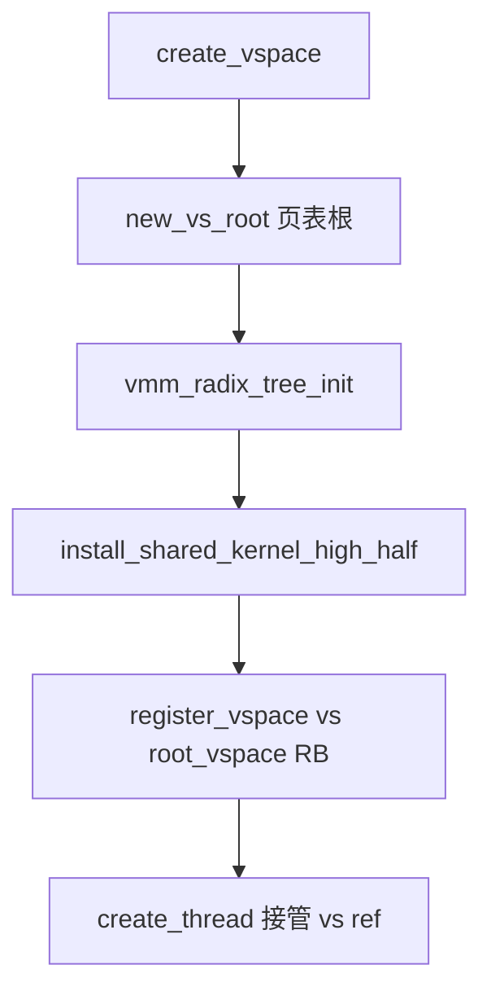

# Radix 树与用户映射

v0.1 · 2026-08-26

本篇覆盖：`kernel/mm/vmm_radix_tree.c`、`kernel/mm/mm_user_utils.c`、`include/rendezvos/mm/vmm_radix_tree.h`、`include/rendezvos/mm/mm_user_utils.h`。

`register_vspace` / `create_vspace` / `clone_vspace` 的 VSpace 对象语义见 `core/docs/v0.1/full/02-内存管理/虚拟地址空间与页表.md`；`map()` / `Map_Handler` 见同目录与 `map_handler` 相关说明；TLB 与 `tlb_cpu_mask` 见 `06-SMP与同步/TLB_shootdown与跨核一致性.md`。port 用的字符串 `name_index` 与 vspace 注册无关，见 `10-基础设施/名称索引注册表.md`。

---

## 1. 概述

每个用户 `VSpace` 在 `vs->root_radix` 上挂一棵四级 radix 树（512 路，与页表层级 L0–L3 索引对齐），作为 **用户虚拟地址元数据的真源**：某段 VA 是否保留、是否已绑定物理页、shadow flags、reverse map 链等都以 radix 为准；硬件页表由 `map()` / `unmap()` 在 `Map_Handler` 下维护，须与 radix 在同一锁契约内一致更新。

`mm_user_utils_*` 是把 radix、PTE、PMM 按固定顺序编排的高层模板（分配并映射一段连续 VA、lazy 填单页、拆映射、改 flags、单页 remap）。调用方在进 utils 前必须已持有 **L0 大范围锁**；utils 内部只再取 **L2  band 锁**。内核堆路径直接对 `root_vspace` 调 radix API，**不得**调 `mm_user_utils_*`（实现会拒绝 `&root_vspace`）。

---

## 2. 目标与边界

core 提供的是「可证明顺序与 rollback 的 VM 原语」，不是用户态 mmap/brk 类语义（由兼容层定义）。兼容层负责：何时 `clone_vspace`、COW 策略、VMA 等价物、fault 里区分 demand-zero 与 COW 写 fault。

core 不做：独立 Nexus/VMA 子系统（已移除；VA 真源就是 radix）；在 utils 里隐藏多段稀疏 VA  walk（ orchestrator 须用 `vmm_radix_tree_find_first_occupied_interval` 分段调用）；对 `root_vspace` 的用户低半区操作（utils 专用于普通用户 AS）。

---

## 3. 分层与调用方

**创建地址空间** — `create_vspace` → `vmm_radix_tree_init` + 安装共享内核高半 → `register_vspace(vs, &root_vspace)`（RB 树登记，键为 `vspace_root_addr`）→ 把 live ref 交给线程（见 VSpace 所有权篇）。

**显式映射** — loader、syscall 层或 fork 逻辑：先 `vmm_radix_tree_lock_range_big(vs, va_start, va_end)`，可用 `find_first_occupied_interval` 找同 flags 子区间，再 `mm_user_utils_set_range_and_fill` 或 `set_range_flags` 等，最后 `unlock_range_big`。

**Demand paging** — 用户线程触发 `TRAP_CLASS_PAGE_FAULT`；core 在 arch trap 里填充 `trap_info`（fault 地址、读/写/执行）。兼容层注册的 fixed handler 在确认叶节点为 LAZY 后，持 L0 调 `mm_user_utils_fill_page_with_exist_range`。COW 写 fault 通常走 `mm_user_utils_remap_page` 或专用 clone 路径，不由 fill 隐式完成。

**Teardown** — `vspace_clear_user_mappings` / `del_vspace` 先 `vmm_radix_tree_clean_user`，再释放用户页表根；须满足 TLB mask 契约（VSpace 篇）。

---

## 4. 数据结构与不变量

### 4.1 树结构（`vmm_radix_tree.h`）

- **L0 / L1 / L2** — 各为一页 `Radix_entry_t[512]`；entry 字打包 CAS 锁位、VALID、子占用计数、子表内核 VA。
- **L3** — 每 L2 行 512 个 `Radix_node_t`（每用户页槽 32 字节）：`flags`（与 PTE 词汇一致，含 `PAGE_ENTRY_LAZY` / `VALID`）、`rmap_list`、`owner`（低半用户 AS 为 `vs`，高半共享槽为 `root_vspace`）。
- **半开区间** — API 使用 `[base, end)`，`end` 为覆盖区段后第一字节。

### 4.2 锁层级

| 层级 | API 示例 | 作用 |
|------|----------|------|
| L0 big | `vmm_radix_tree_lock_range_big` | 串行进入该 VA -span 上的 radix 树操作；支持 interval 扫描 |
| L2 small | `lock_range_small_with_big_locked` | 单条 2 MiB band 上的 INSERT/DELETE/bind/change |
| 多 band | 升序 acquire L2、降序 release | 不变量 I6 |

`mm_user_utils_*` **假定 L0 已由调用方持有**；函数内只 acquire/release L2。违反顺序（未持 L0 调 utils、持 L2 时再嵌套重叠 L2 acquire）可能死锁或破坏 I3/I6。

### 4.3 Radix 操作种类 `radix_lock_acquire_kind_t`

- **INSERT** — `insert_range`：预留 LAZY 叶，增长路径；与已有可插入区间重叠则失败。
- **DELETE** — 删除元数据；VALID 叶须先 unbind。
- **QUERY_OR_CHANGE** — bind/unbind、改 PPN/flags、query。

推荐顺序见 `vmm_radix_tree.h` 文件头「Recommended call order」：init → insert_range → map PTE → leaf_bind → … → leaf_unbind → clean_user → delete。

### 4.4 register_vspace（与 name_index 区分）

`register_vspace` 把用户 `VSpace` 插入 `root_vspace` 的红黑树，键为 **`vspace_root_addr`（页表根物理/安装地址）**，用于内核侧枚举/调试遍历，**不是** IPC port 那种字符串 `name_index`。`vs->registered` 与 `vs->root_vs` 在成功 insert 后设置；`unregister_vspace` 在 `free_vspace_ref` 路径上调用。

---

## 5. 代码对应

| 文件 | 职责 |
|------|------|
| `vmm_radix_tree.h` | 数据结构、锁 API、insert/bind/change/clean/destroy 声明与 I0–I7 注释 |
| `vmm_radix_tree.c` | radix 实现（~8k 行）：grow、range lock、rmap 与 PMM zone 协作 |
| `mm_user_utils.h` | 编排契约与五个对外 entry point |
| `mm_user_utils.c` | PMM alloc + radix INSERT + `map()` 循环 + bind + 失败 rollback |
| `vmm.c` | `create_vspace`、`clone_vspace`、`register_vspace`、`vspace_clear_user_mappings` 调用 radix |

`map_handler.c` 提供 `map`/`unmap`/`have_mapped`；本篇不展开 PTE 格式（见虚拟地址空间篇）。

---

## 6. 流程

### 6.1 新用户 AS 与共享高半



`install_shared_kernel_high_half` 让 L0[256..511] 指向与 `root_vspace` 共享的内核映射元数据（I5）；用户低半 L0[0..255] 的 `owner` 为各自 `vs`。

### 6.2 连续映射：`mm_user_utils_set_range_and_fill`

在 **已持 L0** 的前提下：

1. L2 + `RADIX_RL_INSERT` → `insert_range`（整段不得与已有 insertable 重叠）。
2. buddy 分配连续物理页（仅映射 `page_count` 页，多余页立即归还）。
3. 对每页 `map()` 安装 PTE。
4. `leaf_bind_range`：LAZY → VALID，挂 rmap。
5. 释放 L2；在 **内核映射窗口** 内 zero-fill（`map_handler_zero_page`，不对用户 VA 直接 `memset`）。

失败时：unmap 前缀、radix DELETE、释放 PMM。

### 6.3 Lazy fault：`mm_user_utils_fill_page_with_exist_range`

前置：fault VA 对应叶已存在且为 **LAZY、非 VALID**（通常由先前 `insert_range` 或 clone 预留）。

1. 调用方持 L0 覆盖该页所在 span。
2. utils 内 L2 acquire → 分配单页 → map → bind → unlock L2 → zero。

兼容层 page fault handler 典型步骤：`arch_populate_trap_info` → 判定 `TRAP_CLASS_PAGE_FAULT` 与用户态 → 取 `current_thread->vs` → L0 lock → fill → L0 unlock → 返回用户态。COW 与权限违例不在此函数内自动处理。

### 6.4 clone_vspace（概要）

`clone_vspace` 在 src 上 **L0 锁全用户范围**，循环 `find_first_occupied_interval`，按 flags 选择 COW prep 或 copy pages，对 dst 调用相应 radix/utils 路径；注释强调 L0 与 L2 窗口模型——clone 在 interval walk 中会等待 L2 释放。细节与 flag 组合见 `vmm.c` 与虚拟地址空间篇。

### 6.5 拆除与 destroy

- **单段用户_unmap**：`mm_user_utils_clean_range_and_unfill`（unbind → unmap → DELETE → pmm_free）。
- **整 AS 用户部**：`vmm_radix_tree_clean_user` + `vspace_free_user_pt`（`del_vspace` / exec 清空）。
- **整树**：`vmm_radix_tree_destroy` / `delete` 在 `Map_Handler` 配合下释放 L0 元数据页。

---

## 7. 公开 API

### Radix（节选，完整列表见头文件）

```c
bool vmm_radix_tree_init(struct map_handler* h, VSpace* vs);
error_t vmm_radix_tree_insert_range(VSpace* vs, vaddr start, vaddr end,
                                    ENTRY_FLAGS_t leaf_flags, ...);
error_t vmm_radix_tree_leaf_bind_range(VSpace* vs, vaddr start, vaddr end,
                                       ppn_t ppn_first, ...);
error_t vmm_radix_tree_lock_range_big(VSpace* vs, vaddr start, vaddr end);
error_t vmm_radix_tree_unlock_range_big(VSpace* vs, vaddr start, vaddr end);
error_t vmm_radix_tree_find_first_occupied_interval(VSpace* vs, ...);
error_t vmm_radix_tree_clean_user(struct map_handler* h, VSpace* vs);
error_t vmm_radix_tree_destroy(struct map_handler* h, VSpace* vs);
```

### mm_user_utils

```c
vaddr mm_user_utils_set_range_and_fill(struct VSpace* vs, vaddr range_start,
                                       size_t page_count, ENTRY_FLAGS_t flags);
error_t mm_user_utils_fill_page_with_exist_range(struct VSpace* vs,
                                                 vaddr page_va,
                                                 ENTRY_FLAGS_t leaf_flags);
error_t mm_user_utils_clean_range_and_unfill(struct VSpace* vs,
                                             vaddr range_start,
                                             size_t page_count,
                                             ppn_t ppn_first);
error_t mm_user_utils_remap_page(struct VSpace* vs, vaddr page_va,
                                 ppn_t new_ppn, ENTRY_FLAGS_t new_flags,
                                 ppn_t expect_old_ppn);
error_t mm_user_utils_set_range_flags(struct VSpace* vs, vaddr range_start,
                                      u64 length_bytes,
                                      mm_user_range_flags_mode_t mode,
                                      ENTRY_FLAGS_t set_mask,
                                      ENTRY_FLAGS_t clear_mask);
```

### VSpace 注册（`vmm.h`，本篇仅引用）

```c
error_t register_vspace(VSpace* vs, VSpace* root_vs);
error_t unregister_vspace(VSpace* vs);
VSpace* create_vspace(struct pmm* pmm);
error_t clone_vspace(VSpace* src, VSpace** dst, enum vspace_clone_flags flags);
```

### Page fault 钩子（core）

```c
void register_fixed_trap(enum trap_class trap_class,
                         void (*handler)(struct trap_frame* tf), u64 attr);
/* TRAP_CLASS_PAGE_FAULT — 见 include/rendezvos/trap/trap.h */
```

---

## 8. 多架构

Radix 与 utils 架构无关；`map()` / PTE / TLB shootdown 由 `arch/*/mm/` 与 `Map_Handler` 实现。x86_64 与 aarch64 为 v0.1 主路径；`USER_SPACE_TOP` 与 canonical VA 策略由 `common/mm.h` 与 arch 头定义。ASID 仅 aarch64 用户 AS 切换使用（见 ASID 篇）。

---

## 9. 测试

`modules/test/single_nexus_test.c`、`single_arch_vmm_test.c`、`smp_nexus_test.c` 等（历史名 nexus，现实现为 vmm_radix_tree）覆盖 radix 与映射。在 `core/` 内 `make ARCH=x86_64 config && make all && make run`（须 `RENDEZVOS_TEST`）。本篇与当前源码一致，尚未单独复测。

---

## 10. 限制与后续

- 单段 utils 不做稀疏多洞合并；复杂 mmap 由兼容层 interval walk 组合多次调用。
- `clone_vspace` 与并发 radix 修改的窗口依赖 L0/L2 纪律；违反 INVARIANTS 可能导致死锁或树损坏。
- 高半共享叶的 `owner` 规则（I5）要求 DELETE 只清属于 caller 的叶。
- NUMA / 多 zone 路由仍在 `VSpace::pmm` 演化中（见 `v0.1/evolution/TODO.md` E1）。

---

## 11. 变更记录

- 2026-08-26：v0.1 初稿；radix 真源、L0/L2 锁、`mm_user_utils_*` 与 fault 协作。
