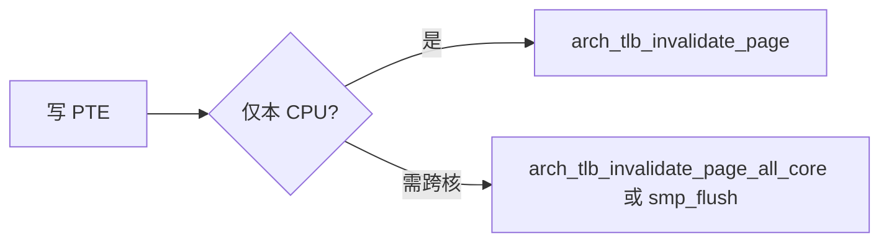

# TLB 与缓存一致性

v0.1 · 2026-08-26

本篇覆盖：`include/rendezvos/mm/tlb_cpu_mask.h`、`include/arch/x86_64/sync/tlb.h`、`include/arch/aarch64/sync/tlb.h`、`include/arch/x86_64/sync/cache.h`、`include/arch/aarch64/sync/cache.h`、`arch/x86_64/mm/arch_smp_tlb_flush.c`。

`VSpace::tlb_cpu_mask` 语义与 schedule 维护见 `03-任务与调度/VSpace所有权与调度切换.md`；`map()` 内 invalidate 见 `虚拟地址空间与页表.md`。

---

## 1. 概述

修改 PTE 或切换 ASID/CR3 后，其他 CPU 的 TLB 可能仍缓存旧翻译。core 用两层机制协作：

1. **`vs_tlb_cpu_mask`** — 记录「哪些 CPU 近期在该 VSpace 上运行过用户 AS」，供 unmap/shootdown 选 IPI 目标。
2. **arch TLB API** — 本地 `invlpg` / `tlbi`；跨核 `arch_smp_flush_*`（x86 IPI + 回调；aarch64 目前多使用 IS 变体广播）。

cache 头文件提供屏障与 cache maintenance 原语，供 arch 与 device 路径使用。

---

## 2. 目标与边界

core 保证：`map()`/`unmap()` 在修改 **当前 CPU** 相关 PTE 后做适当本地 flush；对仍在 mask 中的远程 CPU，`map_handler` 在需要时调用 **all_core** 变体或 SMP flush。

core 不做：完整 TLB range flush 的高层 mm 语义（由兼容层在其 fault/unmap 路径中组合 core 原语）；lazy TLB shootdown 批处理优化。

---

## 3. 分层与调用方

- **schedule** — 切入 user AS：set mask；切走：clear 本 CPU 位 + 本地 invalidate ASID/全 TLB（x86 见下）。
- **map_handler** — 改 user PTE：`arch_tlb_invalidate_page(vs->asid, v)` 或 kernel 页用 `arch_tlb_invalidate_kernel_page`；若需跨核，查 `vs->tlb_cpu_mask` 调 `*_all_core` 或 `arch_smp_flush_page_tlb`。
- **del_vspace / vspace_clear_user_mappings** — 要求 mask 归零（除 in-place exec 特例外），否则 `-E_REND_RC_UNEQUAL`。

兼容层 unmap 用户区前应保证无并发 runnable 或使用 IPI 路径清 mask。

---

## 4. 数据结构与不变量

### 4.1 vs_tlb_cpu_bitmap_t

```c
#define VS_TLB_CPU_MASK_BITS RENDEZVOS_MAX_CPU_NUMBER
BITMAP_DEFINE_TYPE(vs_tlb_cpu_bitmap_t, VS_TLB_CPU_MASK_BITS);
```

inline：`vs_tlb_cpu_mask_set/clear/is_zero`（`vmm.h`）。更新时在 `tlb_cpu_mask_lock`（CAS）下与 schedule 配合。

### 4.2 不变量

- 对 **del_vspace**：通常要求 `tlb_cpu_mask == 0`（全系统无 stale TLB owner）。
- **allow_self_use**（exec 原地清映射）：允许本 CPU 仍置位，远程须 clear。
- reclaim/IPI 回调内禁止阻塞持锁跨 schedule（见 AI_CHECKLIST）。

---

## 5. 代码对应

| 文件 | 职责 |
|------|------|
| `tlb_cpu_mask.h` | bitmap 类型定义 |
| `arch/x86_64/sync/tlb.h` | invlpg、IPI flush 声明 |
| `arch/aarch64/sync/tlb.h` | tlbi vaae/aside/alle1 等 |
| `arch_smp_tlb_flush.c` | x86 SMP TLB shootdown IPI 处理 |
| `cache.h` | wbinvd/clflush 或 dsb/缓存维护（arch） |
| `map_handler.c` | map/unmap 后调用 arch invalidate |

---

## 6. 流程

### 6.1 schedule 切换 user AS（摘要）

切 **入** new_vs：mask set 本 CPU → 装 CR3/TTBR+ASID。  
切 **出** old_vs（user→user）：本地 invalidate old ASID → mask clear 本 CPU → `ref_put` CPU 侧 ref。

切 **出** 到 kernel 线程：**不**清 mask、不 invalidate（延迟到下次 user→user）。

### 6.2 map 单页（user）



x86 **user vspace** 的 `arch_tlb_invalidate_vspace_page(asid, addr)` 当前实现为 **整表 invlpg 等价**（`arch_tlb_invalidate_all`），粗粒度；unmap 大规模时依赖 mask + IPI。

aarch64：`tlbi aside1`（按 ASID 整空间）或 `vae1`（单 VA+ASID）。

### 6.3 x86 SMP IPI

`arch_smp_flush_tlb_init` 注册 IPI handler；`arch_smp_flush_page_tlb(addr, mask)` 向 mask 中 CPU 发 IPI，远程执行 local invalidate。

---

## 7. 公开 API

```c
/* vmm.h inline */
void vs_tlb_cpu_mask_set(VSpace* vs, cpu_id_t cpu);
void vs_tlb_cpu_mask_clear(VSpace* vs, cpu_id_t cpu);
bool vs_tlb_cpu_mask_is_zero(const VSpace* vs);

/* arch/x86_64/sync/tlb.h 等 */
void arch_tlb_invalidate_page(u64 asid, vaddr addr);
void arch_tlb_invalidate_vspace_page(u64 asid, vaddr addr);
void arch_tlb_invalidate_page_all_core(u64 asid, vaddr addr,
                                       const vs_tlb_cpu_bitmap_t* cpu_mask);
void arch_smp_flush_page_tlb(vaddr addr, const vs_tlb_cpu_bitmap_t* cpu_mask);
void arch_smp_flush_all_tlb(const vs_tlb_cpu_bitmap_t* cpu_mask);
void arch_smp_flush_tlb_init(void);
```

aarch64 无独立 `arch_smp_flush*.c` 于 v0.1 树时，跨核多用 `tlbi *is`  Inner Shareable 指令（见 `tlb.h`）。

---

## 8. 多架构

| 行为 | x86_64 | aarch64 |
|------|--------|---------|
| 用户单 VA | invlpg | tlbi vae1 |
| 用户整 AS | 当前 ≈ 全 TLB flush | tlbi aside1 |
| 内核临时 map 槽 | invlpg KVA | tlbi vaale1 |
| ASID 参与 | 否（CR3 全换） | 是（TTBR0+ASID） |
| 跨核 | IPI + handler | tlbi IS 变体 |

---

## 9. 测试

SMP 测例中间接触发 TLB 路径；无独立 tlb 单元测试。本篇与当前源码一致，尚未单独复测。

---

## 10. 限制与后续

- x86 `arch_tlb_invalidate_vspace_page` 粗粒度 flush 可能影响性能。
- user→idle 不 shrink mask，依赖后续 user 切换清理。
- cache 与 DMA 一致性由设备驱动与 arch 屏障承担，本篇不展开。

---

## 11. 变更记录

- 2026-08-26：v0.1 初稿，tlb_cpu_mask 与 arch shootdown 钩子。
