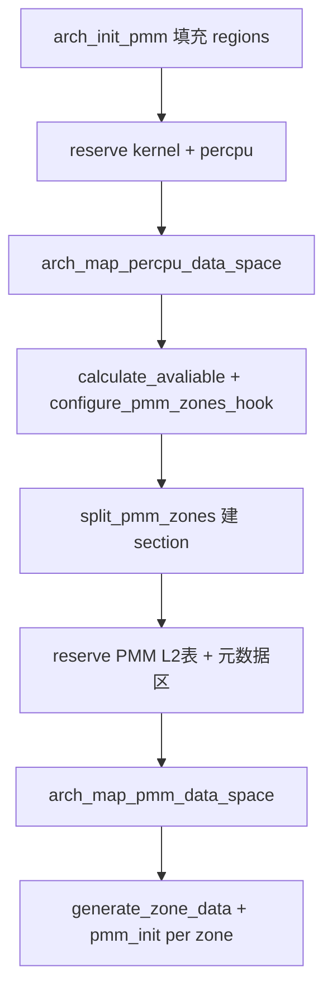

# 物理内存与 Buddy 分配器

v0.1 · 2026-08-26

本篇覆盖：`kernel/mm/pmm.c`、`kernel/mm/buddy_pmm.c`、`include/rendezvos/mm/pmm.h`、`include/rendezvos/mm/buddy_pmm.h`、`arch/x86_64/mm/pmm.c`、`arch/aarch64/mm/pmm.c` 及对应 arch 头文件（riscv64/loongarch 仅占位头）。

虚拟映射与 `map()` 见 `02-内存管理/虚拟地址空间与页表.md`；radix 用户路径见 `Radix树与用户映射.md`。

---

## 1. 概述

RendezvOS 物理内存由 **memory_regions**（平台提供的可用 RAM 区间）经启动期保留（内核、per-CPU、PMM 元数据、ACPI 等）后，划分为若干 **MemZone**，每 zone 绑定一个 `struct pmm` 实现。v0.1 默认仅 **ZONE_NORMAL**，后端为 **buddy** 分配器（最大 order 10，即 2¹⁰ 页 = 2 MiB 块）。

`phy_mm_init()` 在 `cmain` 中于虚拟内存子系统之前运行，完成区域保留、zone 配置、PMM 数据结构映射与 buddy 初始化。

---

## 2. 目标与边界

core 提供：页帧分配/释放、每页 `Page::ref_count`、zone 级 MCS 锁、可选 **reclaim hook**（分配失败时同步回调，由兼容层释放页回 buddy）。

core 不做：swap、NUMA 自动迁移、某 OS 的内存 zone 分类语义（若兼容层沿用 DMA32/DirectMap 等名称，仅为兼容命名，不等同于 core 分区）；OOM kill 策略（reclaim 回调仅返回是否重试）。

---

## 3. 分层与调用方

- **arch `arch_init_pmm`** — 从 Multiboot/DTB 填充 `m_regions`，保留 arch 专有区（x86 RSDP 等）。
- **`configure_pmm_zones_hook`** — weak 符号；平台可在链接时用 **strong 符号** 覆盖，设置 `nr_mem_zones` 与各区 `[lower, upper)`、`pmm` 指针（须为静态 `struct buddy` 等）。
- **`pmm_alloc` / `pmm_free`** — `map_handler`、`kmalloc` 整页路径、`mm_user_utils` 等调用。
- **`pmm_set_reclaim_hook`** — 兼容层注册同步 reclaim；回调 **不得** 在持锁时调用 `pmm_alloc`。

---

## 4. 数据结构与不变量

### 4.1 memory_regions 与 MemZone

- `struct region { paddr addr; u64 len; }` 数组，最多 `RENDEZVOS_MAX_MEMORY_REGIONS`。
- `memory_regions_reserve_region` — 从某 region 扣掉 `[phy_start, phy_end)`（可分裂 region）。
- `MemZone` — `lower_addr`/`upper_addr`、`zone_total_pages`、`section_list`、`pmm` 指针、`zone_id`。

### 4.2 MemSection 与 Page

每个 zone 拆成多个 **MemSection**（连续物理段）；`sec->pages[]` 为每物理页的 `Page`（`ref_count`、`rmap_list`）。Buddy 的 `buddy_page` 与 `Page` 一一对应索引。

### 4.3 struct pmm / buddy

```c
struct pmm {
        pmm_init, pmm_alloc, pmm_free, pmm_calculate_manage_space, pmm_show_info;
        spin_lock spin_ptr;
        MemZone* zone;
        u64 total_avaliable_pages;
        pmm_reclaim_fn_t reclaim_fn;
};
```

Buddy：`buckets[0..BUDDY_MAXORDER]` 空闲链表；`pages[i].order` — 当前块 order，**-1 表示已分配**。

### 4.4 锁

`pmm_lock(pmm)` 使用 zone_id 索引的 per-CPU MCS 节点 `pmm_spin_lock[zone_id]`。

---

## 5. 代码对应

| 文件 | 职责 |
|------|------|
| `pmm.h` | zone、Page、cursor、`pmm_change_pages_ref`、reclaim 类型 |
| `pmm.c` | `phy_mm_init`、`split_pmm_zones`、`generate_zone_data`、regions 操作 |
| `buddy_pmm.c` | buddy 合并/分裂、`pmm_alloc`/`pmm_free`、全局 `buddy_pmm` |
| `arch/*/mm/pmm.c` | `arch_init_pmm`、`arch_get_memory_regions`、`reserve_arch_region` |

---

## 6. 流程

### 6.1 phy_mm_init 顺序



约束：内核与 per-CPU 区须落在 **同一 1 GiB** 窗口内（代码检查）。

### 6.2 Buddy 分配

1. `pmm_lock`；检查 `total_avaliable_pages >= page_number`。
2. `alloc_order = log2_of_next_power_of_two(page_number)`，上限 `BUDDY_MAXORDER`。
3. 从 `alloc_order` 向上找非空 bucket，取下块后 **向下分裂** 至目标 order。
4. 失败 → `try_reclaim`：`reclaim_fn(pmm, page_number, attempts)` 返回 true 则 retry（最多 64 次）。

### 6.3 多 zone 骨架

`mem_zones[ZONE_NR_MAX]`、`nr_mem_zones` 活跃区数。默认 hook 只填 `ZONE_NORMAL`。第二 zone（如 DMA）需 strong `configure_pmm_zones_hook` 在 `split_pmm_zones` 前写好各区地址范围；**无**自动回退到 NORMAL。

---

## 7. 公开 API

```c
error_t phy_mm_init(struct setup_info *arch_setup_info);

void configure_pmm_zones_hook(paddr avail_lo, paddr avail_hi);  /* weak */

ppn_t pmm_alloc(struct pmm *pmm, size_t page_number, size_t *alloced_page_number);
error_t pmm_free(struct pmm *pmm, ppn_t ppn, size_t page_number);

void pmm_set_reclaim_hook(struct pmm *pmm, pmm_reclaim_fn_t fn);
error_t pmm_change_pages_ref(struct pmm *pmm, ppn_t start_ppn, size_t n, bool inc);

extern MemZone mem_zones[ZONE_NR_MAX];
extern int nr_mem_zones;
extern struct buddy buddy_pmm;
```

---

## 8. 多架构

- **x86_64** — Multiboot memmap + `acpi_probe_rsdp` 保留 ACPI；`arch_get_memory_regions` 读 Multiboot 区段。
- **aarch64** — DTB `/memory` reg；无 RSDP。
- **riscv64 / loongarch** — 头文件占位，PMM 实现未纳入 v0.1 主线测例。

Buddy 算法与 `pmm.c` 主体架构无关。

---

## 9. 测试

`modules/test/single_pmm_test.c`、`smp_kmalloc_test.c` 等间接压测 buddy。在 `core/` 内 `make ARCH=x86_64 config && make all && make run`。本篇与当前源码一致，尚未单独复测。

---

## 10. 限制与后续

- 单次 `pmm_alloc` 最大 2 MiB（order 10）。
- reclaim 同步、无优先级；`-E_REND_RETRY` / `-E_REND_NO_MEM` 由 hook 行为决定。
- region 删除为「置零」而非紧凑数组。
- 第二 zone 需平台 strong hook，文档与 evolution 跟踪 DMA 等场景。

---

## 11. 变更记录

- 2026-08-26：v0.1 初稿，zone、phy_mm_init、buddy 与 reclaim hook。
