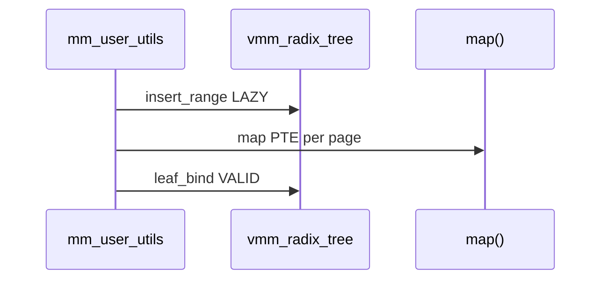

# 虚拟地址空间与页表

v0.1 · 2026-08-26

本篇覆盖：`kernel/mm/vmm.c`、`kernel/mm/map_handler.c`、`kernel/mm/map_util_page.S`、`include/rendezvos/mm/vmm.h`、`include/rendezvos/mm/map_handler.h`、arch `vmm.c`/`vmm.h`/`page_table_def.h`/`mm.h`（x86_64、aarch64）。

Radix 用户 VA 真源见 `Radix树与用户映射.md`；VSpace refcount 与 schedule 切换见 `03-任务与调度/VSpace所有权与调度切换.md`。

---

## 1. 概述

**VSpace** 表示一个硬件页表根（`vspace_root_addr`）及其关联的 radix 元数据（`root_radix`）、ASID（aarch64）、PMM 策略（`pmm`）与 TLB 跟踪（`tlb_cpu_mask`）。**Map_Handler** 是 per-CPU 的 PTE 安装助手：维护临时映射窗口、页表 walk、调用 arch 的 `arch_set_L*entry`。

**`map()` / `unmap()` / `have_mapped()`** 是安装/拆除/查询 PTE 的统一入口；内核恒等区与用户区共用同一套 walk，但策略不同（用户须经 radix/utils 编排）。

---

## 2. 目标与边界

core 提供：root_vspace 启动、`create_vspace`/`clone_vspace`/`del_vspace`、PTE 级 map/unmap 语义（含同 PPN 改 flag、异 PPN 需 `PAGE_ENTRY_REMAP`）、per-CPU 4 槽临时 map 窗口。

core 不做：独立 VMA 链表；用户映射区域的合并策略（由兼容层定义）；在 `map()` 内隐式分配 radix（caller 须先 insert/bind）。

---

## 3. 分层与调用方

| 调用方 | 典型路径 |
|--------|----------|
| `mm_user_utils_*` | radix INSERT → `map()` → leaf_bind |
| `kmalloc.c` | 直接对 `&root_vspace` radix + `map()` |
| `map_handler` 自身 | `sys_init_map` 安装自映射与 map 窗口 |
| page fault 处理 | L0 锁 + fill → 内部 `map()` |

**禁止**对 `&root_vspace` 调用 `mm_user_utils_*`（utils 内显式拒绝）。

---

## 4. 数据结构与不变量

### 4.1 VSpace（摘要）

见 `vmm.h` 注释：`refcount`、`vspace_lock`（保护页表结构）、`root_radix`、`registered`/`root_vs` RB 树节点。`root_vspace` 生命周期覆盖整个内核运行期。

### 4.2 Map_Handler

```c
struct map_handler {
        cpu_id_t cpu_id;
        vaddr map_vaddr[4];      /* 每 CPU 在 map_pages 区 4 个 4K 槽 */
        ppn_t ppn_cache[4];      /* 建表时复用的空闲页 */
        ppn_t mapped_ppn[4];
        struct pmm* pmm;
        spin_lock_t vspace_lock_node;
};
```

`map_pages = 0xFFFFFFFFFFE00000`：每个 CPU 占用 2 MiB 窗口（最多 512 CPU 设计余量），用于 **临时映射物理页** 以便写 PTE 或 zero/copy。

### 4.3 map() 契约（摘要）

- 已有 VALID 叶且 **同 PPN**：仅改 flags（mprotect 路径）。
- 已有 VALID 叶且 **异 PPN**：须 `PAGE_ENTRY_REMAP`，否则失败。
- 无叶：分配中间表页（从 `ppn_cache`），写 leaf。

软件位（`LAZY`、`COW`、`REMAP`）写入 PTE 前由 `entry_flags_rm_sw_flags` 剥离。

---

## 5. 代码对应

| 文件 | 职责 |
|------|------|
| `vmm.c` | `virt_mm_init`、`init_root_vspace`、`create/clone/del_vspace`、`register_vspace` |
| `map_handler.c` | `sys_init_map`、`init_map`、`map`/`unmap`/`have_mapped`、临时槽、TLB invalidate 调用 |
| `map_util_page.S` | 与 map 窗口相关的低级辅助（若链接） |
| `arch/*/mm/vmm.c` | `new_vs_root`、`vspace_free_*`、arch PTE 读写 |
| `page_table_def.h` | L0–L3 项布局、flag 位 |

---

## 6. 流程

### 6.1 virt_mm_init（BSP）

1. `sys_init_map(pmm)` — 全局 map 区与自映射 setup。
2. `init_map(&Map_Handler, cpu_id, pmm)` — 本 CPU handler 槽位。
3. BSP：`init_root_vspace` — radix init、共享内核高半 bootstrap。
4. 设置 `percpu(current_vspace) = &root_vspace`，`boot_stack_bottom`。

AP 在 `start_secondary_cpu` 再次 `virt_mm_init`，attach 共享内核映射。

### 6.2 用户映射（与 radix 协作）



`unmap` 路径：`unmap` → radix unbind/DELETE → `pmm_free`（utils 编排）。

### 6.3 内核高半

L0[256..511] 与 `root_vspace` 共享（radix I5）；用户 AS `install_shared_kernel_high_half` 指向同一内核映射。用户线程 CR3/TTBR 切换后仍可访问内核高半（core 混合内核模型）。

---

## 7. 公开 API

```c
error_t virt_mm_init(cpu_id_t cpu_id, struct setup_info *info);
error_t init_root_vspace(VSpace* root_vs, cpu_id_t cpu_id);
VSpace* create_vspace(struct pmm* pmm);
error_t clone_vspace(VSpace* src, VSpace** dst, enum vspace_clone_flags flags);
error_t del_vspace(VSpace** vs);
error_t register_vspace(VSpace* vs, VSpace* root_vs);

error_t sys_init_map(struct pmm* pmm);
error_t init_map(struct map_handler* handler, cpu_id_t cpu_id, struct pmm* pmm);

error_t map(VSpace* vs, ppn_t ppn, vpn_t vpn, int level, ENTRY_FLAGS_t eflags,
            struct map_handler* handler);
ppn_t unmap(VSpace* vs, vpn_t vpn, u64 new_entry_addr, struct map_handler* handler);
ppn_t have_mapped(VSpace* vs, vpn_t vpn, ENTRY_FLAGS_t* flags_out,
                  int* level_out, struct map_handler* handler);

vaddr map_handler_map_slot(struct map_handler* handler, int slot_id, ppn_t ppn);
error_t map_handler_zero_page(struct map_handler* handler, ppn_t ppn);
```

`arch_set_L0_entry` … 声明于 `vmm.h`，实现在 arch。

---

## 8. 多架构

- **x86_64** — 4 级页表、2 MiB/4 KiB 叶、`CR3` 根；`arch_set_current_user_vspace_root_asid` 写 CR3（ASID 忽略）。
- **aarch64** — 4 级、TTBR0 + **ASID**；TLB 操作带 ASID（见 TLB 篇）。
- 页表项类型在各自 `page_table_def.h`；`common/mm.h` 提供 VPN/PPN 与 `ENTRY_FLAGS_t` 词汇。

---

## 9. 测试

`single_arch_vmm_test.c`、`single_nexus_test.c` 等。本篇与当前源码一致，尚未单独复测。

---

## 10. 限制与后续

- `map_handler` 仅 4 并发槽；嵌套 map 须避免槽冲突。
- clone_vspace 与并发 radix 修改的 L0/L2 纪律见 radix 篇。
- riscv/loongarch 页表路径未完整验证。

---

## 11. 变更记录

- 2026-08-26：v0.1 初稿，VSpace、Map_Handler、map/unmap 策略。
