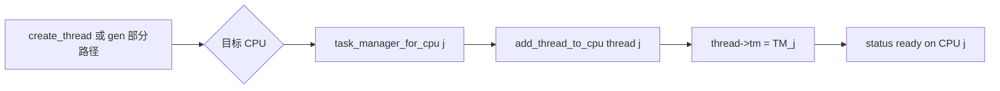

# CPU 亲和性：创建时绑核

v0.1 · 2026-08-27

本篇覆盖：`kernel/task/thread.c`（affinity helpers）、`include/rendezvos/task/thread.h`、`modules/test/thread_affinity_test.c`、`modules/test/smp_test.c`、`include/modules/test/test.h`。

调度环与 `Task_Manager` 见 `线程与Task_Manager.md`；`gen_thread_from_func` 创建路径见 `线程创建与ELF加载.md`；SMP 启动与 `NR_CPU` 见 `06-SMP与同步/SMP启动与处理器拓扑.md`；per-CPU `core_tm` 见 `06-SMP与同步/per-CPU数据与访问约定.md`。

---

## 1. 概述

RendezvOS v0.1 的 CPU 亲和性模型非常简单：**线程在首次入队时绑定到某个 `Task_Manager`（即某个逻辑 CPU）**，之后一直由该 CPU 的调度环和 `schedule` 驱动。不存在运行期把已运行、已阻塞或正在退出的线程迁移到其他核的 API。

创建时选核靠三个公开 helper：`cpu_id_is_online`、`task_manager_for_cpu`、`add_thread_to_cpu`；观测绑核结果用 `thread_owner_cpu`。典型用法是 initcall 或测例在 CPU `i` 上调用 `gen_thread_from_func(..., task_manager_for_cpu(j), ...)` 或 `add_thread_to_cpu(thread, j)`。

---

## 2. 目标与边界

core 要解决的问题是：在 SMP 已启动、每核有独立 `core_tm` 的前提下，让集成方 **明确指定新线程落在哪个 run queue**，以便 server per-CPU 分工、减少跨核调度假设错误。

core **故意不做**：

- 运行期 migration（无 `migrate_thread_to_cpu`）。
- 负载均衡或 work stealing。
- 根据 IRQ 亲和自动绑核（驱动须自行选 CPU 创建线程）。
- 保证「创建线程的 CPU」等于「线程函数首次运行的 CPU」——首次运行只保证在 **owner CPU** 上，而创建调用可能来自任意核（测例通过全局 schedule 同步）。

兼容层若需要 Linux 式 `sched_setaffinity`，须在自有 proc 结构中记录「期望 CPU」，并 **在创建新线程时** 映射到 `add_thread_to_cpu`；已存在线程无法靠 core API 改绑。

---

## 3. 分层与调用方

**单核 server 线程** — 多数 initcall 使用 `percpu(core_tm)`：线程与创建者同核，最简单。

**per-CPU server 复制** — BSP init 或各 AP init 循环 `for (cpu = 0; cpu < NR_CPU; cpu++)`，对每核 `gen_thread_from_func(..., task_manager_for_cpu(cpu), ...)`。每份线程只在对应环上 RR。

**跨核创建 probe** — 如 affinity 测例：在 CPU `me` 上创建线程到 `(me+1)%NR_CPU`，probe 函数内读 `percpu(cpu_number)` 验证运行核。

**错误用法** — 对已在队的线程再次 `add_thread_to_cpu`（返回 `-E_RENDEZVOS`）；对 `status != init` 的线程绑核；向 offline CPU 绑核（`task_manager_for_cpu` 返回 NULL）。

调用方须配合：`NR_CPU` 与 `start_smp` 完成后目标 CPU 已有 `core_tm`（AP 路径 `init_proc`）；`cpu_id_is_online` 仅检查 `per_cpu(core_tm, cpu) != NULL`，不检查线程是否 busy。

---

## 4. 数据结构与不变量

### 4.1 owner CPU 来源

```c
struct task_manager {
        ...
        cpu_id_t owner_cpu;  /* new_task_manager 时设为 percpu(cpu_number) */
        ...
};
```

`thread_owner_cpu(thread)`：

```c
return thread->tm ? thread->tm->owner_cpu : CPU_ID_INVALID;
```

线程未入队或已 detach 时返回 `CPU_ID_INVALID`。

### 4.2 在线 CPU 判定

```c
bool cpu_id_is_online(cpu_id_t cpu)
{
        if (cpu >= RENDEZVOS_MAX_CPU_NUMBER) return false;
        if (NR_CPU <= 0 || cpu >= NR_CPU) return false;
        return per_cpu(core_tm, (u32)cpu) != NULL;
}
```

- **`NR_CPU`** — 运行时在线逻辑 CPU 数（SMP 篇）。
- **`RENDEZVOS_MAX_CPU_NUMBER`** — 编译期数组上界。

「在线」≠「当前线程可迁移到该 CPU」；只表示该索引已有 Task_Manager。

### 4.3 add_thread_to_cpu 前置条件

| 条件 | 违反时返回 |
|------|------------|
| `thread != NULL` | `-E_IN_PARAM` |
| `thread->tm == NULL` | — |
| `thread->tm != NULL` | `-E_RENDEZVOS` |
| `thread_get_status(thread) == init` | `-E_RENDEZVOS` |
| `task_manager_for_cpu(cpu)` 非 NULL | `-E_IN_PARAM` |

成功时等价于 `add_thread_to_manager(tm, thread)`：链入目标环，status init→ready。

**不变量：** 线程生命周期内 `thread->tm->owner_cpu` 不变，直至 `del_thread_from_manager` 清空 `tm`。

---

## 5. 代码对应

| 符号 | 文件 | 说明 |
|------|------|------|
| `cpu_id_is_online` | `thread.c` | 在线检测 |
| `task_manager_for_cpu` | `thread.c` | 取目标 TM |
| `add_thread_to_cpu` | `thread.c` | 创建时绑核入队 |
| `thread_owner_cpu` | `thread.h` inline | 查询 owner |
| `add_thread_to_manager` | `thread_boot.c` | 实际链入环 |
| `smp_thread_affinity_test` | `thread_affinity_test.c` | 环绑核测例 |
| `smp_test` | `smp_test.c` |  broader SMP（含多核 schedule） |

---

## 6. 流程

### 6.1 创建时绑核（推荐模式）



**便捷路径：** `gen_thread_from_func(&t, f, name, task_manager_for_cpu(j), arg)` 内部直接 `add_thread_to_manager(tm, ...)`，等价于绑核 j。

**分步路径：** `create_thread` 返回 init 线程 → `add_thread_to_cpu(t, j)` — 用于自定义 VSpace/user 线程且需跨核入队。

### 6.2 affinity 测例逻辑（说明性）

`smp_thread_affinity_test` 在每核 AP 上：

1. BSP 清零 `affinity_seen[]`。
2. `target = (me + 1) % NR_CPU`。
3. `gen_thread_from_func(..., task_manager_for_cpu(target), (void*)me)` — 参数 `me` 为 **创建者 CPU id**。
4. probe 线程在 **owner CPU** 上运行，写 `affinity_seen[here] = creator`。
5. 创建者 spin `schedule` 直到 `affinity_seen[target] == me`。
6. 等待 probe zombie 后 `delete_thread`。

`smp_thread_affinity_check` 验证：对每个 CPU `j`，`affinity_seen[j] == (j + NR_CPU - 1) % NR_CPU`（即 j 上运行的线程由 j-1 创建）。

该测例证明 **运行核 = owner_cpu**，而非 **创建调用核**。

### 6.3 与 IPC 阻塞的交互

线程在 `block_on_send` / `block_on_receive` 时仍挂在 **原 owner CPU** 的 TM 上；wakeup 后仍由同一 CPU `schedule`。port 会合不跨核迁移 waiter。兼容层设计 server 时须让 listen 线程与 port 策略一致（例如 per-CPU listen port）。

---

## 7. 公开 API

| API | 用途 |
|-----|------|
| `bool cpu_id_is_online(cpu_id_t cpu)` | 创建前检查 TM 是否存在 |
| `Task_Manager* task_manager_for_cpu(cpu_id_t cpu)` | 取目标 run queue；offline 返回 NULL |
| `error_t add_thread_to_cpu(Thread_Base* thread, cpu_id_t cpu)` | init 线程首次入队到 cpu |
| `cpu_id_t thread_owner_cpu(const Thread_Base* thread)` | 查询绑核结果 |

**不在本篇重复：** `gen_thread_from_func`、`add_thread_to_manager` — 见线程与创建篇。

---

## 8. 多架构

亲和性逻辑 **arch 无关**，仅依赖 `per_cpu(core_tm, ...)` 与 `percpu(cpu_number)`。x86_64 / aarch64 AP 均在 `init_proc` 后拥有各自 TM。未启动的 AP 上 `core_tm == NULL`，`cpu_id_is_online` 为 false。

---

## 9. 测试

| 测例 | 验证点 |
|------|--------|
| `smp_thread_affinity_test` / `smp_thread_affinity_check` | 创建时绑核 + 在 owner CPU 执行 |
| `smp_test` | 多核 schedule、IPC（间接要求正确 TM） |

运行（需 SMP 配置，`NR_CPU > 1`）：

```bash
cd core && make ARCH=x86_64 config && make all && make run
```

与当前源码一致，尚未复测。

---

## 10. 限制与后续

- **无 migration** — 阻塞在 port、持有 per-CPU 数据（如 `me` MCS 槽）的线程不能换核而不改 core。
- **gen_thread_from_elf 仅本核 TM** — 用户 ELF  harness 未暴露 `add_thread_to_cpu` 封装。
- **创建核 ≠ owner 核** — 允许 CPU A 调用 API 在 CPU B 创建线程；调用方自行同步。
- 运行期亲和 API 若加入，须单独设计 teardown、IPC、VSpace TLB mask 与 `-E_REND_AGAIN` 语义，记入 `v0.1/evolution/TODO.md`（E3）。

---

## 11. 变更记录

| 日期 | 摘要 |
|------|------|
| 2026-08-27 | 初稿：创建时绑核模型与 helper API |
