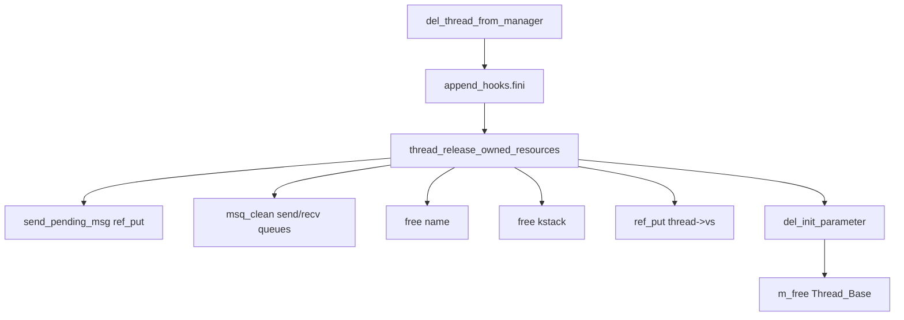

# EBR 与线程资源回收

v0.1 · 2026-08-27

本篇覆盖：`kernel/task/ebr.c`、`include/rendezvos/task/ebr.h`、`kernel/task/thread.c`（`thread_set_name_with_copy`、`thread_release_owned_resources`、`delete_thread` / `del_thread_structure`）。

MSQ 算法、tagged pointer 与 `ebr_enter`/`ebr_exit` 在队列操作内的包裹见 `04-IPC/无锁队列与EBR设计.md`；`free_message_ref` / `free_ipc_request` 的 IPC 路径见 `04-IPC/Port与消息模型.md`；`schedule` 内 reclaim 钩子见 `线程与Task_Manager.md` §6.2。

---

## 1. 概述

RendezvOS 在 v0.1 用 **Epoch-Based Reclamation（EBR）** 解决无锁 MSQ 读者与释放者之间的竞争：可能仍被并发遍历的节点 **不能立即 `kfree`**，而应先 **retire** 到 per-CPU 槽位，等全局 epoch 安全后再调用真正的 `free_func`。

EBR 与线程子系统的交汇点有两类：

1. **调度钩子** — 每次 `schedule()` 调用 `ebr_try_reclaim()`，让不常分配/释放的 CPU 也能推进回收。
2. **线程 teardown** — `delete_thread` → `ref_put` → `del_thread_structure` → `thread_release_owned_resources` **同步**释放 kstack、name、IPC 队列与 `vs`；此路径 **不** 经 EBR（线程结构体本身由 refcount 保护，MSQ dummy 释放遵循 msq 注释中的单次 dequeue 契约）。

IPC 的 `Message_t` / `Ipc_Request_t` 节点则通过 `ebr_retire_ref` 延迟释放——与线程 block/wakeup 并发。

---

## 2. 目标与边界

core 提供 **minimal EBR**：per-CPU enter/exit、global epoch、固定大小 retire 表（默认 512 slot）、overflow 时 **故意 leak** 并打日志而非 UAF。

core 不负责：替上层决定何时 `delete_thread`；在 EBR overflow 后自动扩容（须改 `EBR_RETIRE_SLOTS` 编译常量或降 churn）；跨模块统一 GC 框架。

**线程 name**（`thread_set_name_with_copy`）与 **kstack** 在 `thread_release_owned_resources` 里直接 `m_free`——它们不参与 MSQ，不走 EBR。

---

## 3. 分层与调用方

**MSQ / IPC 实现** — 在 `include/common/dsa/ms_queue.h` 的 dequeue/enqueue/CAS 循环内调用 `ebr_enter()` / `ebr_exit()`；`free_message_ref`、`free_ipc_request` 用 `ebr_retire_ref(..., *_real)`。

**任意 kernel 路径** — 间接通过 `schedule()` 触发 `ebr_try_reclaim`；idle-heavy CPU 依赖此钩子。

**兼容层 / server** — 删除线程仍用 `delete_thread`；不要假设 IPC 消息在 `ref_put` 后立刻消失——可能延迟到下一 reclamation。clean server 应基于 `THREAD_FLAG_EXIT_REQUESTED` + zombie status，而非 message 节点地址立即可复用。

**调试** — `ebr_dump_stats()` 打印 per-CPU live/peak/retire/reclaim/overflow 计数。

---

## 4. 数据结构与不变量

### 4.1 Per-CPU EBR 状态

| 变量 | 含义 |
|------|------|
| `ebr_active_flag` | 本 CPU 是否处于 enter 深度 > 0 |
| `ebr_local_epoch` | enter 时复制的 global epoch |
| `ebr_nesting_depth` | enter/exit 嵌套计数 |
| `ebr_retired_recs[EBR_RETIRE_SLOTS]` | retire 槽：ref、free_func、retire_epoch |
| `ebr_retired_count` | 当前占用槽数 |

Global：`ebr_global_epoch`（从 1 起）、`ebr_inited` 三态（0/1/2）lazy init。

### 4.2 ebr_retired_rec_t

```c
typedef struct {
        ref_count_t* ref;
        error_t (*free_func)(ref_count_t*);
        u64 retire_epoch;
        bool used;
} ebr_retired_rec_t;
```

### 4.3 安全 epoch

`ebr_compute_safe_epoch()`：取 global epoch 与所有 **active** CPU 的 `local_epoch` 的最小值。仅当 `rec.retire_epoch < safe_epoch` 的槽可在 `ebr_try_reclaim` 中调用 `free_func(ref)`。

**直觉：** active CPU 可能仍持有指向已 dequeue 节点的指针；inactive（quiescent）CPU 的 local epoch 已落后，不会影响更老的 retire 记录。

### 4.4 线程释放顺序（del_thread_structure）



**顺序理由：** `fini` hook 可能仍读 `thread->vs` 或 append 区；故 fini 在 drop vs 之前。注释明确 **禁止** 在 `delete_thread` 里、最后一次 ref 之前调用 `thread_release_owned_resources`（否则 MSQ dummy 双重释放 / dequeue 死循环）。

IPC 队列清理使用 `msq_clean_queue(..., free_message_ref)` — message 节点走 EBR retire，而非同步 destroy。

---

## 5. 代码对应

| 文件 | 职责 |
|------|------|
| `ebr.h` | 公开 API、`EBR_RETIRE_SLOTS`、watermark 编译开关 |
| `ebr.c` | enter/exit/reclaim/retire/stats |
| `ms_queue.h` | 读者侧 enter/exit |
| `message.c` | `free_message_ref` → `ebr_retire_ref(..., free_message_ref_real)` |
| `ipc.c` | `free_ipc_request` → `ebr_retire_ref(..., free_ipc_request_real)` |
| `task_manager.c` | `schedule` → `ebr_try_reclaim` |
| `thread.c` | 同步资源释放；`delete_thread` 与 manager detach |

---

## 6. 流程

### 6.1 ebr_enter / ebr_exit

- **enter**：深度 0→1 时记录当前 `ebr_global_epoch` 到 `ebr_local_epoch`，置 active。
- **exit**：深度 1→0 时清 active，**递增 global epoch**，并调用 `ebr_try_reclaim()`。

MSQ 每次指针遍历须配对 enter/exit（含所有 early return 路径）。

### 6.2 ebr_retire_ref

1. `ebr_ensure_init()`。
2. 记录 `retire_epoch = global_epoch`（当前值，不在 retire 时 bump global）。
3. 先 `ebr_try_reclaim()` 腾槽。
4. 找空闲 slot 存入 `(ref, free_func, retire_epoch)`；成功则 `ebr_retired_count++`，再 reclaim。
5. 若仍无槽 — **overflow**：计数 + 错误日志，**leak 该节点**（不调用 free_func），返回 `REND_SUCCESS`（避免 UAF）。

设计取舍：overflow Rare if `EBR_RETIRE_SLOTS=512`；高 churn IPC 应监控 `ebr_overflow_ops`。

### 6.3 ebr_try_reclaim

对每 CPU 本地槽：`retire_epoch < safe_epoch` → 清槽、`free_func(ref)`、`ebr_retired_count--`。

调用点：`ebr_exit`、retire 前后、`schedule()`。

### 6.4 delete_thread 与 EBR 的时间线

1. `thread_set_status(exit)` — 仍可能有 IPC 并发直到 detach。
2. `del_thread_from_manager` — 若 blocking，status 可能仍为 block_on_*；detach 后不再被 schedule 选中（除非 `-E_REND_AGAIN` 重试）。
3. `ref_put` — 若 IPC request 仍 hold thread ref，结构体延后释放。
4. 最后 ref → `msq_clean_queue` 对每个 message `free_message_ref` → **EBR retire**，线程 kstack/vs **同步**释放。

因此：**线程对象生命周期 ≥ 其队列中 message 的 logical 释放**；message 物理 free 可能略滞后于 thread struct free，但 retire 记录持有 ref 直至 reclaim。

### 6.5 thread_set_name_with_copy

分配新 name 缓冲；若已有旧 name 则 **同步** `m_free` 旧缓冲——name 不参与 lock-free 读者，无需 EBR。

---

## 7. 公开 API

| API | 说明 |
|-----|------|
| `void ebr_enter(void)` | MSQ 读者进入临界 |
| `void ebr_exit(void)` | 读者退出；可能 bump epoch + reclaim |
| `void ebr_try_reclaim(void)` | 扫描本 CPU retire 槽 |
| `error_t ebr_retire_ref(ref, free_func)` | 延迟释放 |
| `void ebr_dump_stats(void)` | 诊断打印 |

线程侧：`delete_thread`、`del_thread_structure`、`thread_set_name_with_copy` — 见 `thread.h`。

---

## 8. 多架构

EBR 实现完全 **arch 无关**。`NR_CPU` 用于扫描他核 active flag；未 SMP 时按 1 处理。

---

## 9. 测试

- IPC 单 port / 多线程测例间接压测 EBR（message/request churn）。
- 若启用 `EBR_ENABLE_WATERMARK` / `EBR_ENABLE_WATERMARK_LOG`，可观察 peak 日志（默认关闭）。

```bash
cd core && make ARCH=x86_64 config && make all && make run
```

与当前源码一致，尚未复测。

---

## 10. 限制与后续

- **Retire 表固定大小** — overflow leak；生产集成应监控 `ebr_overflow_ops`。
- **Per-CPU retire** — 在 CPU A retire 的节点由 A 的 reclaim 扫描；safe epoch 为全局最小，逻辑正确但可能延迟。
- **线程体不走 EBR** — 若未来 TCB 也经 lock-free 结构可见，需另议。
- **Watermark 默认关** — 需编译 `-DEBR_ENABLE_WATERMARK=1` 开启 peak 统计。

MSQ 与 tagged ptr 细节见 IPC 无锁队列篇；更大 slot 或 generational 方案见 `v0.1/evolution/TODO.md`（E11）。

---

## 11. 变更记录

| 日期 | 摘要 |
|------|------|
| 2026-08-27 | 初稿：EBR 机制、schedule 钩子、线程 teardown 与 IPC retire 边界 |
