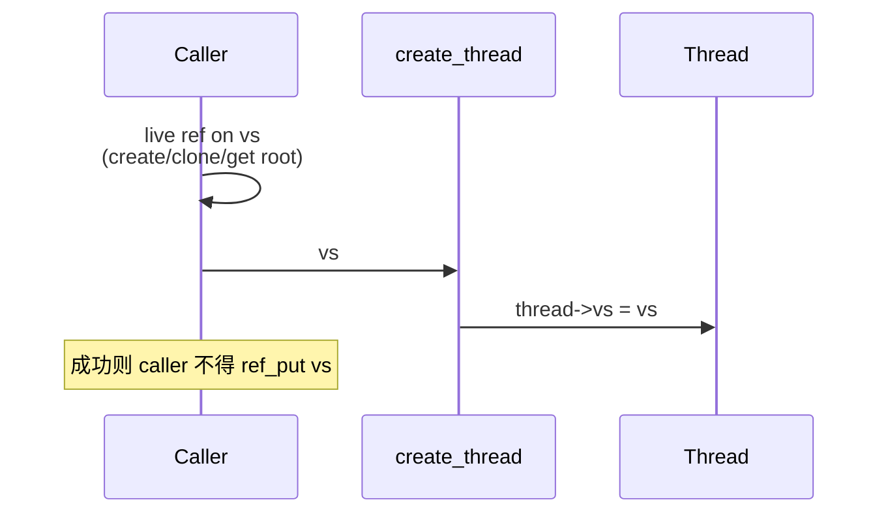
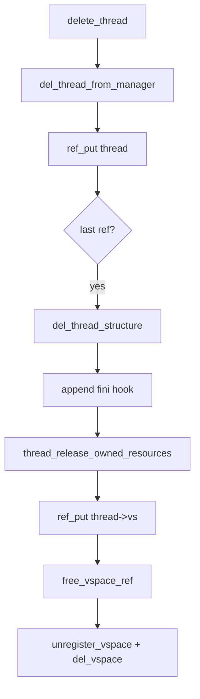

# VSpace 所有权与调度切换

v0.1 · 2026-08-26

本篇覆盖：`kernel/task/thread.c`（schedule/teardown 相关）、`kernel/task/task_manager.c`、`include/rendezvos/task/thread.h`、`include/rendezvos/mm/vmm.h`。

Radix 树、页表安装、`create_vspace`/`clone_vspace` 的细节见 `core/docs/v0.1/full/02-内存管理/Radix树与用户映射.md` 与 `虚拟地址空间与页表.md`；TLB shootdown 与 `tlb_cpu_mask` 的跨核语义见 `core/docs/v0.1/full/06-SMP与同步/TLB_shootdown与跨核一致性.md`。

---

## 1. 概述

RendezvOS 把地址空间 `VSpace` 的引用计数与两类「持有者」绑在一起：线程在 `thread->vs` 上持有一条所有权引用；CPU 在调度切换到用户线程时，为当前硬件页表根（x86 CR3 / aarch64 TTBR0+ASID）再持有一条临时引用，并用 `tlb_cpu_mask` 记录哪些核上可能仍有该 ASID 的 TLB 项。内核线程与 boot 线程不走用户 AS 切换路径；用户线程必须挂独立 `VSpace`，且不得把 `THREAD_FLAG_USER` 与 `&root_vspace` 搭配。

本篇说明 refcount 如何创建与转移、`schedule()` 何时改硬件 AS、线程 teardown 如何 `ref_put`，以及 boot 线程为何是例外。

---

## 2. 目标与边界

core 要解决的问题是：在混合内核（内核高半区各 AS 共享、用户低半区 per-process）下，明确「谁拥有 VSpace 对象、谁为 HW 切换付费、何时才能 `del_vspace`」。**兼容层**负责 fork/exec/clone 等进程语义与何时 `clone_vspace`，但 must 遵守 core 的所有权与 `register_vspace` 顺序；core 不解释某一 OS 的 clone 标志（例如是否共享地址空间）。

core 不做：在切到 idle/内核线程时强制把 CR3/TTBR 改回 `root_vspace`（内核路径只使用共享高半区，允许 HW 仍指向上一用户 AS）；运行期把线程迁到其他 CPU 的 VSpace 策略（亲和性在创建时固定，见 `CPU亲和性-创建时绑核.md`）。

---

## 3. 分层与调用方

**用户进程地址空间** — 兼容层调用 `create_vspace` 或 `clone_vspace`，再 `register_vspace(vs, &root_vspace)`，然后把 **live ref** 交给 `create_thread` / `copy_thread` / `gen_thread_from_elf`。register 与 radix 内容见内存管理篇章；本篇只强调：register 必须在任意线程接管 `vs` 之前完成，unregister 在最后一次 `ref_put` 触发的 `free_vspace_ref` 里由 core 调用。

**内核/server 线程** — 使用 `gen_thread_from_func`，其内部对 `root_vspace` 做 `ref_get_not_zero` 后 `create_thread(..., &root_vspace, ...)`。不要给用户线程传 `&root_vspace` 并设置 `THREAD_FLAG_USER`。

**boot 线程** — 由 `create_boot_thread` 用 `new_thread_structure` 构造，**不**经过 `create_thread`，`thread->vs` 保持 `NULL`，不设 `THREAD_FLAG_USER`。它跑在 BSP 的 per-CPU boot 栈上，负责内核 IPC 循环。

调用方常见错误：在 `create_thread` 成功后再次 `ref_put(vs)`（双重释放）；在用户 AS 仍有其他 runnable 线程时 `del_vspace`；把 `THREAD_FLAG_USER` 设在 `root_vspace` 上（`schedule` 会报错并回退到旧线程）。

---

## 4. 数据结构与不变量

### 4.1 VSpace 中与本篇相关的字段

`include/rendezvos/mm/vmm.h` 中 `struct VSpace` 的注释是权威说明，此处归纳调度与所有权相关部分：

- **`refcount`** — 对象生命周期。最后一次 `ref_put(..., free_vspace_ref)` 走 `unregister_vspace` + `del_vspace`。
- **`tlb_cpu_mask` / `tlb_cpu_mask_lock`** — 曾运行在该 AS 上的 CPU 集合；`schedule` 切入用户 AS 时 set，切出时 clear 并可能 `ref_put` CPU 侧额外引用。
- **`vspace_root_addr` / `asid`** — 传给 `arch_set_current_user_vspace_root_asid` 安装 HW 根。
- **`root_vs`** — 用户 VSpace 指向 `root_vspace` 用于 RB 注册树；`root_vspace` 自身 `root_vs` 指向自己。

### 4.2 线程侧

`Thread_Base::vs` — 非 NULL 表示线程持有一条 VSpace 所有权 ref（由 `create_thread` / `copy_thread` 转入，无二次 get）。`thread_release_owned_resources` 在结构体释放前 `ref_put(&thread->vs->refcount, free_vspace_ref)`。

`thread->flags & THREAD_FLAG_USER` — 为 true 时 `schedule` 才会尝试切换用户 HW AS。内核线程默认不置此位。

### 4.3 per-CPU `current_vspace`

`extern VSpace* current_vspace`（per-CPU）记录本核 **逻辑上** 关联的用户 AS（`virt_mm_init` 初始化为 `&root_vspace`）。仅在 `schedule` 成功切换到 **下一线程为用户线程且 vs 变化** 时更新；切到 idle/内核线程时不改回 root。

### 4.4 引用来源一览

同一 `VSpace` 的 refcount 可能同时来自：

1. 每个绑定该 AS 的用户线程的 `thread->vs`（各 1）。
2. 每个正在 HW 上运行该 AS 的 CPU 的 schedule 临时 get（切走 user→另一 user 时对旧 AS put；user→kernel 时不 put，见第 6 节）。
3. `root_vspace` 启动时 `ref_init(1)`，每个内核线程再通过 `create_thread` 转入一条；系统运行期 root 的 refcount 通常大于 1。

**不变量（调用方须维护）：**

- `create_thread` / `copy_thread` 成功返回后，调用方不得再持有传入的 `vs` ref。
- `THREAD_FLAG_USER` 的线程：`thread->vs` 必须非 NULL 且 `!= &root_vspace`。
- `del_vspace` 要求已 unregister，且除 in-place exec 特例外 `tlb_cpu_mask` 全零（见 `vspace_clear_user_mappings`）。
- 在目标线程仍可能是 `current_thread` 时，`del_thread_from_manager` 返回 `-E_REND_AGAIN`；须先 schedule 离开（`delete_thread` 内对 owner CPU 自旋 schedule）。

---

## 5. 代码对应

| 文件 | 职责（本篇范围） |
|------|------------------|
| `include/rendezvos/mm/vmm.h` | `VSpace` 定义、`current_vspace`/`root_vspace` 声明、refcount 语义注释、`free_vspace_ref` |
| `kernel/mm/vmm.c` | `free_vspace_ref` → `unregister_vspace` + `del_vspace`；`virt_mm_init` 初始化 root 与 per-CPU `current_vspace` |
| `include/rendezvos/task/thread.h` | `thread->vs`、`THREAD_FLAG_USER`、`create_thread` 所有权注释、`gen_thread_from_func` 说明 |
| `kernel/task/thread.c` | `create_thread` 赋值 `thread->vs`；`thread_release_owned_resources`；`copy_thread` 失败回滚 put |
| `kernel/task/thread_loader.c` | `gen_thread_from_func` 对 root get/put；`gen_thread_from_elf` 用户 AS 路径 |
| `kernel/task/thread_boot.c` | `create_boot_thread`：`vs == NULL`，无 USER 标志 |
| `kernel/task/task_manager.c` | `schedule()` 内 VSpace 切换与 CPU ref |
| `include/arch/*/mm/vmm.h` | `arch_set_current_user_vspace_root_asid`、`arch_tlb_invalidate_vspace_page` |

线程创建全貌（ELF、user stack）见 `03-任务与调度/线程创建与ELF加载.md`；`task_manager` 调度环见 `线程与Task_Manager.md`。

---

## 6. 流程

### 6.1 所有权转入线程



- **用户线程**：`create_vspace` → `register_vspace` → `create_thread(..., vs, ...)` → 可选 `THREAD_FLAG_USER`（`gen_thread_from_elf` 在 user stack 就绪后设置）。
- **内核线程**：`ref_get_not_zero(&root_vspace.refcount)` → `create_thread(..., &root_vspace, ...)`；失败则 put root。
- **`copy_thread`**：与 `create_thread` 相同，传入的子 AS ref 转入 dst；失败路径 `drop_vs_error` 处 `ref_put`。

### 6.2 schedule 与 HW 地址空间

`schedule(Task_Manager* tm)`（`task_manager.c`）在选出 next ≠ curr 且 next 为 `THREAD_FLAG_USER` 时进入 VSpace 逻辑：

1. `new_vs = next->vs`；若 NULL 或 `&root_vspace`，打印错误并 **不切换**（`use_old_thread`）。
2. `old_vs = percpu(current_vspace)`。
3. 若 `old_vs != new_vs`：
   - `ref_get_not_zero(&new_vs->refcount)`；失败则 abort 切换。
   - 在 `new_vs->tlb_cpu_mask` 上 set 当前 CPU。
   - `arch_set_current_user_vspace_root_asid(new_vs->vspace_root_addr, new_vs->asid)`；`percpu(current_vspace) = new_vs`。
   - 若 `old_vs != &root_vspace`：对该 ASID 做本地 TLB invalidate，clear 本 CPU 的 mask 位，`ref_put(&old_vs->refcount, free_vspace_ref)`（释放 **CPU 侧** 在先前 user→user 切换时多 get 的那条 ref，而非线程所有权 ref）。

**未覆盖的路径（刻意行为）：**

- **next 为内核/idle/boot**（无 `THREAD_FLAG_USER`）：整段 VSpace 代码跳过；HW 可能仍指向上一用户 AS；`current_vspace` 与旧 user 的 CPU ref/mask 保持不变。
- **user → 同一 user**（next == curr）：前面已排除。
- **kernel idle → user B**：若 `current_vspace` 仍为更早的 user A，则按 user→user 处理，清理 A 的 CPU ref 并安装 B。

切换成功后，若 outgoing 线程带有 `THREAD_FLAG_EXIT_REQUESTED` 且已被置为 ready，owner CPU 将其标为 zombie（供 clean 路径回收）。

### 6.3 Teardown



- `thread_release_owned_resources` **不会**切换 HW AS；注释说明调用者不应是正在该 AS 上运行的目标线程本身，且允许 caller 仍运行在旧 AS 上——只 drop 线程持有的所有权 ref。
- 若 refcount 归零时仍有 CPU 在 mask 中或 HW 未 shootdown，`del_vspace` / `vspace_clear_user_mappings` 会失败（`-E_REND_RC_UNEQUAL`）；兼容层须先保证无并发 runnable 或完成 TLB 同步。

### 6.4 boot 线程例外

`create_boot_thread` 不调用 `create_thread`，因此：

- `boot_thread->vs == NULL`；
- 无 `THREAD_FLAG_USER`；
- `schedule` 永远不会为 boot 切换用户 AS；
- boot 使用 `percpu(boot_stack_bottom)`（在 `virt_mm_init` 为 BSP 设置），不是 kmalloc 的 kstack。

`init_proc` 创建 boot 与 idle 后，用 `switch_to` 从 boot 上下文切到 idle，此后正常走 `schedule()`。

---

## 7. 公开 API

本篇涉及的 API 如下；创建/克隆 VSpace 的完整签名见 `vmm.h`，线程 API 见 `thread.h`。

**所有权转移**

```c
Thread_Base* create_thread(void* __func,
                           const thread_append_hooks_t* append_hooks,
                           VSpace* vs, bool reserve_trap_frame,
                           int nr_parameter, ...);
```

成功：`vs` 的 ref 转移到 `thread->vs`。失败：caller 仍拥有 `vs`。

```c
error_t gen_thread_from_func(Thread_Base** out, kthread_func fn,
                             char* name, Task_Manager* tm, void* arg);
```

内部 `ref_get_not_zero(&root_vspace.refcount)` 后 `create_thread(..., &root_vspace, ...)`。

```c
Thread_Base* copy_thread(Thread_Base* src, VSpace* vs, u64 syscall_ret);
```

`vs` 所有权转入新线程；仅允许 `src` 为 `THREAD_FLAG_USER`。

**调度**

```c
void schedule(Task_Manager* tm);
```

用户 AS 切换仅在此函数内、且下一线程为 USER 时发生。

**释放**

```c
error_t delete_thread(Thread_Base* thread);
void del_thread_structure(Thread_Base* thread);  /* 通常经 free_thread_ref */
error_t free_vspace_ref(ref_count_t* refcount);
```

**查询**

```c
extern VSpace root_vspace;
extern VSpace* current_vspace;  /* percpu */
```

---

## 8. 多架构

HW 切换通过 `arch_set_current_user_vspace_root_asid(paddr root, asid_t asid)`：

- **x86_64**（`include/arch/x86_64/mm/vmm.h`）：写入 CR3；ASID 参数为占位，无效。
- **aarch64**：同时设置 TTBR0 与 ASID；`VSpace::asid` 由 `asid_alloc` 分配。

切走旧用户 AS 时调用 `arch_tlb_invalidate_vspace_page(old_asid, 0)` 做本地 shootdown；跨核 IPI 与 map/unmap 路径见 TLB 专篇。

riscv64 头文件存在同名 inline，但 v0.1 调度与测例以 x86_64/aarch64 为准。

---

## 9. 测试

与 VSpace 所有权间接相关的测例：`modules/test/single_task_test.c`、`single_nexus_test.c`、`smp_nexus_test.c` 等覆盖线程与映射；`thread_affinity_test.c` 验证绑核，不覆盖 VSpace 切换本身。

在 `core/` 内 `make ARCH=x86_64 config && make all && make run` 并启用 `RENDEZVOS_TEST`（见 `11-测试/内核测试框架与测例索引.md`）。本篇与当前源码一致，尚未针对 refcount/teardown 单独复测。

---

## 10. 限制与后续

- 切到内核线程时不恢复 `root_vspace` HW 根，依赖共享内核高半区；若兼容层需要「内核线程始终 CR3=root」，core 未提供自动保证。
- user→idle 时不释放 CPU 对上一 user AS 的 schedule get，延迟到下一次 user→user 切换；refcount 与 mask 语义须按此理解。
- exec 原地清映射（`vspace_clear_user_mappings` + `allow_self_use`）与多线程共享 AS 的策略由兼容层保证，见 `vmm.h` 注释。
- 增强项（NUMA `pmm` 策略、更细 shootdown）见 `v0.1/evolution/TODO.md`（E1）。

---

## 11. 变更记录

- 2026-08-26：v0.1 初稿，整理 thread->vs 所有权、schedule HW 切换与 boot 例外。
