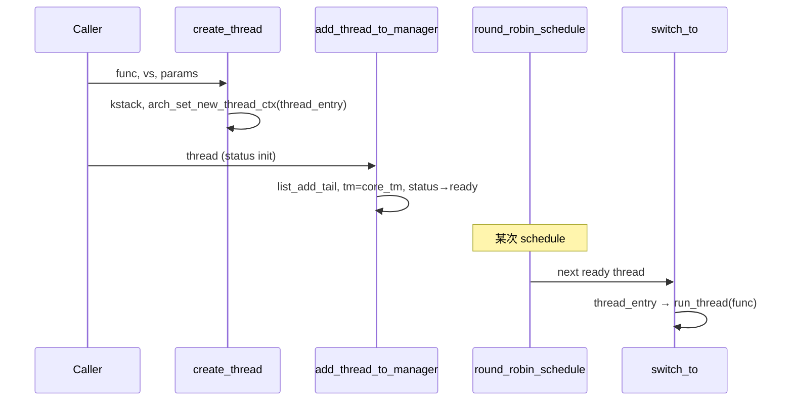
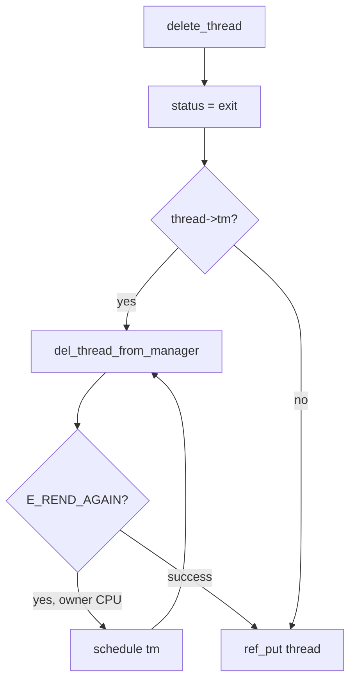

# 线程与 Task_Manager

v0.1 · 2026-08-27

本篇覆盖：`kernel/task/thread.c`、`kernel/task/task_manager.c`、`include/rendezvos/task/thread.h`、`include/rendezvos/task/id.h`、`kernel/task/id.c`。

`init_proc`、boot/idle 与 `cmain` 编排见 `01-启动与初始化/模块初始化与内核入口.md`；用户 AS 切换与 `thread->vs` refcount 见 `VSpace所有权与调度切换.md`；线程创建与 ELF 见 `线程创建与ELF加载.md`；创建时绑核见 `CPU亲和性-创建时绑核.md`；EBR 与 teardown 见 `EBR与线程资源回收.md`；IPC 阻塞状态见 `04-IPC/阻塞与非阻塞收发.md`。

---

## 1. 概述

RendezvOS 的调度单位是 **Thread_Base**：每个可调度实体挂在本 CPU 的 **Task_Manager** 环形就绪队列上，由 `schedule()` 在持锁下选出下一个 `thread_status_ready` 线程并 `switch_to`。v0.1 默认策略是 **round-robin**（`round_robin_schedule`），从 `current_thread` 的 `sched_thread_list.next` 起绕环，跳过非 ready 节点。

线程从 `create_thread` 或 `new_thread_structure`（boot）诞生，经 `add_thread_to_manager` 入队后变为 ready；退出意图用 `THREAD_FLAG_EXIT_REQUESTED` 表达，配合 owner CPU 在切走时将 ready 线程标为 zombie。全局 `tid` 由 `tid_manager` 单调分配。

本篇说明 `Thread_Base` / `Task_Manager` 字段、状态机、调度环、`schedule` 主路径（不含 VSpace 细节）、`add/del_thread_from_manager` 契约，以及 boot 线程与内核线程的特殊性。

---

## 2. 目标与边界

core 提供 **per-CPU 调度器骨架**：就绪队列、上下文切换钩子、与 IPC 共享的 `thread_status` 原子字段。不在 core 内实现 CFS、优先级、运行期 CPU 迁移或 sleep/wakeup 定时器队列——兼容层可在 `append_hooks` 或自有 server 策略里扩展，但 v0.1 公开 API 只有 round-robin。

core 不做：进程组 / 会话语义；在 `schedule` 里自动把 HW 页表切回 `root_vspace`（见 VSpace 篇）；解释某一 OS 的 `fork`/`clone` 标志（那是兼容层在 `copy_thread` 之前准备 `VSpace` 的事）。

---

## 3. 分层与调用方

**内核/server 线程** — 典型路径：`gen_thread_from_func(..., tm, arg)` 或 `create_thread` + `add_thread_to_manager` / `add_thread_to_cpu`。函数体在 `thread_entry` → `run_thread` 中执行；返回后 core 置 `THREAD_FLAG_EXIT_REQUESTED` 并 `schedule`。

**用户线程** — 由 `gen_thread_from_elf` 或兼容层 `copy_thread` 创建，须设 `THREAD_FLAG_USER` 且挂独立 `VSpace`（见创建篇与 VSpace 篇）。用户态返回路径覆盖内核栈上的 `thread_entry` 帧，正常不应落回 `thread_entry` 尾部清理。

**boot 线程** — 不走 `create_thread`：`create_boot_thread` 用 `new_thread_structure`，`vs == NULL`，栈为 per-CPU boot 栈。BSP/AP 上负责 `kernel_handle_msg` 循环（模块初始化篇）。

**跨核创建** — 仅 **创建时** 选择目标 CPU 的 `Task_Manager`（`add_thread_to_cpu` / `gen_thread_from_func(..., task_manager_for_cpu(cpu), ...)`）。线程一旦入队，其 `thread->tm->owner_cpu` 固定，v0.1 **无** 运行期迁移 API。

调用方须理解：`delete_thread` 可能因 `-E_REND_AGAIN`（仍为 `current_thread`）在 owner CPU 上自旋 `schedule`；IPC 路径会临时把 status 设为 `block_on_send` / `block_on_receive`，不得用 status 单独表达 exit（用 `THREAD_FLAG_EXIT_REQUESTED`）。

---

## 4. 数据结构与不变量

### 4.1 Thread_Base

定义于 `thread.h`，关键字段：

| 字段 | 含义 |
|------|------|
| `sched_thread_list` | 嵌入 `Task_Manager::sched_thread_list` 环 |
| `tm` | 所属 per-CPU 调度器；NULL 表示未入队或已 detach |
| `status` | 原子调度/IPC 状态（见 4.2） |
| `flags` | `THREAD_FLAG_USER`、`THREAD_FLAG_EXIT_REQUESTED`、`THREAD_FLAG_IPC_PORT_CLOSED` 等 |
| `vs` | 地址空间所有权 ref；boot 为 NULL |
| `ctx` | `Arch_Thread_Context`，由 arch 切换代码读写 |
| `kstack_bottom` / `kstack_num` | 内核栈顶（高地址）与页数；默认 `thread_kstack_page_num == 2` |
| `init_parameter` | `thread_func_ptr` + 最多 `NR_ABI_PARAMETER_INT_REG` 个 u64 参数 |
| `refcount` | 线程结构体生命周期；IPC `Ipc_Request` 等可额外 hold |
| `send_msg_queue` / `recv_msg_queue` | per-thread MSQ（dummy 节点在 `new_thread_structure` 分配） |
| `port_ptr` | 阻塞在 port 上时指向 `Message_Port_t` |
| `port_cache` | 按 port 名的 token LRU（最多 16 条） |
| `append_hooks` + `append_thread_info[]` | 可选 FAM 尾区，供兼容层挂 proc 等状态 |

**不变量：**

- 同一时刻 `thread->tm` 非 NULL 则 `sched_thread_list` 必在对应 TM 环上（`del_thread_from_manager` 会校验 `-E_REND_AGAIN`）。
- `add_thread_to_manager` 要求入队前 `status == thread_status_init`，成功 CAS 为 `ready`。
- `create_thread` 成功则 **caller 不得再** `ref_put` 传入的 `vs`（所有权转入 `thread->vs`）。

### 4.2 线程 status 枚举

```c
enum thread_status_base {
        thread_status_error = -1,
        thread_status_init = 0,
        thread_status_running,
        thread_status_ready,
        thread_status_zombie,
        thread_status_block_on_send,
        thread_status_block_on_receive,
        thread_status_suspend,
        thread_status_exit,
};
```

语义要点：

- **`running` / `ready`** — 调度器维护：`schedule` 把 outgoing 从 running→ready，incoming 设为 running。
- **`block_on_*`** — IPC `send_msg`/`recv_msg` 在 port 上等待时设置；配对成功后由 IPC 代码改回 ready 并 `schedule`。
- **`zombie`** — owner CPU 在切离带 `THREAD_FLAG_EXIT_REQUESTED` 的 ready 线程时设置，供 clean 路径观测。
- **`exit`** — `delete_thread` 入口设置，表示逻辑退出；资源在最后一次 `ref_put` 时释放。
- **`suspend`** — v0.1 预留，公开路径较少使用。

**Exit 与 status 分离：** 仅改 status 可能覆盖 IPC 阻塞态，故 exit 意图只用 `THREAD_FLAG_EXIT_REQUESTED`。

### 4.3 Task_Manager

```c
struct task_manager {
        cas_lock_t sched_lock;
        struct list_entry sched_thread_list;  /* 哨兵环 */
        cpu_id_t owner_cpu;
        Thread_Base* current_thread;
        Thread_Base* (*scheduler)(Task_Manager* tm);
};
```

- `DEFINE_PER_CPU(Task_Manager*, core_tm)` — 每核一个实例，`new_task_manager` 时 `owner_cpu = percpu(cpu_number)`。
- `choose_schedule` 安装 `round_robin_schedule`。
- `sched_lock` — CAS 锁；`schedule`、`add_thread_to_manager`、`del_thread_from_manager` 在修改环或 `current_thread` 时持有。

### 4.4 tid 分配

`Id_Manager tid_manager` + 全局 MCS 锁 `tid_spin_lock`（per-CPU `me` 槽）。`get_new_id` 自增返回；`INVALID_ID`（`U64_MAX`）表示分配失败边界。v0.1 不回收 tid。

---

## 5. 代码对应

| 文件 | 职责 |
|------|------|
| `thread.h` | `Thread_Base`、`Task_Manager`、status/flags、公开 API 与所有权注释 |
| `thread.c` | 结构体分配、`create_thread`、`delete_thread`、`thread_entry`、`copy_thread`、port cache、`thread_release_owned_resources` |
| `thread_boot.c` | `add_thread_to_manager`、`del_thread_from_manager`、`init_proc`、boot/idle |
| `task_manager.c` | `schedule`、`round_robin_schedule`、`new_task_manager` |
| `id.h` / `id.c` | `tid_manager`、`get_new_id`、`init_core_id_system` |
| `arch/*/task/arch_thread.c`、`arch_switch.S` | `switch_to`、`arch_set_new_thread_ctx`、`run_thread` |

---

## 6. 流程

### 6.1 新线程入队与首次运行



- 内核线程入口：`thread_entry` 读 `init_parameter`，调用 arch 提供的 `run_thread`（汇编），按 ABI 跳转到 `thread_func_ptr`。
- 用户线程若经 `copy_thread`：入口为 `run_copied_thread`，用已拷贝的 trap frame 返回用户（创建篇）。

### 6.2 schedule 主路径

每次 `schedule(tm)`（含 idle 循环、IPC 唤醒、delete 重试）大致顺序：

1. **`kalloc_process_cross_cpu_frees()`** — 处理跨核 kfree 队列（见 kmalloc 篇）。
2. **`ebr_try_reclaim()`** —  opportunistic EBR 回收（见 EBR 篇）。
3. **持 `sched_lock`**：current `running→ready`；`scheduler(tm)` 选 next。
4. 若 next == current 或 NULL → 恢复 current 为 running，解锁返回（**不** `switch_to`）。
5. 若 next 为 `THREAD_FLAG_USER` → VSpace HW 切换（**详见 VSpace 篇 §6.2**，本篇不重复）。
6. 若 outgoing 有 `THREAD_FLAG_EXIT_REQUESTED` 且为 ready → 标 **zombie**。
7. incoming → running；解锁；**`switch_to(&curr->ctx, &next->ctx)`**。

`is_print_sche_info` 为 true 时打印 old/new 线程名与 status（调试）。

### 6.3 round_robin_schedule

从 `tm->current_thread->sched_thread_list.next` 开始，沿 `next` 指针绕环，直到遇到 `status == ready` 的线程或回到起点。若环上无 ready 线程，行为取决于环上是否仅有 idle——典型部署 idle 始终 ready，故总能选中 idle。

### 6.4 delete_thread 与调度环



- `-E_REND_AGAIN`：目标仍是 `current_thread`，须在 owner CPU 上先 schedule 切走。
- 最后一次 `ref_put` → `free_thread_ref` → `del_thread_structure`（append fini、释放 kstack/IPC 队列/`vs` 等，见 EBR 篇）。

### 6.5 boot 与 idle 的特殊调度

`init_proc` 结束时人为设置：`current_thread = idle`（running），boot 为 ready，然后 **`switch_to(boot_ctx, idle_ctx)`** 把 **CPU 执行流** 切到 idle，但 boot 已在环上可被 RR 选中。之后 idle 无限 `schedule`，RR 会运行 boot 与其他 ready 线程。

---

## 7. 公开 API

本篇拥有的 API（完整语义以 `thread.h` 注释为准）：

| API | 摘要 |
|-----|------|
| `schedule(tm)` | 调度并可能上下文切换 |
| `round_robin_schedule` / `choose_schedule` | 默认 RR 策略 |
| `new_task_manager` / `del_task_manager_structure` | TM 分配/释放（仅结构体） |
| `new_thread_structure` | 分配 TCB + IPC dummy + 可选 append 尾 |
| `create_thread` | 内核/用户通用创建；**取得 vs 所有权** |
| `delete_thread` | 退出 + detach + ref_put |
| `add_thread_to_manager` / `del_thread_from_manager` | 调度环链入/链出 |
| `add_thread_to_cpu` | 创建时绑核入队（亲和性篇） |
| `get_cpu_current_thread` / `set_cpu_current_thread` | 本核 current |
| `thread_get/set_status(_with_expect)` | 原子 status |
| `thread_set/or_flags` | flags |
| `thread_lookup_port` | 带 LRU cache 的 port 查找 |
| `thread_set_name_with_copy` | 线程名堆拷贝 |
| `copy_thread` | 用户线程复制（创建篇） |
| `run_copied_thread` | copy 子线程用户态入口 |
| `cpu_id_is_online` / `task_manager_for_cpu` / `thread_owner_cpu` | 亲和性辅助 |
| `get_new_id` / `init_core_id_system` | tid |

**链到其他篇：** `gen_thread_from_func` / `gen_thread_from_elf` → 创建篇；`init_proc` / boot IPC → 模块初始化篇；VSpace 切换 → VSpace 篇。

---

## 8. 多架构

- **`Arch_Thread_Context`** — x86_64 / aarch64 各自在 `include/arch/*/thread_arch.h` 定义；`arch_set_new_thread_ctx` 设置首次 `thread_entry` 与内核栈顶。
- **`switch_to`** — 保存/恢复内核 GS/FS（x86 TLS MSR）、user RSP scratch，再调用 `context_switch`（`.S`）。
- **`run_thread`** — 各 arch 的 `arch_run_thread.S`，按 calling convention 调用 `thread_func_ptr`。
- **`copy_thread`** — 拷贝 kstack 上的 `trap_frame`，`arch_ctx_refresh` / `arch_ctx_merge_from_src` 同步 live user SP/TLS。
- riscv64 / loongarch 头文件存在，v0.1 bring-up 以 x86_64、aarch64 为准。

---

## 9. 测试

相关测例（见 `11-测试/内核测试框架与测例索引.md`）：

- **`smp_test`** — 多核调度与 IPC 压力。
- **`thread_affinity_test`** — 创建时绑核（亲和性篇）。
- 各 `single_*` / `smp_*` 测例通过 `gen_thread_from_func` 创建内核线程。

core  standalone 运行：

```bash
cd core && make ARCH=x86_64 config && make all && make run
```

与当前源码一致，尚未复测。

---

## 10. 限制与后续

- **单调度策略**：仅 RR；`Task_Manager::scheduler` 函数指针预留替换，core 未导出优先级队列。
- **无运行期迁移**：线程阻塞在 port 上时仍属 owner CPU 的 TM；跨核 detach 无公开 API。
- **`thread_status_suspend`**：未形成完整 wait 子系统。
- **RR 公平性**：不区分内核/用户时间片；长时间占 CPU 的内核线程会延迟同核其他 ready 线程。
- 远期：迁移、优先级、更细的 exit/clean 协议见 `v0.1/evolution/TODO.md`（E3、E4）。

---

## 11. 变更记录

| 日期 | 摘要 |
|------|------|
| 2026-08-27 | 初稿：Thread_Base/TM、状态机、schedule/RR、入队与 delete 契约 |
