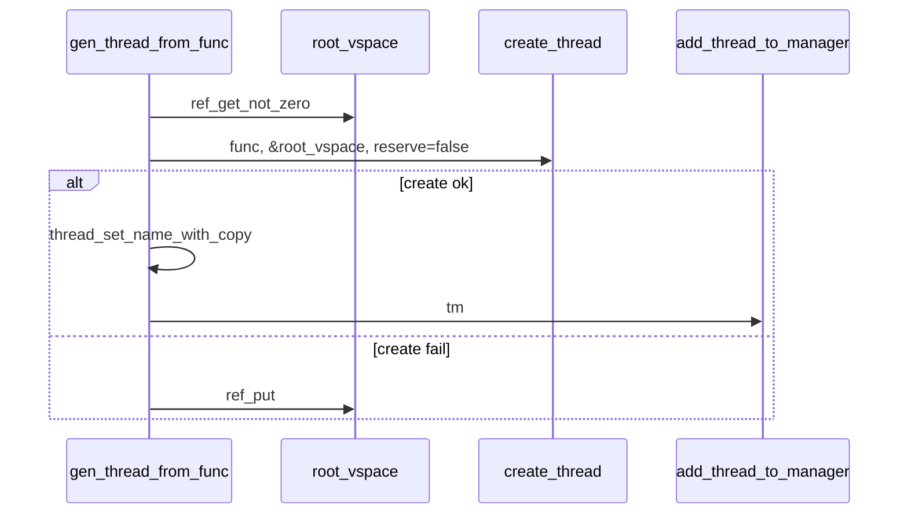

# 线程创建与 ELF 加载

v0.1 · 2026-08-27

本篇覆盖：`kernel/task/thread_loader.c`、`include/rendezvos/task/thread_loader.h`、`modules/elf/elf.c`、`modules/elf/elf_print.c`、`include/modules/elf/*.h`、`arch/*/task/arch_thread.c`、`arch/*/task/arch_switch.S`、`arch/*/task/arch_run_thread.S`、`arch/*/task/arch_user_switch.S`、`include/arch/*/thread_arch.h`。

`create_thread` 通用语义与 `thread_entry` 路径见 `线程与Task_Manager.md`；VSpace 创建/register/所有权见 `02-内存管理/Radix树与用户映射.md` 与 `VSpace所有权与调度切换.md`；纯 ELF 头/Phdr 解析模块边界见 `09-平台模块/ELF加载辅助模块.md`；`page_slice` 读文件镜像见 `02-内存管理/page_slice稀疏页索引.md`。

---

## 1. 概述

RendezvOS core 提供三条常见创建路径：

1. **`create_thread`** — 底层工厂：分配 kstack、设置 arch 上下文指向 `thread_entry`，把 **live `VSpace` ref** 转入 `thread->vs`。
2. **`gen_thread_from_func`** — 内核线程便捷封装：`ref_get` `root_vspace` → `create_thread` → 命名 → `add_thread_to_manager`。
3. **`gen_thread_from_elf` / `run_elf_program`** — bare-core 测例路径：新建用户 `VSpace`、映射 PT_LOAD、建 user stack、以 `run_elf_program` 为线程体，最终 `arch_return_to_user` 跳入 ELF entry。

此外 **`copy_thread`** 供兼容层实现 fork/clone 类语义：复制父用户 trap frame 与 arch 上下文，子线程从 `run_copied_thread` 带 syscall 返回值回到用户态。

本篇说明各 API 的参数/所有权、ELF 映射步骤、user stack 布局，以及 append hook 在 ELF 路径上的调用点。

---

## 2. 目标与边界

core 负责：**TCB + kstack + arch 上下文** 的创建，以及 **把 ELF PT_LOAD 映射进给定 VSpace** 的标准 helper。不在 core 内实现完整 execve（无 shebang、无 interpreter 链、无 AT_* aux vector 标准集）；兼容层 personality 可自建 loader，仅复用 `load_elf_to_vs` 或完全自管映射。

core 不做：解析 argv/envp 入 user stack（`run_elf_program` 仅留 minimal null word）；动态链接器加载（`PT_DYNAMIC` 段 handler 为占位）；ELF32（显式拒绝）；自动 `add_thread_to_cpu` 跨核策略（调用方选 `tm`）。

---

## 3. 分层与调用方

**内核 server / initcall** — `gen_thread_from_func(&ptr, func, name, tm, arg)`。`name` 经 `thread_set_name_with_copy` 堆分配；`tm` 通常为 `percpu(core_tm)` 或 `task_manager_for_cpu(target)`。

**bare-core / 测例** — `gen_thread_from_elf(&ptr, hooks, slice)`：`slice` 为已填充的 ELF 文件 `page_slice`；成功后线程在本核 `core_tm` 上 ready。`run_elf_program` 在首次被调度时在 **当前线程的 vs** 上完成映射并 drop 到用户（不再返回）。

**兼容层 fork/clone** — 先按政策 `clone_vspace` 或共享 AS，再 `copy_thread(parent, vs, child_tid_or_ret)`，然后 `add_thread_to_manager` / `add_thread_to_cpu`。`copy` hook 可复制 append 尾区（proc 结构等）。

**append_hooks** — `thread_append_hooks_t` 的 `init` 在 `run_elf_program` 映射完成后、`arch_return_to_user` 前调用（传入 `elf_load_info_t`）；`copy` 在 `copy_thread`；`fini` 在 `del_thread_structure`。core 不在 `create_thread` 时调 `init`。

调用方常见错误：`create_thread` 成功后对同一 `vs` 再 `ref_put`；`gen_thread_from_func` 失败时已内部 put root；对用户线程忘记 `THREAD_FLAG_USER`；`copy_thread` 源非 USER 线程。

---

## 4. 数据结构与不变量

### 4.1 Thread_Init_Para

```c
typedef struct {
        void* thread_func_ptr;
        u64 int_para[NR_ABI_PARAMETER_INT_REG];
} Thread_Init_Para;
```

`create_thread` 的 varargs 仅接受整数型参数，超过寄存器 ABI 上限的忽略。`run_elf_program` 路径：`int_para[0]` = `page_slice*`。

### 4.2 elf_load_info_t

```c
typedef struct elf_load_info {
        struct page_slice* slice;
        vaddr entry_addr;
        vaddr max_load_end;
        vaddr user_sp;
        u16 phnum;
        u16 phentsize;
} elf_load_info_t;
```

供 `append_hooks->init` 构建兼容层所需的进程元数据（例如记录 brk  hint）。

### 4.3 栈与页数常量

定义于 `thread_boot.c`：

- `thread_kstack_page_num = 2` — 每线程内核栈。
- `thread_ustack_page_num = 8` — `generate_user_stack` 映射的用户栈大小。

### 4.4 所有权（与 VSpace 篇一致）

| 路径 | `vs` 来源 | 成功后 caller 是否仍持有 vs ref |
|------|-----------|----------------------------------|
| `create_thread` | caller 传入 | **否** |
| `gen_thread_from_func` | 内部 get root | N/A（已转入 thread） |
| `gen_thread_from_elf` | 内部 create+register | N/A |
| `copy_thread` | caller 传入（clone 或新 AS） | 成功 **否**；失败 caller 仍持有 |

---

## 5. 代码对应

| 文件 | 职责 |
|------|------|
| `thread_loader.c` | `gen_thread_from_*`、`run_elf_program`、`load_elf_to_vs`、`generate_user_stack` |
| `thread_loader.h` | 公开 API 与 `elf_load_info_t` |
| `thread.c` | `create_thread`、`copy_thread`、`run_copied_thread` |
| `modules/elf/elf.c` | `check_elf_header`、`ELF64` 宏与 phdr 遍历 helper |
| `modules/elf/elf_print.c` | 调试打印 phdr |
| `mm_user_utils.c` / `vmm_radix_tree.c` | 用户区映射与 range 锁 |
| `page_slice_copy.c` | 文件内容拷入 user mapping |
| `arch_thread.c` | `switch_to`、`arch_ctx_*`、`arch_syscall_set_user_return` |
| `arch_run_thread.S` | `run_thread` |
| `arch_user_switch.S` | `arch_return_to_user` |

---

## 6. 流程

### 6.1 create_thread

1. 断言 `vs != NULL`。
2. `new_thread_structure`（含 IPC MSQ dummy、append 尾）。
3. `ref_init(&thread->refcount)`；`tid = get_new_id(&tid_manager)`。
4. kmalloc `thread_kstack_page_num` 页，`kstack_bottom = base + size`。
5. `arch_set_new_thread_ctx(&ctx, thread_entry, kstack_bottom, reserve_trap_frame)`。
6. 填充 `init_parameter`（func + varargs）。
7. `thread->vs = vs` — **所有权转移**。

失败路径：`del_thread_structure`（含 put vs 若已赋值）。

`reserve_trap_frame == true` 时内核栈底预留 `trap_frame` 槽（用户线程、copy 路径）。

### 6.2 gen_thread_from_func



不在此路径设置 `THREAD_FLAG_USER`（内核线程）。

### 6.3 gen_thread_from_elf

1. `create_vspace(root_vspace.pmm)` → `register_vspace(vs, &root_vspace)`。
2. `create_thread(run_elf_program, hooks, vs, reserve_trap_frame=true, 1, slice)` — vs 所有权转入 thread。
3. `generate_user_stack(thread->vs)` → `arch_set_thread_user_sp`。
4. `thread_set_flags(THREAD_FLAG_USER)`。
5. `add_thread_to_manager(percpu(core_tm), thread)`。

失败 rollback：`del_thread_from_manager`（若已 add）、`del_thread_structure`、或尚未 create 时 `ref_put(vs)`。

### 6.4 load_elf_to_vs

1. 从 `page_slice` 第 0 页取 kernel 映射基址，校验 ELF64 header。
2. 第一遍 phdr：对每个 `PT_LOAD` 调 `elf_Phdr_64_load_handle`：
   - 按 `p_vaddr` 对齐映射 user 页，`PF_R/W/X` → `PAGE_ENTRY_*`。
   - `mm_user_utils_set_range_and_fill` 分配 backing；`page_slice_copy_to_user` 拷贝 `p_filesz` 文件字节。
   - 跟踪 `max_load_end`。
3. 第二遍：`PT_DYNAMIC` 调占位 `elf_Phdr_64_dynamic_handle`（v0.1 无链接器加载）。
4. 可选输出 page-aligned `max_load_end_out`。

依赖 radix range 锁：`vmm_radix_tree_lock_range_big` / `unlock_range_big`。

### 6.5 generate_user_stack

- 栈顶方向：`USER_SPACE_TOP` 向下 `thread_ustack_page_num` 页。
- flags：`USER | VALID | READ | WRITE`。
- 返回 **初始 user SP** = 映射高地址 − 8（16 字节对齐惯例前的 minimal 槽）。

### 6.6 run_elf_program（线程首次运行）

在线程上下文中执行（`vs` 取自 `get_cpu_current_thread()->vs`）：

1. `load_elf_to_vs(slice, vs, &max_load_end)`。
2. 读 `e_entry`；在 user SP 上写 8 字节 0（占位）。
3. 若 `append_hooks->init`：填 `elf_load_info_t` 并调用。
4. 重新读 user SP（init 可能修改）。
5. `arch_empty_drop_trap_frame` + `arch_syscall_set_user_return` + **`arch_return_to_user`** — 不返回。

### 6.7 copy_thread

前置：`src` 必须 `THREAD_FLAG_USER`。

1. `create_thread(run_copied_thread, src->append_hooks, vs, true, 1, custom_return_value)`。
2. 拷贝 `src` kstack 上的 `trap_frame` 到 `dst`。
3. `arch_ctx_refresh(src)`；`arch_ctx_merge_from_src(dst, src)` — 同步 live SP/TLS。
4. `dst->flags = src->flags`；复制 name；可选 `append_hooks->copy`。
5. 返回时 status 仍为 **init** — 由 caller `add_thread_to_manager` 置 ready。

子线程首次运行：`run_copied_thread(syscall_return_value)` 写 trap frame 返回值并 `arch_return_to_user`；失败则 exit 路径 `schedule`。

---

## 7. 公开 API

| API | 返回值 / 所有权 |
|-----|-----------------|
| `create_thread(func, hooks, vs, reserve_tf, n, ...)` | 成功 → 新 thread，caller 不得 put vs |
| `gen_thread_from_func(ptr, func, name, tm, arg)` | 成功 add 到 tm；失败 put root |
| `gen_thread_from_elf(ptr, hooks, slice)` | 成功；slice 生命周期 **不由 core 释放** |
| `load_elf_to_vs(slice, vs, max_out)` | 仅映射，不创建线程 |
| `generate_user_stack(vs)` | 0 失败 |
| `run_elf_program(slice)` | 设计为不返回；错误码仅内部失败 |
| `copy_thread(src, vs, ret)` | 成功 dst 未入队；失败 put vs |

kthread 函数签名：`void* (*)(void*)`（`kthread_func`）。

---

## 8. 多架构

- **`arch_set_new_thread_ctx`** — 各 arch 设置内核 RIP/PC、RSP/SP、段/EL 状态；`reserve_trap_frame` 决定 kstack 布局。
- **`arch_return_to_user`** — 从 `kstack_bottom` 弹出或合成 trap frame，恢复 user PC/SP/标志位。
- **`arch_empty_drop_trap_frame`** — exec 类「无父帧」首次进用户。
- **`arch_set_thread_user_sp` / `arch_get_thread_user_sp`** — 记录在 `Arch_Thread_Context` 与 per-CPU scratch（x86 `user_rsp_scratch`）。
- x86_64 与 aarch64 均实现上述符号；切换细节见各 `arch_thread.c` / `.S`。

---

## 9. 测试

- **`modules/helloworld`** 等 incbin ELF 经 `gen_thread_from_elf` 启动（若测例配置启用）。
- **`single_test` / `smp_test`** 大量使用 `gen_thread_from_func`。
- ELF 模块打印：`print_elf_ph64` 在加载时输出 phdr（日志级别依赖配置）。

```bash
cd core && make ARCH=x86_64 config && make all && make run
```

与当前源码一致，尚未复测。

---

## 10. 限制与后续

- **ELF32** — 明确拒绝。
- **PT_DYNAMIC / interpreter** — 未加载共享库；完整 exec 由兼容层负责。
- **User stack auxv/argc/argv** — `run_elf_program` 未构建标准栈图像；hook 或兼容层须补充。
- **`gen_thread_from_elf` 固定 `percpu(core_tm)`** — 不跨核创建；跨核须 `create_thread` + `add_thread_to_cpu` 自管后续步骤。
- **slice 生命周期** — 由测例或 hook 释放；core 不 destroy slice。

---

## 11. 变更记录

| 日期 | 摘要 |
|------|------|
| 2026-08-27 | 初稿：create/gen/copy/ELF/user stack 全路径 |
