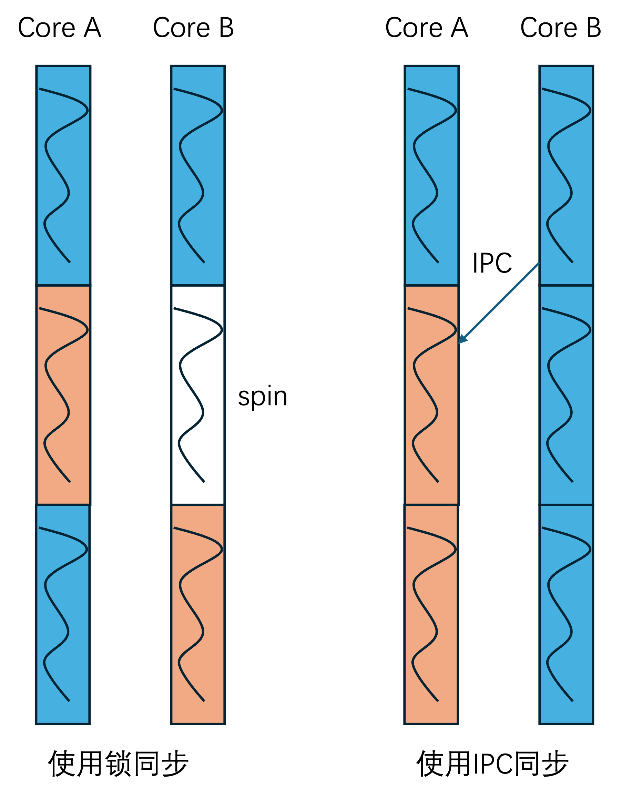
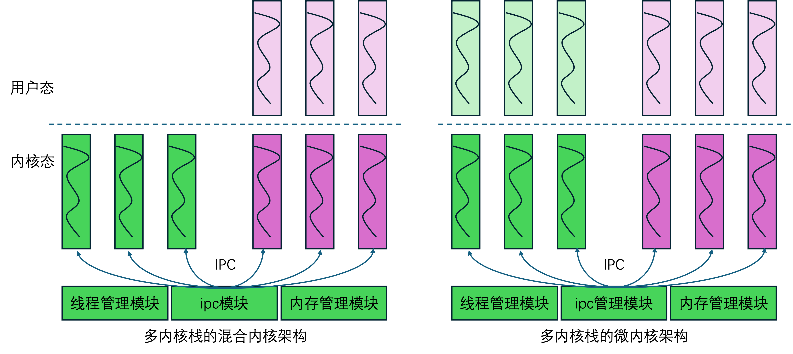
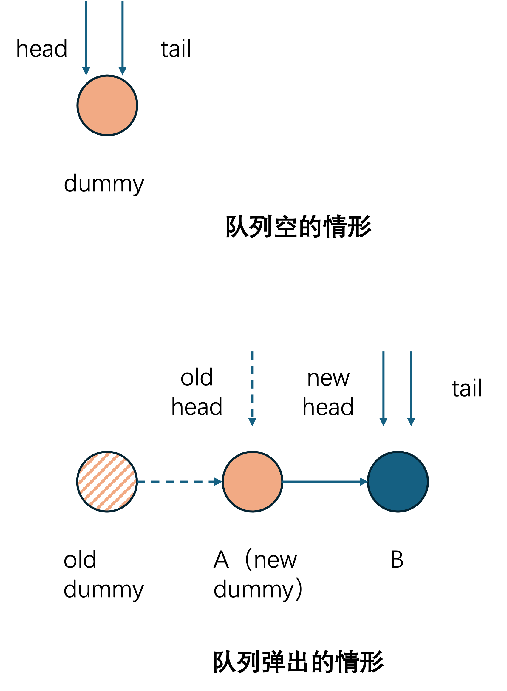
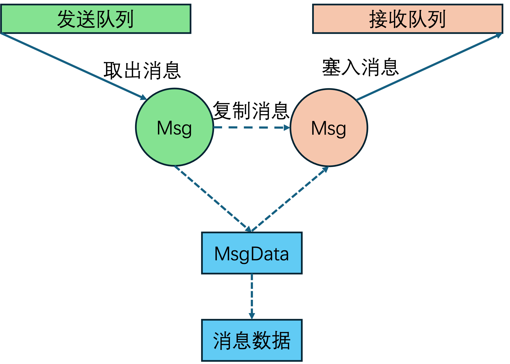

# 无锁队列与 EBR 设计

v0.1 · 2026-10-02

本篇覆盖：`include/common/dsa/ms_queue.h`、`include/common/taggedptr.h`；以及 IPC / message 路径上 **如何咬合** EBR（`kernel/task/ebr.c`）。`ipc.c` / `message.c` 的对象与收发契约分别以 Port 篇、收发篇为准——本篇只写「队列算法迫使它们长成什么样」。

EBR 在调度与线程 teardown 中的用法见 `03-任务与调度/17-EBR与线程资源回收.md`；Port 对象见 `19`；会合收发见 `20`；tagged pointer 位布局亦见 `taggedptr.h` 注释。

### 在 04-IPC 章里怎么读

整章设计意图压在本篇 **§1 的五张图**上。建议顺序：

1. **本篇 §1** — 为何同步沉进 IPC、为何 MSQ、假出队如何迫使 Msg 拆开与单状态 port
2. **`19`** — 两层模型与对象（port / `Msg_Data` / `Message_t`）
3. **`20`** — 推拉会合、`Ipc_Request`、transfer、system 投递
4. **`21` / `22`** — kmsg 与 hooks（横向）
5. **本篇 §2 起** — MSQ / tagged ptr / EBR 的算法与 API

下表把五图→后果→权威篇钉死，避免三篇各讲一半、读者对不上：

| 图（`figures/`） | 钉死什么 | 对象/行为权威 | 算法权威 |
|------------------|----------|---------------|----------|
| `lock-vs-ipc` | 临界区线程化后，同步变成 IPC 会合；无锁是扩展前提 | `19` §1、`20` §1 | 本篇 §1.1 |
| `hybird-vs-micro` | 混合≈微内核同构；IPC + 可感知阻塞的调度是核心件 | `19` §1 | 本篇 §1.2 |
| `dummy-link-list` | 朴素链表无法无锁 → 必须 MS 假出队 | — | 本篇 §1.3–§1.4、§6 |
| `ms-queue-feature` | 假出队；节点不能整段迁移走；port 单状态扩展 | `19` §4.1–4.2、`20` §4.1 | 本篇 §1.4、§1.7、§6.2–6.3 |
| `ipc_transfer_message` | 给 receiver 新建 `Message_t`、共享 `Msg_Data`；`send_pending_msg` 兜底 | `19` §4.2、`20` §6.4 | 本篇 §1.5 |

---

## 1. 概述

在 §1.1 我们介绍了锁并发与基于IPC并发的同构性，并解释了，我们试图使用无锁IPC来规避内核锁并发的核心思路。

基于这种同构性，我们在 §1.2 讨论了，基于无锁 IPC 方案来解构锁，同时使用单执行流来循环执行临界区，使用无锁IPC方案进行通信协作，这样一个代码执行思路。其最终的目的是，为了让兼容层实现的代码，可以以单执行流的方式实现，以规避复杂的内核并发实现问题。

RendezvOS v0.1 的并发无锁IPC核心是 **Michael–Scott 无锁 MSQ**（Maged M. Michael 与 Michael L. Scott 提出的多生产者多消费者无锁队列算法，`ms_queue_t`），同时添加 **tagged pointer** 在指针里携带 small tag 来解决ABA问题和带状态的 port 会合问题，再配 **EBR**（Epoch-Based Reclamation，基于世代的延迟回收）延迟释放节点，避免「队列上还能看见、堆里已经 free」的 UAF（Use-After-Free，释放后使用）。从而在 §1.3 到 §1.7 的剩余几个小节，概述了这些细节实现上的一些问题。

三处主要用法：port 的 `thread_queue`；每线程 send / recv 消息队列；kmalloc 跨核 free（见 kmalloc 篇）。

下面五张图构成整套设计框架（图源在同目录 `figures/`）。**图本身才是动机真源**；文字是解说。Port / 收发两篇从这些图**往下推导**对象与行为，不另开一套故事。

### 1.1 同步没有消失，只是搬家了

宏内核里两核都要访问同一块共享资源：一核进临界区，另一核自旋——核数一多，各核轮流等待，总等待会急剧上升。



左图「使用锁同步」：两核各自跑非临界区（蓝），争用时一核进临界区（橙），另一核 **spin**（白）——吞吐被串行化。右图「使用 IPC 同步」：共享资源变成**一个 server 线程**（橙框），其它线程只发 IPC；业务侧可以写成「单线程循环收消息」。但多核同步**没消失**：两个客户端同时向 server 投递请求，**谁先谁后、会不会丢失配对**，全变成 **IPC 框架自己的同步问题**。

所以：若 IPC 还用一把大锁做会合，核数增多时争用情况和宏内核大锁差不多——混合内核「换扩展性」的叙事在底层崩塌。v0.1 的选择是 port 会合与消息队列走 **无锁 MSQ**：每核承担自己那份操作成本，再加上调度切换。核少时，精心设计的细粒度锁往往更便宜（切换比获取锁贵）；**核变多、临界区都线程化之后**，可扩展的无锁 IPC 才是前提。

**代价量级（直觉，非基准）：** N 个客户端争同一把锁，最坏等待像 **O(N²)** 累积；「一 server + 无锁 port」每人承担一次会合 / 切换，总工作更接近 **O(N)**——争用从「自旋消耗 CPU」变成「排队进 server」。

对比：有的系统用大内核锁换验证简单；有的假设 SPSC（Single-Producer Single-Consumer，单生产者单消费者）环形缓冲区。我们面对的是混合内核里常见的 **MPMC（Multi-Producer Multi-Consumer，多生产者多消费者）会合**（多客户端对一个 server port），所以要可带 tag 约束的 MS 队列。

→ **Port 为何存在、为何会合先于搬消息**：见 `19` §1。

### 1.2 混合内核与微内核在 IPC 轴上同构



本框架里，除内存 / 线程管理外，多数内核功能以内核线程跑在高半地址；用户线程进内核有**自己的内核栈**（不是单内核栈），内核态延伸流也可以当「能收发 IPC 的执行流」看。左图：混合内核——绿为纯内核 server 栈，紫为用户线程陷入后的内核栈；IPC 模块连到所有内核栈底。右图：把业务下放到用户态后，仍是「多栈 + 中央 IPC」——**基于 IPC 的混合内核与微内核在这条轴上是同构的**；IPC + 能感知阻塞的调度因此是核心件，不是边缘组件。

运行条件上还有两点：IPC 路径工作在**同一内核地址空间**（用户 AS（Address Space，地址空间）不同，但内核映射共享，不必为会合切页表）；内核里通常**手动 schedule**——竞态主要来自多核，阻塞点必须主动让出，否则同核其它线程饥饿。

→ **阻塞会合必须 `schedule`、谁跑 transfer**：见 `20` §1。

### 1.3 为何朴素链表做不成无锁队列

固定 dummy 的单链表看起来只要把 `dummy→next` 从 A 改成 B 就能出队：


并发下却要在**两次非相邻读**之后再写一次：`读 dummy→next(=A)` → `读 A→next(=B)` → `写 dummy→next = B`。竞态一例：

1. T1 读到 `dummy→next = A`
2. T2 先把 A、B 都出队，队列空（`dummy→next = NULL`）
3. T1 仍持有过期的 A，读到 `A→next = B`，再把 `dummy→next` 写成 B

于是 **已被出队的 B「复活」**。无 dummy 时用独立 `head` 指向首元，矛盾同类。根因：需要**同时**原子更新「dummy→A」与「A→B」两处非相邻指针；硬件 CAS 一次只能动一个字，朴素链表无锁做不到。Michael–Scott 队列用「假出队 + 帮助推进 tail」绕开了这个双指针硬性需求。

### 1.4 MSQ 四性质（假出队）



上半：空队列 = 唯一 dummy，**head 与 tail 都指向它**。下半：出队时旧 dummy 被摘除（虚线），原先的 A 成为**新 dummy 且必须仍挂在队上**；逻辑上「弹出」的是载荷语义，节点内存不能整段迁移走。

四条钉死实现取舍：

| # | 性质 | 后果 |
|---|------|------|
| 1 | **MPMC** | 多客户端对一个 server port 合法 |
| 2 | **空 = 单 dummy，head=tail** | 空判断不能靠「head 是否 NULL」 |
| 3 | **假出队**：新 dummy **必须留队**；其 `next` 可能仍被别人读 | **不能**把刚 dequeue 的节点整段迁移到另一队列；只能给对方新建 `Message_t` + 共享 `Msg_Data_t`（§1.5、`19` §4.2） |
| 4 | **帮助推进 stale tail** | 失败不是「立刻放弃」，常需重试 |

再钉两条 **IPC 侧后果**（对象在 `19`，行为在 `20`）：

- **Port 单状态线程队列**：同一时刻要么全 SEND、要么全 RECV（或空）。双队列「检查 + 插入」无法单 CAS——见 `19` §1。扩展原语：`msq_enqueue_check_tail` / `msq_dequeue_check_head`（本篇 §1.7、§6.2–6.3）。
- **会合排队的是 `Ipc_Request_t`，不是 TCB**：假出队会让「刚匹配的节点」仍当 dummy；若把 TCB 嵌进节点再入队会自环——见 `20` §4.1。

### 1.5 假出队迫使 `Msg` / `Msg_Data` 拆开



从发送队列**取出**的是 `Message_t`；transfer 时给接收方**再分配一条** `Message_t`，发送侧与接收侧各自持有同一份 `Msg_Data_t`（再指向真正载荷）。不能把 MSQ 节点整段迁移到接收队列——假出队要求旧节点可能仍被别人当 dummy / next 读。拆开之后：`Message_t` 跟着队列走、可独立 refcount；载荷一对一绑在 `Msg_Data` 上（内核里往往无法在任意缓冲前后强行添加一个 refcount）。

对象字段与生命周期：`19` §4.2。谁跑 transfer、exit race、`send_pending_msg`：`20` §1.1、§6.4。

### 1.6 ABA 与 tagged pointer

CAS 只看「字是否仍等于期望值」。典型 ABA：

1. T1 读到 head/tail 字 = **A**（某节点地址）
2. T2 把该节点 dequeue → free → 分配器又把**同一地址**分给新节点再入队
3. T1 的 CAS 仍看见地址 A，以为没人动过，误判为成功

队列里 head/tail/`next` 都是 CAS 目标；节点经 EBR/堆复用后，裸指针 CAS 分不清「同一地址、不同代」。

本仓库：`tagged_ptr_t` = **低 48 位地址 + 高 16 位 tag**（`taggedptr.h`）。`tp_get_ptr` 对 bit47 做 **canonical 符号扩展**，否则内核高半地址解包会出错。每次推进 tail / 改链时 tag 单调递增（单状态扩展下步长为 `1 << append_info_bits`，低位留给 port 状态）。即使指针回到同一地址，tag 不同 → CAS 失败 → 重试。EBR 延迟 reclaim，缩短「还挂在别人读路径上的节点被立刻复用」的窗口；**tag 解决 ABA 检测，EBR 解决读侧寿命**——二者互补，不是互相替代。

tagged pointer 解决 ABA 的原理（同一地址、不同代）：

```text
   tagged_ptr_t = [ 16-bit tag (高) | 48-bit 地址 (低) ]
                  └─ append_info_bits 占 tag 低位 ─┘

   T1 读 tail = {tag=5, addr=A}              ┌── T2 把 A dequeue → free → 分配器
   准备 CAS tail {5,A}→{6,B}                  │   又把同一地址 A 分给新节点再 enqueue
                                              ▼   tail 现在是 {tag=6, addr=A}
   T1 的 CAS {5,A}→{6,B}：tag 不匹配（5≠6）→ 失败 → 重试
   ── 即使地址碰巧相同，tag 单调递增让 T1 看见「这是新一代」，不会误以为没人动过
   注：x86_64 虚拟地址 canonical 形式只用低 48 位，高 16 位空出来正好放 tag
        bit47 = 1（内核高半）时 tp_get_ptr 须符号扩展到 64 位，否则解出的指针非法
```

### 1.7 单状态扩展（EMPTY 枢纽）

标准 MSQ 不区分「队列里现在全是谁」。Port 需要「整条队同一侧」。做法：

- `append_info_bits`（≤15）占用 tag 低位存 `IPC_PORT_STATE_*`；高位仍作 ABA 计数，`tag_step = 1 << bits`。
- **状态只写在 tail** 的 append 域（head / next 不作权威）。
- `EMPTY` 是 SEND↔RECV 的枢纽：任一侧可从 EMPTY 入队并改状态；对侧 `dequeue_check_head` 才匹配。
- 入队 CAS 失败但 tail 状态未变：退化成同侧 MS 竞态，仍正确——对侧无法进入。

细节咬合见 §6.2 / §6.3；状态机与生命周期见 `19`；enqueue_wait / try_match 调用序见 `20`。

---

## 2. 目标与边界

**提供：** MSQ + tagged ptr + 与 EBR 的咬合约定；支撑「临界区线程化 → 同步沉入 IPC」的混合内核模型（§1.1）。把假出队、单状态、Msg 拆开、Ipc_Request 等**设计后果**钉死，供 `19`/`20` 承接。

**不做：** Port / Message 对象契约（`19`）；`send_msg` / `recv_msg` / system 投递状态机（`20`）；通用阻塞队列；优先级队列；内核 malloc 层对 EBR 的隐藏（caller 显式 `ebr_retire_ref`）；跨进程队列；形式化验证完备性声明。

权衡：

- MSQ dequeue 会 **移动 dummy 节点** 并 `ref_put` 旧 dummy，故 message 拆成 `Msg_Data_t` + `Message_t`（`19` §4.2）。
- EBR retire 表 overflow 时 **leak**（泄漏，保留节点不回收）而非 UAF（见 EBR 篇）——用可观测泄漏换并发安全上界。
- 无锁正确性依赖 tag / EBR 纪律；写错 `free_func` 或缺 `ebr_enter` 会导致稀有崩溃，框架将难度留给少数原语实现者，而非每个 server 作者。

与相邻子系统：跨核传递的消息 / 对象常在 **A 核 `kallocator` 分配、B 核释放**，堆必须承认所有权（见 kmalloc 篇跨核 free MSQ）。单执行流 server 依赖本篇原语，而不是在业务里自写多核锁协议。

---

## 3. 分层与调用方

**IPC 实现**（`ipc.c`，契约见 `20`）— 只通过 `msq_enqueue` / `msq_dequeue` / `msq_enqueue_check_tail` / `msq_dequeue_check_head` 操作 port 队列；**不**直接 malloc 队列节点（Ipc_Request 在外部分配）。

**Message**（`message.c`，契约见 `19`）— `free_message_ref` → EBR → `free_message_ref_real` 真正销毁。

**任意 MSQ 读者** — 必须在 `ebr_enter()` 与 `ebr_exit()` 之间完成指针遍历（`ms_queue.h` inline 已包裹）。

**集成方** — 一般 **不**直接操作 port `thread_queue`；仅使用 send / recv API。若扩展新无锁结构，须同样配对 EBR 或证明无并发读。

---

## 4. 数据结构与不变量

### 4.1 ms_queue_node_t / ms_queue_t

```c
typedef struct {
        ref_count_t refcount;
        tagged_ptr_t next;
} ms_queue_node_t;

typedef struct Michael_Scott_Queue {
        tagged_ptr_t head;
        tagged_ptr_t tail;
        size_t append_info_bits;  /* tag 可用位数，≤15 */
} ms_queue_t;
```

- 队列 **不**内嵌 payload；用 `container_of` 从 node 得 `Ipc_Request_t` / `Message_t`。
- **Dummy 节点** — `msq_init` 用 caller 提供的空 node 作初始 head / tail；dequeue 成功后旧 dummy 经 `free_func` 释放（可能 EBR）。

### 4.2 tagged pointer

布局见 §1.6。Port 用 tag 低 **2 bit**（`IPC_PORT_APPEND_BITS`）存 `IPC_PORT_STATE_*`；`msq_enqueue_check_tail` 要求 tail append 与期望一致才 enqueue。内核堆对齐保证地址域低位可给 MS 方案腾空间。v0.1 **不**另开 wide-CAS ABA 计数。

### 4.3 refcount 约定

- 入队节点：caller 分配，`ref_init` 或 **`ref_get_not_zero`** 后 enqueue。后者用 CAS 环：仅当 count ≠ 0 才加一——避免「`fetch_dec` 已到 0、即将 free」与「另一核 `ref_get` 又把死对象救活」的竞态。普通 `ref_get` 在 MS 节点上不够安全。
- dequeue 返回数据 node 时已 **increment** refcount；caller `ref_put(..., free_func)`。
- `free_func` 对 IPC / message 通常为 `free_ipc_request` / `free_message_ref` → **EBR retire**。EBR 保护读侧仍可能看见的节点；refcount 保护对象逻辑寿命。

### 4.4 EBR 与 MSQ 协作（摘要）

| 角色 | 动作 |
|------|------|
| MSQ 读者 | `ebr_enter` … 读 next 指针 … `ebr_exit` |
| 节点最后一个 ref_put | `ebr_retire_ref(ref, real_free)` |
| 任意 schedule | `ebr_try_reclaim` 扫描 retire_epoch < safe_epoch |

**safe epoch** — 所有 active CPU 的 `local_epoch` 最小值与 global epoch 的关系见 EBR 篇。本篇不重复公式。

EBR grace period 与 retire/reclaim 时序：

```text
   global epoch:        G0          G1          G2          G3
                       │           │           │           │
   CPU0 local_epoch:   G0 ──enter───────────exit── G2 ──enter──...
   CPU1 local_epoch:   G0 ──enter──exit── G1 ──enter──────────exit──...
                       │           │           │           │
   safe_epoch = min(active local_epoch)
                       │           │           │
   retire 表:        retire@G0 ────► safe≥G1 后可 reclaim
                       │           │
                       │           └─► retire@G1 ────► safe≥G2 后可 reclaim

   关键不变量：节点 retire 时的 epoch G 必须严格小于「所有 CPU 都已离开 G、进入 G+1 之后」
              的 safe_epoch，才能 reclaim——保证任何可能看见该节点的读者都已退出临界区
   overflow：retire 表满时 EBR 选择 leak（保留节点）而非冒险 reclaim → UAF
              （用可观测泄漏换并发安全上界，详见 `17`）
```

---

## 5. 代码对应

| 文件 | 职责 |
|------|------|
| `ms_queue.h` | MSQ 全部 inline 操作 + EBR 包裹 |
| `taggedptr.h` | tag / ptr 打包与 CAS |
| `ebr.c` / `ebr.h` | epoch 与 retire 表 |
| `ipc.c` | port check_head / dequeue、request free |
| `message.c` | message free retire |
| `task_manager.c` | schedule → reclaim |

主要 MSQ 入口：`msq_init`、`msq_enqueue`、`msq_dequeue`、`msq_enqueue_check_tail`、`msq_dequeue_check_head`、`msq_clean_queue`。

---

## 6. 流程

### 6.1 标准 enqueue / dequeue

```text
调用方:  alloc node → msq_enqueue / msq_dequeue（**不必**再自行 ebr_enter；
         两入口 inline 内部已 ebr_enter…ebr_exit）
         → 对返回的数据节点 ref_put(..., free_func)   // 可能进 EBR（旧 dummy 亦 put）
```

概念上「写端只链新节点、读端遍历可能看见已 retire 节点」仍成立；实现上 **enqueue/dequeue 都包了 EBR**，调用方勿双重 enter。

MS 队列 enqueue / dequeue 算法（伪码，省略 EBR 包裹与 tag 推进细节）：

```text
   msq_enqueue(q, node, free_func):
     loop:
       tail = q->tail                       # 读 tail（tagged ptr）
       next = tail->next
       if tail == q->tail:                   # tail 未变
         if next == NULL:                    # tail 是末元
           if CAS(&tail->next, NULL, node):  # 链上 node
             break                           # 成功
         else:                               # tail 落后于 next
           CAS(&q->tail, tail, next)         # 帮助推进 tail（help stale）
       # 否则重试
     CAS(&q->tail, tail, node)              # 推进 tail（tag+step）

   msq_dequeue(q, free_func) -> node | none:
     loop:
       head = q->head; tail = q->tail
       next = head->next                    # head 必是 dummy
       if head == q->head:
         if head == tail:                   # 队列空或 tail 落后
           if next == NULL: return none    # 真·空
           CAS(&q->tail, tail, next)       # 帮助推进 tail
         else:
           value = next->value             # 读首元数据
           if CAS(&q->head, head, next):   # 假出队：head 跳到 next
             free_func(head)               # 旧 dummy 经 EBR retire
             return next                   # next 成为新 dummy（仍挂队）
   注：CAS 均带 tag 比较；tag 不匹配则视为「已被别人改」，重试
        假出队 = 逻辑弹出 value，但 next 节点内存仍挂在队上当新 dummy
```

### 6.2 Port 会合 enqueue（check_tail）

`ipc_port_enqueue_wait` 调用 `msq_enqueue_check_tail(&port->thread_queue, &req->ms_queue_node, my_ipc_state, tp_new(NULL, expected_ipc_state), free_ipc_request)`：

- 仅当 tail tag 为 `expected_ipc_state`（EMPTY 或同侧 SEND / RECV）才链接；
- 成功后 tail tag 更新为 `my_ipc_state`；
- 失败 `-E_REND_AGAIN` → 调用方重试（并发侧可能已 match）。

### 6.3 try_match（check_head）

`ipc_port_try_match` → `msq_dequeue_check_head(..., MSQ_CHECK_FIELD_APPEND, tp_new(NULL, target_ipc_state), NULL)`：

- 校验 head 后首个真实节点的 append tag 为 **对侧** 状态；
- tag 不匹配则 continue dequeue。
- **IPC 层还要再滤一层：** `ipc_port_try_match` 在 dequeue 之后检查对头线程 status / `port_ptr`，不合格的 request 直接 put 掉再取下一个（见 `20` §6.0）。这不是 MSQ 算法的一部分。

### 6.4 msq_clean_queue（teardown）

`thread_release_owned_resources` 用 `msq_clean_queue(..., free_message_ref)` 排空 thread 队列。注释强调：**不要**对 dummy 二次 `ref_put`；空队列 dequeue 路径已处理 dummy refcount。

---

## 7. 公开 API

本篇涉及的接口分布在：`ms_queue.h`（MSQ 全套 inline）与 `taggedptr.h`。EBR 符号说明与完整约定见 **`17` §7**（本篇只钉与 MSQ 的咬合）。

IPC **不**把 MSQ 再包一层公开 API；上层经 `send_msg` / port 会合间接使用。

### 7.1 编排顺序（调用方须遵守）

| 场景 | 顺序 |
|------|------|
| 建队列 | 分配 dummy node → **`msq_init(q, dummy, append_info_bits)`** |
| 普通入/出队 | 节点 `ref_init` → **`msq_enqueue`** / **`msq_dequeue`** → 对返回节点 **`ref_put(..., free_func)`** |
| Port 单状态会合 | **`msq_enqueue_check_tail`** / **`msq_dequeue_check_head`**（tag=SEND/RECV） |
| 读临界区 | MSQ 内部已 **`ebr_enter`…`ebr_exit`**；节点 last put → **`ebr_retire_ref`**（message/ipc free） |
| teardown 排空 | **`msq_clean_queue(q, true, free_*)`** — **勿**对空队列路径的 dummy 再 put |

### 7.2 MSQ（`ms_queue.h`）

```c
void msq_init(ms_queue_t *q, ms_queue_node_t *dummy, size_t append_info_bits);
void msq_enqueue(ms_queue_t *q, ms_queue_node_t *node,
                 error_t (*free_func)(ref_count_t *));
tagged_ptr_t msq_dequeue(ms_queue_t *q, error_t (*free_func)(ref_count_t *));
error_t msq_enqueue_check_tail(ms_queue_t *q, ms_queue_node_t *node,
                               u64 append_info, tagged_ptr_t expect_tp,
                               error_t (*free_func)(ref_count_t *));
tagged_ptr_t msq_dequeue_check_head(ms_queue_t *q, u64 check_field_mask,
                                    tagged_ptr_t expect_tp,
                                    error_t (*free_func)(ref_count_t *));
void msq_clean_queue(ms_queue_t *q, bool zero_head_tail,
                     error_t (*free_func)(ref_count_t *));
```

| 接口 | 说明 |
|------|------|
| `msq_init` | dummy 作初始 head=tail；`append_info_bits` 钳制 ≤15。 |
| `msq_enqueue` | MS 入队 + EBR 包裹；可帮助推进 stale tail。 |
| `msq_dequeue` | **假出队**：返回数据节点（持一 ref），旧 dummy put；该节点留作新 dummy。空 → none（已 put 唯一 dummy）。 |
| `msq_enqueue_check_tail` | tail append-tag 须匹配 `expect_tp`，否则 `-E_REND_AGAIN`。 |
| `msq_dequeue_check_head` | 对 next 做 PTR/APPEND 检查（`MSQ_CHECK_FIELD_*`）。 |
| `msq_clean_queue` | 循环 dequeue+put；空路径勿二次 put dummy。 |

队列不内嵌 payload：`container_of` → `Message_t` / `Ipc_Request_t`。

### 7.3 tagged pointer（`taggedptr.h`）

```c
tagged_ptr_t tp_new(void *ptr, u16 tag);
void *tp_get_ptr(tagged_ptr_t);
u16 tp_get_tag(tagged_ptr_t);
tagged_ptr_t tp_new_none(void);
bool tp_is_none(tagged_ptr_t);
```

48-bit 地址 + 16-bit tag；`tp_get_ptr` 做 canonical 符号扩展。Port 用 tag 低 **2 bit** 存 `IPC_PORT_STATE_*`。

### 7.4 EBR（交叉引用 `17`）

```c
void ebr_enter(void); void ebr_exit(void);
void ebr_try_reclaim(void);
error_t ebr_retire_ref(ref_count_t *, error_t (*free_func)(ref_count_t *));
```

MSQ 读者路径已包 enter/exit；`free_message_ref` / `free_ipc_request` → retire。`schedule` 推进 reclaim。安全条件 `retire_epoch < safe`、overflow leak：见 `17`。

---

## 8. 多架构

MSQ / EBR 纯 C + atomics，**arch 无关**。`tagged_ptr` 假设指针低位对齐留出 tag 位（内核 heap 对齐满足）。CAS 具体指令随 arch（`lock cmpxchg` / `ldaxr`+`stlxr` 等），语义相同。

---

## 9. 测试

- SMP IPC 测试用例对 MSQ + EBR 施加并发压力。
- `ebr_dump_stats` — 调试 retire / overflow（非正式测试用例）。

```bash
cd core && make ARCH=x86_64 config && make all && make run
```


---

## 10. 限制与后续

- **MPMC 假设** — 依赖 MS 算法与正确 tag；错误 `free_func` 或缺 EBR enter 会导致 rare crash。
- **EBR_RETIRE_SLOTS=512** — 极高 churn 可能 overflow leak（见 EBR 篇）。
- **append_info_bits 上限 15** — tag 空间受限；port 仅用 2 bit。
- **无 hazard pointer 备选** — 全库统一 EBR；其他子系统复用须遵守 enter / exit 纪律。

更形式化正确性论证不在本篇展开；若替换队列实现须同步更新本篇与 EBR / IPC 相关 full。性能、广播、批量绕开会合等**尚未实现**的项见 `20` §10.1 与 `v0.1/evolution/TODO.md`（E2）——**现行设计动机与约定以本篇正文为准**。

---

## 11. 变更记录

- 2026-10-05：§6.3 标明 IPC `try_match` 在 MSQ dequeue 之后还要丢 status/`port_ptr` 不合格的 request（权威在 `20` §6.0）；§10 未实现项回链 `20` §10.1。
- 2026-10-05：任务 1/3/5 精读——口语词与翻译腔清理（涨得很陡→急剧上升、丢配→丢失配对、塌掉→崩塌、故事→情况、付自己那份→承担自己那份、精心细锁→精心设计的细粒度锁、堆起来→累积、烧核→消耗 CPU、环假设 SPSC→假设 SPSC 环形缓冲区、边角插件→边缘组件、饿死→饥饿、硬需求→硬性需求、摘掉→摘除、搬走/挪→迁移、硬加→强行添加、进不来→无法进入、会错→会出错）；为首现缩写补全称/释义（Michael–Scott、EBR、UAF、SPSC、MPMC、AS、leak）；§9「测例」→「测试用例」。
- 2026-10-02：整章表述逻辑：§1 定为 04-IPC 设计框架（五图 + 图→18/19 后果表）；收窄本篇覆盖面（不拥有 ipc/message 契约）；§1.4–1.5 明确牵出单状态 port / Ipc_Request / Msg 拆分。
- 2026-10-02：迁入 lockfree-IPC 五张设计图到 `figures/`，嵌入 §1.1–§1.5（锁 vs IPC、混合≈微、dummy 复活、MSQ 假出队、Msg 壳复制）；§1.6 ABA、§1.7 EMPTY；图为动机真源。
- 2026-10-02：§1.1 补 O(N²) 锁等待 vs O(N) 无锁会合的代价直觉；回灌设计动机——朴素链表复活竞态、MSQ 四性质、ABA/tagged-ptr、EMPTY 枢纽、`ref_get_not_zero`；成稿不引用归档笔记路径。
- 2026-09-27：中文表述润色（母语习惯）；「真源 / 契约」改为「以…为准 / 约定」。
- 2026-09-26：§6.1 纠正「writer 通常不需 ebr_enter」——与 `ms_queue.h` 一致：enqueue/dequeue inline **均**已包裹 enter/exit；调用方勿再包一层。
- 2026-09-26：§7 全文审阅——`ms_queue.h` / `taggedptr.h` Doxygen（假出队、check_tail、EBR 包裹）；写清编排并链 `17`。
- 2026-09-25：语言整理；§6.1 改文字流；§8 点明 CAS 随 arch。
- 2026-08-29：回灌设计动机：同步搬家、混合≈微内核同构、MSQ 假出队→Msg 拆分；去掉审计稿外链。
- 2026-08-27：初稿：MSQ、tag、EBR 配合与三处用法。
- 2026-10-05：最终词句顺畅。
