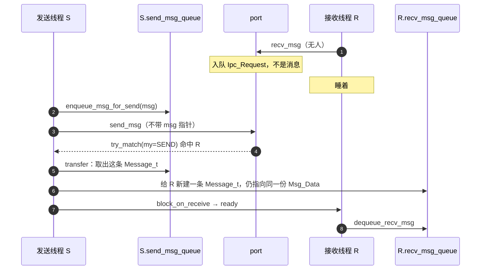
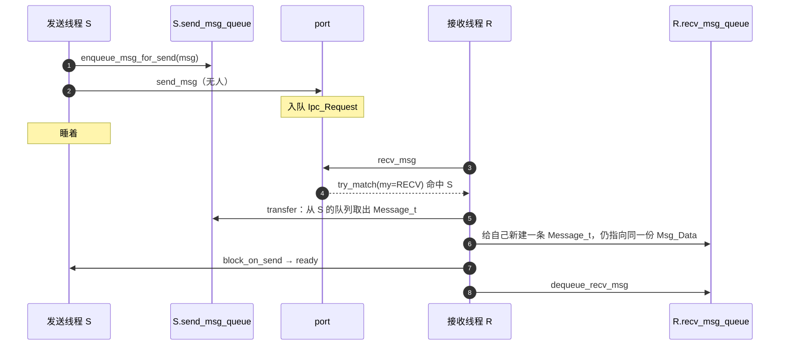
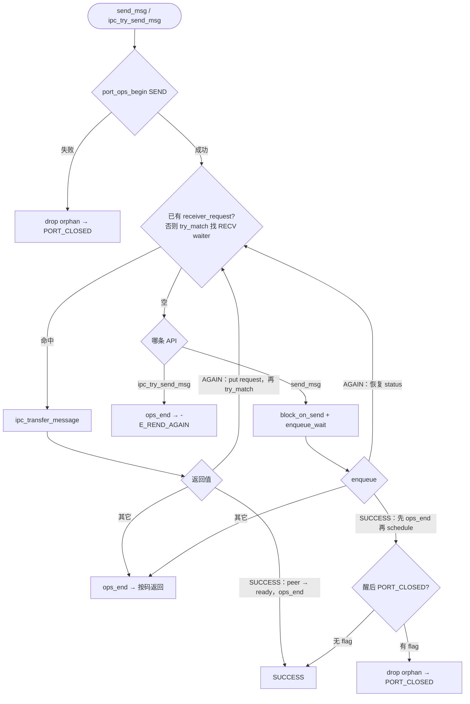
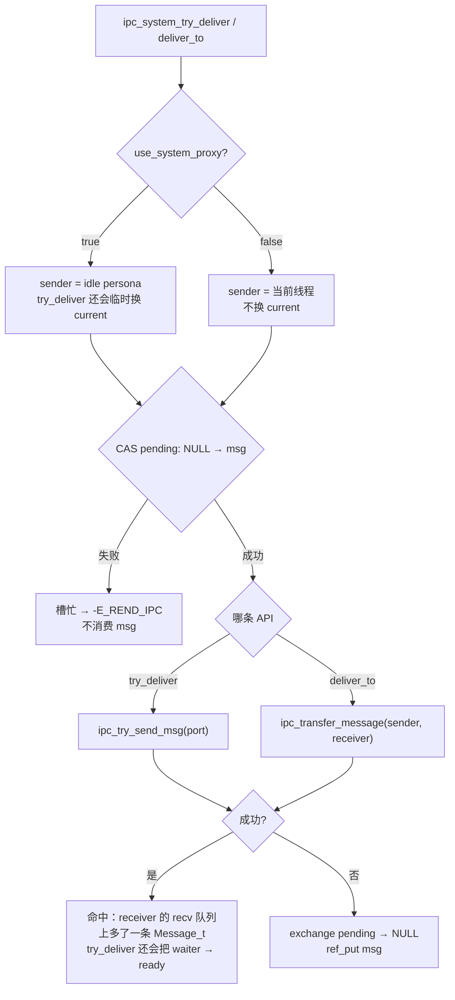

# 阻塞与非阻塞收发

v0.1 · 2026-10-02

本篇覆盖：`kernel/ipc/ipc.c`、`include/rendezvos/ipc/ipc.h`。

**建议先读** `18` **§1**（设计框架）与 `19`（两层对象），再读本篇。线程 status 与 `schedule` 见 `03-任务与调度/13-线程与Task_Manager.md`；`port_ops_begin/end` 与关闭 port 见 `22`；MSQ 会合队列细节见 `18` §2 起；system 异步投递见 `ipc.h` 注释（本篇 §6.6 摘要）。

---

## 1. 概述

从对象模型往下推，本篇钉 **会合与投递怎么跑**。

收发仍是两步：**在 port 上配对线程**（`Ipc_Request` 进 `thread_queue`），再 **`ipc_transfer_message` 投递消息**（新建对方的 `Message_t`、两边共享同一份 `Msg_Data_t`，图在 `18` §1.5）。

**阻塞**（`send_msg` / `recv_msg`）：port 上没对手就挂进 `thread_queue`，标记 `block_on_send` / `block_on_receive`，然后 **`schedule`**（混合内核手动调度条件见 `18` §1.2）。被叫醒后返回。

**非阻塞**（`ipc_try_*`）：只 try_match；对不上就 `-E_REND_AGAIN`，不阻塞。

调用方：先 `enqueue_msg_for_send` 再 `send_msg`；或 `recv_msg` 再 `dequeue_recv_msg`——「放消息 / 取消息」与「会合传送」解耦（`19` §1.1）。状态机、推拉时序与实现循环见 §6。

### 1.1 谁跑 transfer——推还是拉？

阻塞路径里，**一定是一侧睡在 port 上，另一侧来配对**。来配对且配对成功的那一侧，顺手跑 `ipc_transfer_message`：

- 已有人在 recv 上等，你 `send_msg` 配对成功 → **sender 推**（transfer 跑在 sender 核上）。
- 已有人在 send 上等，你 `recv_msg` 配对成功 → **receiver 拉**（transfer 跑在 receiver 核上）。

不是「只推」或「只拉」，而是 **推拉平衡**：谁没阻塞在 port 上，谁干活。跨核时「拷贝消息的代码跑在哪颗核」要心里有数——exit race / `send_pending_msg` 见 §6.5；场景时序图见 §6.0。IRQ 不走 `enqueue`，见 §6.6。无锁会合上的阻塞只表示「在等对手」，**不**等于会合队列上加了大锁（`18` §1.1）。

### 1.2 假出队如何定下 `Ipc_Request`

Port 上排队的必须是 **每次会合新分配的 `Ipc_Request_t`**，不能把 TCB 嵌进 MS 节点——假出队会让刚匹配的节点仍当 dummy，再次 enqueue 会自环（详 §4.1；因果钉在 `18` §1.4）。这也是拒绝通用 `cancel_ipc` 的根因之一（§6.7）：队上多个 request，按 TCB 反查代价高。

---

## 2. 目标与边界

**提供：** 不绑定 capability 的会合式收发与消息转移；阻塞与 try 两套入口；IRQ / timer 用的 system 异步投递。承接无锁篇假出队 / 推拉、Port 篇两层模型。

**不做：** Port / Message 对象创建与注册（`19`）；MSQ CAS 细节（`18`）；RPC 状态机、reply port 命名、超时；多消息 batching；跨 port 自动路由；在 `send_msg` 内替 caller 构造 `Message_t`（须先 `enqueue_msg_for_send`）。

---

## 3. 分层与调用方

**Server 线程** — 循环：`thread_lookup_port` → `recv_msg(port)` → `while (dequeue_recv_msg())` 处理 → `ref_put(msg)` → `ref_put(port)`。

**Client 线程** — `kmsg_create` / `create_message_with_msg` → `enqueue_msg_for_send` → `send_msg` → `ref_put(port)`；reply 侧另建 recv 循环或 try_recv。

**Boot 线程** — `kernel_handle_msg` 对 `KERNEL_PORT_NAME` 阻塞 recv（模块初始化篇）。

**IRQ / timer** — 不用 `send_msg` 阻塞路径；用 `ipc_system_try_deliver` / `ipc_system_deliver_to`（§6.6），staging（暂存到单槽 `send_pending_msg`，避免消息进入被打断线程的 send 队列）在 `send_pending_msg`。

须遵守：每次 lookup 得到的 port 要 `ref_put(..., free_message_port_ref)`；`send_msg` / `recv_msg` 前 port 必须已 `register_port`；关闭中的 port 返回 `-E_REND_PORT_CLOSED`。阻塞在 port 上时被 `unregister` 清队唤醒：**send / recv 两侧的通知方式不同**（权威叙述见 `19` §6.2）——send 侧恒带 `THREAD_FLAG_IPC_PORT_CLOSED`；recv 侧优先投 `KMSG_OP_SYSTEM_PORT_CLOSED`，仅投递失败（`recv_pending_cnt` 仍为 0）才打同一 flag。

---

## 4. 数据结构与不变量

### 4.1 Ipc_Request_t

```c
typedef struct {
        ms_queue_node_t ms_queue_node;
        Thread_Base* thread;
        ms_queue_t* queue_ptr;
} Ipc_Request_t;
```

**为何排队的是 request，不是 TCB？** 概述已钉因果（§1.2；`18` §1.4）。展开：匹配后旧 dummy 被 put，**对手的节点仍留在队里当新 dummy**。若直接把 `Thread_Base` 嵌进 MS 节点，被 match 醒过来的 receiver 再次 `recv`/`enqueue_wait` 时，会把**仍挂在队列上的同一节点**再 enqueue → **自环**，队列损坏。

因此每次阻塞会合**新分配**一个 `Ipc_Request_t` 入队；节点代表「这一次请求」，不代表线程本体。生命周期：

- 创建时 `ref_get_not_zero(&thread->refcount)`，等待期间 TCB 有效。
- **单向**引用：request → thread；**不**让 TCB 回指 request，避免循环 ref。
- `free_ipc_request` → **EBR retire**（见 `17`）。

曾考虑过「TCB 内嵌两个 MS 节点轮流当 dummy」——免动态分配、无循环引用，但实现复杂且与「一请求一节点」模型冲突；**已拒绝**，现行方案即 per-op request。

### 4.2 线程侧 IPC 字段（与本篇相关）

| 字段 | 作用 |
|------|------|
| `send_msg_queue` | 待发送消息 MSQ |
| `recv_msg_queue` | 已到达消息 MSQ |
| `send_pending_msg` | 已从 send 队列取出但尚未成功 transfer 的单槽（push race / system deliver） |
| `recv_pending_cnt` | 逻辑到达计数；`dequeue_recv_msg` 递减 |
| `port_ptr` | 阻塞在 port 上时非 NULL；match 时 CAS 清掉 |

### 4.3 Port 队列状态 tag

`IPC_PORT_STATE_EMPTY (0)` / `SEND (1)` / `RECV (2)` — 编码在 MSQ tail 的 tagged pointer 低位（`IPC_PORT_APPEND_BITS == 2`）。`ipc_port_enqueue_wait` 根据当前 tag 与 `my_ipc_state` 决定能否入队；冲突返回 `-E_REND_AGAIN` 供调用方重试。

### 4.4 不变量

- 阻塞路径：**不得在持 `port_ops_begin` 语义等价锁时 schedule** — 实现上在 enqueue 成功或 try 路径末尾先 `port_ops_end` 再 `schedule`。
- `enqueue_msg_for_send` 后消息 refcount 由 send 队列持有；caller 的 `ref_put` 后不得再访问 msg。
- 一次成功的 blocking send / recv 保证至少一条 message 已进入 receiver 的 recv 队列（caller 须 `dequeue_recv_msg`）。

---

## 5. 代码对应

| 符号 | 职责 |
|------|------|
| `ipc_port_try_match` | 从 port MSQ 找对手 Ipc_Request；status / `port_ptr` 不合格则丢弃再取下一个（§6.1） |
| `ipc_port_enqueue_wait` | 当前线程入 port 等待队列 |
| `ipc_transfer_message` | sender → receiver 转移一条 message |
| `send_msg` / `recv_msg` | 阻塞会合 + transfer |
| `ipc_try_send_msg` / `ipc_try_recv_msg` | 非阻塞 try_match + transfer |
| `enqueue_msg_for_send` | 消息入当前线程 send 队列 |
| `dequeue_recv_msg` | 从 recv 队列取 message（隐藏 dummy 语义） |
| `ipc_drop_one_orphan_send_msg` | 关闭 port 或 send 失败时清理 send 侧孤儿消息 |

---

## 6. 流程

### 6.0 一次会合：分叉与推拉时序

阻塞 vs 非阻塞（以 send 为例；recv **骨架**对偶，transfer 失败码不对偶，见 §6.3）：

```text
                 port_ops_begin(SEND)
                         │
                         ▼
                 ┌──────────────┐
                 │ try_match   │──── 命中 RECV 对手 ──► ipc_transfer_message ──► SUCCESS
                 └──────────────┘
                         │ 未命中
                         ▼
            ┌─────────────────────────┐
            │  blocking send_msg       │   non-blocking ipc_try_send_msg
            │  block_on_send + enqueue  │   port_ops_end → 返回 -E_REND_AGAIN
            │  port_ops_end → schedule │   (消息仍在本线程 send 队列)
            │  （睡）                   │
            └─────────────────────────┘
                         │ 被对手 match 并 transfer（或被 unregister 清队）
                         ▼
              醒后看 THREAD_FLAG_IPC_PORT_CLOSED
                ├ 有 flag → drop orphan → -E_REND_PORT_CLOSED
                └ 无 flag → SUCCESS（对手已 transfer）
```

**场景 A：R 先到，S 来配对 → sender 推（transfer 跑在 S 上）**



**场景 B：S 先到，R 来配对 → receiver 拉（transfer 跑在 R 上）**



下面是 **`send_msg` / `ipc_try_send_msg` 的实现循环**——同一套会合，把 `ipc.c` 的 `while`、失败码、try 不阻塞画出来：

| 上面场景 | 本图 / 后文 |
|----------|-------------|
| 场景 A：R 已在 port 上，S 的 `send_msg` 命中 | 图中 `try_match` **命中** → `ipc_transfer_message`（S 推） |
| 场景 B：S 已在 port 上，R 的 `recv_msg` 命中 | **骨架相同**，把 SEND/RECV、`block_on_*` 对调；见 §6.3。不另画 flowchart |
| port 上没人 | 阻塞：enqueue + `schedule`；try：立刻 `-E_REND_AGAIN` |

**为何只画 send：** `recv_msg` 的 `while` 与 send 一样。**不对称的只有** transfer 失败后的 `switch`（见 §6.3）。调用方须先 `enqueue_msg_for_send`（§6.6 的 system 封装除外）。



和代码对齐的两点（成功路径时序图里看不到）：

- `ipc_transfer_message` 返回 `AGAIN`（receiver 正在 `exit`，消息在 `send_pending_msg`）时：`ref_put` 当前 `Ipc_Request`，指针置空，下一圈重新 `try_match`。不要对同一条已经 exit 的 request 再 transfer。
- 阻塞路径醒后**不一定** SUCCESS：关 port 会走 `PORT_CLOSED`。enqueue `AGAIN` 才是重新 `try_match`。

### 6.1 `ipc_port_try_match`：对头不合格就丢掉再取下一个

`try_match` 不是「dequeue 一次就交给调用方」。它对 `thread_queue` 循环 `msq_dequeue_check_head`，每次取出一个 `Ipc_Request_t` 后还要过两道门（`ipc.c`）：

1. **status 必须仍是期望的阻塞态**（本侧 SEND → 对头须 `block_on_receive`；本侧 RECV → 对头须 `block_on_send`）。不匹配：CAS 试图清 `port_ptr`，`ref_put` 这个 request，**continue** 取下一个。这就是「陈旧 waiter」——线程已经不在这次会合上了（exit、被清队、状态被改过），节点却还留在 MSQ 里（假出队 / 关闭竞态）。没有 `cancel_ipc`，靠这条路径把它们丢掉。
2. **`port_ptr` CAS port→NULL 必须成功**。失败同样 put request 再 continue（对头已经不属于这个 port）。

两道都过才把 request 交给 `send_msg` / `recv_msg` / `ipc_try_*`。队列空或 tag 对不上 → 返回 NULL，由上层决定阻塞还是 `-E_REND_AGAIN`。

### 6.2 send_msg（阻塞）

```text
port_ops_begin(SEND)
  loop:
    try_match(RECV 侧对手)?
      yes → ipc_transfer_message(me, peer)
            SUCCESS：peer block_on_receive → ready；ops_end；SUCCESS
            AGAIN：receiver 正在 exit → ref_put request，指针置空，再 try_match
                   （消息在 send_pending_msg）
            其它：ops_end；按码返回（含 drop orphan）
      no  → status = block_on_send
            enqueue_wait
            成功：ops_end → schedule
                  醒后若 PORT_CLOSED → drop orphan，-E_REND_PORT_CLOSED
                  否则 SUCCESS（对手已 transfer）
            enqueue 冲突 -E_REND_AGAIN → 恢复 status，重试 loop
            enqueue 其它错误 → 恢复 status，ops_end，-E_RENDEZVOS
```

要点：

- try_match 成功时由 **sender** 跑 transfer；receiver **不**在此路径 `schedule`（只被改成 ready；真正再跑是它自己的 recv 返回或之后某次被 RR（Round-Robin，轮转调度）选中）。
- enqueue 成功后当前 sender 睡眠，直到对手 match 并完成 transfer。
- transfer 的 `-E_REND_AGAIN` **只**表示 receiver 正在 `exit`。send / `ipc_try_send_msg`：`ref_put` 这条 `Ipc_Request`，`receiver_request = NULL`，再 `try_match`。recv 路径见 §6.3，不可照抄。

### 6.3 recv_msg（阻塞）

会合骨架与 send **相同**（对应 §6.0 场景 B）：`try_match(my=RECV)` 找 **SEND waiter**，命中后仍是 `ipc_transfer_message(sender, receiver)`（R 拉）；无人则 `block_on_receive` + enqueue + schedule。**只有 transfer 失败的 `switch` 与 send 不同**（现行 `recv_msg`）：

| `ipc_transfer_message` | `recv_msg` 怎么做 | 为何 |
|------------------------|-------------------|------|
| `REND_SUCCESS` | sender `block_on_send`→`ready`；SUCCESS | 拉成功 |
| `-E_REND_NO_MSG` | `continue` 再 match | sender 队列空或 sender 正在 exit（pull 侧注释） |
| `-E_REND_AGAIN` | `ref_put` request；**返回 `-E_RENDEZVOS`** | 源码认定不可能：AGAIN 只在 **receiver** 正在 exit 时产生，而跑这段代码的就是 receiver |
| 其它 | 按码返回 | |

不要把 §6.2 的「AGAIN → put 再 match」抄到 recv 上。enqueue 冲突仍是恢复 status 再 loop；enqueue 其它错误同样 `-E_RENDEZVOS`。

**关闭 port 后醒来时，send / recv 等待者处理不同**（由 `port_clean_thread_queue` 决定；**为何**不对称见 `19` §6.2「为何不对称」——send 醒在 errno/orphan 路径，recv 醒在「dequeue 一条消息」路径）：

| 醒后条件 | `recv_msg` 返回 | 调用方 |
|----------|-----------------|--------|
| `THREAD_FLAG_IPC_PORT_CLOSED` | `-E_REND_PORT_CLOSED`（清 flag；**无** orphan 路径） | 无消息可 dequeue（投递 closed-kmsg 失败时的兜底） |
| 无 flag（通常已投上 PORT_CLOSED kmsg） | `REND_SUCCESS` | **必须** `dequeue_recv_msg`；以 `kmsg_from_msg` + opcode 识别 port 已关闭 |

Send 侧醒后：有 flag → drop orphan + `-E_REND_PORT_CLOSED`；无 flag → `REND_SUCCESS`（对手已 transfer）。关闭路径上 send **总是**带 flag（从不靠 kmsg）。

### 6.4 ipc_try_send_msg / ipc_try_recv_msg

源码里是带 `while (1)` 的，但 **空 port 不会空转**：

- `try_match` 得到 NULL → 立刻 `port_ops_end` + **`-E_REND_AGAIN`**（消息仍在 send 队列；recv 侧无消息）。
- 循环只在 **已经 match 到对手、但 transfer 还没做成** 时继续：try_send 对 transfer `AGAIN` 先 `ref_put` 再清空指针、下一圈 `try_match`；try_recv 对 `-E_REND_NO_MSG` `continue`。try_recv 若看到 transfer `AGAIN`，与阻塞 recv 一样返回 **`-E_RENDEZVOS`**。
- **不**把 caller 改成 block 状态（match 成功时只改 **对手** status）。
- 适用于 compat poll、合作式 server，以及 §6.6 的 `ipc_system_try_deliver`（内部就是 `ipc_try_send_msg`）。

try 与 blocking 在 `ipc.c` 是分支拷贝，注释写明不要想当然合并。

### 6.5 ipc_transfer_message 要点

图解（新建 `Message_t`、共享 `Msg_Data`）见无锁篇 §1.5。对照 `ipc.c` 头注释里的若干 race：

1. 优先 `atomic exchange` 取 `sender->send_pending_msg`；否则 `msq_dequeue(send_msg_queue)`。
2. 给 receiver **新分配**一个 `Message_t`，`fill_message_data` 让它和 sender 那条指向同一份 `Msg_Data_t`，再 enqueue 到 `receiver->recv_msg_queue`。
3. 若 receiver 正在 exit（`-E_REND_AGAIN`），message 还回 `send_pending_msg`——避免「已从 send 队列取出、又无处可去」。sender-push（`send_msg` / `ipc_try_send_msg`）接着 `ref_put` 这条 `Ipc_Request`、指针置空，再 `try_match` 下一个 waiter，**不要**对同一条 exit 中的 request 再 transfer。
4. 成功则 put sender 侧 message ref。

receiver pull 时 sender 必须存活（运行 transfer 的上下文）；sender push 时 receiver exit 由 `-E_REND_AGAIN` 处理。`try` 与 blocking 两套路径在源码里是分支拷贝，注释写明不要想当然合并。

### 6.6 System 封装：IRQ / timer 不能直接 `send_msg`

Timer / 设备 IRQ **没有合法的「发送者线程」**。若在 IRQ 里调 `get_cpu_current_thread()` 再 `enqueue_msg_for_send` + `send_msg`：

1. 消息会进**被打断的线程**的 `send_msg_queue`；
2. `ipc_transfer_message` 永远从队列**头**取（或 `send_pending_msg`），不是「刚入队的那条」；
3. 被打断线程醒来时，自己的 send 语义已被污染。

因此 system 路径**禁止** `enqueue_msg_for_send`，也**禁止**阻塞 `send_msg`（IRQ 里 `schedule` 会把整机卡住）。改走单槽 staging + **try 发送**：

| API | 模式 |
|-----|------|
| `ipc_system_try_deliver(port, msg, proxy)` | CAS 把 `msg` 写入选定 sender 的 `send_pending_msg` → **`ipc_try_send_msg(port)`**；经 port 会合。无 waiter → `-E_REND_AGAIN`，再 try-clean 槽 |
| `ipc_system_deliver_to(receiver, msg, proxy)` | staging 后直接 `ipc_transfer_message(sender, receiver)`，**无** port 会合 |

`use_system_proxy`：

| 值 | 含义 | 典型 |
|----|------|------|
| **true** | 暂用 **idle** 当 `current_thread`（persona，即临时借用 idle 线程身份作为「发送者」），跑完再换回 | Timer **EXPIRE**（IRQ） |
| **false** | 用真正的当前线程；**不**换 persona；仍只 staging、不 enqueue | Timer **CANCEL**（线程上下文） |

`ipc_system_*` **不是**第三套会合模型，而是对上面骨架的封装：选 sender → 把 `Message_t` 放进 `send_pending_msg` → 再调已有的 `ipc_try_send_msg` 或 `ipc_transfer_message`。下图只画这一层封装（sender 用谁、pending 怎么进、失败怎么清），不重画 §6.0 的两个线程。


读图：两条 API 共用「选 sender + CAS pending」；`try_deliver` 接到 **`ipc_try_send_msg`**（还要 port 上有人在 recv，等价于 §6.0 场景 A 的 try 版）；`deliver_to` 跳过 port，直接 **`ipc_transfer_message`**。失败都走右边 `CLEAN`，不要把消息留在 pending 里。`deliver_to` **不**换 `current_thread`（即使 `proxy=true` 也只用 idle 当 sender）。关 port 清队注入 `PORT_CLOSED` 也走 `deliver_to`，不限于 timer。

**用 timer 理解 try 发送：** 等待线程必须事先在 `wait_port` 上 `recv_msg` 睡着。IRQ 到期只做 `ipc_system_try_deliver(..., true)`——这就是「有人对面就投、没有就立刻失败」的 try 发送，不会帮你排队。waiter 已经离开 port（提前醒、cancel 已处理、token 已失效）时，`-E_REND_AGAIN` **是预期**，随后 exchange 清 `send_pending_msg` 并 `ref_put` 这条 kmsg。上层用 `delivery_token` 分辨「这是不是我还在等的那一次」。port 引用谁 `get`、谁 `put`、EXPIRE 失败是否 `fini`，以时间篇 `33` 与 `time.c` 为准（现行：成功 EXPIRE 才 `fini`；失败 `change(now+1)` 重试，不放 port）。

失败 try-clean staging slot（put msg）。关闭 port 清队时，对 recv 等待者注入 PORT_CLOSED kmsg 走 **`deliver_to`**（旁路 `port_ops`）。

**刻意没有** `ipc_system_try_recv`：入站仍由专用 kthread 在自己的 port 上阻塞 `recv_msg`（powerd / servers 同模式）。IRQ 里绝不阻塞 `schedule`。

### 6.7 不做 `cancel_ipc`

没有、也不计划「按线程从 port MSQ 强制 dequeue」的 API。原因：

1. 队上挂的是多个 `Ipc_Request_t`，按 TCB 定位代价高且与假出队/EBR 耦合。
2. 阻塞常态常常只有一侧各一人在等——**取消发送**：对端任意收一条再丢弃；**取消接收**：发一条约定 cancel / 关闭协议消息即可。
3. 定时器取消已有专用路径：`rendezvos_timer_event_cancel` → `ipc_system_try_deliver(..., false)`（见时间篇），不必通用 cancel。

compat 若要「打断阻塞 syscall」，用协议消息 / 关 port / 专用 cancel opcode，不要假设存在 Linux 式 `cancel_ipc`。

---

## 7. 公开 API

本篇涉及的接口分布在：`ipc.h` / `ipc.c` 的会合式收发、transfer、enqueue/dequeue、system 异步投递。说明以头文件 Doxygen 为准（已与 `.c` 核对）。

**本篇不涉及：** port 创建/注册 → `19`；`port_ops_begin`/`ops_allow` 深挖 → `22`；MSQ CAS → `18`；EBR → `17`。

`ipc_port_try_match` / `ipc_port_enqueue_wait`：**内部**（`ipc.c` static）；不要当作公开 API。

### 7.1 编排顺序（调用方须遵守）

| 场景 | 顺序 |
|------|------|
| 阻塞发送 | 造消息（`19`）→ **`enqueue_msg_for_send`** → **`send_msg(port)`** →（成功则消息已在对面） |
| 阻塞接收 | **`recv_msg(port)`** → **`dequeue_recv_msg`** → 用完 `ref_put(..., free_message_ref)` |
| 非阻塞 | 同上，但用 **`ipc_try_send_msg` / `ipc_try_recv_msg`**；无对手 → `-E_REND_AGAIN`（send 时消息仍在本线程 send 队列） |
| IRQ / timer 投递 | **勿** `enqueue_msg_for_send`；用 **`ipc_system_try_deliver`**（port 会合）或 **`ipc_system_deliver_to`**（已知 receiver） |

推拉：配对成功且未睡在 port 上的一侧跑 `ipc_transfer_message`（见 §6.0）。

### 7.2 线程收发

```c
error_t enqueue_msg_for_send(Message_t *msg);
error_t send_msg(Message_Port_t *port);
error_t recv_msg(Message_Port_t *port);
error_t ipc_try_send_msg(Message_Port_t *port);
error_t ipc_try_recv_msg(Message_Port_t *port);
Message_t *dequeue_recv_msg(void);
error_t ipc_transfer_message(Thread_Base *sender, Thread_Base *receiver);
```

| 接口 | 说明 |
|------|------|
| `enqueue_msg_for_send` | 挂到当前线程 `send_msg_queue`；无 current → `-E_REND_AGAIN`；refcount 坏 → `-E_REND_IPC`。 |
| `send_msg` | `port_ops_begin(SEND)`；try_match → transfer（推）或 `block_on_send`+enqueue+**先 end 再 schedule**。transfer `AGAIN`：`ref_put` + 置空 + 再 `try_match`。begin 失败 / 醒后见 `IPC_PORT_CLOSED` flag → 清 orphan → `-E_REND_PORT_CLOSED`。 |
| `recv_msg` | 会合对偶；transfer 失败码见 §6.3（`AGAIN` → `-E_RENDEZVOS`，不是重试）。成功后**必须** `dequeue_recv_msg`。关闭 port 后醒来：**无** flag → `REND_SUCCESS`（dequeue 识别 `KMSG_OP_SYSTEM_PORT_CLOSED`）；**有** flag → `-E_REND_PORT_CLOSED`（见 `19` §6.2）。 |
| `ipc_try_send_msg` | 同前置；无 receiver → `-E_REND_AGAIN`（不阻塞；消息仍在 send 队列除非自行取出）。match 后 transfer `AGAIN`：`ref_put` + 指针置空，再 `try_match`。成功则对方 `block_on_receive`→`ready`。 |
| `ipc_try_recv_msg` | 无 sender → `-E_REND_AGAIN`；transfer `NO_MSG` 再 match；transfer `AGAIN` → `-E_RENDEZVOS`。成功须 dequeue；对方 `block_on_send`→`ready`。 |
| `dequeue_recv_msg` | 隐藏 MSQ dummy；`recv_pending_cnt--`；调用方持有返回消息的引用。 |
| `ipc_transfer_message` | 高级：已配对后给 receiver 新建 `Message_t`、共享 `Msg_Data`。`-E_REND_AGAIN`（recv 在 exit，消息回 `send_pending_msg`）；sender-push 调用方须 put request 再 match，见 §6.2。`-E_REND_NO_MSG`。 |

### 7.3 System 异步（IRQ / trap）

```c
error_t ipc_system_try_deliver(Message_Port_t *port, Message_t *msg,
                               bool use_system_proxy);
error_t ipc_system_deliver_to(Thread_Base *receiver, Message_t *msg,
                              bool use_system_proxy);
```

| 接口 | 说明 |
|------|------|
| `ipc_system_try_deliver` | 经 port try_match；`msg` 进 `send_pending_msg` 再 `ipc_try_send_msg`。`use_system_proxy`：true=idle persona（可临时换 current）；false=当前线程。失败 try-clean put msg。 |
| `ipc_system_deliver_to` | 无 port 会合；直接 `ipc_transfer_message(sender, receiver)`。receiver 不必在 port 上阻塞。 |

单槽 `send_pending_msg`：同时只飞一条 system 出站。不要在 IRQ 里调阻塞 `send_msg`/`recv_msg`。

### 7.4 会合节点（较少直接调用）

```c
Ipc_Request_t *create_ipc_request(Thread_Base *thread);
void delete_ipc_request(Ipc_Request_t *req);
error_t free_ipc_request(ref_count_t *); /* EBR */
```

port `thread_queue` 上挂的是这些节点（钉 thread ref），不是 `Message_t`。

---

## 8. 多架构

IPC 会合与转移 **arch 无关**；依赖 per-CPU `core_tm` 与 `schedule`。system proxy 路径使用 idle 线程 persona。没有专用 IPC 硬件门铃——跨核唤醒靠把对手标 ready，等对方核自己 `schedule`（或已在运行）。

---

## 9. 测试

- `modules/test/single_port_test.c` — 单 port 阻塞往返。
- `smp_*` 测试用例 — 多核 send / recv 压力。

```bash
cd core && make ARCH=x86_64 config && make all && make run
```


---

## 10. 限制与后续

现行限制：

- **单消息 transfer** — 每次会合转移一条；要多条就上层循环 `enqueue` + send / try。
- **send_pending_msg 单槽** — 多 receiver 同时 pull 同一 sender 的 race 由 `ipc.c` 注释中的 Problem 约束；上层应避免。
- **无超时** — 阻塞直到 match 或 port close。
- **try 路径不保证 fairness** — RR 可能导致 try 饥饿，compat 需自旋或阻塞。

### 10.1 未实现的演进方向（现行代码不做）

下面四条来自设计笔记里「想过、现行代码不做」的部分。对象模型仍以 `19` 为准；实现或专篇 design 完成前见 `v0.1/evolution/TODO.md` **E2 / E4**。

**背压。** 环形队列靠容量硬顶：满了发送失败。本仓库 MSQ 无固定容量，core **不**另做流量窗口。阻塞 `send_msg` 在没有 receiver 取走 request 时把 sender 停住——这就是现在的隐式背压。走 try / 批量、放弃阻塞之后，就要上层用反向消息做反馈控制，不在 core 里做。

**批量、异步、函数调用式。** 都建立在已经暴露的 `ipc_transfer_message` 上。一种设想：控制线程仍用阻塞会合交换「数据线程指针」，之后双方绕过 port、直接 `enqueue` + `ipc_transfer_message`（甚至两边同时调）。异步再补线程状态；函数调用式则是 caller 发完就阻塞在自己的 recv 队列、callee 回一条。现行公开路径仍是「先会合再 transfer」；直接对任意 `Thread_Base*` 调 transfer 只留给 system `deliver_to` 这类明确入口（不要把 `send_msg` 改成可指定任意 sender）。

**广播。** 「一条消息叫醒这个 port 上所有 waiter」和现行 **单状态、一次 match 一条** 冲突（`19` §1.2、`18` §1.7）。v0.1 **明确不做**。

**调度器可感知的 IPC。** 临界区线程化之后，优先级翻转并没有消失：高优先级 A 等低优先级 B 的回复，B 被中优先级 C 抢走。enqueue 阻塞时若登记「A 依赖 B」，调度就可以先跑 B。这需要依赖图，也需要调度策略超出 RR——与 **E4** 绑在一起，不是 IPC 单独能做完的。

---

## 11. 变更记录

- 2026-10-07：§1 概述瘦身——阻塞分叉 ASCII 与推拉 mermaid 迁入 §6.0，与实现 flowchart 合并；原 §6.0–6.6 顺延为 §6.1–6.7。
- 2026-10-05：§10.1 去掉 `lockfree-ipc` 旧路径外链；演进只指向 `v0.1/evolution/TODO.md`（E2 / E4）。
- 2026-10-05：§1.1 推/拉时序改为 mermaid sequence（一次发送从 `19` 挪到本篇）；ASCII 三栏错位不再用。
- 2026-10-05：`send_msg` / `ipc_try_send_msg`：transfer `AGAIN` 改为 put request 并再 `try_match`（与 `ipc.c` 一致）。§6 流程图 AGAIN 边回到 match。
- 2026-10-04：补推 / 拉时序对比图（§1.1）与阻塞 vs 非阻塞状态机 ASCII 图（§1 概述末）；口语动词「丢」改为「丢弃」。
- 2026-10-05：任务 1/3/5 精读——口语动词与翻译腔清理（不睡觉→不阻塞、拿到→取得、拿走→取出、毁掉→损坏、纠缠→耦合、随便→任意、勿想当然→不要想当然、勿当→不要当作、勿在→不要在、已在跑→已在运行、饿死→饥饿、touch→访问、标→标记为、摘→取出）；为首现缩写补全称/定义（RR、persona、staging、自环）；§9「测例」→「测试用例」。
- 2026-10-02：§1 按「18§1 → 18 → 本篇行为」重写：推拉、`Ipc_Request`、与假出队/图的推导链；§2 边界与 18/22 对齐。
- 2026-10-02：§4.1 假出队交叉引用改为 `18` §1.4（与 MSQ 四性质图节对齐）。
- 2026-10-02：§6.5 扩写 IRQ sender 问题与 proxy 语义；§6.6 写明拒绝 `cancel_ipc` 的理由与替代。（编号以当时稿为准；2026-10-07 后对应 §6.6 / §6.7。）
- 2026-10-02：§4.1 写清为何排队 `Ipc_Request` 而非 TCB（假出队自环）及拒绝双嵌入节点方案。
- 2026-10-01：§6.2 指向 `19`「为何不对称」；标明 send 关闭路径恒带 flag、recv flag 仅为 kmsg 投递失败兜底。
- 2026-09-27：中文表述润色（母语习惯）；`rendezvous` →「会合式收发」；「关港」改为「关闭 port」；「真源」改为「以…为准」；两侧通知差异表述更顺口。
- 2026-09-26：对照 `port_clean_thread_queue` / `recv_msg`：纠正「关闭 port 后醒来与 send 对称」——recv 优先 kmsg+SUCCESS，flag 仅投递失败；§3/§6.2/§7.2 与 `ipc.h` Doxygen 对齐；注明清队用 `deliver_to`。
- 2026-09-26：§7 全文审阅——`ipc.h` 补 Ipc_Request / send·recv 编排序与 PORT_CLOSED；写清 enqueue→send / recv→dequeue 与 system 双路径。
- 2026-09-25：语言整理；§6.1 改文字流程图（对照 `ipc.c`）；补 transfer race / IRQ 不可阻塞说明。
- 2026-08-29：§1 叙述：推拉平衡（谁没睡在 port 上谁跑 transfer）。
- 2026-08-27：初稿：阻塞 / try 收发、transfer、system deliver 摘要。
- 2026-10-05：最终词句顺畅。
