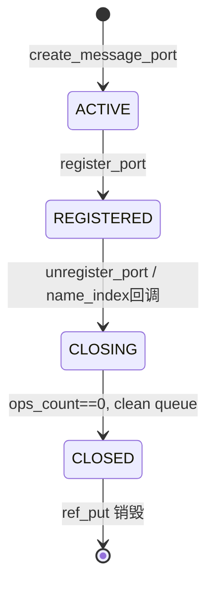
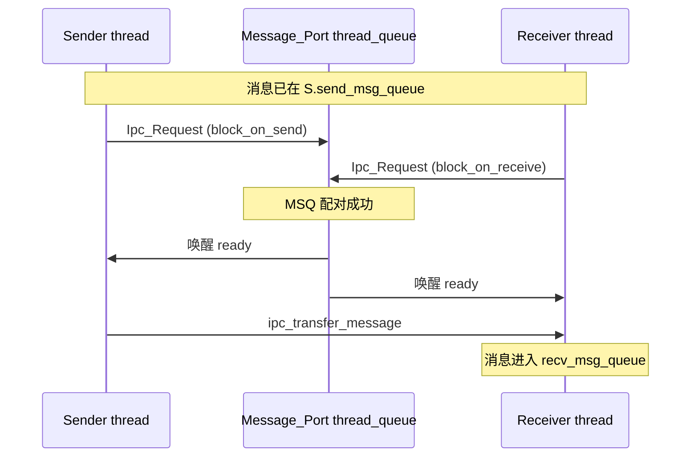

# Port 与消息模型

v0.1 · 2026-08-26

本篇覆盖：`kernel/ipc/port.c`、`kernel/ipc/message.c`、`include/rendezvos/ipc/port.h`、`include/rendezvos/ipc/message.h`、`kernel/registry/name_index.c`（经 `Port_Table` 使用的部分）。

`send_msg` / `recv_msg` 的阻塞语义、push/pull 与返回码见 `core/docs/v0.1/full/04-IPC/阻塞与非阻塞收发.md`。kmsg 载荷格式见 `kmsg与TLV序列化.md`；`port_ops_begin` 与 `ops_allow` 钩子见 `Port钩子与准入门.md`；MSQ 与 EBR 见 `无锁队列与EBR设计.md`。name_index 通用契约见 `10-基础设施/名称索引注册表.md`。

---

## 1. 概述

RendezvOS IPC 用两层结构把「线程在 port 上会合」与「消息在线程间转移」分开：

1. **Port 会合层** — 每个 `Message_Port_t` 持有一条无锁 MSQ `thread_queue`，上面挂的是 `Ipc_Request_t`（指向等待中的 `Thread_Base`），用 tagged tail 区分当前是 send 侧还是 recv 侧在等（`IPC_PORT_STATE_*`）。
2. **Per-thread 消息层** — 每个线程有自己的 `send_msg_queue` 与 `recv_msg_queue`，元素是 `Message_t`。`ipc_transfer_message` 在 send/recv 配对成功后，把消息从发送方队列挪到接收方队列。

全局按名字找 port 靠 `global_port_table`（内部是 `name_index_t`）。本篇说明 port/message 对象、生命周期、全局表与 name 解析；不展开收发状态机的每一步。

---

## 2. 目标与边界

core 提供 capability-neutral 的 port 原语：创建、注册、按名查找、会合、关闭。字符串名即索引键；namespace、权限表、描述符级 capability 语义（若兼容层采用）由兼容层在 `port_append_hooks.ops_allow` 或 server 策略里实现（见 Port 钩子篇）。

core 不做：RPC 框架、reply port 命名约定、文件系统/proc 类 server 协议——这些由兼容层定义并在其文档中描述。本篇也不重复 kmsg TLV 的编解码。

---

## 3. 分层与调用方

典型 server 线程：`create_message_port` → `register_port(global_port_table, port)` → 循环 `recv_msg(port)` → `dequeue_recv_msg()` 处理 → `ref_put` 消息。客户端：`thread_lookup_port(name)`（带 per-thread LRU cache）→ `enqueue_msg_for_send` → `send_msg` → `ref_put(port)`。

兼容层须理解：

- lookup/send/recv 返回的 `Message_Port_t*` 已 bump refcount，用完 `ref_put(..., free_message_port_ref)`。
- 未 `register_port` 的 port 不能 `port_ops_begin`（send/recv 会失败）。
- `unregister_port` 之后新 send/recv 得到 `-E_REND_PORT_CLOSED`；已在等的线程由 `port_clean_thread_queue` 唤醒并打 `THREAD_FLAG_IPC_PORT_CLOSED`。
- 消息所有权：`Message_t` 与 `Msg_Data_t` 分设 refcount；`free_message_ref` 经 EBR 延迟释放（见 EBR 篇）。

---

## 4. 数据结构与不变量

### 4.1 Message_Port_t

定义于 `port.h`：

- **`thread_queue`** — port 级会合队列；节点为 `Ipc_Request_t`，dummy 节点在 `create_message_port` 时分配。
- **`refcount`** — 创建者 1；`register_port` 成功后再 get 1（表持有）；lookup 每次 get；最后一次 put 可能销毁结构体。
- **`name[PORT_NAME_LEN_MAX]`** — 注册键，最长 63 字符加 NUL。
- **`service_id`** — 由 port 名 FNV-1a 派生的 16 位 id，供 kmsg 头快速校验「是否发给我」；路由仍以名为准。
- **`ops_life`** — `PORT_OPS_LIFE_ACTIVE | REGISTERED | CLOSING | CLOSED`。
- **`ops_count`** — 当前已进入 `port_ops_begin` 未 `port_ops_end` 的 send/recv 临界区数量；`unregister_port` 自旋等到 0 再清队列。
- **`append_hooks`** — 可选 append 区与 `ops_allow` 门控。

**队列状态 tag**（`ipc_get_queue_state`）：`IPC_PORT_STATE_EMPTY` / `SEND` / `RECV`，编码在 MSQ tail 的 tagged pointer 低位。

### 4.2 消息：Msg_Data_t 与 Message_t

`message.h` 注释说明拆分原因：MSQ dequeue 会移动 dummy 节点，无法「整体挪动」消息节点，因此：

- **`Msg_Data_t`** — 持有 `msg_type`、`data_len`、`data` 与 `free_data` 析构器；独立 refcount。
- **`Message_t`** — 嵌入 `ms_queue_node_t`（自带 refcount）、指向 `Msg_Data_t` 的指针、可选 `receiver` 字段。

一条消息通常：`create_message_data` → `create_message_with_msg`（msgdata refcount +1）→ 入 send 队列 → transfer 后 receiver `dequeue_recv_msg` → 双方 `ref_put`。

### 4.3 Port_Table 与 global_port_table

```c
struct Port_Table {
        name_index_t by_name;
};
extern struct Port_Table* global_port_table;
```

`port_table_init` 把 `name_index` 回调设为：`port_get_name`、`port_hold`（ref_get）、port_drop`（ref_put）、`port_on_register`（ACTIVE→REGISTERED，设 `port->table`）、`port_on_unregister`（REGISTERED→CLOSING，清 `table`）。

查找在 `name_index` 锁下进行；`port_table_spin_lock` 为 per-CPU MCS 锁的 `me` 槽（见 name_index 篇）。

### 4.4 线程侧 IPC 字段（与 port 配合）

`Thread_Base` 上：`send_msg_queue`、`recv_msg_queue`、`send_pending_msg`（系统/IRQ 单槽投递）、`recv_pending_cnt`、`port_ptr`（阻塞 recv/send 时指向当前 port）、`port_cache`（按名 lookup 的 token LRU）。thread 队列语义在收发篇展开；本篇只记 port 会合成功后 transfer 用的是 thread 队列而非 port 队列存 `Message_t`。

---

## 5. 代码对应

| 文件 | 职责 |
|------|------|
| `include/rendezvos/ipc/port.h` | `Message_Port_t`、生命周期 inline、`port_ops_*`、表 API |
| `kernel/ipc/port.c` | 创建/销毁、register/unregister、lookup、清队、`global_port_init` |
| `include/rendezvos/ipc/message.h` | `Msg_Data_t` / `Message_t` API |
| `kernel/ipc/message.c` | 分配/填充/EBR 延迟释放 |
| `kernel/registry/name_index.c` | 字符串索引实现（port 表复用） |
| `include/rendezvos/ipc/ipc.h` | `Ipc_Request_t` 声明（会合节点） |

`kernel/ipc/ipc.c` 实现 send/recv/transfer，属下一篇源码范围。

---

## 6. 流程

### 6.1 Port 生命周期



- **ACTIVE** — 已创建，不在全局表；不得 send/recv。
- **REGISTERED** — 在 `global_port_table`；`port_ops_begin` 可成功（若 `ops_allow` 通过）。
- **CLOSING** — 已从索引摘除；进行中的 ops 须 `port_ops_end`；新 ops 失败。
- **CLOSED** — 等待队列已 drain；ref 归零后 `delete_message_port_structure`。

`unregister_port` 在锁外等待 `ops_count == 0`（循环 `schedule`），再 `port_clean_thread_queue`，CAS 到 CLOSED，最后 `ref_put` 释放表持有的那条 ref。

### 6.2 两层会合（概念）



port 上只排队「等对方的线程」；`Message_t` 始终在 thread 的 send/recv 队列间转移。try 变体不把自己入 port 队列，详见收发篇。

### 6.3 全局表 boot 初始化

`cmain` 在 `init_proc` 之前调用 `global_port_init()` 分配并 `port_table_init`。`kernel_port_register`（boot 路径）创建名为 `KERNEL_PORT_NAME` 的 port 并 register，供 boot 线程 `kernel_handle_msg` recv 循环使用。

### 6.4 按名 lookup 与 cache

- **`port_table_lookup` / `port_table_lookup_with_token`** — 在表锁下 `name_index_lookup`，bump port ref，可选输出 `(row_index, row_gen)` token。
- **`thread_lookup_port`** — 先查 thread 的 `port_cache`（FNV-1a + token），miss 则 cold lookup 并 record；每次返回 live ref，caller 须 put。
- **`port_table_resolve_token`** — cache hit 后在锁下验证 gen 仍有效。

name_index 内部扩容、哈希与 generation 规则见基础设施篇；port 层只依赖「register 后 name 唯一」。

---

## 7. 公开 API

**Port**

```c
Message_Port_t* create_message_port(const char* name,
                                    const port_append_hooks_t* hooks);
error_t register_port(struct Port_Table* table, Message_Port_t* port);
error_t unregister_port(struct Port_Table* table, const char* name);
Message_Port_t* port_table_lookup(struct Port_Table* table, const char* name);
bool port_ops_begin(Message_Port_t* port, enum port_ops_type op_type);
void port_ops_end(Message_Port_t* port);
error_t global_port_init(void);
```

**Message**

```c
Msg_Data_t* create_message_data(i64 msg_type, u64 data_len, void** data_ptr,
                                error_t (*free_data)(ref_count_t*));
Message_t* create_message_with_msg(Msg_Data_t* msgdata);
Message_t* create_message_structure(void);
error_t fill_message_data(Message_t* msg, Msg_Data_t* msgdata);
error_t free_message_ref(ref_count_t* ref_count_ptr);
error_t free_message_port_ref(ref_count_t* ref_count_ptr);
```

**线程便捷接口**（声明在 `thread.h`）

```c
Message_Port_t* thread_lookup_port(const char* name);
```

收发 API（`send_msg`、`recv_msg`、`enqueue_msg_for_send`、`dequeue_recv_msg`）在 `ipc.h`，见下一篇。

---

## 8. 多架构

Port 与 message 逻辑架构无关；`percpu(kallocator)` 与 `percpu(port_table_spin_lock)` 在 SMP 下各 CPU 使用本核 allocator 分配 port/request 节点，表锁仍保护全局 `name_index`。跨核 send/recv 通过 MSQ 与线程 status 协调，不依赖 ISA。

---

## 9. 测试

`modules/test/single_port_test.c`、`single_ipc_test.c`、`smp_port_robustness_test.c` 等覆盖 register/lookup、并发与 unregister。在 `core/` 内 `make ARCH=x86_64 config && make all && make run` 并启用测例。本篇与当前源码一致，尚未单独复测。

---

## 10. 限制与后续

- 单全局 `global_port_table`；分区命名空间需兼容层用 name 前缀或 hooks 区分。
- `service_id` 为哈希摘要，非全局唯一 registry；冲突仅影响 kmsg 快速过滤，不以 id  alone 路由。
- Port 关闭时 blocked 线程靠 synthetic `KMSG_OP_SYSTEM_PORT_CLOSED` 或 `THREAD_FLAG_IPC_PORT_CLOSED` 通知；兼容层 RPC 须处理这些路径。
- 性能与无锁队列改进见 `v0.1/evolution/TODO.md`（E2）。

---

## 11. 变更记录

- 2026-08-26：v0.1 初稿，两层 IPC 模型、Message_Port 生命周期与全局表。
