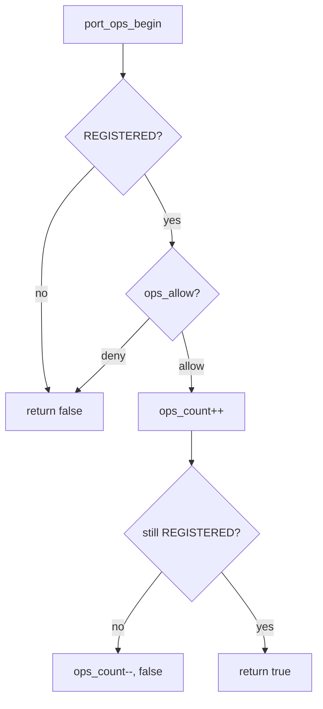

# Port 钩子与准入门

v0.1 · 2026-08-27

本篇覆盖：`kernel/ipc/port.c`、`include/rendezvos/ipc/port.h`、`modules/test/single_port_test.c`。

Port 结构与生命周期见 `Port与消息模型.md`；`send_msg`/`recv_msg` 与 `port_ops_end` 时序见 `阻塞与非阻塞收发.md`；name_index 注册见 `10-基础设施/名称索引注册表.md`。

---

## 1. 概述

每个 `Message_Port_t` 除 MSQ 会合队列外，还有 **ops 生命周期**（ACTIVE → REGISTERED → CLOSING → CLOSED）与 **ops_count**（当前已进入 send/recv 临界区的线程数）。`port_ops_begin` / `port_ops_end` 把 unregister 与阻塞 send/recv 序列化：unregister 后新 `port_ops_begin` 失败，返回 `-E_REND_PORT_CLOSED`；已在等的线程由 `port_clean_thread_queue` 唤醒并可能收到 system kmsg。

可选 **`port_append_hooks_t`** 提供 FAM 尾区 `append_port_info[]` 与三个钩子：`init`（创建后）、`fini`（销毁前）、**`ops_allow`**（lookup/send/recv/register 准入门）。core 不实现 capability 表；兼容层在 `ops_allow` 里读 `get_cpu_current_thread()` 与 thread/port append 状态做策略。

---

## 2. 目标与边界

core 解决：**无锁 send/recv 与 unregister 之间的互斥**，以及给上层一个 **统一 admission 回调** 而不硬编码 namespace/权限模型。

core 不做：默认 deny 规则；自动 audit log；在 hook 内阻塞或 schedule（`ops_allow` 应快速返回）。

**与 MSQ 无锁的边界：** 同一 port 上多个 send 或多个 recv 仍可并发（MSQ 算法）；`ops_count` 只保护 **unregister vs begin**，不串行化 send/send。

---

## 3. 分层与调用方

**创建 port** — `create_message_port(name, hooks)` → 可选 `hooks->init(port)` 填 append 区 → `register_port(table, port)`（register 时也可能调 `ops_allow(PORT_OPS_REGISTER)`）。

**lookup** — `port_table_lookup` / `thread_lookup_port` 成功后对 `PORT_OPS_LOOKUP` 调 `ops_allow(port, LOOKUP, name)`；拒绝则 ref_put 并返回 NULL。

**send/recv** — `port_ops_begin(port, SEND|RECV)` 内先检查 REGISTERED，再 `ops_allow`（lookup_name **NULL**），再 `ops_count++`；双重检查 life 仍为 REGISTERED。

**unregister** — `unregister_port`：name_index 摘除 → life CLOSING → spin 等 `ops_count==0`（期间 schedule）→ `port_clean_thread_queue` → life CLOSED → ref_put。

兼容层典型：`ops_allow` 检查 thread append 里的 credential 或只允许特定 service 访问某 port 名前缀。

---

## 4. 数据结构与不变量

### 4.1 port_append_hooks_t

```c
typedef struct port_append_hooks {
        size_t append_info_len;
        port_append_init_t init;
        port_append_fini_t fini;
        port_ops_allow_t ops_allow;
} port_append_hooks_t;
```

- **`append_info_len`** — FAM 字节数；`create_message_port` 一次分配 `sizeof(Message_Port_t) + len`。
- **`ops_allow`** — NULL 表示全部允许。

### 4.2 port_ops_type（准入门种类）

```c
enum port_ops_type {
        PORT_OPS_LOOKUP,
        PORT_OPS_SEND,
        PORT_OPS_RECV,
        PORT_OPS_REGISTER,
};
```

与 **`PORT_OPS_LIFE_*`**（对象生命周期）不同命名空间，勿混淆。

### 4.3 Message_Port_t 相关字段

| 字段 | 含义 |
|------|------|
| `ops_life` | ACTIVE / REGISTERED / CLOSING / CLOSED |
| `ops_count` | 已 begin 未 end 的 send/recv 数 |
| `append_hooks` | 静态表指针 |
| `append_port_info[]` | FAM 尾区 |
| `service_id` | 16 位，port 名 hash；供 kmsg.module |

### 4.4 不变量

- 仅 **REGISTERED** port 可 `port_ops_begin(SEND|RECV)`。
- `port_ops_begin` 失败时 **不得** `ops_count++`。
- unregister **必须** 在 `ops_count==0` 后清 `thread_queue`（注释说明否则 deadlock case）。
- 阻塞 send/recv **必须** 在 schedule 前 `port_ops_end`（见 port.h 顶部注释）。

---

## 5. 代码对应

| 符号 | 文件 | 说明 |
|------|------|------|
| `create_message_port` | `port.c` | 分配 dummy Ipc_Request、`port_ops_life_init` |
| `register_port` | `port.c` | name_index + life ACTIVE→REGISTERED + table ref |
| `unregister_port` | `port.c` | 等待 ops_count、clean queue、CLOSED |
| `port_ops_begin` / `port_ops_end` | `port.c` | send/recv 门禁 |
| `port_lookup_finish` | `port.c` | LOOKUP ops_allow |
| `port_clean_thread_queue` | `port.c` | 唤醒阻塞线程、PORT_CLOSED flag、可选 system kmsg |
| `free_message_port_ref` | `port.c` | 最后 ref 销毁结构、调 fini hook |
| inline life/count | `port.h` | CAS 与 accessor |

---

## 6. 流程

### 6.1 port_ops_begin（send/recv）



### 6.2 unregister 与等待线程

1. `name_index_unregister` — 新 lookup 失败；life → CLOSING。
2. `while (ops_count != 0) schedule()` — 让已 begin 的 send/recv 完成 end。
3. **`port_clean_thread_queue`** — 对每个阻塞 request：
   - CAS 清 `thread->port_ptr`；
   - 置 `THREAD_FLAG_IPC_PORT_CLOSED`；
   - block_on_receive 可能注入 `KMSG_OP_SYSTEM_PORT_CLOSED`  synthetic message；
   - `thread_set_status` → ready 并 `schedule`（实现细节见 `port.c`）。
4. life CLOSING → CLOSED；`ref_put` port。

### 6.3 append init/fini

- **init** — `create_message_port` 末尾、register 之前；失败则销毁 port。
- **fini** — `delete_message_port_structure` / 最后 ref_put 路径；勿在 fini 里递归 IPC。

---

## 7. 公开 API

| API | 说明 |
|-----|------|
| `create_message_port(name, hooks)` | ACTIVE 态 port |
| `register_port(table, port)` | 可 lookup/send/recv |
| `unregister_port(table, name)` | 关闭并唤醒等待者 |
| `bool port_ops_begin(port, SEND\|RECV)` | 进入 send/recv 临界区 |
| `void port_ops_end(port)` | 离开临界区 |
| `port_ops_allow_t` | 策略钩子 typedef |
| `message_port_total_size(hooks)` | 分配大小 helper |

Lookup API 见 Port 篇；send/recv 见阻塞收发篇。

---

## 8. 多架构

Port 钩子路径 **arch 无关**；`ops_allow` 内仅应使用 arch-neutral 的 thread/port 查询。

---

## 9. 测试

- **`single_port_test.c`** — 基本 register/lookup/send/recv；可扩展 hook 测例。
- unregister 与阻塞 recv 交互 — 依赖 port close system kmsg 路径（若测例覆盖）。

```bash
cd core && make ARCH=x86_64 config && make all && make run
```

与当前源码一致，尚未复测。

---

## 10. 限制与后续

- **ops_allow 无 lookup_name on send/recv** — 仅 LOOKUP/REGISTER 传 name 字符串。
- **单次 unregister** — life CAS 假设 port 生命周期一次关闭；重复 unregister  idempotent 返回 success。
- **hook 内无锁顺序** — 若 hook 拿 compat 锁，须避免与 IPC schedule 死锁。
- **capability 模型** — 完全由兼容层在 append 区与 ops_allow 实现。

---

## 11. 变更记录

| 日期 | 摘要 |
|------|------|
| 2026-08-27 | 初稿：ops 生命周期、ops_allow、unregister 清队 |
