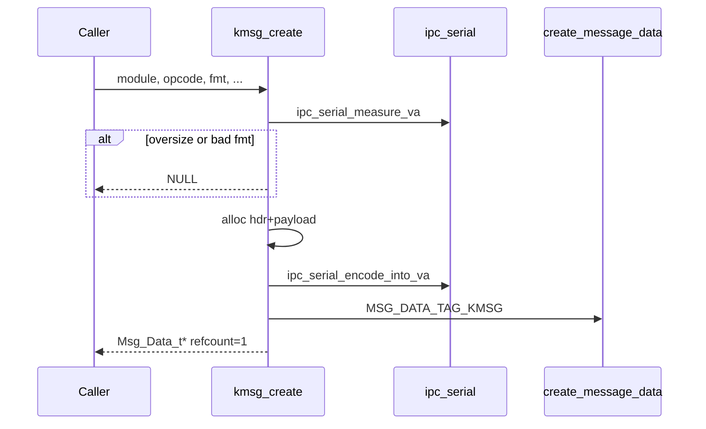

# kmsg 与 TLV 序列化

v0.1 · 2026-08-27

本篇覆盖：`kernel/ipc/kmsg.c`、`kernel/ipc/ipc_serial.c`、`include/rendezvos/ipc/kmsg.h`、`include/rendezvos/ipc/kmsg_system.h`、`include/rendezvos/ipc/ipc_serial.h`。

Message 载体与 `Msg_Data_t` 拆分见 `Port与消息模型.md`；send/recv 顺序见 `阻塞与非阻塞收发.md`；`service_id` 与 port 名关系见 Port 篇 §4.1。

---

## 1. 概述

兼容层 RPC 与 server 协议在 IPC 之上通常使用 **kmsg**：固定头 `kmsg_hdr_t` + **ipc_serial TLV** 载荷。`kmsg_create` 一次分配 buffer、编码 variadic 参数，并包装为 `Msg_Data_t`（`msg_type == MSG_DATA_TAG_KMSG`）。接收方用 `kmsg_from_msg` 校验 magic 与长度，再用 `ipc_serial_decode` 按格式串拆参。

`kmsg_hdr.module` 通常填目标 port 的 `service_id`（FNV-1a 派生，16 位），供快速「是否发给我」校验；**路由仍以 port 名字符串为准**。`opcode` 由兼容层定义，core 不维护 opcode 表。

---

## 2. 目标与边界

core 提供：**紧凑 TLV 编解码** + **kmsg 信封** + 少量 **system opcode**（如 port 关闭通知，见 `kmsg_system.h`）。不提供 schema 注册、JSON、capability 描述符或跨版本自动兼容——layout 变更须 bump `KMSG_MAGIC` 并同步所有 call site（头文件注释说明无 in-band version 字段）。

core 不做：解释具体 compat opcode 含义；在 `kmsg_create` 内查 port 或自动填 reply port（caller 在 fmt 里显式 `'t'` 传名字符串）。

---

## 3. 分层与调用方

**请求方** — `Msg_Data_t* d = kmsg_create(service_id, OP_X, "pq", ptr, val)` → `create_message_with_msg(d)` → `ref_put(d)` → `enqueue_msg_for_send` → `send_msg`。

**服务方** — `recv_msg` → `dequeue_recv_msg` → `kmsg_from_msg(msg)` → 读 `hdr.opcode` dispatch → `ipc_serial_decode(km->payload, km->hdr.payload_len, fmt, ...)`。

**Reply** — fmt 字符 `'t'` 编码 reply port 名（wire 同 `'s'`，含 trailing NUL）；core 不解析命名约定。

**Port 关闭** — `unregister_port` 清理等待队列时可能注入 `KMSG_OP_SYSTEM_PORT_CLOSED`（`port.c`），载荷格式见 `kmsg_system.h`。

解码得到的 `'s'`/`'t'` 指针指向 **message buffer 内部**；若需异步处理须拷贝字符串。

---

## 4. 数据结构与不变量

### 4.1 kmsg_hdr_t / kmsg_t

```c
#define KMSG_MAGIC 0x47534d4cu  /* 'MSG' little-endian */

typedef struct {
        u32 magic;
        u16 module;
        u16 opcode;
        u32 payload_len;
} kmsg_hdr_t;

typedef struct {
        kmsg_hdr_t hdr;
        u8 payload[];
} kmsg_t;
```

- **`KMSG_MAX_PAYLOAD`** — `PAGE_SIZE` 上限，防止畸形 fmt 或大 string 耗尽内存。
- **`MSG_DATA_TAG_KMSG`** — `Msg_Data.data` 指向整块 `kmsg_t` 缓冲。

### 4.2 TLV wire layout（ipc_serial）

```
u32 param_count
repeat param_count times:
    u8  type_tag    /* fmt 字符：p q i u s t */
    u32 value_len
    u8[value_len]   value bytes
```

| 字符 | C 类型 | wire 说明 |
|------|--------|-----------|
| `p` | pointer / machine word | sizeof(void*) |
| `q` | i64 | 8 字节 |
| `i` | i32 | 4 字节 |
| `u` | u32 | 4 字节 |
| `s` | `char*` | strlen + 1（含 NUL） |
| `t` | port 名 | 同 `s`，语义约定为 reply endpoint |

fmt 中空白忽略；一个字符对应一个参数。measure 与 encode 必须配对同一 fmt。

### 4.3 校验（kmsg_from_msg）

失败返回 NULL：`msg`/`data` 空、tag 非 KMSG、buffer 小于 header、`magic` 不匹配、`payload_len` 与 `data_len` 不一致。

---

## 5. 代码对应

| 文件 | 职责 |
|------|------|
| `kmsg.c` | `kmsg_create`、`kmsg_from_msg` |
| `ipc_serial.c` | measure / encode / decode / alloc helper |
| `kmsg.h` | 头结构与公开 API |
| `ipc_serial.h` | fmt 契约与 wire 说明 |
| `kmsg_system.h` | system opcode 与 fmt 常量 |
| `message.c` | `create_message_data`、`create_message_with_msg` |

---

## 6. 流程

### 6.1 kmsg_create



高频路径：**一次分配** — measure 后直接在 kmsg payload 区 encode，无中间 serialized buffer 拷贝（`ipc_serial.h` 注释）。

### 6.2 接收解码

1. `const kmsg_t* km = kmsg_from_msg(msg)`。
2. `km->hdr.opcode` → 兼容层 dispatch。
3. `ipc_serial_decode(km->payload, km->hdr.payload_len, "qsp", &ret, &path, &name)` — 参数顺序与 fmt 一致。

### 6.3 与 Message  refcount

- `create_message_with_msg` bump `Msg_Data` refcount。
- `Message_t` 与 `Msg_Data` 独立 refcount；transfer 后 receiver dequeue 并 `ref_put` message 节点，Msg_Data 在两者都 put 后释放。

---

## 7. 公开 API

| API | 说明 |
|-----|------|
| `Msg_Data_t* kmsg_create(u16 module, u16 opcode, const char* fmt, ...)` | 构建 carrier |
| `const kmsg_t* kmsg_from_msg(const Message_t* msg)` | 校验视图 |
| `ipc_serial_measure_va(fmt, ap, &total)` | 预计算 payload 长度 |
| `ipc_serial_encode_into_va(buf, total, fmt, ap)` | 写入已有 buffer |
| `ipc_serial_encode_va` / `ipc_serial_encode_alloc` | 独立 buffer 辅助 |
| `ipc_serial_decode(buf, len, fmt, ...)` | 出参 variadic |

---

## 8. 多架构

TLV 整数与 pointer 使用 **本机 endianness**（与 message buffer 同核读写一致）；未做 wire-endian 转换。跨架构 IPC 若未来需要须另议。`p`  tag 宽度随 `void*` 大小变化。

---

## 9. 测试

- 各 `single_port_test` / IPC 测例使用 kmsg 往返。
- 畸形 magic/length 依赖 `kmsg_from_msg` 返回 NULL（可写负测，v0.1 以正向为主）。

```bash
cd core && make ARCH=x86_64 config && make all && make run
```

与当前源码一致，尚未复测。

---

## 10. 限制与后续

- **无版本字段** — 仅 `KMSG_MAGIC`；协议演进靠集成方同步 bump。
- **payload 上限 PAGE_SIZE** — 大页传数据须用 pointer tag 指向共享内存或另行约定。
- **decode 指针生命周期** — 绑定 message buffer；异步 handler 须拷贝。
- **core 不注册 opcode** — 完整表在兼容层文档。

---

## 11. 变更记录

| 日期 | 摘要 |
|------|------|
| 2026-08-27 | 初稿：kmsg 头、TLV fmt、kmsg_create/from_msg 流程 |
