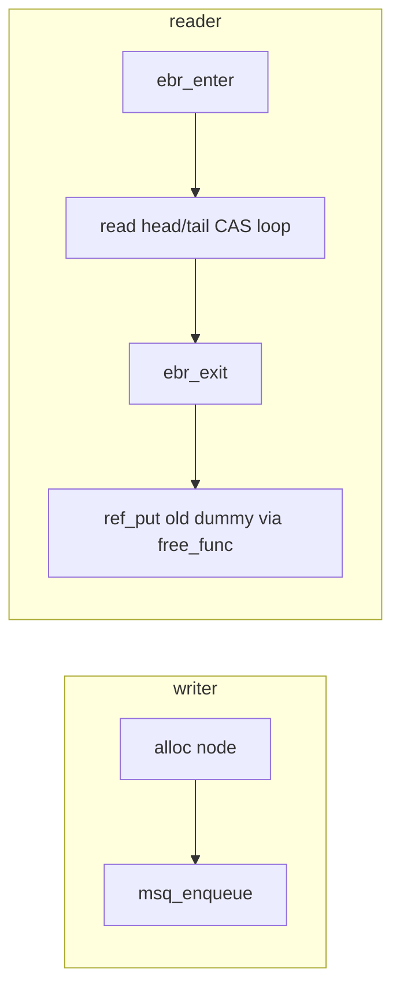

# 无锁队列与 EBR 设计

v0.1 · 2026-08-27

本篇覆盖：`include/common/dsa/ms_queue.h`、`include/common/taggedptr.h`、`kernel/task/ebr.c`、`kernel/ipc/ipc.c`、`kernel/ipc/message.c`。

EBR 在调度与线程 teardown 中的用法见 `03-任务与调度/EBR与线程资源回收.md`；IPC 会合语义见 `Port与消息模型.md` 与 `阻塞与非阻塞收发.md`；tagged pointer 位布局亦见 `taggedptr.h` 注释。

---

## 1. 概述

RendezvOS v0.1 的并发队列核心是 **Michael–Scott 无锁 MSQ**（`ms_queue_t`），用 **tagged pointer** 在指针里塞 small tag（port 会合状态等），再配 **EBR** 延迟释放节点，避免「队列上还能看见、堆里已经 free」的 UAF。

三处主要用法：port 的 `thread_queue`；每线程 send/recv 消息队列；kmalloc 跨核 free（见 kmalloc 篇）。本篇是 **「为啥 IPC 必须无锁」** 与 **MSQ/tag/EBR 怎么咬合** 的权威篇；Port 对象模型见 Port 篇。

### 1.1 同步没有消失，只是搬家了

想象宏内核里两核都要碰同一块网卡硬件：一核进临界区，另一核自旋——核一多，大家轮流等，总等待能涨到大约 **O(n²)** 那种感觉。

混合内核常见做法：网卡变成**一个 server 线程**，协议栈线程只发 IPC。业务代码可以写成「单线程循环收消息」，好写很多。但多核同步**没消失**：两个协议栈同时给网卡线程塞请求，**谁先谁后、会不会丢配**，全变成 **IPC 框架自己的同步问题**。

所以：若 IPC 还用一把大锁做会合，核数上去时争用故事和宏内核大锁差不多——混合内核「换扩展性」的叙事在底层塌掉。v0.1 的选择是 port 会合与消息队列走 **无锁 MSQ**：每核付自己那份操作成本（相对更接近 **O(n)**），再加上调度切换。核少时，精心细锁往往更便宜（切换比抢锁贵）；**核变多、临界区都线程化之后**，可扩展的无锁 IPC 才是前提。

对比：有的系统用大内核锁换验证简单；有的环假设 SPSC。我们面对的是混合内核里常见的 **MPMC 会合**（多客户端对一个 server port 等），所以要可带 tag 约束的 MS 队列。

再补一层定位：本框架里用户线程进内核有**自己的内核栈**，内核态延伸流也可以当「能收发 IPC 的执行流」看——**基于 IPC 的混合内核与微内核在这条轴上是同构的**；IPC + 能感知阻塞的调度因此是核心件，不是边角插件。

### 1.2 单状态队列 + MSQ「假出队」

Port 用**一条**线程队列（同一时刻要么全 sender 等、要么全 recv 等），避免双队列「检查+插入」无法单 CAS 原子完成——见 Port 篇。

实现上还要啃 MSQ 自己的怪癖（直接影响消息结构）：

1. **MPMC**，带 **dummy**；空队列时 head/tail 都指 dummy。  
2. **出队不是真拿走节点**：逻辑上弹出的是旧 dummy，后面那个节点变成**新 dummy，还必须留在队列里**；它的 `next` 还可能被别人读着。所以 **不能**把「刚 dequeue 的 Message 节点」整段挪到对方 recv 队列——只能**新建壳 + 复制/共享载荷指针**。这就是 `Msg_Data_t` / `Message_t` 拆开的根因（Port 篇 §4.2）。  
3. enqueue/dequeue 失败时都会**帮忙推进 tail**（帮助机制）。

单状态扩展：`msq_enqueue_check_tail` / `msq_dequeue_check_head` 用 tag 卡住「只允许同侧入队 / 只允许对侧出队」。

---

## 2. 目标与边界

core 选择在 port 会合与消息移动路径上用 **MSQ + EBR**，而不是全局自旋锁保护链表，以便 SMP 下 IPC hot path 可扩展，并支撑「临界区线程化 → 同步沉入 IPC」的混合内核模型（§1.1）。

**有意不包含：** 通用阻塞队列；优先级队列；内核 malloc 层对 EBR 的隐藏（caller 显式 `ebr_retire_ref`）；跨进程队列；形式化验证完备性声明。

**设计权衡：**

- MSQ dequeue 会 **移动 dummy 节点** 并 `ref_put` 旧 dummy，故 message 拆成 `Msg_Data_t` + `Message_t` shell（Port 篇 §4.2）。
- EBR retire 表 overflow 时 **leak** 而非 UAF（见 EBR 篇 §6.2）——用可观测泄漏换并发安全上界。
- 无锁正确性依赖 tag/EBR 纪律；写错 `free_func` 或缺 `ebr_enter` 会导致稀有崩溃，框架把难度留在少数原语实现者，而不是每个 server 作者。

**与相邻子系统：** 跨核传递的消息/对象常在 **A 核 `kallocator` 分配、B 核释放**，堆必须承认所有权（见 kmalloc 篇跨核 free MSQ）。单执行流 server 依赖本篇原语，而不是在业务里自写多核锁协议。

---

## 3. 分层与调用方

**IPC 实现**（`ipc.c`）— 只通过 `msq_enqueue` / `msq_dequeue` / `msq_enqueue_check_tail` / `msq_dequeue_check_head` 操作 port 队列；**不** 直接 malloc 队列节点（Ipc_Request 在外部分配）。

**Message**（`message.c`）— `free_message_ref` → EBR → `free_message_ref_real` 真正销毁。

**任意 MSQ 读者** — 必须在 `ebr_enter()` 与 `ebr_exit()` 之间完成指针遍历（`ms_queue.h` inline 已包裹）。

**集成方** — 一般 **不** 直接操作 port `thread_queue`；仅使用 send/recv API。若扩展新无锁结构，须同样配对 EBR 或证明无并发读。

---

## 4. 数据结构与不变量

### 4.1 ms_queue_node_t / ms_queue_t

```c
typedef struct {
        ref_count_t refcount;
        tagged_ptr_t next;
} ms_queue_node_t;

typedef struct Michael_Scott_Queue {
        tagged_ptr_t head;
        tagged_ptr_t tail;
        size_t append_info_bits;  /* tag 可用位数，≤15 */
} ms_queue_t;
```

- 队列 **不** 内嵌 payload；用 `container_of` 从 node 得 `Ipc_Request_t` / `Message_t`。
- **Dummy 节点** — `msq_init` 用 caller 提供的空 node 作初始 head/tail；dequeue 成功后旧 dummy 经 `free_func` 释放（可能 EBR）。

### 4.2 tagged pointer

`taggedptr.h` 将 user pointer 与 tag 打包（低位 tag 位数由 `append_info_bits` 限制）。Port IPC 用 **2 bit** 存 `IPC_PORT_STATE_*`；`msq_enqueue_check_tail` 要求 tail tag 与期望值 CAS 一致才 enqueue。

**ABA：** 依赖 tag 递增（MS 算法标准做法）与 EBR 延迟 reuse；v0.1 不使用 wide counter ABA 除 tag 外。

### 4.3  refcount 约定

- 入队节点：caller 分配，`ref_init` 或 `ref_get_not_zero` 后 enqueue；enqueue 内可能 claim refcount。
- dequeue 返回数据 node 时已 **increment** refcount；caller `ref_put(..., free_func)`。
- `free_func` 对 IPC/message 通常为 `free_ipc_request` / `free_message_ref` → **EBR retire**。

### 4.4 EBR 与 MSQ 协作（摘要）

| 角色 | 动作 |
|------|------|
| MSQ 读者 | `ebr_enter` … 读 next 指针 … `ebr_exit` |
| 节点最后一个 ref_put | `ebr_retire_ref(ref, real_free)` |
| 任意 schedule | `ebr_try_reclaim` 扫描 retire_epoch < safe_epoch |

**safe epoch** — 所有 active CPU 的 `local_epoch` 最小值与 global epoch 的关系见 EBR 篇 §4.3。

---

## 5. 代码对应

| 文件 | 职责 |
|------|------|
| `ms_queue.h` | MSQ 全部 inline 操作 + EBR 包裹 |
| `taggedptr.h` | tag/ptr 打包与 CAS |
| `ebr.c` / `ebr.h` | epoch 与 retire 表 |
| `ipc.c` | port check_head/dequeue、request free |
| `message.c` | message free retire |
| `task_manager.c` | schedule → reclaim |

主要 MSQ 入口：`msq_init`、`msq_enqueue`、`msq_dequeue`、`msq_enqueue_check_tail`、`msq_dequeue_check_head`、`msq_clean_queue`。

---

## 6. 流程

### 6.1 标准 enqueue / dequeue



Writer 不需 EBR enter（仅链入新 node）；Reader 必须 enter 保护对 **已 dequeue 但尚未 reclaim** 节点的间接访问。

### 6.2 Port 会合 enqueue（check_tail）

`ipc_port_enqueue_wait` 调用 `msq_enqueue_check_tail(&port->thread_queue, &req->ms_queue_node, my_ipc_state, tp_new(NULL, expected_ipc_state), free_ipc_request)`：

- 仅当 tail tag 为 `expected_ipc_state`（EMPTY 或同侧 SEND/RECV）才链接；
- 成功后 tail tag 更新为 `my_ipc_state`；
- 失败 `-E_REND_AGAIN` → 调用方重试（并发侧可能已 match）。

### 6.3 try_match（check_head）

`ipc_port_try_match` → `msq_dequeue_check_head(..., MSQ_CHECK_FIELD_APPEND, tp_new(NULL, target_ipc_state), NULL)`：

- 校验 head 后首个真实节点的 append tag 为 **对侧** 状态；
- 不匹配则 continue  dequeue  stale request。

### 6.4 msq_clean_queue（teardown）

`thread_release_owned_resources` 用 `msq_clean_queue(..., free_message_ref)` 排空 thread 队列。注释强调：**不要** 对 dummy 二次 `ref_put`；空队列 dequeue 路径已处理 dummy refcount。

---

## 7. 公开 API

MSQ 为 **header inline API**，无独立 `.c`。EBR 公开 API 见 `ebr.h`（EBR 篇 §7）。

IPC 层不暴露 MSQ；扩展阅读 `ms_queue.h` 中各 `msq_*` 参数：`free_func`、`refcount_is_zero`、check 字段枚举 `MSQ_CHECK_FIELD_APPEND`。

---

## 8. 多架构

MSQ/EBR 纯 C + atomics，**arch 无关**。`tagged_ptr` 假设指针低位对齐留出 tag 位（内核 heap 对齐满足）。

---

## 9. 测试

- SMP IPC 测例对 MSQ + EBR 施加并发压力。
- `ebr_dump_stats` — 调试 retire/overflow（非正式测例）。

```bash
cd core && make ARCH=x86_64 config && make all && make run
```

与当前源码一致，尚未复测。

---

## 10. 限制与后续

- **MPMC 假设** — 依赖 MS 算法与正确 tag；错误 `free_func` 或缺 EBR enter 会导致 rare crash。
- **EBR_RETIRE_SLOTS=512** — 极高 churn 可能 overflow leak（见 EBR 篇）。
- **append_info_bits 上限 15** — tag 空间受限；port 仅用 2 bit。
- **无 hazard pointer 备选** — 全库统一 EBR；其他子系统复用须遵守 enter/exit 纪律。

更形式化正确性论证不在本篇展开范围；若替换队列实现须同步更新本篇与 EBR/IPC 相关 full。性能与队列扩展等**尚未实现**的项见 `v0.1/evolution/TODO.md`（E2）——**现行设计动机与契约以本篇正文为准**，不外链到已废弃的工程审计稿。

---

## 11. 变更记录

| 日期 | 摘要 |
|------|------|
| 2026-08-27 | 初稿：MSQ、tag、EBR 配合与三处用法 |
| 2026-08-29 | 回灌设计动机：同步转化、相对大锁/O(n²)、单队列会合、与 kmalloc 咬合 |
| 2026-08-29 | 叙述加强：同步搬家、混合≈微内核同构、MSQ 假出队→Msg 拆分；去掉审计稿外链 |
