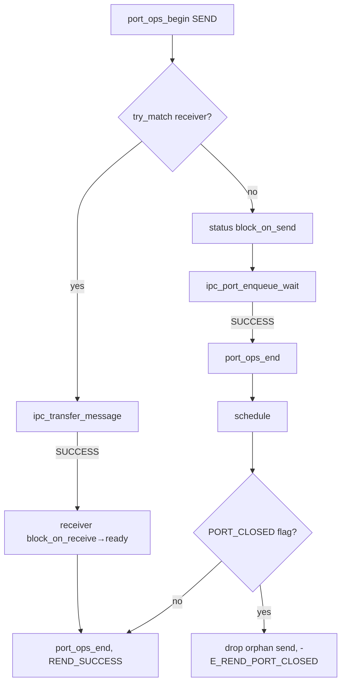

# 阻塞与非阻塞收发

v0.1 · 2026-08-27

本篇覆盖：`kernel/ipc/ipc.c`、`include/rendezvos/ipc/ipc.h`。

Port 对象、两层模型与全局表见 `Port与消息模型.md`；线程 status 与 `schedule` 见 `03-任务与调度/线程与Task_Manager.md`；`port_ops_begin/end` 与 port 关闭见 `Port钩子与准入门.md`；MSQ 会合队列细节见 `无锁队列与EBR设计.md`；system 异步投递见 `ipc.h` 注释（本篇 §6.5 摘要）。

---

## 1. 概述

RendezvOS IPC 收发分 **会合** 与 **转移** 两步：

1. **Port 级 MSQ**（`Message_Port_t::thread_queue`）让 send 侧与 recv 侧线程配对；队列 tail tag 记录当前是 SEND 等 RECV、RECV 等 SEND，还是 EMPTY。
2. **配对成功后** `ipc_transfer_message` 从发送方 `send_pending_msg` 或 `send_msg_queue` 取一条 `Message_t`，复制 payload 到接收方 `recv_msg_queue`，并 bump `recv_pending_cnt`。

**阻塞** API（`send_msg` / `recv_msg`）在 port 上无对手时把当前线程 enqueue 到 `thread_queue`，置 `block_on_send` / `block_on_receive`，`port_ops_end` 后 **`schedule`**，被唤醒后返回。 **非阻塞** API（`ipc_try_send_msg` / `ipc_try_recv_msg`）只 try_match，不匹配则 `-E_REND_AGAIN`，不入队、不 schedule。

调用方典型顺序：构造 message → `enqueue_msg_for_send` → `send_msg`；或 `recv_msg` → `dequeue_recv_msg` → 处理 → `ref_put`。

---

## 2. 目标与边界

core 提供 capability-neutral 的 **rendezvous + 消息转移** 原语，不内置 RPC 状态机、reply port 命名或超时。兼容层在 kmsg opcode 之上实现 request-reply、嵌套调用等。

core 不做：多消息 batching；跨 port 自动路由；在 `send_msg` 内替 caller 构造 `Message_t`（caller 须先 `enqueue_msg_for_send`）。

**Push vs Pull：** `send_msg` 路径为 **sender push**（sender 运行 transfer，receiver 被标 ready）；`recv_msg` 在已匹配 sender 时为 **receiver pull**（receiver 运行 transfer）。`ipc_transfer_message` 内注释详述两种方向下的 exit race 与 `send_pending_msg` 语义。

---

## 3. 分层与调用方

**Server 线程** — 循环：`thread_lookup_port` → `recv_msg(port)` → `while (dequeue_recv_msg())` 处理 → `ref_put(msg)` → `ref_put(port)`。

**Client 线程** — `kmsg_create` / `create_message_with_msg` → `enqueue_msg_for_send` → `send_msg` → `ref_put(port)`；reply 侧另建 recv 循环或 try_recv。

**Boot 线程** — `kernel_handle_msg` 对 `KERNEL_PORT_NAME` 阻塞 recv（模块初始化篇）。

**IRQ / timer** — 不用 `send_msg` 阻塞路径；用 `ipc_system_try_deliver` / `ipc_system_deliver_to`（§6.5），staging 在 `send_pending_msg`。

须遵守：每次 lookup 得到的 port 要 `ref_put(..., free_message_port_ref)`；`send_msg`/`recv_msg` 前 port 必须已 `register_port`；关闭中的 port 返回 `-E_REND_PORT_CLOSED`，阻塞唤醒可能带 `THREAD_FLAG_IPC_PORT_CLOSED`。

---

## 4. 数据结构与不变量

### 4.1 Ipc_Request_t

```c
typedef struct {
        ms_queue_node_t ms_queue_node;
        Thread_Base* thread;
        ms_queue_t* queue_ptr;
} Ipc_Request_t;
```

- 创建时 `ref_get_not_zero(&thread->refcount)`，保证等待期间 TCB 有效。
- `free_ipc_request` → **EBR retire**（见 `EBR与线程资源回收.md`）。

### 4.2 线程侧 IPC 字段（与本篇相关）

| 字段 | 作用 |
|------|------|
| `send_msg_queue` | 待发送消息 MSQ |
| `recv_msg_queue` | 已到达消息 MSQ |
| `send_pending_msg` | 已从 send 队列取出但尚未成功 transfer 的单槽（push race / system deliver） |
| `recv_pending_cnt` | 逻辑到达计数；`dequeue_recv_msg` 递减 |
| `port_ptr` | 阻塞在 port 上时非 NULL；match 时 CAS 清掉 |

### 4.3 Port 队列状态 tag

`IPC_PORT_STATE_EMPTY (0)` / `SEND (1)` / `RECV (2)` — 编码在 MSQ tail 的 tagged pointer 低位（`IPC_PORT_APPEND_BITS == 2`）。`ipc_port_enqueue_wait` 根据当前 tag 与 `my_ipc_state` 决定能否入队；冲突返回 `-E_REND_AGAIN` 供调用方重试。

### 4.4 不变量

- 阻塞路径：**不得在持 `port_ops_begin` 语义等价锁时 schedule** — 实现上在 enqueue 成功或 try 路径末尾先 `port_ops_end` 再 `schedule`。
- `enqueue_msg_for_send` 后消息 refcount 由 send 队列持有；caller 的 `ref_put` 后不得再 touch msg。
- 一次成功的 blocking send/recv 保证至少一条 message 已进入 receiver 的 recv 队列（caller 须 `dequeue_recv_msg`）。

---

## 5. 代码对应

| 符号 | 职责 |
|------|------|
| `ipc_port_try_match` | 从 port MSQ 找对手 Ipc_Request；校验 status + `port_ptr` CAS |
| `ipc_port_enqueue_wait` | 当前线程入 port 等待队列 |
| `ipc_transfer_message` | sender → receiver 转移一条 message |
| `send_msg` / `recv_msg` | 阻塞会合 + transfer |
| `ipc_try_send_msg` / `ipc_try_recv_msg` | 非阻塞 try_match + transfer |
| `enqueue_msg_for_send` | 消息入当前线程 send 队列 |
| `dequeue_recv_msg` | 从 recv 队列取 message（隐藏 dummy 语义） |
| `ipc_drop_one_orphan_send_msg` | port 关闭或 send 失败时清理 send 侧孤儿消息 |

---

## 6. 流程

### 6.1 send_msg（阻塞）



- try_match 成功：由 **sender** 调 transfer；receiver **不** 在此路径 schedule（仅改 ready；若其原为阻塞 recv，将在它自己的 recv_msg 返回路径或已被唤醒的 schedule 中运行）。
- enqueue 成功：当前 sender 睡眠，直到对手 match 并完成 transfer（对手侧 recv_msg/send_msg 逻辑将其唤醒）。

### 6.2 recv_msg（阻塞）

与 send 对称：`IPC_PORT_STATE_RECV` 侧 try_match **sender**，transfer 方向 `ipc_transfer_message(sender, receiver)`；无 sender 则 `block_on_receive` + enqueue + schedule。

### 6.3 ipc_try_send_msg / ipc_try_recv_msg

- 仅一轮（循环内）try_match；无对手 → `port_ops_end` + **`-E_REND_AGAIN`**。
- **不** 修改 caller 为 block 状态（除非 match 成功改变 **对手** status）。
- 适用于 compat 层 poll、cooperative server 或 system deliver 内部。

### 6.4 ipc_transfer_message 要点

1. 优先 `atomic exchange` 取 `sender->send_pending_msg`；否则 `msq_dequeue(send_msg_queue)`。
2. 分配新 `Message_t` shell，`fill_message_data` 共享 `Msg_Data_t` 内容，enqueue 到 `receiver->recv_msg_queue`。
3. 若 receiver 正在 exit（`-E_REND_AGAIN`），message 还回 `send_pending_msg` 供重试。
4. 成功则 put sender 侧 message ref。

receiver pull 时 sender 必须存活（运行 transfer 的上下文）；sender push 时 receiver exit 由 `-E_REND_AGAIN` 处理。

### 6.5 System 异步投递（摘要）

| API | 模式 |
|-----|------|
| `ipc_system_try_deliver(port, msg, proxy)` | 在 `send_pending_msg` staging 后调 `ipc_try_send_msg(port)`；proxy 时用 idle  persona 暂替 `current_thread` |
| `ipc_system_deliver_to(receiver, msg, proxy)` | staging 后直接 `ipc_transfer_message(sender, receiver)`，**无** port 会合 |

两者 **不要** 用 `enqueue_msg_for_send`；caller 转移 msg 所有权。失败 try-clean staging slot。

---

## 7. 公开 API

| API | 前置条件 | 成功返回 | 典型错误 |
|-----|----------|----------|----------|
| `enqueue_msg_for_send(msg)` | 当前线程非 NULL；msg refcount 有效 | `REND_SUCCESS` | `-E_IN_PARAM`, `-E_REND_AGAIN`, `-E_REND_IPC` |
| `send_msg(port)` | 已 enqueue 至少一条 send 消息 | `REND_SUCCESS` | `-E_REND_PORT_CLOSED`, transfer 错误 |
| `recv_msg(port)` | — | `REND_SUCCESS`（须 dequeue） | 同上 |
| `ipc_try_send_msg(port)` | 同 send | `REND_SUCCESS` / `-E_REND_AGAIN` | port closed |
| `ipc_try_recv_msg(port)` | — | 同 recv | 同上 |
| `dequeue_recv_msg()` | — | `Message_t*` 或 NULL | — |
| `ipc_transfer_message(s, r)` | 高级：caller 已 match 并 hold refs | 见 `ipc.h` | `-E_REND_NO_MSG`, `-E_REND_AGAIN` |

Message 构造 API 见 `Port与消息模型.md` §7。

---

## 8. 多架构

IPC 会合与转移 **arch 无关**；依赖 per-CPU `core_tm` 与 `schedule`。system proxy 路径使用 idle 线程 persona，与 arch 无关。

---

## 9. 测试

- `modules/test/single_port_test.c` — 单 port 阻塞往返。
- `smp_*` 测例 — 多核 send/recv 压力。

```bash
cd core && make ARCH=x86_64 config && make all && make run
```

与当前源码一致，尚未复测。

---

## 10. 限制与后续

- **单消息 transfer** — 每次会合转移一条；batch 由上层循环。
- **send_pending_msg 单槽** — 多 receiver 同时 pull 同一 sender 的 race 由注释中的 Problem 3/4 约束；上层应避免。
- **无超时** — 阻塞直到 match 或 port close。
- **try 路径不保证 fairness** — RR 调度可能导致 try 饿死，compat 需自旋或阻塞。

---

## 11. 变更记录

| 日期 | 摘要 |
|------|------|
| 2026-08-27 | 初稿：阻塞/try 收发、transfer、system deliver 摘要 |
