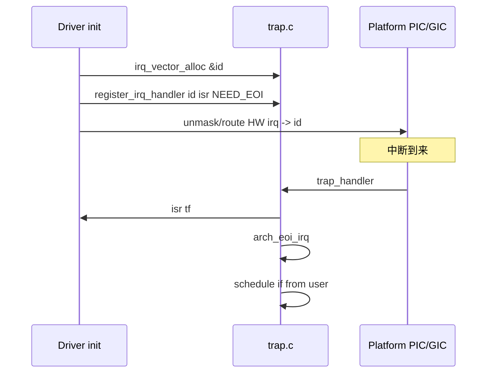

# IRQ 向量分配与处理

v0.1 · 2026-08-27

本篇覆盖：`kernel/trap/trap.c`、`include/rendezvos/trap/trap.h`、`kernel/time/time.c`（timer IRQ 注册示例）。

Trap 分类与 fixed handler 见 `Trap抽象与分类.md`；x86 APIC/PIC 与 aarch64 GIC 硬件细节见同分区平台篇。

---

## 1. 概述

每 CPU 维护 **`irq_vector[NR_IRQ]`**：每项含 handler 指针与 **`irq_attr`**（`IRQ_VEC_USED`、`IRQ_NEED_EOI`）。Boot 时 arch 通过 **`irq_vector_reserve_range_for_cpu`** 标记 CPU 自有向量（异常 0–31、timer、IPI、spurious 等），并 **`irq_vector_set_alloc_pool`** 划定设备驱动可 **`irq_vector_alloc`** 的区间。

**`register_irq_handler(id, fn, attr)`** 在所有 CPU 上同步写入 handler（要求 id 已 USED）。硬件中断经汇编 → **`trap_handler`** → handler；若 attr 含 **`IRQ_NEED_EOI`**，返回前调 **`arch_eoi_irq(trap_info)`**。若 trap 来自用户态且 **`core_tm`** 已就绪，**`trap_handler`** 末尾 **`schedule`**。

---

## 2. 目标与边界

core 提供 **SMP 一致的 trap id 命名空间** 与 **alloc/free 池**，不在此定义 Linux `request_irq` 或 MSI 框架。设备驱动（或模块）负责：alloc id → register handler → 在 arch PIC/GIC 中 unmask 对应 HW IRQ（平台篇）。

**池耗尽** — `irq_vector_alloc` 返回 `-E_RENDEZVOS`；集成方应缩小静态 reserve 或增大 `NR_IRQ`（编译配置）。

---

## 3. 分层与调用方

**arch 启动** — `arch_init_irq_vector_state()` 内 reserve 核心向量 + set pool（x86：`ARCH_IRQ_VEC_*` 常量在 arch trap.h）。

**timer** — `kernel/time/time.c` 等在 init 时 `register_irq_handler(ARCH_IRQ_VEC_TIMER, timer_handler, IRQ_NEED_EOI)`（具体 attr 以实现为准）。

**设备模块** — `u32 id; irq_vector_alloc(&id); register_irq_handler(id, my_isr, IRQ_NEED_EOI);` 然后在平台代码把 HW IRQ 号路由到 id（x86 IOAPIC 壳、aarch64 GIC SPI 配置见平台篇现状）。

**释放** — `irq_vector_free(id)` 清 USED（所有 CPU 一致）； rarely used in v0.1。

---

## 4. 数据结构与不变量

### 4.1 irq_attr 位

| 标志 | 含义 |
|------|------|
| `IRQ_VEC_USED` | 槽位已占用（reserve/alloc/register） |
| `IRQ_NEED_EOI` | handler 返回后 arch EOI |

### 4.2 全局池

```c
static u32 irq_vector_pool_lo, irq_vector_pool_hi;
```

`irq_vector_alloc` 在 `[lo, hi]` 扫描：**所有 CPU** 上该 id 均未 USED 才分配，并 mark USED on **all CPUs**。

### 4.3 不变量

- `register_irq_handler` 对 unused id **拒绝**并打 log。
- alloc 与 free 必须 all-CPU 对称。
- handler 运行于 **中断上下文**（或等价 trap 上下文）；须短、不阻塞；需 EOI 时 attr 必须正确。

---

## 5. 代码对应

| 符号 | 说明 |
|------|------|
| `irq_vector_reserve_range_for_cpu/all` | 标记 USED |
| `irq_vector_set_alloc_pool` | 设备池范围 |
| `irq_vector_alloc` / `irq_vector_free` | 动态 id |
| `register_irq_handler` | 安装 handler |
| `trap_handler` | 分发 + EOI + schedule |
| `init_interrupt` | arch_init_irq_vector_state + arch_init_interrupt |
| `arch_eoi_irq` | 平台 ACK |

---

## 6. 流程

### 6.1 设备 IRQ 安装



### 6.2 trap_handler 核心逻辑

1. `trap_id = TRAP_ID(tf->trap_info)`。
2. 有 handler → 调用；无 → unknown + panic。
3. `IRQ_NEED_EOI` → `arch_eoi_irq`。
4. `!arch_int_from_kernel(tf) && core_tm` → `schedule(percpu(core_tm))`。

第 4 步使 **用户态被 IRQ 打断** 后内核有机会切换线程；纯内核态 trap 不 schedule。

---

## 7. 公开 API

见 §5 表；完整声明在 `include/rendezvos/trap/trap.h`。

---

## 8. 多架构

- **x86_64** — 向量 0–31 CPU exception；`ARCH_IRQ_VEC_TIMER/IPI/...` 在 alloc pool 之上；IDT 由 `arch_init_interrupt` 填充（平台篇）。
- **aarch64** — GIC SPI/SGI 与 trap_info 编码在 arch trap；EOI 写 GIC CPU interface（GIC 篇）。

两 arch 共享 `trap.c` 中 **alloc/register** 逻辑。

---

## 9. 测试

- timer tick 依赖 timer IRQ 注册与 GIC/APIC 时钟源。
- SMP IPI 使用 reserve 的 IPI 向量（`06-SMP与同步/软IPI机制.md`）。

与当前源码一致，尚未复测。

---

## 10. 限制与后续

- **register_irq_handler 写所有 CPU** — 不支持 per-CPU 不同 handler 同 id（设计为 SMP 对称）。
- **IOAPIC 完整路由** — x86 v0.1 部分为空壳（平台篇）。
- ** threaded IRQ** — 无 Linux 式 bottom half；driver 应 IPC 到线程。

---

## 11. 变更记录

| 日期 | 摘要 |
|------|------|
| 2026-08-27 | 初稿：irq_vector 池、trap_handler、EOI/schedule |
