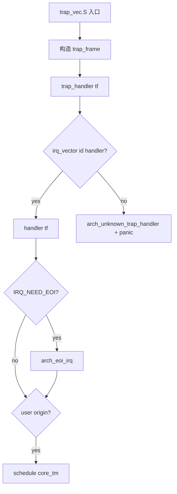

# Trap 抽象与分类

v0.1 · 2026-08-27

本篇覆盖：`kernel/trap/trap.c`、`include/rendezvos/trap/trap.h`、`include/rendezvos/trap/trap_common.h`、`include/rendezvos/trap.h`、`arch/x86_64/trap/trap_vec.S`、`arch/aarch64/trap/trap_vec.S`。

IRQ 向量分配与 `trap_handler` 见 `IRQ向量分配与处理.md`；系统调用弱符号 `syscall` 见 `系统调用入口.md`；x86/aarch64 平台中断控制器见同分区平台篇。

---

## 1. 概述

RendezvOS 把 **硬件 trap/IRQ 号** 与 **语义分类 trap_class** 分层：汇编入口构建 `struct trap_frame`，`trap_handler` 按 trap id 查 per-CPU `irq_vector[]` 分发；异常类 fault 另可通过 **`register_fixed_trap(trap_class, handler, attr)`** 按架构无关类别注册，arch 层把 class 反向映射到本地 vector/EC 并安装 wrapper。

`trap_common.h` 定义 **`enum trap_class`**（页 fault、非法指令、syscall、IRQ 等）与 **`TRAP_COMMON` 宏**（嵌入各 arch 的 `*_trap_info`）。兼容层 page fault、illegal insn 等应优先用 trap_class + `arch_populate_trap_info`，避免硬编码 x86 `#PF=14` 或 aarch64 EC。

---

## 2. 目标与边界

core 提供：**统一 trap_frame 入口**、**两级 handler 注册**、**trap_handler 末尾 schedule 策略**（用户态/非 kernel-int 来源时）。不在 core 实现完整 POSIX signal、ptrace 或 Linux `do_page_fault` 语义——兼容层在 fixed handler 或弱符号 `syscall` 中实现。

**两种注册方式互斥于同一 trap id**（后注册覆盖前者），见 `trap_common.h` 长注释。推荐：fault/syscall 用 `register_fixed_trap`；设备 IRQ 用 `irq_vector_alloc` + `register_irq_handler`。

---

## 3. 分层与调用方

**兼容层** — 启动早期（arch `start_arch` 之后）注册：

```c
register_fixed_trap(TRAP_CLASS_PAGE_FAULT, my_pf_handler, IRQ_NO_ATTR);
```

handler 内：`arch_*_trap_info info; arch_populate_trap_info(tf, &info);` 读 `info.fault_addr`、`info.is_write` 等。

**arch 启动** — `init_interrupt()` → `arch_init_irq_vector_state` + `arch_init_interrupt`（IDT/GIC 等）；`register_fixed_trap(TRAP_CLASS_SYSCALL, arch_syscall_helper, ...)` 在 boot 代码（aarch64 `start_arch.c`；x86 通过 MSR syscall entry + 向量绑定，见系统调用篇）。

**模块驱动** — 动态 IRQ：`irq_vector_alloc` → `register_irq_handler(id, fn, IRQ_NEED_EOI)`。

---

## 4. 数据结构与不变量

### 4.1 trap_class（节选）

```c
enum trap_class {
        TRAP_CLASS_PAGE_FAULT,
        TRAP_CLASS_ILLEGAL_INSTR,
        ...
        TRAP_CLASS_SYSCALL,
        TRAP_CLASS_IRQ,
        ...
        TRAP_CLASS_UNKNOWN,  /* 必须最后；定 fixed_trap_handlers[] 大小 */
};
```

编译期检查 `TRAP_CLASS_UNKNOWN <= 255`（`trap_class` 存 u8）。

### 4.2 TRAP_COMMON 字段（语义）

- `trap_class`、`is_user`、`is_fatal`
- 页 fault：`fault_addr`、`is_write`、`is_execute`、`is_present`
- `error_code`、`arch_flags` — arch 原始字段副本或摘要

### 4.3 struct irq（per-CPU 向量表项）

```c
struct irq {
        void (*irq_handler)(struct trap_frame *tf);
        u64 irq_attr;  /* IRQ_VEC_USED, IRQ_NEED_EOI */
};
```

`DEFINE_PER_CPU(struct irq, irq_vector[NR_IRQ])`。

### 4.4 不变量

- `register_irq_handler` 要求 trap id 已 **USED**（reserve 或 alloc）。
- `trap_handler` 在无 handler 时 `arch_unknown_trap_handler` + **panic**。
- 用户态 trap 处理返回前可能 **`schedule(core_tm)`**（若 `!arch_int_from_kernel(tf)`）。

---

## 5. 代码对应

| 文件 | 职责 |
|------|------|
| `trap_common.h` | trap_class、TRAP_COMMON、注册优先级说明 |
| `trap.h` | irq_vector API、register_fixed_trap 声明 |
| `trap.c` | irq_vector 池、register_irq_handler、trap_handler、init_interrupt |
| `arch/*/trap/trap.c` | x86/aarch64 trap_class 映射、populate_trap_info、register_fixed_trap 实现 |
| `arch/*/trap/trap_vec.S` | 硬件入口 → trap_frame |
| `rendezvos/trap.h` | 聚合 include arch trap.h |

---

## 6. 流程

### 6.1 硬件 → trap_handler



Fixed trap 路径：handler 实为 `x86_fixed_trap_wrapper` / `aarch64_fixed_trap_wrapper` → populate_trap_info → `fixed_trap_handlers[trap_class]`。

### 6.2 register_fixed_trap（x86 示例）

1. 保存 handler 到 `fixed_trap_handlers[class]`。
2. 扫描 `x86_trap_class_map[trap_id]`，对每个匹配 id 调 `register_irq_handler(trap_id, x86_fixed_trap_wrapper, attr)`。

aarch64 对 EC 表 `aarch64_ec_to_trap_class` 做类似反向扫描（含 SVC → SYSCALL）。

---

## 7. 公开 API

| API | 说明 |
|-----|------|
| `register_fixed_trap(class, handler, irq_attr)` | 按语义类注册 |
| `register_irq_handler(id, handler, irq_attr)` | 按向量号注册 |
| `trap_handler(tf)` | 核心分发（arch 汇编调用） |
| `init_interrupt()` | per-CPU arch IRQ 初始化 |
| `arch_populate_trap_info(tf, info)` | arch 填充 TRAP_COMMON |
| `arch_int_from_kernel(tf)` | 是否来自内核态 |
| `arch_unknown_trap_handler(tf)` | 未注册向量诊断 |

IRQ 池 API 见下一篇。

---

## 8. 多架构

| 方面 | x86_64 | aarch64 |
|------|--------|---------|
| trap id | IDT 向量 0–31 + 设备 IRQ | 异常 EC + SPI/SGI 编号 |
| class 映射 | `x86_trap_class_map[]` | `aarch64_ec_to_trap_class(ec)` |
| syscall | MSR LSTAR + `#PF` 同类框架 | EL0 SVC EC 0x15/0x18 |
| trap_frame | `rip/cs/rflags/...` | `ELR/SPSR/sp` 等 |

riscv/loongarch 头文件占位，无完整 trap 链。

---

## 9. 测试

- 页 fault、syscall 测例依赖 compat 或 helloworld 注册 handler。
- 未注册向量触发 panic（负向行为）。

```bash
cd core && make ARCH=x86_64 config && make all && make run
```

与当前源码一致，尚未复测。

---

## 10. 限制与后续

- **同 id 覆盖** — fixed 与 direct irq 混用易踩坑；文档化纪律见 trap_common.h。
- **TRAP_CLASS_UNKNOWN 必须末项** — 扩展 class 须同步 arch 映射表。
- **trap_handler 统一 schedule** — 高频率 IRQ handler 内应考虑快速返回 vs 可抢占性。
- **personality 边界** — 弱符号 `syscall` 在单独篇说明。

---

## 11. 变更记录

| 日期 | 摘要 |
|------|------|
| 2026-08-27 | 初稿：trap_class、fixed trap、trap_handler 流程 |
