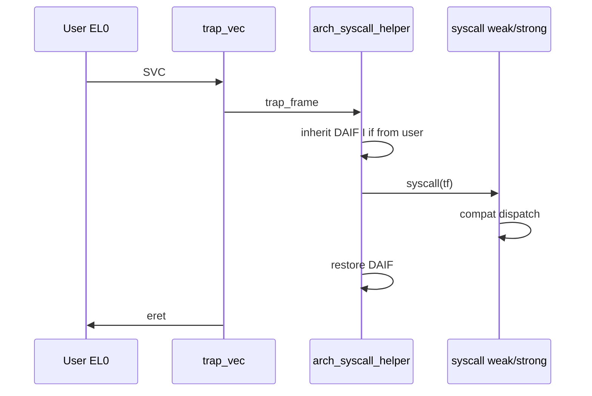

# 系统调用入口

v0.1 · 2026-08-27

本篇覆盖：`kernel/system/syscall.c`、`arch/x86_64/trap/trap.c`、`arch/aarch64/trap/trap.c`、`arch/x86_64/trap/kernel_entry.S`、`arch/aarch64/trap/kernel_entry.S`、`arch/x86_64/trap/tss.c`、`include/arch/x86_64/trap/tss.h`、`include/arch/x86_64/trap/trap.h`、`include/arch/aarch64/trap/trap.h`、`include/arch/*/trap/trap_def.h`。

Trap 分类与 `register_fixed_trap` 见 `Trap抽象与分类.md`；从 syscall 返回用户见 `03-任务与调度/线程创建与ELF加载.md`（`arch_syscall_set_user_return` / `arch_return_to_user`）。

---

## 1. 概述

RendezvOS core 只提供一个 **弱符号** `syscall(struct trap_frame* tf)`（默认空实现）。各 arch 在启动时注册 **`TRAP_CLASS_SYSCALL`** 的 fixed handler（x86：`sysenter/syscall` MSR 入口 + 对应向量；aarch64：`arch_syscall_helper`），在 arch glue 中调用 **`syscall(tf)`**，再按 trap frame 返回用户态。

兼容层链接时 **强符号覆盖** `syscall`，在其中读架构定义的 syscall 号与参数寄存器、分发到 OS 语义实现，最后写回返回值寄存器。core 不维护 syscall 表或 NR_syscalls 常量。

---

## 2. 目标与边界

core 负责：**进入内核态的统一帧**、**syscall 类 trap 的注册**、**中断标志继承策略**（aarch64 DAIF I 位；x86 IF 相关见 arch 代码）。不负责：Linux ABI 兼容表、seccomp、strace、vsyscall 页。

**fork/clone/exec** 等若需特殊返回路径，兼容层在 `syscall` 内调用 `copy_thread` / `arch_return_to_user`（创建篇），core 不硬编码。

---

## 3. 分层与调用方

**链接方 / 兼容层** — 实现：

```c
void syscall(struct trap_frame *tf) {
        /* 读 arch 定义的 nr/args，dispatch，写 tf->rax 或 arch 等价 */
}
```

须在 `start_smp` 与用户程序运行 **之前** 完成（通常随 compat `.o` 链接，无需额外注册——arch 已在 boot 注册 helper）。

**core 测例** — 未覆盖 `syscall` 时调用为空，用户态 SVC/int 0x80 路径无 ops。

**返回用户** — 正常 syscall 返回：修改 trap frame 中的 PC/SP/返回值；特殊路径（如 `run_copied_thread`）用 `arch_syscall_set_user_return` + `arch_return_to_user`。

---

## 4. 数据结构与不变量

### 4.1 trap_frame（arch 特定）

- **x86_64** — `rax`（nr/ret）、`rdi, rsi, rdx, r10, r8, r9`（参数）、`rip/cs/rsp/ss/rflags` 等（`include/arch/x86_64/trap/trap.h`）。
- **aarch64** — `x0–x7`、`ELR`、`SPSR`、banked SP（`include/arch/aarch64/trap/trap.h`）。

handler 必须只修改 frame 中 **应暴露给用户** 的字段；内核栈切换由 entry.S 已完成。

### 4.2 弱符号契约

```c
__attribute__((weak)) void syscall(struct trap_frame* syscall_ctx);
```

- 无 strong 定义时为空操作。
- 强定义须可重入（SMP 每 CPU 独立 trap frame）。

### 4.3 中断继承（aarch64）

`arch_syscall_helper`：EL0 进入时保存 DAIF，从 user SPSR 继承 **I 位** 到 syscall 窗口，返回前恢复——使用户 syscall 执行期间中断策略与进内核前一致。Same-EL SVC（EC 0x18）保持内核 DAIF。

---

## 5. 代码对应

| 文件 | 职责 |
|------|------|
| `syscall.c` | 弱符号 `syscall` |
| `aarch64/boot/start_arch.c` | `init_syscall` → register_fixed_trap(SYSCALL, arch_syscall_helper) |
| `x86_64/boot/start_arch.c` | `init_syscall`：IA32_STAR/FMASK/LSTAR |
| `arch/x86_64/trap/kernel_entry.S` | syscall 指令入口 |
| `arch/aarch64/trap/kernel_entry.S` | exception vector 入口 |
| `arch_thread.c` | `arch_syscall_set/get_user_return` |
| `tss.c` | x86 per-CPU TSS、RSP0 |

---

## 6. 流程

### 6.1 aarch64



`register_fixed_trap` 绑定 EC **0x15**（EL0 SVC）与 **0x18**（防御性 same-EL）。

### 6.2 x86_64

1. Boot：`wrmsr(IA32_STAR/LSTAR/FMASK)`，`arch_set_syscall_entry()` 指向 kernel_entry。
2. 用户 `syscall` 指令 → entry.S 建 frame → 映射到 **TRAP_CLASS_SYSCALL** fixed wrapper → 最终到 compat `syscall`（若 x86 路径经 fixed wrapper 调 weak 符号，以实现为准，见 `arch/x86_64/trap/trap.c` 与 entry 链）。
3. 返回：`sysret` 或 iret 等价路径恢复 user rip/rsp。

（x86 详细 MSR 与向量号以实现文件为准；集成方读 `start_arch.c` + `kernel_entry.S`。）

### 6.3 与调度的关系

syscall handler **内** 可调用阻塞 IPC、`schedule` 等；返回 user 前须保证 `current_thread` 与 HW AS 一致（VSpace 篇）。`trap_handler` 在 syscall **不属于 IRQ** 时通常不额外 schedule（syscall 路径在 fixed handler 内返回，不经过 IRQ 的 trap_handler schedule 分支——若从 syscall 嵌套 IRQ 则另论）。

---

## 7. 公开 API

| 符号 | 说明 |
|------|------|
| `void syscall(struct trap_frame* tf)` | 兼容层实现点（weak） |
| `arch_syscall_helper` | arch static，TRAP_CLASS_SYSCALL |
| `arch_syscall_set_user_return(tf, ctx, pc, sp, ret)` | 写回 user 返回值 |
| `arch_syscall_get_user_return(tf, ctx, &pc, &sp, &ret)` | 读 user 上下文 |
| `arch_return_to_user(kstack_bottom, tf, syscall_ret)` | 首次/特殊进 user |

---

## 8. 多架构

| 项目 | x86_64 | aarch64 |
|------|--------|---------|
| 用户触发 | `syscall` insn | `svc #0` |
| 号/参数 | rax, rdi, rsi, … | x8, x0–x5 |
| 注册 | MSR + fixed class | register_fixed_trap(SYSCALL) |
| TLS/FSGS | MSR_FS/GS_BASE | TPIDR |

---

## 9. 测试

- 完整 syscall 表需 **兼容层镜像**；standalone core 通常无 user syscall 行为。
- 可写用户测例触发 SVC/int 0x80 验证覆盖强符号。

与当前源码一致，尚未复测。

---

## 10. 限制与后续

- **core 无 syscall NR 枚举** — 全在 compat。
- **x86 int 0x80 兼容** — 若需要由 compat 额外注册向量。
- **audit / trace** — 非 core 范围。

---

## 11. 变更记录

| 日期 | 摘要 |
|------|------|
| 2026-08-27 | 初稿：weak syscall、arch helper、返回路径 |
