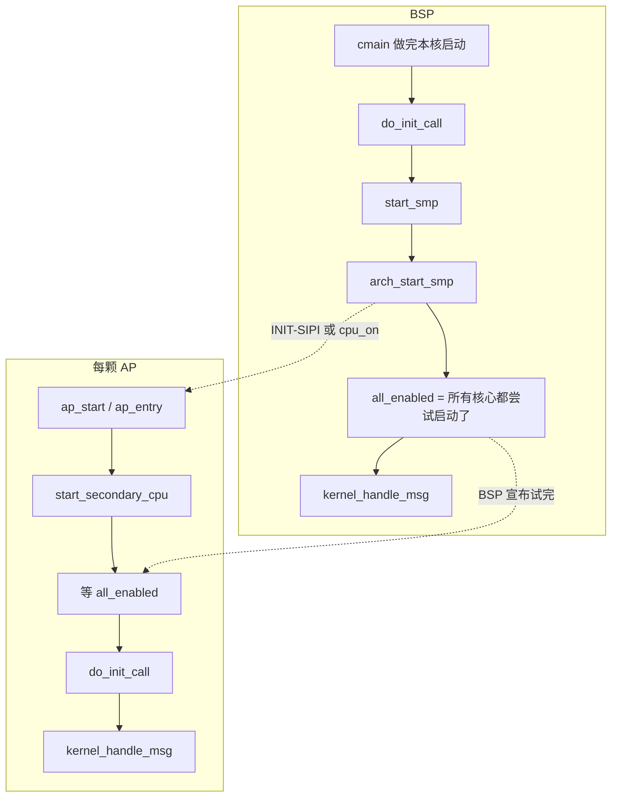
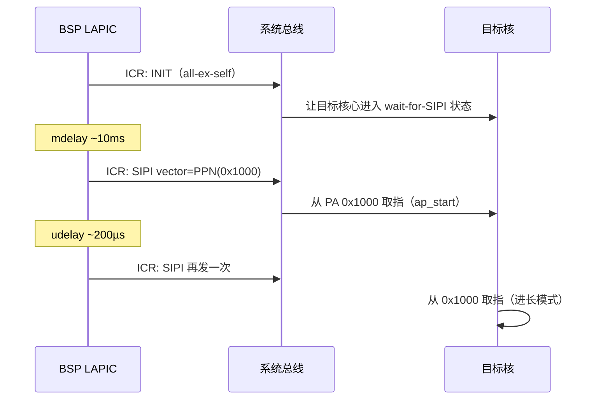
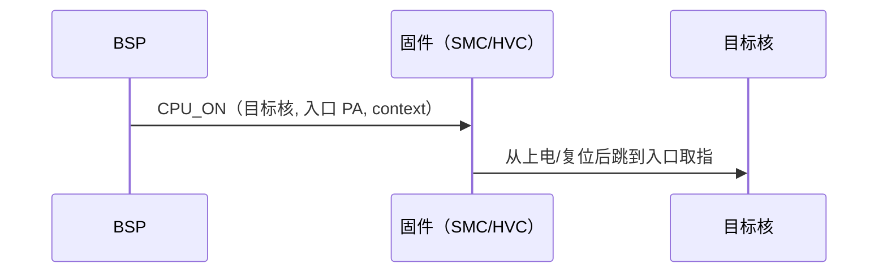
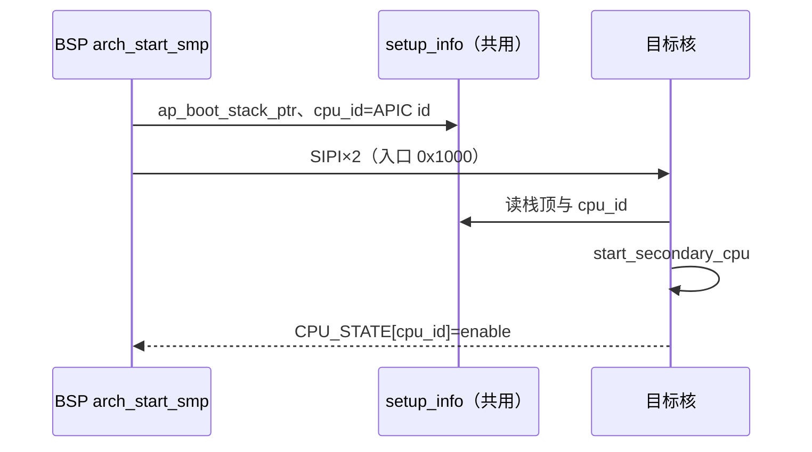
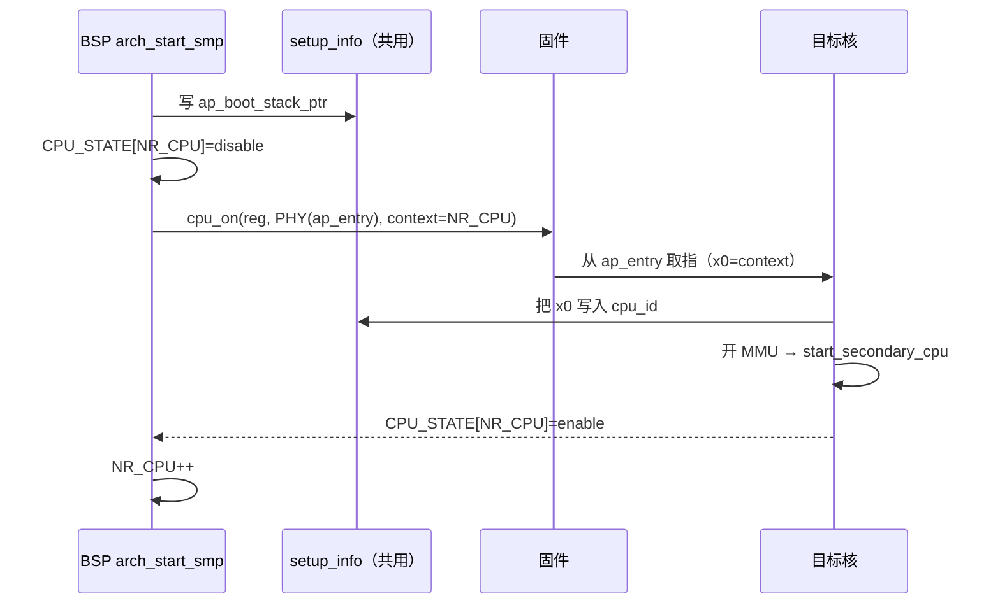

# SMP 启动与处理器拓扑

v0.1 · 2026-10-04

本篇对应的源码是：`kernel/smp/smp.c`、`include/rendezvos/smp/smp.h`、`include/rendezvos/smp/cpu_id.h`、`include/rendezvos/cpu_topology.h`，以及 `arch/x86_64/boot/smp.c`、`arch/aarch64/boot/smp.c`。

启动总览里，最先起来的核叫 **BSP**，其余后来被叫醒的核叫 **AP**。总览写过：BSP 在 `cmain` 末尾才调 `start_smp`；AP 从汇编入口进 `start_secondary_cpu`。`ap_start` / `ap_entry` 本身怎样从实模式或关着 MMU 走到能跑 C，见平台启动篇。本篇接着讲：**怎样把其它核叫醒，叫醒之后 BSP 与 AP 各自还要补什么，以及 `cpu_id` 在 x86_64 / aarch64 上怎么编号。**

建议读法：§1 看目的；§4 看本篇管哪些状态与不变量；§6 先硬件背景，再 `start_smp`、叫醒、最后 AP 进 C；§7 查接口。

---

## 1. 概述

多核启动要解决的事很单纯：BSP 已经独自把内核跑起来了，现在要让其余核也进入同一套内核，并能各自调度、收消息。

为此，core 把工作拆成两层：

1. **跨架构的编排**（`start_smp` / `start_secondary_cpu`）：`start_smp` 只管理 `all_enabled` 并调用架构侧的 `arch_start_smp`。`start_secondary_cpu` 则是每颗 AP 都要走的启动。需要注意：BSP 先跑完自己的 `do_init_call` 再叫醒别人；AP 等到 BSP 宣布该试的核都试过了（`all_enabled`）后，再跑各自的 `do_init_call`。
2. **架构侧的叫醒手段**（`arch_start_smp`）：x86_64 走 Local APIC 的 INIT–SIPI；aarch64 走固件 PSCI 的 `cpu_on`。

目的是：同一份 `kernel/` 不用按 ISA 分叉 `cmain` 和 `start_smp` ；兼容层看到的是统一的 `cpu_id` / `CPU_STATE` / `cpu_is_online`，而不是两套完全不同的启动故事。

x86_64 和 aarch64 的硬件手段不同，软件设计也不同，这些落在 §4 和 §6，概述不展开。

本篇还涵盖的`cpu_topology.h` 里的 `cpu_socket` / `cpu_cluster` / `cpu_core` 目前是空占位。



---

## 2. 目标与边界

要讲清的是：`start_smp` 多核心如何启动，如何在启动时进行同步以免引发并发问题；`all_enabled` / `NR_CPU` 与 `CPU_STATE`等CPU状态记录；发 SIPI 或调 `cpu_on` 之前怎样改写共用的 `setup_info`用于多核心启动；以及不同架构下的 `cpu_id` 设置。

不在本篇做：运行期 hotplug、NUMA、aarch64 的 `spin-table`。GDT / 开 MMU / GIC `init_distributor` 与 `init_cpu_interface` 的分工，以平台启动篇为准。ICR 各位、PSCI function id，以 APIC 篇、PSCI 篇为准；本篇只留启核用到的那一层。

失败时：x86_64 对某核约十秒仍非 `cpu_enable` 则打日志继续尝试下一个核心的启动；aarch64 `cpu_on` 失败也可能仍 `NR_CPU++`（这是一个已知缺口，当然，按照设计，我们不应该期望在这种情况下后面测试可以正常工作，如果发生这种情况，请务必进行调试更改启动多核心这部分内容）。AP 上 `virt_mm_init` / `arch_start_core` 失败则直接返回，**还没有**把自己标成 `cpu_enable`（BSP 会等到超时）。`init_proc` 排在标 `cpu_enable` **之后**：它失败时这颗核在 BSP 看来已经起来了，但本核不会再等 `all_enabled`，也不会跑 `do_init_call`。

---

## 3. 分层与调用方

整条 `cmain` 顺序、BSP/AP 谁做「全机一次 / 每核一次」、initcall 早晚差与 `DEFINE_INIT` 里按 `cpu_number` 分支——这些在启动总览（`02`）和模块初始化篇（`03`）已经讲过，本篇不重复。

本篇只切出多核唤醒这一段里的两层：

| 层 | 符号 | 谁调用 | 本篇职责 |
|----|------|--------|----------|
| 可移植编排 | `start_smp`、`start_secondary_cpu`、`all_enabled`、`cpu_is_online` | BSP：`cmain` → `start_smp`；AP：`ap_start` / `ap_entry` → `start_secondary_cpu` | 何时开始叫醒、用什么同步汇合、AP 起来后设定AP核环境、对BSP提供「这颗核起来了没有」的信号 |
| 架构唤醒 | `arch_start_smp` | 仅由 `start_smp` 调用 | 发 INIT–SIPI 或调 PSCI `cpu_on`；每启一核前改写共用的 `setup_info` |

平台侧的 `arch_start_platform`（仅 BSP）/ `arch_start_core`（每核）以及跳板汇编归平台启动篇；AP 路径上会**调用**它们，但职责不以本篇为准。软 IPI、per-CPU 访问约定是唤醒之后的事，见同目录专篇。

---

## 4. 数据结构与不变量

本篇管的运行时状态是：一共认多少核、每核处于什么状态、软件 `cpu_id` 怎么分配、何时宣布「该试的都试完了」。`setup_info` 里启核用的通用字段（`ap_boot_stack_ptr` / `cpu_id`）定义见启动总览 §4.1.1；这里只补**启核阶段**上的用法与不变量。

### 4.1 核计数与每核状态等数据

| 符号 | 含义 |
|------|------|
| `RENDEZVOS_MAX_CPU_NUMBER` | 编译时允许的 `cpu_id` 最大值加一（默认 128，或与 `NR_CPUS` 取较小者）。唤醒时从 0 扫到此上限减一 |
| `NR_CPU` | 运行时认为有多少个核。初值 1。x86_64 解析 MADT 时改成合法 Local APIC 条目个数；aarch64 在 `arch_start_smp` 里先改回 1，再每处理完一颗加一（失败路径也可能加，见 §2、§6.5） |
| `NR_CPUS` | 构建宏，由构建系统注入，见`01-构建与链接.md`。仅为 1 时可以不启 AP |
| `CPU_STATE` | 每个 `cpu_id` 一份：`no_cpu` / `cpu_disable` / `cpu_enable` |
| `BSP_ID` | 软件侧认定的 BSP 编号。x86_64 由 `arch_cpu_info` 写成 APIC id；aarch64 固定 0 |

### 4.2 两套软件编号规矩

同一套编排代码，两套 ISA 给 `cpu_id` 的方式不同：

| | x86_64 | aarch64 |
|--|--------|---------|
| 发现核 | MADT Local APIC | 设备树 `type=cpu` 且 `enable-method=psci` |
| `cpu_id` | **APIC id 直接当编号**（可有空号，如只有 0 和 2） | **从 0 连着数**（BSP 固定 0，AP 为 1,2,…） |
| 叫醒目标 | **APIC**的 ICR 寄存器的 dest字段 = APIC id | PSCI的 `cpu_on`调用的目标 = 节点 `reg`；第三个参数才是软件 `cpu_id` |
| `BSP_ID` | 等于 BSP 的 APIC id | 0（要求 BSP 节点 `reg` 也是 0） |

不变量：

- AP 串行拉起，同一块 `setup_info` 同时只服务一颗核；每唤醒下一颗前必须改写 `ap_boot_stack_ptr`（以及 x86 路径上的 `cpu_id`）。
- x86_64 上 `NR_CPU`（条目个数）和「最大 APIC id + 1」不是一回事。若误用「`cpu_id` 必须 `< NR_CPU`」，会把本来存在的 APIC id 2 判成越界——这也是 `cpu_is_online` 与 `cpu_id_is_online` 语义分叉的根因（接口对照见 §7.4）。

`cpu_id` 如何从 BSP 传递给 AP ：x86_64 由 BSP 在发 SIPI 前写入 `setup_info`；aarch64 经 `cpu_on` 第三个参数传入，由 `ap_entry` 写入。

### 4.3 启动汇合标志 `all_enabled`

AP 把自己标成 `cpu_enable` 之后，空转等 `all_enabled`。BSP 必须在 `arch_start_smp` **整段返回后**才写成试完——不能边叫醒边宣布。

各 ISA 在 `arch_start_smp` 内部怎么等单核就绪，属于实现细节（§6.4 / §6.5）：x86_64 在循环里等各目标核的 `CPU_STATE`；aarch64 每 `cpu_on` 一次，等 `CPU_STATE[当前 NR_CPU]` 再 `NR_CPU++`。

### 4.4 处理器拓扑（占位）

预留了 `cpu_topology_root` → `cpu_socket` → `cpu_cluster` → `cpu_core`。当前全是空结构体，无 walker、无查询。现行 `cpu_id` 来自 MADT / DTB+PSCI，**不**经过这棵树。

### 4.5 本核 per-CPU 区何时可用

| 核 | 何时 `arch_enable_percpu` |
|----|---------------------------|
| BSP | 对于percpu区域，物理内存启动分配了该区域并清空后，就存在了，BSP需要`cmain`：`arch_cpu_info` 之后、`virt_mm_init` 之前，确定参数 `BSP_ID`以调用`arch_enable_percpu` |
| AP | `start_secondary_cpu` 尽早，参数 `setup_info->cpu_id`获取自己的cpuid就可以`arch_enable_percpu`了。 |

编号规矩见 §4.2。x86_64 启动时 `CPUID（EAX=1）` 只有 8 位 APIC id；不连续或更宽时要另做对照，见启动总览 §10。更细的 `percpu()` 约定见 `29-per-CPU数据与访问约定.md`。

---

## 5. 代码对应

| 文件 | 职责 |
|------|------|
| `kernel/smp/smp.c` | 跨架构的`start_smp`多核心启动、跨架构的AP启动`start_secondary_cpu`、全局多核心启动同步记录`all_enabled` |
| `include/rendezvos/smp/smp.h`、`cpu_id.h` | 编排入口、`cpu_is_online`、`NR_CPU` / `BSP_ID` / `CPU_STATE`等辅助函数和宏 |
| `arch/x86_64/boot/smp.c` | 实现x86_64架构下的多核心启动，拷 `ap_start`代码到低地址、发INIT ipi、SIPI ipi、等待所有核心启动、清低地址的跳板`clean_tmp_page_table` |
| `arch/x86_64/boot/boot.S` 的 `ap_start` | AP 入口汇编；步骤见 x86 平台篇 |
| `arch/aarch64/boot/smp.c` | 实现aarch64架构下的多核心启动，按设备树串行 `cpu_on` |
| `arch/aarch64/boot/boot.S` 的 `ap_entry` | AP 入口汇编；见 aarch64 平台篇 |
| `include/rendezvos/cpu_topology.h` | 拓扑占位结构体（§4.4） |

---

## 6. 流程

`start_smp` 之前 BSP 在 `cmain` 里做过什么，见启动总览。下面先补启核要用的一点硬件背景，再按时间看本仓库怎么做。寄存器字段与 function id 仍以专篇为准。

### 6.1 背景：x86 INIT–SIPI

官方背景：Intel SDM 里 Multi-Processor Initialization（INIT–SIPI–SIPI）、Local APIC 的 Interrupt Command Register（ICR）。寄存器字段与发送顺序见 `26-平台中断-x86_64-APIC与PIC.md` §5.7；APIC id 怎么读见同篇 APIC ID 小节。这里只留读 §6.4 够用的那一层。

每个核有一份 **Local APIC（LAPIC）**。要叫醒另一颗核，不是写那颗核的内存，而是往**本核** LAPIC 的 **ICR** 里写一笔「请把这条消息送给 APIC id = …」。启核用的 delivery mode 和运行期软 IPI（Fixed、向量 `0x30`）不是同一套字段组合——26 篇已经强调过这一点。

本实现用到的顺序（与 Intel 常见做法一致）：

1. **INIT**（shorthand：除自己以外的所有核）——目标核进入 wait-for-SIPI。
2. 延时约 10 ms。
3. **SIPI（STARTUP）两次**——ICR 的向量字段填的是**启动代码所在物理页的页帧号**（本仓库是 `0x1000` → 帧号 1），不是普通 IDT 向量。两次之间约 200 µs。Intel 建议发两次，因为 SIPI 失败不会自动重发。



发 INIT/SIPI 走 `APIC_send_IPI`（先 ICR_HIGH 再 ICR_LOW 等约束见 26）。此时 BSP 的 `arch_start_core` 已经打开过 LAPIC。哪些核存在、APIC id 是几，来自更早的 MADT，见 `35-ACPI与MADT-x86_64.md`。

### 6.2 背景：aarch64 PSCI `CPU_ON`

官方背景：ARM **DEN0022**（PSCI）、**DEN0028**（SMCCC：用 `SMC` / `HVC` 调固件，参数在 `x0–x3`）。本仓库的 method 选择、`psci_func` 表、function id 常量见 `39-PSCI与处理器电源-aarch64.md`。这里只留读 §6.5 够用的那一层。

aarch64 常见路径是请固件执行 **`CPU_ON`**：内核不直接拨复位线，而是把「叫醒哪颗硬件核、从哪个物理地址开始执行、附带一个 context」交给固件（`SMC` / `HVC`）；固件负责上电或复位，并跳到入口。三个参数在规范里分别是目标 MPIDR 亲和性、入口物理地址、context（进入口时通常在 `x0`）。本仓库填什么、怎样和 `setup_info` 对上，见 §6.5。



完整 function id、DTB `method=smc|hvc` 见 39。

### 6.3 BSP：`start_smp`

BSP 上已在 boot 线程跑，`do_init_call` 和 `"kernel_port"` 已做过。无 `SMP` 宏则直接返回。否则：把 `all_enabled` 写成还没试完 → `arch_start_smp`（§6.4 / §6.5）→ 再写成试完（该尝试的核都尝试过，不保证每颗都 `cpu_enable`）。`start_smp` 返回之后，可选 `RENDEZVOS_TEST` 再挂测试线程，然后 BSP 进 `kernel_handle_msg`。

`arch_start_smp` 返回之前，被叫醒的核已经可以跑到 `start_secondary_cpu` 里等 `all_enabled`（§6.6）。BSP 先让`arch_start_smp`跑完返回，再宣布试完，才放行 AP 的 initcall 。

### 6.4 x86_64：`arch_start_smp` 怎么做

背景见 §6.1；ICR 字段见 `26` §5.7。`ap_start` 为何必须在低 1 MiB，见 x86 平台篇。本实现将AP启动代码拷到物理 **`0x1000`**。

SIPI 只告诉AP「从哪一页开始取指」（`0x1000`），无法告知AP它使用的栈顶和软件编号。这两项放在和 BSP 启动时同一块 `setup_info` 里：每叫醒一颗核之前，BSP 先改写，AP 的 `ap_start` 进 C 之前使用分配给自己的栈，`start_secondary_cpu` 再读 `cpu_id`。同一时刻只有一颗 AP 视这两字段有效，所以必须一颗一颗来。


关于x86_64的`arch_start_smp`：
1. BSP 自己的 `CPU_STATE = cpu_enable`。
2. 若 `NR_CPU == 1`：不拷代码、不发 IPI，但仍调用 `clean_tmp_page_table`（拆启动早期低地址恒等映射；`bsp_entry` 进 `cmain` 时故意不拆，见 x86 平台篇）。
3. 若 `NR_CPU > 1`：关本核可屏蔽中断 → 拷 `ap_start` → INIT（all-ex-self）→ 约 10 ms → 对每个 `CPU_STATE[i]==cpu_disable`：分配 16 页栈、写 `ap_boot_stack_ptr` 与 `cpu_id=i`、SIPI 两次（间隔约 200 µs）、轮询至 `cpu_enable` 或约十秒超时 → 开中断 → 清掉 `0x1000` → `clean_tmp_page_table`(拆启动早期低地址恒等映射)。

### 6.5 aarch64：`arch_start_smp` 怎么做

背景见 §6.2；function id / SMC·HVC 见 `39`。`ap_entry` 的汇编启动到`start_secondary_cpu`之前的内容，见 aarch64 平台篇。

`setup_info` 同样是 BSP 和 AP 共用的那一块。栈顶仍由 BSP 在 `cpu_on` 之前写入 `ap_boot_stack_ptr`。软件 `cpu_id` 不走结构体由 BSP 直写，而是 `cpu_on` 的第三个参数（当时的 `NR_CPU`），`ap_entry` 把入口寄存器 `x0` 存进 `setup_info.cpu_id`。这也必须一颗一颗来。这和 Linux arm64「AP 入口 `x0–x3` 为 0」不同。

`enable-method` 必须是 `psci`；`spin-table` 直接拒绝（没实现）。


关于 aarch64 的 `arch_start_smp`：
1.`NR_CPU = 1`，BSP `CPU_STATE = enable`；若 `NR_CPUS==1` 返回。否则关中断，按设备树 `type=cpu` 遍历：要有 `reg`，`enable-method` 必须是 `psci`，`reg==0` 当 BSP 跳过。其余核：分出 16 页作为栈、写 `ap_boot_stack_ptr`、`CPU_STATE[NR_CPU]=disable`，再

2.`cpu_on(reg, PHY(ap_entry), context = 当前 NR_CPU)`。

3.等到 `CPU_STATE[NR_CPU]==enable` 后 `NR_CPU++`。`cpu_on` 失败仍可能 `NR_CPU++`（缺口）。

### 6.6 AP：`start_secondary_cpu`

汇编入口见平台篇；比 BSP 少做哪些全机一次的事，见启动总览 §6.2。这里只钉 **叫醒之后** 可移植层还卡哪些点。`cpu_id` 和栈顶怎样从 `setup_info`获取，见刚写完的 §6.4 / §6.5。

进来时 `setup_info->cpu_id` 已经是本核软件编号。随后：`arch_enable_percpu` → `virt_mm_init`（栈顶来自 `ap_boot_stack_ptr`）→ `arch_start_core`。这两步任一失败就 `return`，**此时还没有**写 `cpu_enable`，BSP 的 `arch_start_smp` 会一直等到超时。

只有这两步都成功，才把 `CPU_STATE` 写成 `cpu_enable`——这是给 BSP 的「这颗核初步准备好了」信号，好让它去叫醒下一颗。然后才 `init_proc`。`init_proc` 失败同样 `return`，但 **`cpu_enable` 已经写下了**：BSP 不会为这一核再等，本核也不会去等 `all_enabled`、不会跑 `do_init_call`。

成功路径上，`init_proc` 之后空转等 `all_enabled`。BSP 还在串行 SIPI / `cpu_on`，不能在这里先跑 AP 的 `do_init_call`。

BSP 把 `all_enabled` 写成试完之后，AP 才 `do_init_call`（意图见 `03`：BSP 那一次一定早于 AP 的那一次），可选 `RENDEZVOS_TEST`，再进 `kernel_handle_msg`。可选 `HELLO` 在函数最前面，与总览一致。

---

## 7. 公开 API

本篇涉及的接口分布在：`smp.h` / `cpu_id.h` 里的编排与 online 查询，以及各架构 `smp.h` 的 `arch_start_smp`。`start_secondary_cpu` 由汇编跳入，定义在 `smp.c`，目前无 `smp.h` 声明。

不归本篇：`cpu_id_is_online` / `task_manager_for_cpu` → `16`；`percpu()` → `29`；软 IPI → `30`；ICR → `26`；PSCI → `39`；`arch_start_core` → 平台启动篇。

### 7.1 编排顺序（与源码一致）

| 场景 | 顺序 |
|------|------|
| BSP `cmain` | … → `init_proc` → **`do_init_call`** → `kernel_port_register` → **`start_smp`** → `kernel_handle_msg`（全文见总览） |
| `start_smp` 内 | `all_enabled` 还没试完 → **`arch_start_smp`** → 试完 |
| AP | `ap_start` / `ap_entry` → **`start_secondary_cpu`**（§6.6）：per-CPU → `virt_mm_init` → `arch_start_core` → `CPU_STATE=enable` → `init_proc` → **等 `all_enabled`** → `do_init_call` → `kernel_handle_msg` |

### 7.2 编排入口

```c
void start_smp(struct setup_info *arch_setup_info);
/* start_secondary_cpu：由 ap_start / ap_entry 跳入，目前无 smp.h 声明 */
```

| 接口 | 说明 |
|------|------|
| `start_smp` | 参数 `setup_info*`。无 `SMP` 宏时直接返回。 |
| `start_secondary_cpu` | 仅 AP；由 `ap_start` / `ap_entry` 调用。 |

### 7.3 架构叫醒：`arch_start_smp`

```c
void arch_start_smp(struct setup_info *arch_setup_info);
```

| 架构 | 做什么 |
|------|--------|
| x86_64 | `ap_start`@`0x1000`；INIT → 对每个 `cpu_disable` SIPI×2；清跳板；`clean_tmp_page_table`。 |
| aarch64 | DTB `cpu` + `psci`；`cpu_on(reg, PHY(ap_entry), NR_CPU)`；失败仍可能 `NR_CPU++`。 |

### 7.4 查询是否 online

```c
bool cpu_is_online(cpu_id_t cpu_id);

extern int NR_CPU;
extern cpu_id_t BSP_ID;
enum cpu_status { no_cpu, cpu_disable, cpu_enable };
```

| 接口 / 符号 | 说明 |
|-------------|------|
| `cpu_is_online` | 只看 `CPU_STATE == cpu_enable`。发 IPI 用这个。 |
| `cpu_id_is_online` | **不归本篇**（`thread.h`）：还要求 `cpu < NR_CPU` 且已有 `core_tm`，假定编号连着排。APIC id 不连续时会误判；选核创建线程见 `16`。 |
| `NR_CPU` / `BSP_ID` / `CPU_STATE` | 含义见 §4.1。 |

---

## 8. 多架构

§4.2 的表是对照。riscv64 / loongarch 目前尚未实现。`start_smp` 只看见同名的 `arch_start_smp`，从而屏蔽架构差异。

---

## 9. 测试

有`smp_test`，但是本篇主要是SMP启动部分，正常来说能看见每个核心的`[ CPUx ]RendezvOS`打印就代表AP启动成功，能看见`successfully start secondary cpu x`就是每个核心走到了AP的设置cpu enable步骤。

---

## 10. 限制与后续

拓扑结构体仍是空占位。`cpu_is_online` 与 `cpu_id_is_online` 在 APIC id 不连续时不一致。MADT disabled 未过滤。aarch64 `cpu_on` 失败仍可能 `NR_CPU++`。x86_64 缺「APIC id → 数组下标」对照层。

---

## 11. 变更记录

- 2026-10-04：校正 §6.5 误写成「关于 x86_64」；`all_enabled` 统一为「该试的都试过」，不是「每颗都 enable」。
- 2026-10-04：§6 时间线改为 6.3 `start_smp` → 6.4/6.5 叫醒 → 6.6 AP；`start_secondary_cpu` 不再重复总览的「少做什么」，只写 `CPU_STATE` / `all_enabled` / initcall 同步点。
- 2026-10-04：`setup_info` 从 §6.2 背景图挪到叫醒实现节；§6.1 / §6.2 只留 INIT–SIPI 与 PSCI `CPU_ON` 硬件。
- 2026-10-04：按系列模板重排 §4 起：§4 只留状态与不变量；APIC/PSCI 背景移入 §6；接口集中到 §7；去掉以函数名/文件名当小节标题的写法。
- 2026-10-04：校正标题与内容：§4 改为「核编号、同步与启核背景」；§4.1 改为「核计数、`CPU_STATE` 与两套编号规矩」；§6.5 / §7.2 同步改题并拆分 online 符号；修正指向不存在的 §6.6 的交叉引用。
- 2026-10-04：§3 去掉与 `02` / `03` 重复的 `cmain` / initcall 叙述，改成「可移植编排 vs 架构叫醒」两层表，细节回指总览与模块初始化篇。
- 2026-10-04：§1 收成目的级概述；APIC INIT–SIPI / PSCI `cpu_on` 基础知识移入 §4.5 / §4.6（含 sequence 图），并引用 `26` / `39` 与 Intel SDM、ARM DEN0022；§6 只留本实现步骤，去掉与概述重复的编号长段。
- 2026-10-04：改回源码符号（`cpu_socket` 等）；交叉引用写文档文件名。
- 2026-10-03：自查通篇代指；按中文阅读习惯与平台篇分工改写。
- 2026-10-03：纠正 `ap_entry`「升 EL1」；`clean_tmp_page_table` 在 `arch_start_smp` 末尾。
- 2026-09-27：中文措辞整理。
- 2026-09-26：§7 审阅。
- 2026-09-25：INIT-SIPI / PSCI 扩写。
- 2026-08-29：整篇重做。
- 2026-08-27：初稿。
