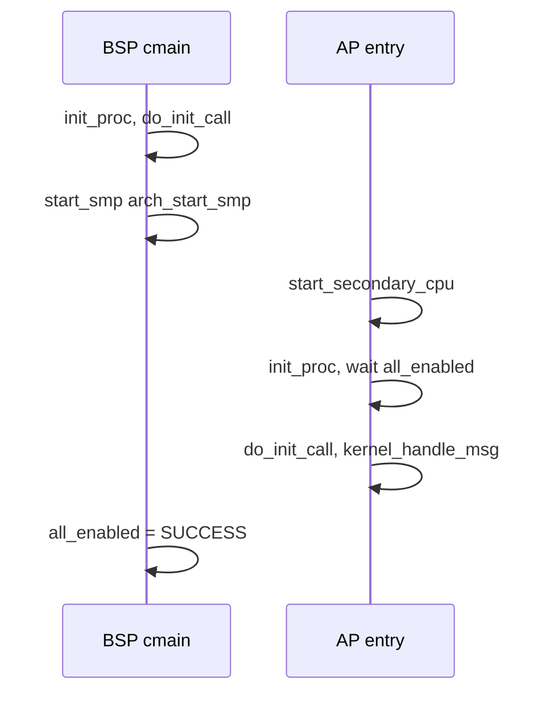

# SMP 启动与处理器拓扑

v0.1 · 2026-08-27

本篇覆盖：`kernel/smp/smp.c`、`include/rendezvos/smp/smp.h`、`include/rendezvos/cpu_topology.h`、`include/rendezvos/smp/cpu_id.h`、`include/arch/x86_64/smp.h`、`include/arch/aarch64/smp.h`、`include/arch/*/arch_bitmap.h`。

per-CPU 访问见 `per-CPU数据与访问约定.md`；BSP/AP 启动分工见 `01-启动与初始化/启动流程总览.md`；x86 MADT / aarch64 PSCI 见 `09-平台模块/` 对应篇。

---

## 1. 概述

v0.1 SMP 模型：**BSP** 在 `cmain` 中 `start_smp` 唤醒 **AP**，全局 **`NR_CPU`** 表示在线逻辑 CPU 数（初值 1，arch 枚举后更新）。每 AP 执行 **`start_secondary_cpu`**：per-CPU 启用 → `virt_mm_init` → **`arch_start_core`** → **`init_proc`** → 等待 **`all_enabled`** → **`do_init_call`** → **`kernel_handle_msg`** 循环（与 BSP boot 线程对称）。

**`cpu_topology.h`** 在 frozen 代码中多为占位/骨架；实际 CPU 发现依赖 **x86 MADT** 或 **aarch64 MPIDR/DT**（平台篇）。

---

## 2. 目标与边界

core 提供：**AP 通用 C 入口**、**all_enabled 栅栏**、**NR_CPU/CPU_STATE** 状态位。不实现 ACPI hotplug、CPU offline 完整语义或 NUMA 拓扑树。

无 `SMP` 编译宏时 `start_smp` 为空操作。

---

## 3. 分层与调用方

**arch** — 实现 `arch_start_smp`（x86 SIPI 序列 / aarch64 PSCI CPU_ON）、`arch_start_core`（GIC/LAPIC、中断 init）。

**initcall** — BSP 上 `do_init_call` **早于** `start_smp`；AP 上 **晚于** `all_enabled` 再次 `do_init_call`（须 idempotent，见模块初始化篇）。

**兼容层** — 读 `NR_CPU`、`cpu_id_is_online` 决定创建多少 per-CPU server；勿假设 AP 已 init 直到 `all_enabled`。

---

## 4. 数据结构与不变量

- **`int NR_CPU`** — 全局在线数；`cpu_id_is_online(c)` 检查 `c < NR_CPU` 且 `core_tm != NULL`。
- **`DEFINE_PER_CPU(volatile u64, CPU_STATE)`** — AP 设为 `cpu_enable` 后可见。
- **`atomic64_t all_enabled`** — BSP `start_smp` 末尾置 SUCCESS；AP spin 等待。

---

## 5. 代码对应

| 文件 | 职责 |
|------|------|
| `smp.c` | `start_smp`、`start_secondary_cpu` |
| `arch/*/boot/smp.c` | 架构唤醒 AP |
| `arch/*/boot/start_arch.c` | `arch_start_core` |
| `cpu_topology.h` | 拓扑类型占位 |

---

## 6. 流程

---

## 7. 公开 API

`start_smp(arch_setup_info)`、`start_secondary_cpu`（arch 调用）；`NR_CPU` extern。

---

## 8. 多架构

x86：MADT 逻辑 id 与 APIC id 映射在 arch smp。aarch64：`cpu_id` 来自 MPIDR 与 PSCI。

---

## 9. 测试

`smp_test`、`thread_affinity_test` 需 `NR_CPU > 1`。

与当前源码一致，尚未复测。

---

## 10. 限制与后续

- **cpu_topology 未完整**
- **AP 重复 do_init_call** — init 必须可重入或 gated

---

## 11. 变更记录

| 2026-08-27 | 初稿 |
