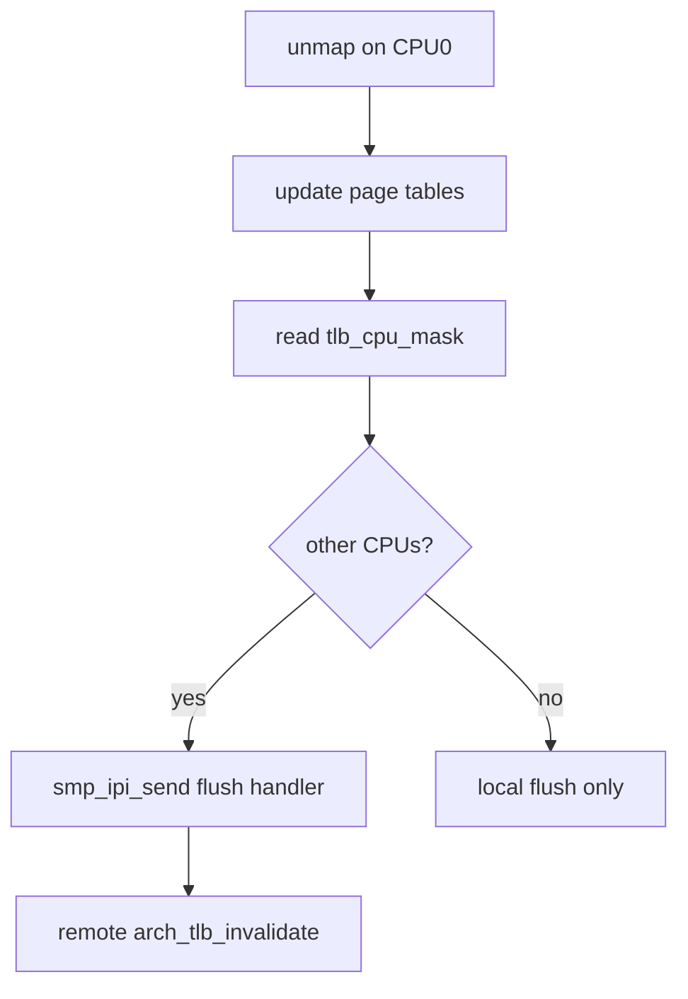

# TLB shootdown 与跨核一致性

v0.1 · 2026-08-27

本篇覆盖：`arch/x86_64/mm/arch_smp_tlb_flush.c`、`include/arch/x86_64/sync/tlb.h`、`include/arch/aarch64/sync/tlb.h`、`kernel/smp/ipi.c`。

`tlb_cpu_mask` 与 schedule 切换见 `02-内存管理/TLB与缓存一致性.md`、`03-任务与调度/VSpace所有权与调度切换.md`；软 IPI 见 `软IPI机制.md`。

---

## 1. 概述

用户 **VSpace** 的 unmap/COW 分裂须保证：**所有可能缓存该 ASID/PCID 翻译的 CPU** 执行 TLB invalidate。core 用 **`VSpace::tlb_cpu_mask`** 记录哪些 CPU 曾 **`schedule`** 到该 AS（set/clear 见 VSpace 篇），shootdown 时遍历 mask 对 remote CPU 发 **IPI**，在 handler 中调 arch flush。

x86 实现集中在 **`arch_smp_tlb_flush.c`**；aarch64 类似 via IPI + `arch_tlb_invalidate_*`。

---

## 2. 目标与边界

core 提供 ** shootdown 原语** 与 mask 维护；兼容层决定 **何时** unmap（fork COW、munmap 等）。**del_vspace** 要求 mask 清零（除 documented in-place exec 例外）。

不做：广播 shootdown 的 lazy batching 框架（每次 unmap 路径调用 arch helper）。

---

## 3. 分层与调用方

**MM** — `vspace_clear_user_mappings`、`unmap` 路径在改页表后调 shootdown helper。

**schedule** — 切换 user AS 时 set/clear 本 CPU bit + 本地 invalidate（VSpace 篇）。

**规则：** shootdown 前须持适当 radix lock；IPI handler 仅 flush，不 sleep。

---

## 4. 数据结构与不变量

- **`tlb_cpu_mask`** + **`tlb_cpu_mask_lock`**（CAS）。
- shootdown IPI slot 在 init 时 register（与 arch_smp_tlb_flush 链接）。

**不变量：** 不得在有 CPU bit 仍 set 时成功 `del_vspace`（`-E_REND_RC_UNEQUAL` 等）。

---

## 5. 代码对应

| 文件 | 职责 |
|------|------|
| `arch_smp_tlb_flush.c` | IPI 发送与 flush 回调 |
| `tlb.h` | 本地 invalidate API |
| `vmm.c` / radix | unmap 触发 shootdown |

---

## 6. 流程

---

## 7. 公开 API

arch **`arch_tlb_invalidate_vspace_page`**、SMP flush 入口（arch 头文件）；`smp_ipi_*` 辅助。

---

## 8. 多架构

x86：INVLPG/PCID/ shootdown IPI；aarch64：TLBI by ASID/VA。细节见各 `arch/*/sync/tlb.h`。

---

## 9. 测试

SMP + user mapping 测例；错误 shootdown 表现为 other CPU stale TLB。

与当前源码一致，尚未复测。

---

## 10. 限制与后续

- shootdown 开销随 CPU 数线性
- kernel 共享映射依赖 GLOBAL 位策略（MM 篇）

---

## 11. 变更记录

| 2026-08-27 | 初稿 |
