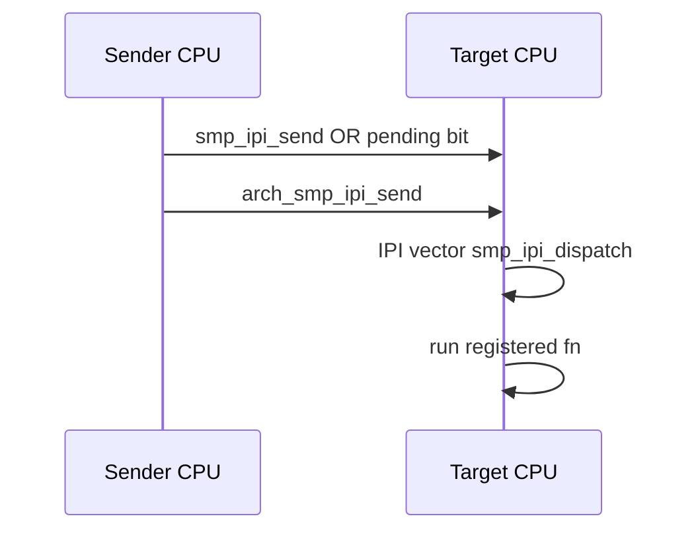

# 软 IPI 机制

v0.1 · 2026-08-27

本篇覆盖：`kernel/smp/ipi.c`、`include/rendezvos/smp/ipi.h`、`arch/x86_64/smp/arch_smp_ipi.c`、`arch/aarch64/smp/arch_smp_ipi.c`。

IRQ 向量 reserved IPI 槽见 `05-陷阱与中断/IRQ向量分配与处理.md`；TLB shootdown 使用 IPI 见 `TLB_shootdown与跨核一致性.md`。

---

## 1. 概述

**软 IPI** 在 core 层提供 **`smp_ipi_register`** / **`smp_ipi_send(cpu, id)`**：回调在 **目标 CPU 的 IPI 中断上下文** 执行（arch 门铃 → trap → **`smp_ipi_dispatch`**）。每 CPU **`smp_ipi_pending`** 位图记录待处理 slot；dispatch 交换清零后调用各 **`smp_ipi_fn_t`**。

**`smp_ipi_init`** 在 arch 启动中注册 arch-specific handler（LAPIC ICR / GIC SGI）。

---

## 2. 目标与边界

v0.1 为 **轻量 cross-CPU 回调**，非 Linux generic IPI multiplexer。slot 数 **`RENDEZVOS_SMP_IPI_MAX`**（头文件）；耗尽返回 `-E_REND_OVERFLOW`。

不做：优先级 IPI、IPI 统计、延迟 IPI 队列（除 pending 位 OR）。

---

## 3. 分层与调用方

**TLB shootdown** — 注册 IPI handler，在 remote CPU 上 flush TLB。

**兼容层** — 可注册 IPI 做 cross-CPU TCB 或 scheduler 唤醒（慎用：handler 须极短）。

调用前 **`cpu_is_online(target)`**（ipi.c 内检查）。

---

## 4. 数据结构与不变量

```c
struct smp_ipi_slot { smp_ipi_fn_t fn; bool used; };
static struct smp_ipi_slot smp_ipi_slots[RENDEZVOS_SMP_IPI_MAX];
DEFINE_PER_CPU(atomic64_t, smp_ipi_pending);
```

- **`smp_ipi_send`**：OR 目标 CPU pending 位 → **`arch_smp_ipi_send(cpu)`** 触发硬件 IPI。
- handler 内 **不可 block**；不可再入同一 CPU 未清 pending 的路径需 arch 保证 EOI。

---

## 5. 代码对应

| 文件 | 职责 |
|------|------|
| `ipi.c` | register/send/dispatch/init |
| `arch_smp_ipi.c` | LAPIC/GIC 发送与 vector 绑定 |

---

## 6. 流程



---

## 7. 公开 API

`smp_ipi_init`、`smp_ipi_register`、`smp_ipi_send`（`ipi.h`）。

---

## 8. 多架构

x86：LAPIC self-IPI/ICR；aarch64：GIC SGI。向量号 arch reserve。

---

## 9. 测试

SMP 测例、TLB flush 路径。

与当前源码一致，尚未复测。

---

## 10. 限制与后续

- 固定 slot 表；无 unregister
- IPI storm 需上层节流

---

## 11. 变更记录

| 2026-08-27 | 初稿 |
