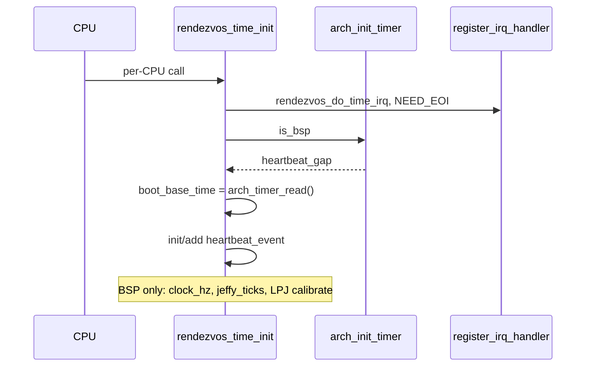

# 时间与定时器子系统

v0.1 · 2026-08-27

本篇覆盖：`kernel/time/time.c`、`include/rendezvos/time.h`、`arch/x86_64/time/time.c`、`arch/x86_64/time/rtc.c`、`arch/aarch64/time/generic_time.c`、`include/arch/x86_64/time.h`、`include/arch/aarch64/time.h`、`modules/driver/timer/8254.c`。

IRQ 向量与 timer handler 注册见 `05-陷阱与中断/IRQ向量分配与处理.md`；system timer kmsg 见 `04-IPC/kmsg与TLV序列化.md`；`rb_tree` 结构见 `10-基础设施/公共基础库与数据结构.md`。

---

## 1. 概述

RendezvOS 时间子系统分三层：

1. **Arch 硬件计数器** — `arch_timer_read()`、`arch_timer_get_hz()`、`arch_init_timer()`、`arch_reset_timer()`；x86 可为 LAPIC timer / TSC deadline 或 8254 PIT；aarch64 为 **CNTPCT_EL0** 物理计数 + **CNTP_TVAL** 比较中断。
2. **Per-CPU 事件队列** — 红黑树按 `expired` 排序；同到期时刻事件挂 **`same_expired_list`** 链表，不占独立 rb 节点。
3. **Timer IRQ** — `rendezvos_do_time_irq` 到期处理：周期事件（含全局 **heartbeat**）重新 `change`；一次性事件经 **`ipc_system_try_deliver`** 向 `wait_port` 发 `KMSG_OP_SYSTEM_TIMER_EXPIRE`。

上层 **`jeffies_get()`** 由 heartbeat 更新 **`percpu(tick_cnt)`**（BSP 校准时钟 Hz 与 `loop_per_jeffies` 供 **`udelay`/`mdelay`**）。

---

## 2. 目标与边界

core 提供：**相对时间**（arch tick 域）、**per-CPU 定时器队列**、**与 IPC 集成的一次性 timer**（model B：init 时 hold port ref）。不提供 wall-clock NTP、CFS tick、或 POSIX `timer_create` 全套语义——兼容层在 `rendezvos_timer_event_*` 之上实现 sleep/alarm。

**并发：** rb 树读写须在 **关 IRQ** 下进行（`time.c` 顶部注释：syscall 可能继承 user IRQ 开启，与 timer IRQ 并发会破坏树）；`rendezvos_timer_event_add/del/change` 内 `arch_save_and_disable_irq` / `arch_irq_restore`。

---

## 3. 分层与调用方

**Server / 兼容层 one-shot timer** — `rendezvos_timer_event_init(event, 0, wait_port, token)` → `rendezvos_timer_event_add(event, rendezvos_time_now() + delta)` → 线程在 `wait_port` 上 recv → 校验 `delivery_token` → `rendezvos_timer_event_fini`。

**Cancel** — `rendezvos_timer_event_cancel`：从队列摘下 + 发 `KMSG_OP_SYSTEM_TIMER_CANCEL`（`use_system_proxy=false`），**不** fini、不 release port ref。

**Periodic（core 内部）** — `heartbeat_event`：`periodic_gap != 0`，`wait_port == NULL`；IRQ 内 `change(now + gap)`；**勿** 对 periodic 调 `fini`。

**Boot** — 每 CPU `arch_start_core` 路径调 **`rendezvos_time_init()`**：register timer IRQ、`arch_init_timer`、插入 heartbeat、BSP 上 `clock_hz`/`jeffy_ticks`/`loop_per_jeffies` 校准。

---

## 4. 数据结构与不变量

### 4.1 rendezvos_timer_event

```c
typedef struct rendezvos_timer_event {
        struct rb_node node;
        struct list_entry same_expired_list;
        tick_t expired;
        u64 periodic_gap;           /* 非 0 = 周期 */
        Message_Port_t *wait_port;  /* 一次性：init 时 ref_get */
        u64 delivery_token;
} rendezvos_timer_event;
```

- **一次性：** `periodic_gap == 0` 且 `wait_port` 非 NULL；expire 成功 delivery 后 IRQ 路径 **`rendezvos_timer_event_fini`**（释放 port ref）。
- **周期：** `wait_port` 必须为 NULL；只用 **`del`** 从队列移除，不用 fini。

### 4.2 时间比较宏

```c
#define time_before(a, b)  ((i64)(b) - (i64)(a) < 0)
```

`tick_t` = `u64`；与 `arch_timer_read()` 同域，相对 **`percpu(boot_base_time)`** 的偏移用 **`rendezvos_time_now()`**。

### 4.3 全局常量

- **`INT_PER_SECOND`** = 100（`SYS_TIME_MS_PER_INT` 10ms 一次 heartbeat 刻度）。
- **`timer_irq_num`** — arch 设为 `ARCH_IRQ_VEC_TIMER`。

### 4.4 不变量

- 事件必须在 **将要触发的 CPU** 上 add（per-CPU 队列）。
- 已在队列中的 event 禁止再次 `init`；须先 `del`/`fini`/`cancel`。
- IRQ handler 末尾 **`arch_reset_timer(next_event_gap)`** 编程下次中断；队列空时 fallback heartbeat_gap（不应长期发生）。

---

## 5. 代码对应

| 文件 | 职责 |
|------|------|
| `time.c` | 事件 rb 树、IRQ handler、jeffies、udelay |
| `time.h` | 公开 API、时间转换、`rendezvos_timer_event` |
| `arch/x86_64/time/time.c` | PIT / LAPIC / TSC 分支 |
| `arch/x86_64/time/rtc.c` | CMOS RTC 读（wall 辅助） |
| `arch/aarch64/time/generic_time.c` | CNTFRQ/CNTPCT/CNTP_TVAL |
| `modules/driver/timer/8254.c` | PIC 模式 PIT 编程 |

---

## 6. 流程

### 6.1 rendezvos_time_init



### 6.2 rendezvos_do_time_irq

1. 循环取 rb 最小 `expired`；若 `now < expired`  break。
2. **Periodic：** `change(now + periodic_gap)`；若为 heartbeat → 更新 `tick_cnt`。
3. **One-shot：** `timer_event_deliver_kmsg(EXPIRE, proxy=true)`；成功则 `fini`；失败则 `change(now+1)` 重试。
4. 计算下一事件间隔 → `arch_reset_timer`。

### 6.3 与 IPC 的 deliver

`timer_event_deliver_kmsg` → `kmsg_create` + `create_message_with_msg` → **`ipc_system_try_deliver(port, msg, use_system_proxy)`**（见阻塞收发篇 §6.5）。

---

## 7. 公开 API

| API | 说明 |
|-----|------|
| `rendezvos_time_init()` | 每 CPU 初始化 |
| `rendezvos_do_time_irq(tf)` | Timer ISR |
| `rendezvos_time_now()` | 相对 boot_base 的 tick |
| `rendezvos_time_*_to_count` / `count_to_*` | us/ms 转换 |
| `jeffies_get()` | 逻辑 jiffy（heartbeat 更新） |
| `udelay` / `mdelay` | 忙等（LPJ 校准） |
| `rendezvos_timer_event_init/add/del/change/cancel/fini/exist` | 事件生命周期 |

Arch hook：`arch_init_timer`、`arch_reset_timer`、`arch_timer_read`、`arch_timer_get_hz`。

---

## 8. 多架构

| 项目 | x86_64 | aarch64 |
|------|--------|---------|
| 计数器 | TSC / APIC CCNT 等 | CNTPCT_EL0 |
| 中断源 | LAPIC timer 或 PIT | CNTP_TVAL 物理定时器 |
| `arch_irq_type` | PIC / xAPIC / x2APIC | GIC SPI（timer 向量） |
| BSP 专用 | PIT 仅 BSP 重置（SMP 注释） | 每 CPU 编程 TVAL |

---

## 9. 测试

- **`modules/test/single_timer_test.c`** — one-shot / 队列基础行为。
- 测例运行需 `RENDEZVOS_TEST`（见 `11-测试/内核测试框架与测例索引.md`）。

```bash
cd core && make ARCH=x86_64 config && make all && make run
```

与当前源码一致，尚未复测。

---

## 10. 限制与后续

- **Per-CPU 队列** — 跨 CPU 定时须在上层选 CPU 再 add。
- **Delivery 失败重试** — one-shot 以 `change(now+1)` 简单重试，无指数退避。
- **PIC 模式** — SMP 下不推荐；virt 通常 APIC。
- **无全局 monotonic clock API** — 仅 `rendezvos_time_now` + jeffies。

---

## 11. 变更记录

| 日期 | 摘要 |
|------|------|
| 2026-08-27 | 初稿：arch 后端、rb 事件队列、IPC timer、jeffies/udelay |
