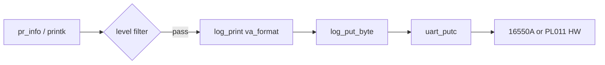

# 日志与 UART 控制台

v0.1 · 2026-08-27

本篇覆盖：`modules/log/log.c`、`include/modules/log/log.h`、`include/rendezvos/stdio.h`、`modules/driver/uart/uart.c`、`modules/driver/uart/uart_16550A.c`、`modules/driver/uart/uart_pl011.c`、`include/modules/driver/uart/*.h`、`modules/driver/x86_char_console/char_console.c`、`include/modules/driver/x86_char_console/char_console.h`、`include/modules/driver/driver.h`。

SMP 下 log 锁见 `06-SMP与同步/锁与内存屏障.md`；`print` 与 early boot 见 `01-启动与初始化/启动流程总览.md`。

---

## 1. 概述

RendezvOS v0.1 控制台输出主路径：**`pr_*` / `printk` → `log.c` 格式化 → `uart_putc`**。UART 后端由编译配置 **`_UART_16550A_`** 或 **`_UART_PL011_`** 选择（`uart.c` 分发）。日志级别由编译宏 **`_LOG_*_`** 或运行时 **`log_init(level)`** 控制。

x86 另可选 **VGA 文本控制台**（`char_console.c`）写显存缓冲；v0.1 日常 **`pr_info` 仍走 UART**（QEMU `-serial stdio`）。**`uart_getc`** 轮询读单字符，供早期或简单交互，无行 discipline 驱动栈。

---

## 2. 目标与边界

core/modules 提供 **内核态 printf 子集** 与 **字符设备 UART 抽象**，不是 termios、pty 或 printk 多 sink 框架。兼容层扩展 console 时复用 `log_put_byte` 或另注册 hook，core 不定义 `/dev/console`  vnode。

**不做：** 异步 log 缓冲 flush 线程；syslog；串口 DMA。

---

## 3. 分层与调用方

**任意 core / 测例** — `#include <modules/log/log.h>`，`pr_err("...\n")` 等。SMP 下 **`log_put_locked`** 用 MCS 锁 **`log_spin_lock_ptr`** + per-CPU `me`。

**Boot 极早期** — 可能直接用 **`print`**（stdio 或 arch 薄封装）在 UART init 之前；`log_init` 通常 UART open 之后。

**x86 VGA** — 调试/本地显示：`char_console_putc` 写 **`0xB8000`** 彩色单元；与 UART 并行存在，log 默认不自动双写。

**链接方** — 通过 `config_*.json` / Makefile 选 UART 型号与 `LOG=true` 等；见 `00-总览/构建与链接.md`。

---

## 4. 数据结构与不变量

### 4.1 日志级别

`log.h` 定义 `LOG_EMERG` … `LOG_DEBUG`、`LOG_OFF`。编译期默认 **`log_level`** 由 `_LOG_INFO_` 等宏择一；否则 `LOG_OFF`。

`printk(format, msg_level, ...)` 仅当 **`msg_level <= log_level`** 时输出。

### 4.2 printf 子集

支持：`d/i/u/x/X/o/p/c/s`、长度修饰 `hh/h/l/ll/j/z/t`、部分 `-+ #0` 与宽度。不支持 `*` 动态宽度、`n`、`f` 浮点。

### 4.3 UART 抽象

```c
void uart_open(void *base_addr);
void uart_putc(u_int8_t ch);
u_int8_t uart_getc(void);
void uart_close(void);
```

PL011 需传入 **`base_addr`**（DTB/平台映射）；16550A 常用固定 I/O 或 MMIO 配置在 `uart_16550A.c`。

### 4.4 SMP

`#ifdef SMP` 时 `log_put_locked` 加锁；单核构建无锁直写 UART。

---

## 5. 代码对应

| 文件 | 职责 |
|------|------|
| `log.c` | 格式化、`printk`、`log_init`、`log_put_locked` |
| `log.h` | `pr_*` 宏、`log_level` |
| `uart.c` | 后端分发 |
| `uart_16550A.c` | PC/QEMU COM |
| `uart_pl011.c` | aarch64 virt PL011 |
| `char_console.c` | VGA 文本 |
| `stdio.h` | `print` 等声明（若与 log 并存） |

---

## 6. 流程



SMP：`log_put_locked` 包裹多字节 write。

---

## 7. 公开 API

| API | 说明 |
|-----|------|
| `printk(fmt, level, ...)` | 带级别格式化输出 |
| `pr_emerg` … `pr_debug` / `pr_off` | 宏包装 |
| `log_init(level)` | 运行时改级别 + 换行 |
| `log_put_byte` / `log_put_locked` | 原始字节 |
| `uart_*` | 驱动入口 |
| `char_console_*` | VGA（x86） |

---

## 8. 多架构

| 平台 | 典型 UART | 附加 console |
|------|-----------|--------------|
| x86_64 QEMU | 16550A (`0x3F8` 或 MMIO) | VGA optional |
| aarch64 virt | PL011 @ DTB `uart` reg | 无 VGA |

由 **`configure.py` / config json** 选择 `-D_UART_*`。

---

## 9. 测试

- **`smp_log_test`**（smp_test 表内可选注释）— 多核并发 `pr_*`。
- 人工：`make run` 观察 serial 输出。

与当前源码一致，尚未复测。

---

## 10. 限制与后续

- **printf 不完整** — 复杂格式需避免。
- **uart_getc 阻塞轮询** — 无 timeout API。
- **VGA 与 log 未统一** — 双输出需上层组合。
- **LOG_OFF 默认** — 部分 config 需显式开 log 宏。

---

## 11. 变更记录

| 日期 | 摘要 |
|------|------|
| 2026-08-27 | 初稿：log、UART 双后端、VGA、SMP 锁 |
