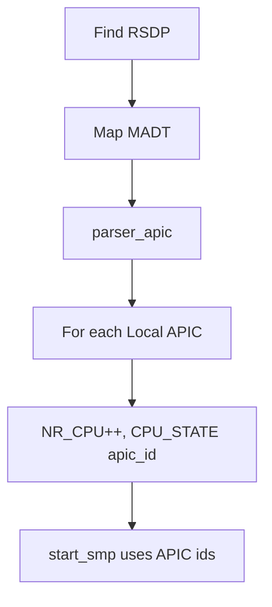

# ACPI 与 MADT（x86_64）

v0.1 · 2026-08-27

本篇覆盖：`modules/acpi/acpi.c`、`modules/acpi/acpi_madt.c`、`include/modules/acpi/*.h`、`arch/x86_64/acpi/acpi.c`、`arch/x86_64/acpi/madt.c`。

SMP 启动消费 **`NR_CPU`/`CPU_STATE`** 见 `06-SMP与同步/SMP启动与处理器拓扑.md`；平台启动见 `01-启动与初始化/平台启动-x86_64.md`。

---

## 1. 概述

x86_64 bring-up 用 **ACPI** 表发现硬件拓扑；v0.1 冻结范围重点是 **RSDP 定位** 与 **MADT（APIC）解析**，枚举 **Local APIC id** 并设置全局 **`NR_CPU`** 与各 **`per_cpu(CPU_STATE, apic_id)`**。`modules/acpi/` 提供表遍历、校验与 MADT 子结构 walk helper；**`arch/x86_64/acpi/madt.c`** 中 **`parser_apic()`** 是 SMP 前实际更新 CPU 计数的入口。

IOAPIC、Interrupt Source Override 等 MADT 条目在 v0.1 **仅打印或跳过**，与 `05-陷阱与中断/平台中断-x86_64-APIC与PIC.md` 中 IOAPIC 空壳现状一致。

---

## 2. 目标与边界

core **modules** 层解析 ACPI 二进制表（不依赖 UEFI 运行时）。不做：AML 解释器、PCI _CRS 完整、CPU hotplug、ACPI sleep 状态机。

兼容层若需 NUMA/SRAT，须扩展 modules 或自有 parser——不在 v0.1 文档范围。

---

## 3. 分层与调用方

**BSP boot** — 在 `start_arch` / SMP 之前：定位 RSDP → 映射/校验 MADT → **`parser_apic()`**。

**Arch** — `arch/x86_64/acpi/acpi.c` 可能处理物理地址映射、与 multiboot 提供指针的衔接。

**SMP** — `arch_start_smp` 使用 MADT 得到的 APIC id 列表发 INIT/SIPI（见 arch smp.c）；`NR_CPU` 为 **MADT Local APIC 条目计数**（apic_id < MAX 时递增，非连续 id 时 `NR_CPU` 与 id 空间不一致——以源码为准）。

---

## 4. 数据结构与不变量

### 4.1 MADT 遍历宏

`acpi_madt.c`：

- **`get_next_ctrl_head(curr)`** — 按 `length` 步进子结构。
- **`final_madt_int_ctrl_head`** — 是否到达表尾。
- **`for_each_madt_ctrl_head(madt_table)`** — 迭代 Local APIC / IO APIC / ISO 等。

### 4.2 parser_apic 行为（arch madt.c）

- 清零 `NR_CPU`，所有 **`CPU_STATE`** → `no_cpu`。
- **`madt_ctrl_type_Local_APIC`**：`NR_CPU++`，`per_cpu(CPU_STATE, apic_id) = cpu_disable`。
- IOAPIC / Source Override：**break 空操作**（v0.1）。

### 4.3 头文件

`acpi_table.h`、`acpi_defs.h`、`acpi_madt.h`、`acpi_fadt.h` 定义表签名与结构布局；与 ACPICA 子集类似。

---

## 5. 代码对应

| 文件 | 职责 |
|------|------|
| `modules/acpi/acpi.c` | 通用表查找、校验 |
| `modules/acpi/acpi_madt.c` | MADT walk helper |
| `arch/x86_64/acpi/acpi.c` | 平台映射与 init |
| `arch/x86_64/acpi/madt.c` | **`parser_apic`**、NR_CPU |

---

## 6. 流程

---

## 7. 公开 API

modules 层多为 **boot 内部** 调用；公开头文件供 arch/init 使用：

- MADT 结构体、`for_each_madt_ctrl_head`
- `parser_apic()` → `error_t`

无 stable「注册 ACPI notify」API。

---

## 8. 多架构

**仅 x86_64**。aarch64 用 DTB（`09-平台模块/DTB与设备树-aarch64.md`）。

---

## 9. 测试

- QEMU `-machine pc` + SMP：`NR_CPU` 与 AP 启动日志。
- 无独立 `acpi_test`；SMP 测例间接验证。

与当前源码一致，尚未复测。

---

## 10. 限制与后续

- **IOAPIC/ISO 未消费** — 设备 IRQ 路由不完整。
- **APIC id 与 logical cpu_id** — 简化映射；复杂拓扑需 evolution。
- **FADT** — 头文件存在，runtime 用途有限。

---

## 11. 变更记录

| 日期 | 摘要 |
|------|------|
| 2026-08-27 | 初稿：RSDP/MADT、parser_apic、NR_CPU |
