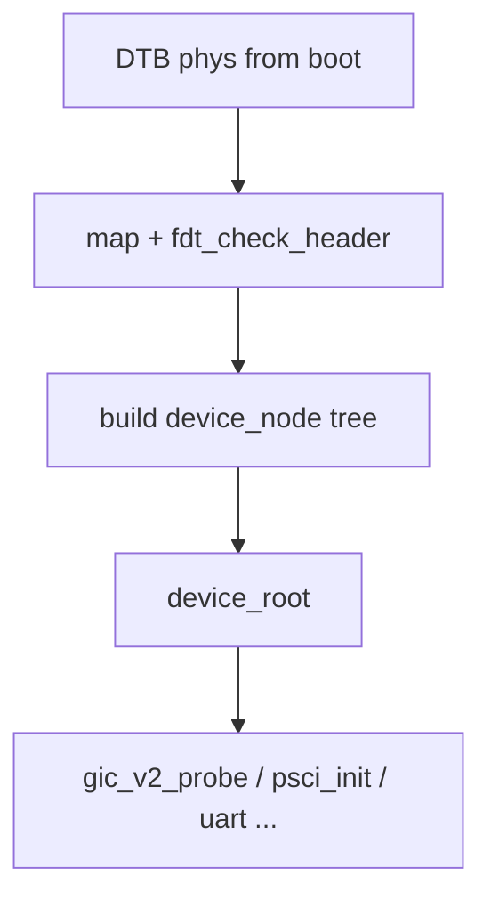

# DTB 与设备树（aarch64）

v0.1 · 2026-08-27

本篇覆盖：`modules/dtb/dtb.c`、`modules/dtb/dev_tree.c`、`modules/dtb/property.c`、`modules/dtb/print_property.c`、`include/modules/dtb/*.h`。

aarch64 启动映射 DTB 见 `01-启动与初始化/平台启动-aarch64.md`；GIC/PSCI/PL011 等 **按 compatible 查找节点** 见 GIC、PSCI、日志篇；PCI ECAM 与 DTB **并存** 问题见 §10。

---

## 1. 概述

aarch64 平台用 **Flattened Device Tree（FDT）** 描述硬件。core **`modules/dtb/`** 提供：

1. **libfdt 风格底层** — `dtb.c`：`fdt_check_header`、`fdt_offset_ptr` 等（源自 u-boot/libfdt 裁剪）。
2. **内核设备树对象** — `dev_tree.c`：`device_node` 树、`dev_node_find_by_compatible`、遍历。
3. **属性解析** — `property.c` / `print_property.c`：按名读 `reg`、`compatible`、`method` 等。

Boot 解析 DTB 后建立 **`device_root`**，供 GIC、PSCI、UART、PCI host 等驱动 probe。

---

## 2. 目标与边界

core 提供 **只读 FDT 访问** 与 **内存中 device_node 树**，不实现 OF 动态 overlay、`/proc/device-tree` 或 Linux `of_*` 全套。不在 core 规定「PCI 必须来自 DTB 还是 ECAM 自扫」——v0.1 两者代码路径均存在，集成方须避免 **重复枚举** 或 **reg 冲突**。

---

## 3. 分层与调用方

**Boot** — `boot_map.c` / `start_arch` 映射 DTB 物理页 → 校验 header → **`dev_tree_build`**（或等价）填充 `device_root`。

**驱动 init** — 典型模式：

```c
struct device_node *n = dev_node_find_by_compatible(NULL, "arm,gic-400");
struct property *reg = dev_node_find_property(n, "reg", 4);
property_read_u64_arr(reg, buf, count);
```

**调试** — `print_device_tree(device_root)` 递归打印节点与属性。

**PSCI** — `compatible = "arm,psci"` + `method = "smc"|"hvc"`（PSCI 篇）。

---

## 4. 数据结构与不变量

### 4.1 device_node

嵌入 **`tree_node`**（`common/dsa/tree.h`）；子节点 sibling/child 链表；**`property`** 链表挂属性。

### 4.2 查找方式

`enum dev_node_find_way`：by **name**、**device_type**、**compatible**（compatible 可为字符串列表，需逐项比较）。

### 4.3 FDT 校验

`fdt_check_header` 验证 magic、version、块边界；失败则 early boot 应 panic 或 halt。

### 4.4 属性类型

`property_types[]` 映射 `device_type`、`compatible` 等标准名长度，供 `dev_node_find_property` 精确匹配。

---

## 5. 代码对应

| 文件 | 职责 |
|------|------|
| `dtb.c` | FDT blob 低级访问 |
| `dev_tree.c` | 建树、查找、打印 |
| `property.c` | read_u32/u64/string/arr |
| `print_property.c` | 人类可读 dump |
| `libfdt.h` / `fdt.h` | 常量与 inline |

---

## 6. 流程



---

## 7. 公开 API

| API | 说明 |
|-----|------|
| `fdt_check_header` / `fdt_offset_ptr` | blob 访问 |
| `dev_node_find_by_compatible` | 驱动 probe |
| `dev_node_find_property` | 取属性 |
| `property_read_*` | 解码 |
| `print_device_tree` | 调试 |
| `dev_tree_get_next` | 遍历 |

---

## 8. 多架构

**本篇以 aarch64 为主**。x86 用 ACPI 而非 DTB；RISC 占位 arch 可能复用 dtb 模块但未 complete bring-up。

---

## 9. 测试

- Boot 日志：`print_device_tree` 或 GIC/PSCI probe 成功信息。
- 无独立 dtb 单元测例。

```bash
cd core && make ARCH=aarch64 config && make all && make run
```

与当前源码一致，尚未复测。

---

## 10. 限制与后续

- **PCI 双路径** — `pci_ops` 可 ECAM 扫描；DTB 也可能声明 pci host；v0.1 **未统一** 为单一真源，集成时只启用一条或合并结果。
- **libfdt 不完整** — 仅 boot 所需子集。
- **无 live tree 修改** — 不能 runtime 增删节点。

---

## 11. 变更记录

| 日期 | 摘要 |
|------|------|
| 2026-08-27 | 初稿：FDT、device_node、probe 模式、PCI 并存 |
