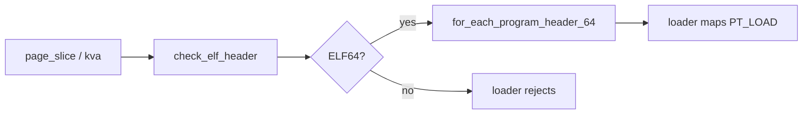

# ELF 加载辅助模块

v0.1 · 2026-08-27

本篇覆盖：`modules/elf/elf.c`、`modules/elf/elf_print.c`、`include/modules/elf/*.h`。

**映射 PT_LOAD、创建用户线程、user stack** 见 `03-任务与调度/线程创建与ELF加载.md`（`thread_loader.c` 调用本模块）。本篇只讲 **ELF 文件格式解析/校验/打印**，不含 VSpace 与调度。

---

## 1. 概述

`modules/elf/` 是 **纯解析库**：校验 ELF 头、读 class/type/machine、遍历 program/section header 的 **宏与 inline helper**、可选 **`print_elf_ph64`** 调试输出。 **`thread_loader.c`** 的 `load_elf_to_vs` 使用 **`check_elf_header`**、**`ELF64_HEADER`**、**`for_each_program_header_64`** 等将 PT_LOAD 映射进 VSpace；**拒绝 ELF32** 的运行路径在 loader 层显式检查。

---

## 2. 目标与边界

| 本模块 | `thread_loader.c` |
|--------|-------------------|
| 头/Phdr 解析、hash、打印 | 映射、page_slice 拷贝、线程创建 |
| 不分配用户页 | `mm_user_utils_*`、`register_vspace` |
| 可链接测例/调试 | `run_elf_program` 进用户 |

core 不实现 **动态链接器**、**符号解析**（`elf64_hash` 为 SysV hash 算法，供将来 dynamic 扩展）、**relocate**。

---

## 3. 分层与调用方

**thread_loader** — 主要 consumer：`check_elf_header`、`get_elf_class`、`ELF64` 宏。

**测例 / 调试** — `print_elf_ph64(phdr)` 打印段类型、flags、vaddr。

**兼容层 personality** — 可只 include elf 头文件做 exec 前校验，自管映射；或复用 `load_elf_to_vs`。

---

## 4. 数据结构与不变量

### 4.1 头文件分层

- **`elf_common.h`** — magic、class、data、类型常量。
- **`elf_32.h` / `elf_64.h`** — `Ehdr`/`Phdr`/`Shdr` 布局。
- **`elf.h`** — 聚合、`for_each_program_header_64` 等宏。
- **`elf_print.h`** — 声明打印函数。

### 4.2 关键函数（elf.c）

| 函数 | 作用 |
|------|------|
| `check_elf_header(ptr)` | EI_MAG*、EI_VERSION |
| `get_elf_class` / `get_elf_type` / `get_elf_machine` | 解头字段 |
| `elf64_hash(name)` | 动态节 hash（v0.1 运行未用） |

### 4.3 与 loader 的衔接

`load_elf_to_vs` 要求 **ELFCLASS64**；PT_LOAD 经 `elf_Phdr_64_load_handle`；PT_DYNAMIC 占位 no-op。

---

## 5. 代码对应

| 文件 | 职责 |
|------|------|
| `elf.c` | 校验与查询 |
| `elf_print.c` | phdr 人类可读 |
| `elf_*.h` | 结构与宏 |

---

## 6. 流程

---

## 7. 公开 API

见 `include/modules/elf/elf.h` 与 `elf_print.h`；loader 公开 API 在 `thread_loader.h`。

---

## 8. 多架构

`e_machine` 常量区分 EM_X86_64、EM_AARCH64 等；loader 不强制 machine 校验（测例可能跑同 ISA 构建的 ELF）。跨 ISA 加载由集成方禁止。

---

## 9. 测试

- **`gen_thread_from_elf` / incbin harness** — 间接验证解析。
- 无独立 `elf_test` 源文件。

与当前源码一致，尚未复测。

---

## 10. 限制与后续

- **ELF32** — 头文件支持查询，运行路径拒绝。
- **Section 表** — 宏存在，loader 未用于执行。
- **Reloc / dynamic** — 未实现。

---

## 11. 变更记录

| 日期 | 摘要 |
|------|------|
| 2026-08-27 | 初稿：与 thread_loader 边界、API 清单 |
