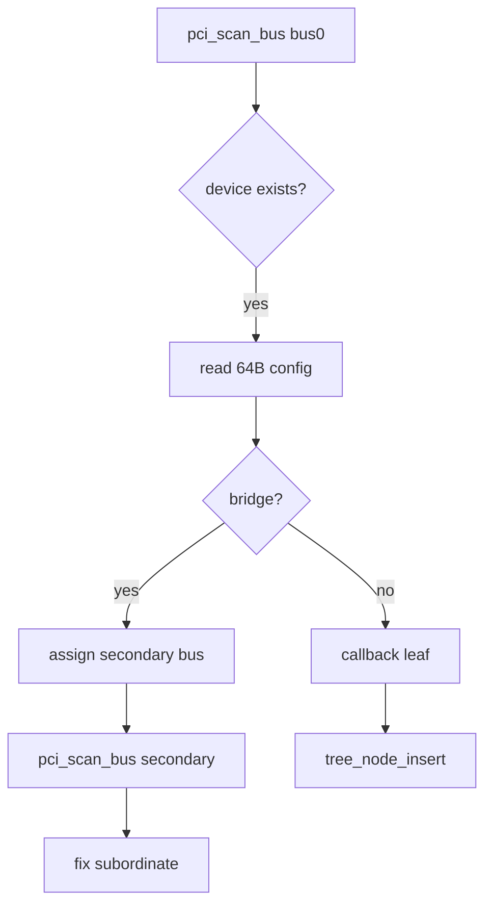

# PCI 枚举与配置空间

v0.1 · 2026-08-27

本篇覆盖：`modules/pci/pci_ops.c`、`modules/pci/pci_dev_tree.c`、`include/modules/pci/pci.h`、`include/modules/pci/pci_ops.h`、`include/modules/pci/pci_dev_tree.h`。

DTB PCI host 节点见 `09-平台模块/DTB与设备树-aarch64.md`（与 ECAM 路径并存问题）；测例 `single_pci_test` 见 `11-测试/内核测试框架与测例索引.md`。

---

## 1. 概述

`modules/pci/` 实现 **PCI/PCIe 配置空间访问** 与 **递归总线扫描**，结果挂到 **`pci_node` 设备树**（嵌入 `tree_node`）。扫描入口 **`pci_scan_bus`**：对每个 bus/device/function 读 config header，识别 **bridge**，分配 secondary/subordinate bus 号，递归子总线；叶设备通过 **`pci_scan_callback`** 交给调用方填充 `pci_node`。

v0.1 **注释 TODO**：enable device、分配 IRQ——当前 **只枚举**，不自动 `register_irq_handler`。

---

## 2. 目标与边界

core 提供 **bring-up 级 PCI 发现**，供调试或兼容层挂驱动。不做：MSI/MSI-X 完整、PCIe hotplug、IOMMU、资源 BAR 分配与 MMIO 映射（caller 或 compat 负责 `map()`）。

**Config 访问方式** — 由 `pci_config_read_IO_dword` 等实现（端口 I/O 或 MMIO ECAM），平台 init 须在扫描前配置好 host bridge。

---

## 3. 分层与调用方

**测例** — `test_pci_scan()` in `single_pci_test.c` 注册 callback，打印 vendor/device。

**兼容层** — 在 initcall 中 `pci_scan_bus(callback, 0, root)`，callback 内记录 BAR、挂 compat 驱动表。

**与 DTB** — aarch64 virt 可能同时有 **DT `pci-host-ecam`** 与本扫描器；须避免重复或地址冲突（DTB 篇 §10）。

---

## 4. 数据结构与不变量

### 4.1 pci_node

`pci_dev_tree.c`：树节点 + bus/dev/fn、header 缓存、bridge 的 primary/secondary/subordinate。

### 4.2 扫描控制

- **`next_bus_number`** — 全局递增 secondary bus。
- **`recursion_depth`** — 上限 **`PCI_MAX_RECURSION_DEPTH`**，防故障拓扑死递归。
- **`pci_bridge_need_scan`** — class 0x06 subclass 0x04/0x07。

### 4.3 Bridge 编程

**`configure_pci_bridge_bus`** 写 config offset **0x18** primary/secondary/subordinate；扫描后更新 subordinate 为 **`next_bus_number - 1`**。

---

## 5. 代码对应

| 文件 | 职责 |
|------|------|
| `pci_ops.c` | scan_bus、scan_device、bridge 配置 |
| `pci_dev_tree.c` | 节点分配、树链接、bus 信息 |
| `pci.h` | 常量、header 布局 |

---

## 6. 流程

---

## 7. 公开 API

| API | 说明 |
|-----|------|
| `pci_scan_bus(callback, bus, parent)` | 递归扫描 |
| `pci_device_exists` | 快速探测 |
| `pci_config_read/write_IO_*` | config 访问 |
| `pci_tree_set_pci_bus_info` | bridge 元数据 |
| `pci_scan_callback` | 调用方 typedef |

---

## 8. 多架构

x86 QEMU 常用 **PIO config** 或 **MMCFG**；aarch64 virt **ECAM** 映射后同一 ops 可 MMIO 读。具体访问函数在 `pci_ops.c` / arch glue。

---

## 9. 测试

- **`single_pci_test.c`** / `test_pci_scan` in `single_test` 表。
- 返回 0  pass，非 0 fail。

与当前源码一致，尚未复测。

---

## 10. 限制与后续

- **无 IRQ 分配**、**无 BAR 编程** — 见 `v0.1/evolution/TODO.md`（E6）
- **与 DTB 双源**
- **recursion 深度限制** — 复杂拓扑可能截断

---

## 11. 变更记录

| 日期 | 摘要 |
|------|------|
| 2026-08-27 | 初稿：扫描、bridge、设备树、边界 |
