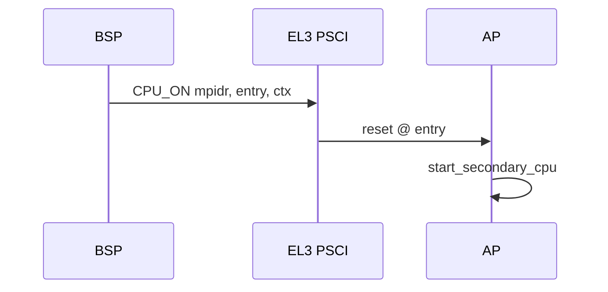

# PSCI 与处理器电源（aarch64）

v0.1 · 2026-08-27

本篇覆盖：`arch/aarch64/psci/psci.c`、`arch/aarch64/psci/psci_call.S`、`include/arch/aarch64/psci/*.h`、`include/arch/aarch64/power_ctrl.h`、`include/arch/x86_64/power_ctrl.h`、`kernel/system/powerd.c`、`include/rendezvos/system/powerd.h`。

SMP AP 启动见 `06-SMP与同步/SMP启动与处理器拓扑.md`；DTB `arm,psci` 节点见 `09-平台模块/DTB与设备树-aarch64.md`；panic/halt 见 `10-基础设施/错误码与panic.md`。

---

## 1. 概述

aarch64 **PSCI**（Power State Coordination Interface）通过 **SMC/HVC** 调用固件完成 **CPU_ON**、**CPU_OFF**、**system off/reset** 等。`psci_init()` 从 DTB 读 **`method`**，绑定 **`psci_smc`** 或 **`psci_hvc`**，填充 **`psci_func`** 函数表。

**Secondary CPU 启动** — arch SMP 在 **`psci_cpu_on`**（或封装）传入 entry 物理地址与 context。  
**关机关** — **`kernel_panic`/`kernel_halt`** → **`arch_shutdown()`**（aarch64 常调 **`psci_system_off`**）；测例结束 **`rendezvos_request_poweroff()`** → **powerd** IPC → **`kernel_halt()`**。

x86 对应 **`arch/x86_64/power_ctrl.h`**（`arch_shutdown` 实现不同），本篇重点 aarch64 PSCI。

---

## 2. 目标与边界

core 封装 **DTB 驱动的 PSCI 0.2/1.x 常用子集**，不是完整 ARM SMCCC 服务框架。v0.1 **reboot** 在 powerd 中 **未实现**（打 log）。

**CPU hotplug/off** — API 存在，SMP bring-up 主要用 **CPU_ON**。

---

## 3. 分层与调用方

**Boot** — DTB 建树后 **`psci_init()`**；失败则 `psci_func.enable = false`，SMP 可能无法启动 AP。

**SMP** — `arch/aarch64/boot/smp.c` 调 PSCI 唤醒 AP 到 **`start_secondary_cpu`** 入口。

**Powerd** — BSP **`DEFINE_INIT(powerd_init)`** 创建 **`powerd`** 内核线程，listen **`RENDEZVOS_POWERD_PORT_NAME`**（`"powerd"`），处理 **`KMSG_OP_SYSTEM_POWER_SHUTDOWN`**。

**测例** — `BSP_test` 完成后 **`rendezvos_request_poweroff()`**（`powerd.h` inline：lookup port → kmsg → send_msg）。

---

## 4. 数据结构与不变量

### 4.1 psci_func_64

函数指针：`version`、`cpu_on`、`cpu_off`、`cpu_suspend`、`system_off`、`system_reset`、`migrate` 等；**`enable`** 标志。

### 4.2 调用约定

`psci_call.S` 提供 **`psci_smc`/`psci_hvc`**，遵循 SMCCC 寄存器约定（x0=function id，x1-x3 参数，返回值 x0）。

### 4.3 powerd

单线程、阻塞 **`recv_msg`**；仅 **BSP init** 创建（`percpu(cpu_number) != BSP_ID` 则 return）。

---

## 5. 代码对应

| 文件 | 职责 |
|------|------|
| `psci.c` | DTB probe、init、API 包装 |
| `psci_call.S` | SMC/HVC 桩 |
| `powerd.c` | shutdown IPC server |
| `powerd.h` | `rendezvos_request_poweroff` |
| `panic.c` | `arch_shutdown` 调用链 |

---

## 6. 流程

### 6.1 AP 启动（概念）

### 6.2 关机

`rendezvos_request_poweroff` → powerd recv → **`kernel_halt`** → **`arch_shutdown`** → PSCI SYSTEM_OFF。

---

## 7. 公开 API

| API | 说明 |
|-----|------|
| `psci_init()` | DTB probe |
| `psci_cpu_on` 等 | 经 `psci_func` 间接 |
| `rendezvos_request_poweroff()` | 客户端 inline |
| `kernel_halt` / `kernel_panic` | 直接停机的 |
| `RENDEZVOS_POWERD_PORT_NAME` | `"powerd"` |

---

## 8. 多架构

| aarch64 | x86_64 |
|---------|--------|
| PSCI SMC/HVC | ACPI PM or QEMU exit |
| DTB `arm,psci` | 无 PSCI |

---

## 9. 测试

- SMP boot 成功即 **CPU_ON** 路径验证。
- 测例 **`rendezvos_request_poweroff`** 结束 QEMU。

与当前源码一致，尚未复测。

---

## 10. 限制与后续

- **Reboot opcode 未实现**
- **Migrate/suspend 少用**
- **无 EL3 错误重试策略**

---

## 11. 变更记录

| 日期 | 摘要 |
|------|------|
| 2026-08-27 | 初稿：PSCI init、SMP、powerd 关机链 |
