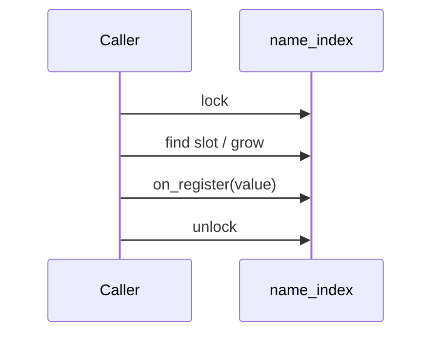

# 名称索引注册表

v0.1 · 2026-08-27

本篇覆盖：`kernel/registry/name_index.c`、`include/rendezvos/registry/name_index.h`。

Port 表与 `port_table_lookup` 见 `04-IPC/Port与消息模型.md`；VSpace **`register_vspace`** 对 name 索引的使用见 `02-内存管理/Radix树与用户映射.md`；线程 **`thread_lookup_port` LRU cache** 见 `03-任务与调度/线程与Task_Manager.md`。

---

## 1. 概述

**`name_index_t`** 是 core 内通用的 **字符串键 → 对象指针** 注册表：行数组（slot + generation）+ 开放寻址哈希表 + MCS 锁。支持 optional **`hold`/`drop` refcount 钩子**、**`on_register`/`on_unregister` 生命周期回调**、以及 **`name_index_token_t`**（row_index + row_gen）供 caller 无锁外缓存后在锁内 **`resolve`** 校验。

**`global_port_table`** 与 VSpace 注册树均基于此原语的不同回调配置。

---

## 2. 目标与边界

core 提供 **O(1) 均摊** register/lookup（扩容 rehash），不实现通配符、层级路径（`/foo/bar`）或 POSIX namespace。键为 **bounded NUL 字符串**（`name_len_max`，port 为 64）。

**不是** per-thread cache——线程 port cache 在 `Thread_Base` 层额外实现。

---

## 3. 分层与调用方

**Port** — `name_index_init(..., port_get_name, port_hold, port_drop, port_on_register, port_on_unregister)`；`register_port` → `name_index_register`。

**VSpace** — radix/注册路径用另一 `name_index_t` 实例（见 Radix 篇），回调不同。

**Lookup 模式** —

1. **Cold：** `name_index_lookup(idx, name, &tok)` — 持锁，bump hold ref。
2. **Warm：** 保存 `tok`；下次 `name_index_resolve(idx, &tok, name)` — 验证 gen 仍有效且名匹配。

`thread_lookup_port` 用 FNV + token LRU 减少 cold lookup。

---

## 4. 数据结构与不变量

### 4.1 name_index_row

```c
struct name_index_row {
        u64 gen;      /* unregister 时递增，使旧 token 失效 */
        u64 used;
        union { void* value; u64 next_free; } storage;
};
```

### 4.2 哈希表

- **FNV-1a** 变体 hash（`name_index_hash_name`）。
- **开放寻址**：EMPTY / TOMB / row_index。
- 负载超 **70%** 触发 **rehash** 或 row 数组 **倍增**。

### 4.3 锁

**`idx->lock`** — MCS；caller 提供 per-CPU **`name_index_spin_lock`** 的 `me` 槽（与 port 表相同模式）。

### 4.4 不变量

- **`register`** 同名冲突返回错误；成功可选 `out_reg_row_idx` 供 abort。
- **`unregister`** 必须提供正确 `row_idx` 与 `name`（防误删）。
- **`hold` 成功** 后 caller 必须 eventual **`drop`**（port lookup 返回的 ref）。

---

## 5. 代码对应

| 函数 | 职责 |
|------|------|
| `name_index_init` / `fini` | 构造/销毁 |
| `name_index_register` | 插入 |
| `name_index_register_abort` | 注册失败回滚 |
| `name_index_unregister` | 删除 + gen++ |
| `name_index_search` | 持锁查找（旧 API） |
| `name_index_lookup` / `resolve` | token 路径 |

---

## 6. 流程

### 6.1 register



### 6.2 lookup + token cache

1. `name_index_lookup` → `tok` + bumped ref。
2. Caller 缓存 `(name_hash, tok)`。
3. `name_index_resolve(tok)` — gen 匹配则 hit；否则 evict。

---

## 7. 公开 API

见 `name_index.h` 全文；`name_index_token_invalidate` 清 token。

---

## 8. 多架构

纯数据结构，**arch 无关**。

---

## 9. 测试

Port 测例、`single_port_test`、VSpace register 间接覆盖。

与当前源码一致，尚未复测。

---

## 10. 限制与后续

- **固定 name_len_max**
- **无 readers-writer 优化** — 高争用 lookup 靠 thread cache
- **全局单表** — 分片由上层多实例实现

---

## 11. 变更记录

| 日期 | 摘要 |
|------|------|
| 2026-08-27 | 初稿：name_index、token、port/vspace 复用 |
