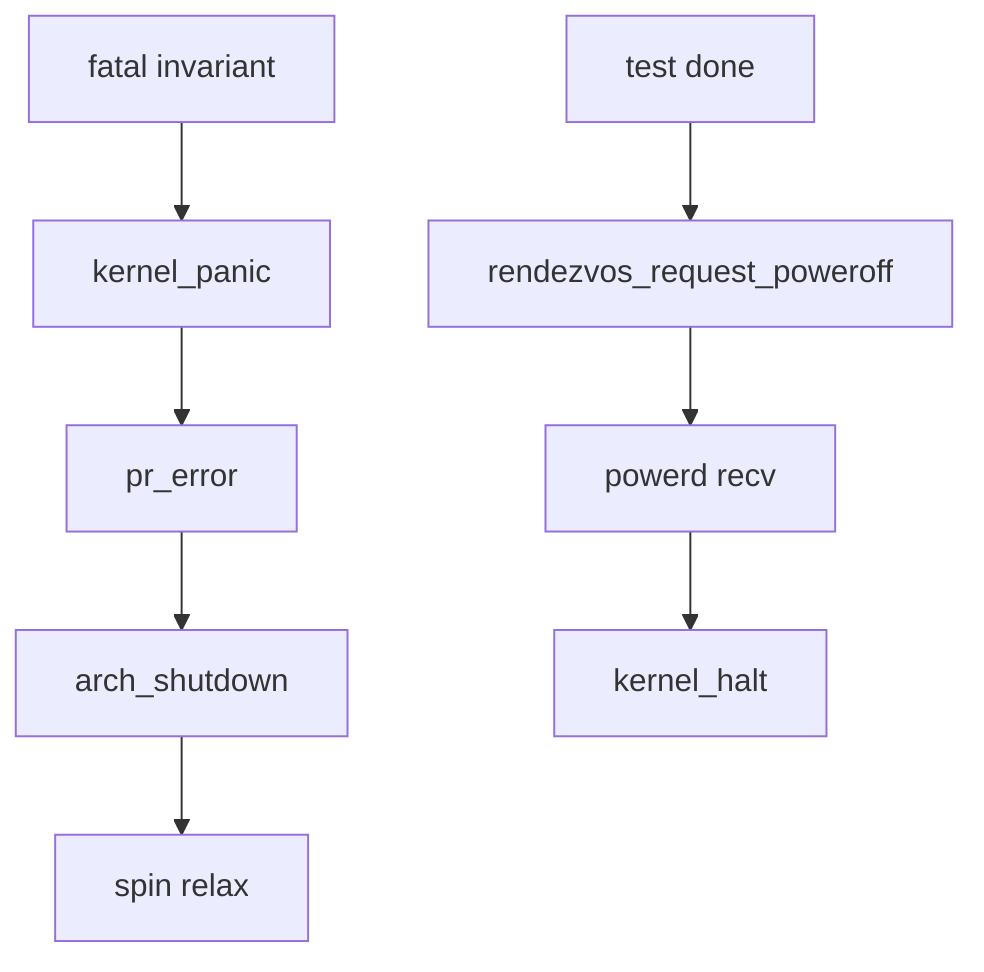

# 错误码与 panic

v0.1 · 2026-08-27

本篇覆盖：`include/rendezvos/error.h`、`kernel/system/panic.c`、`include/rendezvos/system/panic.h`、`kernel/system/powerd.c`、`include/rendezvos/system/powerd.h`、`include/rendezvos/common.h`、`include/rendezvos/limits.h`。

powerd 与 PSCI/关机链详见 `09-平台模块/PSCI与处理器电源-aarch64.md`；IPC 相关错误码见 `04-IPC/` 各篇。

---

## 1. 概述

RendezvOS core 用 **`typedef int error_t`**（`common/types.h`）表示操作结果：**`REND_SUCCESS == 0`**，core 自有错误为 **正数枚举值**（`E_RENDEZVOS = 1024` 起），调用惯例常写 **`return -E_IN_PARAM`** 即返回 **负值** 以便与成功区分。

**不可恢复错误** — **`kernel_panic(msg)`** 打印 **`pr_error`**、调 **`arch_shutdown()`**、死循环 **`arch_cpu_relax`**。较温和 **`kernel_halt()`** 省略 panic 前缀消息。

**优雅关机** — 用户/测例应 **`rendezvos_request_poweroff()`**（powerd IPC），而非直接 panic。

---

## 2. 目标与边界

core **不** 实现 Linux errno 全表；`error.h` 仅列 **内核原语** 常用码。兼容层 syscall 负 errno 在 compat 映射，不在 core `error.h` 扩展。

**panic 不** 刷栈、不 dump 其他 CPU——仅当前 CPU 日志 + shutdown hook。

---

## 3. 分层与调用方

**API 返回** — 检查 `== REND_SUCCESS` 或 `< 0`（若约定统一 negated）。

**IPC** — `-E_REND_AGAIN` 非阻塞重试；`-E_REND_PORT_CLOSED` port 关闭；`-E_REND_IPC` 资源/协议错误。

**MM** — `-E_REND_RC_UNEQUAL` refcount/TLB mask 不满足 teardown。

**Init** — `rendezvos_time_init` heartbeat 失败 **`kernel_panic`**。

**测例** — 全部通过后 **`rendezvos_request_poweroff`**。

---

## 4. 数据结构与不变量

### 4.1 error 枚举（error.h）

| 符号 | 典型含义 |
|------|----------|
| `REND_SUCCESS` | 0 |
| `E_RENDEZVOS` | 通用失败（1024） |
| `E_IN_PARAM` | 参数/状态非法 |
| `E_REND_TEST` | 测例失败 |
| `E_REND_IPC` | IPC 协议/资源 |
| `E_REND_AGAIN` | 非阻塞 retry |
| `E_REND_ABANDON` | 放弃操作 |
| `E_REND_NO_MSG` | 无消息可 transfer |
| `E_REND_RC_UNEQUAL` | refcount/不变量 |
| `E_REND_NOFOUND` | 查找失败 |
| `E_REND_OVERFLOW` | 表满（IPI slot 等） |
| `E_REND_NO_MEM` | 内存不足 |
| `E_REND_PORT_CLOSED` | port 已关闭 |
| `E_REND_RETRY` | 显式重试提示 |

新增 error 须避免与 Linux 常用负 errno 混淆（core 内部用正枚举 + 取负返回）。

### 4.2 panic / halt

```c
void kernel_panic(const char* msg);
void kernel_halt(void);
```

注释：`kernel_panic` 期望上层通过 powerd IPC 协调；直接 panic 用于 invariant 破坏。

---

## 5. 代码对应

| 文件 | 职责 |
|------|------|
| `error.h` | 枚举 |
| `panic.c` | panic/halt + arch_shutdown |
| `powerd.c` | shutdown kmsg → kernel_halt |
| `powerd.h` | request_poweroff inline |

---

## 6. 流程



---

## 7. 公开 API

`error_t` 类型；`error.h` 枚举；`kernel_panic`/`kernel_halt`；`rendezvos_request_poweroff`。

---

## 8. 多架构

**`arch_shutdown`** — aarch64 PSCI off；x86 可能 **`pm`** 或 QEMU **`isa-debug-exit`**（以实现为准）。

---

## 9. 测试

测例 fail 不自动 panic——由 **`single_cpu_test`** 打印 ERROR。poweroff 路径需 powerd 已 **`DEFINE_INIT`**。

与当前源码一致，尚未复测。

---

## 10. 限制与后续

- **无 panic_notifiers**
- **error 命名空间小**
- **reboot 未走 powerd**

---

## 11. 变更记录

| 日期 | 摘要 |
|------|------|
| 2026-08-27 | 初稿：error_t、panic/halt、powerd |
