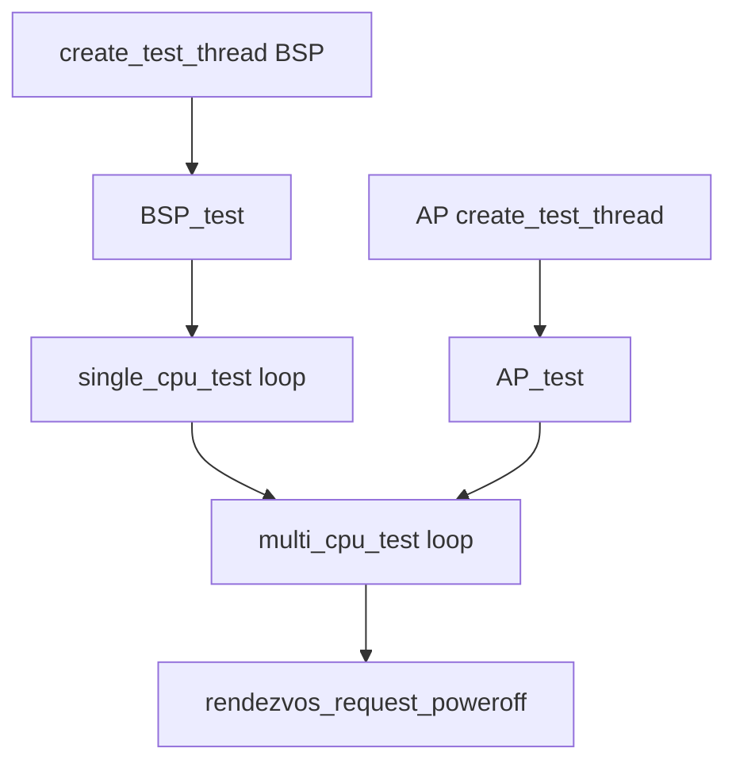

# 内核测试框架与测例索引

v0.1 · 2026-08-27

本篇覆盖：`modules/test/test.c`、`modules/test/single_test.c`、`modules/test/smp_test.c`、`include/modules/test/test.h` 及 `modules/test/single_*.c`、`modules/test/smp_*.c`、`modules/test/thread_affinity_test.c`。

构建开关 **`RENDEZVOS_TEST`** 见 `00-总览/构建与链接.md`；关机 **`rendezvos_request_poweroff`** 见 `10-基础设施/错误码与panic.md`。

---

## 1. 概述

core standalone 测例在 **`RENDEZVOS_TEST`** 编译时启用：**BSP** 创建 **`BSP_test`** 线程跑 **`single_cpu_test`** + **`multi_cpu_test`** 后 **request poweroff**；各 **AP** 创建 **`AP_test`** 仅跑 **`multi_cpu_test`**。

框架分两层：

1. **Single-CPU 表** — `single_test[]`：顺序执行，**返回值 0 = pass**。
2. **SMP 表** — `smp_test[]`：各 CPU 并行跑同一 case，BSP 同步 barrier；可选 **`check_result()`** 仅在 BSP 汇总（per-CPU 返回值被忽略）。

---

## 2. 目标与边界

测例验证 **core 原语**，不是兼容层 syscall 回归。失败时 **打印 `pr_error` 并 break**（single）或标记 **`multi_cpu_test_fail`**（smp），**不** 自动 panic。

**`pmm_test`** 在 single 表中 **注释掉**（耗尽显存，须放最后或单独跑）。

---

## 3. 分层与调用方

**启用** — `config_*.json` 或 `OVERRIDE_CFLAGS` 定义 **`RENDEZVOS_TEST`**；`main.c` 在 SMP 后 **`create_test_thread(is_bsp)`**。

**禁用** — 集成构建常关测例，加快 boot。

**新增测例** — 实现 `int my_test(void)` 或 smp 对 + 可选 check；填入对应 static 表；注意 **`MAX_*_TEST_CASE`** 上限（10）。

---

## 4. 数据结构与不变量

### 4.1 single_test_case

```c
struct single_test_case {
        int (*test)(void);
        char name[32];
};
```

### 4.2 smp_test_case

```c
struct smp_test_case {
        int (*test)(void);
        char name[32];
        bool (*check_result)(void);  /* NULL → 每 CPU 检查 test() 返回值 */
};
```

### 4.3 SMP 同步

- **`test_state[cpu]`** — not_start / running / success / fail。
- **`curr_test`** — 当前 case 索引；各 CPU spin 等 **`test_state[j] != not_start`** 再执行。
- BSP 在 case 结束后等所有 CPU **!= running**，再调用 **`check_result`** 或扫描 fail 状态。

### 4.4 check_result 语义

若 **`check_result != NULL`**：各 CPU 只跑 **`test()`**（返回值忽略），**仅 BSP** 调 **`check_result()`** 决定 pass（例：**thread affinity** 用全局 **`affinity_seen[]`**）。

---

## 5. 代码对应

| 文件 | 测例 |
|------|------|
| `single_rb_tree_test.c` | rb_tree |
| `single_arch_vmm_test.c` | arch_vmm |
| `single_kmalloc_test.c` | kmalloc |
| `single_pmm_test.c` | pmm（表内可选） |
| `single_pci_test.c` | test_pci_scan |
| `single_ipc_test.c` | ipc, ipc_multi_round |
| `single_port_test.c` | single_port_test |
| `single_timer_test.c` | timer |
| `single_page_slice_test.c` | page_slice |
| `smp_lock_test.c` | spinlock |
| `smp_kmalloc_test.c` | cross-cpu kmalloc |
| `smp_ms_queue_test.c` | MSQ（even CPU 等） |
| `smp_ms_queue_dyn_alloc_test.c` | 动态节点 MSQ |
| `smp_ms_queue_check_test.c` | NR_CPU==4 专用 |
| `smp_ipc_test.c` | SMP IPC |
| `smp_port_robustness_test.c` | port unregister 等 |
| `smp_ipc_test.c` / `smp_port_robustness_test.c` | 见源文件 |
| `thread_affinity_test.c` | 创建时绑核 |

---

## 6. 流程



Single 循环内每 case 后 **`schedule(core_tm)`** 让出 CPU。

---

## 7. 公开 API

| API | 说明 |
|-----|------|
| `create_test_thread(bool is_bsp)` | main 调 |
| `single_cpu_test` / `multi_cpu_test` | 表驱动 |
| `BSP_test` / `AP_test` | 线程入口 |
| 各 `*_test` / `*_check` | 见 test.h |

---

## 8. 多架构

测例 **arch 无关** 为主；`arch_vmm_test`、APIC timer 等依赖平台。aarch64/x86_64 均可在 QEMU 跑表内大部分 case。

**SMP case 注释** 标明：

- **scalable** — 任意 NR_CPU≥1
- **even-only** — 奇数 CPU 跳过部分
- **fixed-4** — 仅 NR_CPU==4

---

## 9. 测试

**如何跑：**

```bash
cd core && make ARCH=x86_64 config && make all && make run
```

（需 config 开启 **`RENDEZVOS_TEST`** 与合适 **`NR_CPU`**。）

**期望输出：** `[ TEST @<jiffies> ] PASS: ...` 与 `[ SINGLE CPU TEST PASS ]` / `[ MULTI CPU TEST PASS ]`；最后 poweroff。

与当前源码一致，尚未复测。

---

## 10. 限制与后续

- **表大小硬编码 10**
- **无 pytest/外部 runner** — 仅 in-kernel
- **失败不 dump 状态**
- **log 级别影响 NOTICE 可见性**

---

## 11. 变更记录

| 日期 | 摘要 |
|------|------|
| 2026-08-27 | 初稿：single/smp 框架、测例索引、check_result |
